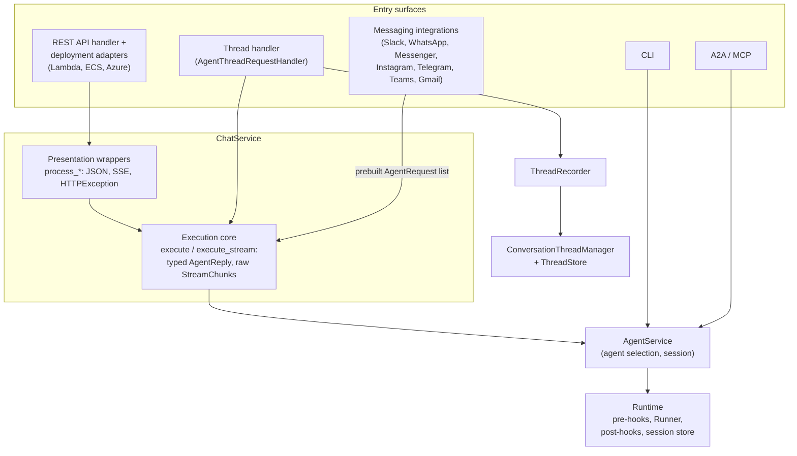

# Agent Kernel Architecture

## Design Principles

1. **Framework-agnostic core**: All core abstractions (`Session`, `Agent`, `Tool`, `Runner`, `Module`, `Runtime`) are framework-independent. Framework-specific logic lives exclusively in adapter modules under `ak-py/src/agentkernel/framework/`.
2. **Adapter pattern**: Each supported agent framework (OpenAI Agents SDK, CrewAI, LangGraph, Google ADK, Smolagents, and Pydantic AI) implements `Agent`, `Tool`, `Runner`, and `Module` subclasses that wrap native framework objects.
3. **Config-driven behavior**: All runtime behavior is governed by `AKConfig` (Pydantic-based), loaded from YAML/JSON files and environment variables (`AK_` prefix, `__` for nesting).
4. **Session lifecycle**: Sessions are async context managers providing concurrency-safe state management. Session stores are pluggable (in-memory, Redis, Valkey, DynamoDB, Cosmos DB, Firestore). Session stores also provide the WebSocket gateway's `WSConnectionStore` on their backend via `SessionStore.get_connection_store()` (spec #495 §9): the ABC lives beside `SessionStore` in `core/session/base.py`, and each store file carries (or explicitly declines) its implementation, encapsulating its database operations over the shared drivers: `InMemoryWSConnectionStore` (`in_memory.py`, process-wide class-level state), `RedisLikeWSConnectionStore` (`core/session/redis_like.py`, client-library-agnostic; constructed by the redis/valkey stores with their own drivers), `DynamoDBWSConnectionStore` (`dynamodb.py`, over an existing table named by `session.connection_store.table_name`, same schema as the AWS adapters' connections table); cosmosdb/firestore raise actionably, as does the base default (so pre-method BYO stores keep working until a WS mode is enabled). Kafka's retry/dedup bookkeeping keeps its own session-type factory in `pipeline/transport/bookkeeping.py` (Q5).
5. **Plugin architecture**: Tools, hooks, guardrails, tracing providers, session stores, knowledge base backends, sandbox providers, and messaging integrations are all pluggable via well-defined interfaces. Backend-selection factories (guardrail, trace, session/thread/multimodal stores, sandbox provider) share one shape via `core/util/factory.py` (`resolve_dotted`, `require_extra`, `AKConfigError`): built-ins resolved by `if/elif` + real imports, with a dotted-path "bring your own" branch on every surface.
6. **Minimal coupling**: Integrations (Slack, WhatsApp, etc.), deployment adapters (AWS Lambda, Azure Functions, Google Cloud Run), and API layers (REST, MCP, A2A) depend on the core but the core never depends on them. The queue pipeline (`pipeline/`) imports only `core` and `api`; `deployment/` imports `pipeline`; modules relocated into `pipeline/` leave re-export shims at their old paths that must preserve existing patch targets (see the Queue Execution Pipeline section).
7. **Queue-pipeline execution** (#495): chat execution on server surfaces runs through one five-component pipeline: Request Handler → Input Queue → Agent Runner → Output Queue → Response Handler: with the queue transport (`execution.queues.type`: `in_memory` default, `sqs`, `kafka`, `nats`) and process topology selected by configuration.

## Core Abstractions

### Session (`ak-py/src/agentkernel/core/base.py`)

Tracks state across related interactions. Key properties:

- **`id`**: Unique session identifier
- **Framework-specific data**: Stored via `get(key)` / `set(key, value)`: each framework stores its own state under a unique key (e.g., `"openai"`, `"langgraph"`). `session.get_framework_session()` is a convenience accessor that resolves that key for you via `Agent.current().runner.name`: returns the **live** stored object (mutate it in place, no `set()` needed) or `None` if nothing's stored yet; raises `RuntimeError` if called with no agent currently running (`Agent.current()` is `None`), so it only works from inside a hook or a tool
- **Volatile cache** (`v_cache`): Cleared after every `Runtime.run()` invocation: use for transient per-request data
- **Non-volatile cache** (`nv_cache`): Persisted across requests within the session: use for data that should survive multiple interactions. AG-UI shared state is **not** a `Session.Keys` member: the AG-UI integration stashes it here under `"agui_state"` (`integration/agui/state.py`), gated by `agui.state`, and exposes it to agents as `get_agui_state` / `update_agui_state` tools — deliberately outside `framework_context`, which is per-run and adapter-owned and would overwrite it (see the AG-UI docs page)
- **Reserved keys** (`Session.Keys` enum): `VOLATILE_CACHE`/`NON_VOLATILE_CACHE` back the two caches; `FRAMEWORK_CONTEXT` (`"framework_context"`) holds a per-run, framework-agnostic caller context/state **dict** (must be picklable) that runners inject into the native framework call and write back on success. Unlike the caches it is **not** pre-initialized: an unset key reads back as `None` (absent ⇒ no injection, no behaviour change). The key is fronted by dedicated accessors: `session.get_framework_context()` (live dict, never auto-creates), `set_framework_context(dict)` (rejects non-dicts), `clear_framework_context()`: the way `get_volatile_cache()` fronts `v_cache`; nothing outside `Session` (runners included) spells the raw key. Scope is **pre-hooks and post-hooks**; tools use their framework-native handle (`RunContextWrapper.context`, `RunContext.deps`, ADK `tool_context.state`, …) instead
- **Acting-user propagation** (`runtime.py`'s `ACTING_USER_CACHE_KEY = "ak.acting_user_id"`): when a caller supplies `acting_user_id` to `Runtime.run`/`Runtime.stream`, it's published into the volatile cache (`session.get_volatile_cache().set(ACTING_USER_CACHE_KEY, acting_user_id)`) before the pre-hook/runner/post-hook span, and cleared with the rest of `v_cache` in the same `finally`. Threaded down from `ChatService.execute*` (`req.user_id`) → `AgentHandler.run*` → `AgentService.run_multi`/`stream_multi`, so hooks and tools can read who a request is acting on behalf of without it being threaded through every call signature
- **Async context manager**: `async with session:` acquires a lock and sets the session as the current context via `contextvars`
- **`Session.current()`**: Class method to retrieve the active session from any code running within the session context

### Agent (`ak-py/src/agentkernel/core/base.py`)

Wraps a framework-specific agent. Key properties:

- **`name`**: Derived from the native agent (e.g., OpenAI `agent.name`, CrewAI `agent.role`)
- **`runner`**: The `Runner` instance that executes this agent
- **`pre_hooks` / `post_hooks`**: Lists of `PreHook` / `PostHook` instances applied during execution
- **`get_description()`**: Abstract method: returns the agent's description/instructions
- **`get_a2a_card()`**: Abstract method: returns an A2A agent card for inter-agent communication
- **`Agent.current()`**: Class method returning whichever `Agent` is currently executing in this async context (or `None`). Backed by a `contextvars.ContextVar` (`current_agent`) set via the private `_activate()` context manager, which `Runtime.run()`/`Runtime.stream()` wrap the whole hook+runner+hook span in (token-based set/reset, so nested activations: e.g. a future agent-as-tool/handoff calling back into the Runtime: restore rather than clobber). This is how `Session.get_framework_session()` resolves which runner key to read

### Runner (`ak-py/src/agentkernel/core/base.py`)

Encapsulates framework-specific execution logic:

- **`run(agent, session, requests) -> AgentReply`**: Async method that executes the agent with the given requests within a session context
- **`stream(agent, session, requests) -> AsyncGenerator[StreamEvent, None]`**: Abstract async generator that yields AK stream events (`core/event.py`: `MessageStart`/`TextDelta`/`MessageEnd`, `ReasoningStart`/`ReasoningDelta`/`ReasoningEnd`, `ToolCallStart`/`ToolCallArgs`/`ToolCallEnd`/`ToolCallResult`, `StepStart`/`StepEnd`) for streaming execution (`execution.mode: stream`) — never a bare `str`; `StreamChunk.event` is a discriminated union and rejects one with a `ValidationError`. Frameworks without native token streaming (CrewAI, smolagents) implement it by raising `NotImplementedError`
- Each framework implements its own Runner (e.g., `OpenAIRunner`, `LangGraphRunner`, `CrewAIRunner`, `GoogleADKRunner`, `SmolagentsRunner`, `PydanticAIRunner`)
- Runners handle: creating `ToolContext`, converting request models to framework-native formats, invoking the framework's execution API, converting responses back to `AgentReply`
- **Per-run framework context**: the base `Runner` provides `_load_framework_context(session)` (returns a **deep copy** of the reserved `framework_context` key, or `None` when absent) and `_store_framework_context(session, incoming, produced)` (shallow-merges `produced` over `incoming`: framework-touched top-level keys win, untouched caller keys preserved: with a fail-fast picklability check). Each adapter's `run`/`stream` calls load before the native call, injects `incoming` via its native mechanism, and calls store **only after a successful native call** (inside the `try`, before the `except`; after the `async for` loop for streams, never in `finally`) so a crash/disconnect leaves the stored context intact. Both helpers go through the `Session` accessors, so the raw key name stays inside `Session`. Round-trip fidelity is per-framework (OpenAI and Pydantic AI full: injected as `context=` / `deps=`, mutated in place by tools; ADK all-but-internal-and-scope-prefixed keys, accumulate-only; smolagents pre-seeded keys only, and the context is also appended to the task prompt; LangGraph declared channels only; CrewAI unsupported: warns once per runner and skips). When an adapter seeds caller keys into a native state dict, write AK-internal keys **last** so a caller key cannot displace them (`ak_tool_context` in ADK, `messages` in LangGraph)

### Module (`ak-py/src/agentkernel/core/module.py`)

Container that wraps framework agents and registers them with Runtime:

- **`load(agents)`**: Takes a list of native framework agents, wraps each via `_wrap()`, registers with `Runtime.current()`
- **`_wrap(agent, agents) -> Agent`**: Abstract method: framework adapters implement this to create their `Agent` subclass
- **`pre_hook(agent, hooks)` / `post_hook(agent, hooks)`**: Attach hooks to a specific agent
- **`unload()`**: Deregisters all agents from the Runtime
- Constructed with native framework agents: e.g., `OpenAIModule([triage_agent, math_agent])`

### Runtime (`ak-py/src/agentkernel/core/runtime.py`)

Global orchestrator and agent registry:

- **Singleton**: `Runtime.current()` returns the global `GlobalRuntime` instance (or the active context-managed runtime)
- **Agent registry**: `register(agent)`, `deregister(agent)`, `agents()` (returns `dict[str, Agent]`)
- **Session store**: `sessions()` returns the configured `SessionStore`
- **`run(agent, session, requests, acting_user_id=None) -> AgentReply`**: The central execution method:
  1. Acquires session lock (`async with session`)
  2. When `acting_user_id` is given, publishes it under `ACTING_USER_CACHE_KEY` in the volatile cache (see Session's Reserved keys)
  3. Runs pre-hooks (agent hooks + system hooks like input guardrails)
  4. Calls `agent.runner.run(agent, session, requests)`
  5. Runs post-hooks (system hooks + agent hooks)
  6. Stores session via `SessionStore.store()`
  7. Clears volatile cache in `finally` block
- **`stream(agent, session, requests, acting_user_id=None) -> AsyncGenerator[StreamChunk, None]`**: Streaming counterpart of `run()`, sharing the same pre-hook pipeline via `_prepare_requests()`:
  1. Runs pre-hooks; if halted, yields a `StreamChunk(error=..., done=True)` and returns
  2. Iterates `agent.runner.stream(agent, session, requests)`; a legacy `str` (TRANSITIONAL) is wrapped into a synthesised `TextDelta` before anything else runs, and its first occurrence allocates a `uuid4().hex` `message_id` shared by a synthesised `MessageStart`/`MessageEnd` pair bracketing the run
  3. Only `TextDelta`/`ReasoningDelta` content passes through `PostHook.on_stream_chunk()` (a hook can drop the whole chunk, event included, by returning `None`; a hook's edit is written back into the event via `model_copy` so `delta` and `event` never disagree)
  4. Yields a `StreamChunk(delta=..., event=...)` per event — `delta` is populated only for `TextDelta` (every other event type carries `event` alone) — then a final `StreamChunk(done=True)`
  5. Stores session and clears volatile cache in `finally`, same as `run()`
- **System hooks**: Automatically includes `InputGuardrailFactory` as system pre-hook, `OutputGuardrailFactory` as system post-hook
- **Context manager**: `with Runtime(sessions):` sets an isolated runtime as current

### AgentService (`ak-py/src/agentkernel/core/service.py`)

High-level utility encapsulating a conversation:

- Combines a `Runtime`, a selected `Agent`, and a `Session`
- **`select(name, session_id)`**: Selects an agent and loads/creates a session
- **`run(prompt) -> str`**: Wraps prompt in `AgentRequestText`, calls `runtime.run()`, returns text
- **`run_multi(requests, acting_user_id=None) -> AgentReply`**: For multi-modal requests; forwards `acting_user_id` to `runtime.run()` (see Runtime and Session's Reserved keys)
- **`stream_multi(requests, acting_user_id=None) -> AsyncGenerator[StreamChunk, None]`**: Calls `runtime.stream()`, yielding `StreamChunk` objects for event-level streaming; forwards `acting_user_id` the same way
- Used directly by stateful clients that own agent/session lifecycle: the CLI, A2A, and MCP. Chat surfaces go through `ChatService`, which sits on top of it

### ChatService (`ak-py/src/agentkernel/core/chat_service.py`)

The chat request layer on top of `AgentService`, split into two sub-layers. `ChatService` has no
knowledge of conversation threads (that lives in `integration/thread/`).

- **Execution core**: transport-neutral, typed results, exceptions propagate:
  - `execute(req, requests=None) -> tuple[AgentReply, session_id]` (async) and `execute_sync(...)`; both thread `req.user_id` through as `acting_user_id` to `AgentHandler.run_async`/`run_sync` (see Runtime and Session's Reserved keys)
  - `execute_stream(req, requests=None) -> AsyncGenerator[StreamChunk, None]` (raw chunks, no framing) and `execute_stream_sync(...)`
  - `requests=None`: `RequestBuilder` builds the list from the pydantic request (prompt required).
    `requests` supplied: the caller-built list is used as-is (prompt optional, list must be non-empty): this
    is how messaging integrations pass platform-downloaded attachments and extra `AgentRequestAny` context
  - Each call selects the agent/session via `prepare_agent_handler(session_id, agent) -> AgentHandler`, which
    wraps `AgentService.ensure_agent_available(name)` (raises `ValueError` for an unmatched agent *before*
    selecting or loading a session — so a request that could never be answered fails before any state
    commits) followed by `AgentService.select(session_id, agent)`. `execute`/`execute_stream` call it
    internally; surfaces that need the session object *between* load and run — AG-UI writes state and
    client context onto it before the runner starts — call `ChatService.prepare_agent_handler` directly
    instead, since `execute_stream` hides the handler
- **Presentation wrappers**: `process_chat_request`, `process_async_chat_request`,
  `process_stream_chat_async`, `process_stream_chat_sync`: thin shells over the core adding the HTTP shapes
  (`ResponseBuilder` JSON dicts / `HTTPException` per `rest_api_mode`, SSE frames). Used by the REST handler
  and every deployment adapter
- Companion classes in the same module: `RequestBuilder` (pydantic request → `AgentRequest` list, extra
  fields → `AgentRequestAny`), `AgentHandler` (AgentService lifecycle + sync/async bridging),
  `ResponseBuilder` (response dicts, SSE frames)

#### Chat execution layering: which layer does a surface call?



Rubric for new code:

- A new HTTP-shaped surface that returns JSON/SSE with the standard error shapes calls the presentation
  wrappers (`process_*`).
- A new channel or integration that owns its own transport, reply formatting, and error UX calls the core
  (`execute`/`execute_stream`), passing a prebuilt request list when it builds its own attachments.
- An interactive or stateful client that manages agent and session lifecycle itself (REPL-like) uses
  `AgentService`.
- Cross-cutting behavior that must apply to every run regardless of surface goes in a `Runtime` pre/post
  hook, not in a service layer.
- Entry surfaces never call `Runtime` directly.

#### ChatService vs AgentService: when to use which

The rubric above routes by surface type; the underlying distinction is **statefulness**:

- **`AgentService` is a stateful conversation object**: it holds one selected agent and one session
  across calls (`select()`/`new()`/`clear()`/`load()`), takes caller-prepared inputs (prompt string or
  `AgentRequest` list), returns typed replies/chunks, and lets exceptions propagate; the caller owns
  validation and error handling. Use it for clients that own a *running conversation* (the CLI's
  `!select`/`!new`/`!clear` is the canonical example; A2A and MCP also use it).
- **`ChatService` is a stateless chat-request processor**: every call carries a `BaseChatRequest`
  envelope and resolves the agent/session fresh per request (via a new `AgentHandler`). It validates the
  envelope, builds the request list (or accepts a prebuilt one), and offers two output contracts: the
  execution core returns typed results with exceptions propagating; the presentation wrappers add HTTP
  shapes and the `ValueError` → 400 / `Exception` → 500 mapping. Use it for chat traffic where each
  request arrives self-contained with its `session_id`.
- **They are layers, not alternatives**: the ChatService core drives `AgentService` internally, so going
  through `ChatService` never bypasses `AgentService` semantics. Do not re-implement one in terms of
  `Runtime` to avoid the other.

### AKConfig (`ak-py/src/agentkernel/core/config.py`)

Pydantic-based configuration:

- **Auto-initialized** at import time via `AKConfig._set()`
- **Config sources** (priority order): environment variables (`AK_` prefix) → config file (YAML/JSON, default `config.yaml`) → defaults
- **Override path**: Set `AK_CONFIG_PATH_OVERRIDE` env var
- **Key sections**: `session`, `api`, `websocket_api`, `a2a`, `mcp`, `slack`, `whatsapp`, `messenger`, `instagram`, `telegram`, `gmail`, `multimodal`, `trace`, `guardrail`, `execution`, `logging`

## Request/Reply Model (`ak-py/src/agentkernel/core/model.py`)

- **Request types**: `AgentRequestText`, `AgentRequestFile`, `AgentRequestImage`, `AgentRequestAny`
- **Reply types**: 
  - `AgentReplyText`, 
  - `AgentReplyImage`
  - `AgentReplyAny`: `content: dict`: returned when the agent is configured for structured output (OpenAI `output_type`, LangGraph `response_format`, ADK `output_schema`, CrewAI module-level `output_pydantic`/`output_json`, Smolagents dict/Pydantic `final_answer`, Pydantic AI `output_type`); `str(reply)` returns the JSON-serialized content. Non-streaming only.
  - `StreamChunk`: `delta: str | None`, `event: StreamEvent | None`, `done: bool`, `error: str | None`, `session_id: str | None`: yielded by `Runtime.stream()` / `AgentService.stream_multi()` for streaming; `delta` is populated only for `TextDelta` events (back-compat for plain-text consumers), `event` carries the full `StreamEvent` (including tool calls and reasoning)
- Type aliases: `AgentRequest = Union[...]`, `AgentReply = Union[...]`

## Tools (`ak-py/src/agentkernel/core/tool.py`)

- **`ToolContext`**: Execution context available inside tool functions via `ToolContext.get()`. Provides access to `runtime`, `agent`, `session`, `requests`.
- **`ToolBuilder`**: Base class for framework-specific tool builders. Each framework implements `bind(funcs)` to wrap plain Python functions into framework-native tool objects.
- Write plain Python functions → bind via the framework's ToolBuilder → tools work across frameworks
- **Gotcha: every `ToolBuilder.bind()` derives the bound tool's name from `func.__name__`, not from `SystemTool.name`.** A `SystemTool` whose `func` has a different `__name__` than `SystemTool.name` binds under the function's name, silently: the model schema advertises the mismatched name while any injected prompt text (and the tool's own `description`) may still reference the `SystemTool.name` spelling, so the model can't find the tool it was told to call. This bit `AnalyzeAttachmentsTool` for every multimodal deployment until `tools.py`'s `_analyze_attachments` was renamed to `analyze_attachments` (#657) — when adding a new `SystemTool`, keep `func.__name__` and `SystemTool.name` identical.

## Hooks (`ak-py/src/agentkernel/core/hooks.py`)

- **`PreHook`**: `on_run(session, agent, requests) -> list[AgentRequest] | AgentReply`: return modified requests to continue, or an `AgentReply` to halt execution
- **`PostHook`**: `on_run(session, requests, agent, agent_reply) -> AgentReply`: return modified or unmodified reply
- **`PostHook.on_stream_chunk(session, requests, agent, delta) -> str | None`**: Optional override called for each streaming `TextDelta`/`ReasoningDelta` content string before it reaches the client (other event types skip the hook chain entirely). Default implementation passes the text through unchanged; return `None` to drop the whole chunk, event included
- Use cases: RAG injection, input/output guardrails, logging, disclaimers, prompt modification, multimodal preprocessing, streaming token filtering/redaction

## Multimodal (`ak-py/src/agentkernel/core/multimodal/`)

Provides image and file attachment support via a pluggable storage and PreHook architecture. When enabled, attachments are automatically processed, described via a vision LLM, and stored outside the session to prevent memory bloat.

### Key Components

- **`MultimodalPreHook`** (`hooks.py`): System `PreHook` that intercepts `AgentRequestImage` / `AgentRequestFile` entries, calls a vision LLM (via LiteLLM) for a brief description, saves binary data to a storage backend, strips consumed attachments from the request list, and injects attachment metadata (IDs + descriptions) into the last `AgentRequestText`. `_extract_attachment`/`_resolve_source` (spec #523 §8) classify each attachment's source form on the thread-off path — bare base64 and base64 `data:` URIs are described and stored as before; `http://`/`https://`/`s3://` references and non-base64 `data:` URIs are **not** fetched or stored (no network I/O/SSRF exposure in a system pre-hook) and are instead left on the request list so the adapter resolves them itself. This source-form classification does not run in thread mode: `ConversationThreadManager.store_attachments` persists `image_data`/`file_data` verbatim before the hook runs (tracked as a follow-up in `docs/specs/523-ag-ui-support/design.md`)
- **`MultimodalPreHookFactory`** (`factory.py`): Returns `MultimodalPreHook` when `config.multimodal.enabled` is `True`, otherwise a `NoOpPreHook`
- **`AnalyzeAttachmentsTool`** (`tools.py`): A `SystemTool` auto-registered on all agents when multimodal is enabled. Lets the agent retrieve and analyze stored attachments (images and PDFs) on demand via the `analyze_attachments(attachment_ids, prompt)` function
- **`AttachmentStorageManager`** (`storage/storage_manager.py`): High-level API that delegates to the configured `AttachmentStore` backend. Generates UUIDs for attachment IDs and serializes `AttachmentData` dicts
- **`AttachmentStore`** (`storage/base.py`): Abstract base with `save()`, `get()`, `delete()` methods
- **`AttachmentData`** (`storage/base.py`): Dataclass: `id`, `type`, `data` (base64), `name`, `mime_type`, `description`, `timestamp`

### Storage Backends

| Backend | Class | Module | Key traits |
|---------|-------|--------|------------|
| In-memory | `InMemoryAttachmentStore` | `storage/in_memory.py` | `ClassVar` dict, ephemeral, zero setup |
| Redis | `RedisAttachmentStore` | `storage/redis.py` | Persistent, TTL, shared `RedisDriver` (lazy connect, retry, ping/reconnect) |
| DynamoDB | `DynamoDBAttachmentStore` | `storage/dynamodb.py` | Serverless/AWS, TTL via `expiry_time` |
| Session cache | `SessionNonVolatileCacheAttachmentStore` | `storage/session_cache.py` | Legacy, stores in `nv_cache` (not recommended) |

### Execution Flow

```
User sends {text + image/file}
  → MultimodalPreHook.on_run()
    → _extract_attachment() / _resolve_source()   # classify source form (thread-off only)
    → is_base64 (bare base64 or data:<mime>;base64,<payload>):
        → _describe_attachment_briefly()          # Vision LLM via LiteLLM
        → AttachmentStorageManager.save_attachment()  # store binary
        → Strip AgentRequestImage/AgentRequestFile from requests
    → not is_base64 (http(s):// / s3:// / non-base64 data: URI):
        → Leave the request on the list undescribed; adapter resolves it
    → Inject "[Attached Images/Files:]\n- <id>: <description>" into last AgentRequestText
  → Agent sees text with attachment metadata (+ any undescribed remote/data URIs)
  → Agent calls analyze_attachments(ids, prompt) when detailed analysis is needed
    → AttachmentStorageManager.get_attachment_data()
    → LiteLLM vision call with binary + user prompt
    → Returns analysis text (clean for conversation history)
```

### Configuration (`_MultimodalConfig` in `config.py`)

```yaml
multimodal:
  enabled: true
  storage_type: in_memory        # in_memory | redis | dynamodb | session_cache
  max_attachments: 20
  description_max_length: 200
  description_model: gpt-4o      # LiteLLM model for brief descriptions (PreHook)
  analysis_model: gpt-4o         # LiteLLM model for detailed analysis (tool)
  redis:
    url: "redis://localhost:6379"
    ttl: 604800
    prefix: "ak:attachments:"
  dynamodb:
    table_name: "ak-attachments"
    ttl: 604800
```

## Conversation Threads (`ak-py/src/agentkernel/integration/thread/`)

Persistent, named conversation threads keyed by `session_id`, independent of session persistence
(`session:`). Threads are packaged as an **integration** (like Slack): the whole capability: handler,
recording logic, manager, models, naming, and store backends: lives under `integration/thread/`
(public alias `agentkernel.thread`), and **mounting `AgentThreadRequestHandler` is what enables it**.
The `thread` config block only parameterizes the store backend and naming. `core/` and `api/` contain
no thread code, and `ChatService` has no thread knowledge. Threads are the history mechanism for
clients that connect to the agent directly; messaging integrations never record threads (their
platforms own the history), and thread recording does not apply to queue-mode/deployment adapters.

### Key Components

- **`AgentThreadRequestHandler`** (`thread_chat.py`): extends `AgentRESTRequestHandler`, serving the same chat routes with thread recording wrapped around the ChatService execution core (build requests via `RequestBuilder` → `ThreadRecorder.pre_run` → `execute`/`execute_stream` with the prebuilt list → `ThreadRecorder.post_run`), plus the read routes. Fails fast in `__init__` when no `thread` config block exists; prechecks agent availability before any thread write (no phantom threads); `user_id` is required on its chat routes (and only there). Streaming accumulates deltas and skips recording on an error chunk or empty stream
- **`ThreadRecorder`** (`recorder.py`): the recording logic as a reusable class over `ConversationThreadManager`: `pre_run` (enforce `user_id`, store attachment bytes and rewrite to `AgentRequestAttachmentRef`, get-or-create thread, append user message; `store_attachments` runs first so config rejections leave no phantom thread) and `post_run` (append assistant message)
- **`ConversationThreadManager`** (`manager.py`): Service façade owning thread lifecycle (create/load/append/history) and, when multimodal is enabled, saving attachment bytes into the shared `AttachmentStore` before the agent runs. A single process-wide instance (`ConversationThreadManager.get()` / class-level singleton, guarded by an `RLock`) is used by `ThreadRecorder` and `ThreadRESTRequestHandler`: `None` when no `thread` config block is present
- **`ThreadStore`** (`store/base.py`): Abstract base with backend persistence methods (create/get/append/list); pluggable per backend
- **`ThreadStoreBuilder`** (`store/base.py`): Factory that constructs the configured `ThreadStore` from `AKConfig`'s `thread.type`
- **`Thread` / `ThreadMessage` / `ThreadAttachment` / `ThreadPage` / `MessagePage`** (`model.py`): Pydantic models for thread metadata, individual messages, attachment references, and cursor-paginated listings, using the shared `core/util/pagination.py` cursor helpers (`encode_cursor`/`decode_cursor`/`clamp_limit`, `MAX_PAGE_SIZE`)
- **`ThreadNamingStrategy`** (`naming.py`): Overridable strategy that names auto-created threads: default implementation makes a single LiteLLM call (`thread.naming.model`, requires the `thread` extra) to derive a concise title from the first prompt, falling back to a truncated prompt prefix when `litellm`/an API key is unavailable. Explicit `thread_name` on a chat request always wins and locks the thread against further automatic naming
- **`Authoriser`** (`auth/authoriser.py`, the single import path — `agentkernel.auth`, alongside `AuthValidator`): Pluggable base class (`authorise(token) -> Optional[user_id]`) that `ThreadRESTRequestHandler` calls, through the shared `AuthorisedRESTRequestHandler` base (`api/handler.py`), to protect the read routes; routes are open when no `Authoriser` is configured. `AuthValidatorAuthoriser` (same module) adapts an existing `AuthValidator` into an `Authoriser`
- **`ThreadRESTRequestHandler`** (`thread_chat.py`): Serves `GET /api/v1/threads` (list, filterable by `user_id`/`group_id`, cursor-paginated) and `GET /api/v1/threads/{session_id}` (thread + paginated message history); raises 404 when thread support is disabled and 403 when a resolved `user_id` doesn't own the requested thread. Composed into `AgentThreadRequestHandler`'s router; also mountable standalone for read-only access

### Store Backends

| Backend | Class | Module | Key traits |
|---------|-------|--------|------------|
| In-memory | `InMemoryThreadStore` | `store/in_memory.py` | `ClassVar` dict, ephemeral, zero setup |
| Redis | `RedisThreadStore` | `store/redis.py` | Persistent, TTL, index-key expiry/refresh for listings |
| Valkey | `ValkeyThreadStore` | `store/valkey.py` | Redis-protocol twin of the above; shares the body via `_RedisLikeThreadStore` (`store/redis_like.py`), requires the `valkey` extra |
| DynamoDB | `DynamoDBThreadStore` | `store/dynamodb.py` | Serverless/AWS, partition key `session_id` + sort key `sk`, optional TTL |
| Firestore | `FirestoreThreadStore` | `store/firestore.py` | Serverless/GCP, one document per `session_id` |
| Cosmos DB | `CosmosDBThreadStore` | `store/cosmosdb.py` | Azure Table API, partitioned by `session_id`, no TTL support |

### Configuration (`_ThreadStoreConfig` in `config.py`)

```yaml
thread:
  type: in_memory    # in_memory | redis | valkey | dynamodb | firestore | cosmosdb
  naming:
    model: gpt-4o-mini
    max_length: 80
  redis:
    url: "redis://localhost:6379"
    ttl: 2592000
    prefix: "ak:thread:"
  valkey:
    url: "valkey://localhost:6379"
    ttl: 2592000
    prefix: "ak:thread:"
  dynamodb:
    table_name: "ak-agent-threads"
    ttl: 0
```

Deployment splits the same way session does: the **application** mounts `AgentThreadRequestHandler`
and declares `thread.type` in its committed `config.yaml`, and **Terraform** provisions the backend
and injects only the connection detail: `create_dynamodb_thread_table` (AWS serverless +
containerized) injects `AK_THREAD__DYNAMODB__TABLE_NAME`; `create_firestore_thread_collection` (GCP)
injects the `AK_THREAD__FIRESTORE__*` vars. Terraform never sets `AK_THREAD__TYPE`. Note the failure
mode this leaves: because `AKConfig.thread` is `Optional` and any `AK_THREAD__*` var materialises it
while `type` defaults to `in_memory`, a mounted handler plus a flag but *without* a declared
`thread.type` runs against the non-durable in-memory backend, with no error.

Attachments in thread mode additionally require `multimodal.enabled: true` with a shared attachment store (`in_memory`, `redis`, or `dynamodb`: `session_cache` is rejected, since threads need durable, cross-request-scoped attachment storage that a session-local cache can't provide).

## AG-UI Integration (`ak-py/src/agentkernel/integration/agui/`)

The [AG-UI protocol](https://github.com/ag-ui-protocol/ag-ui) surface for streaming an agent run to a
compliant frontend (public alias `agentkernel.agui`, requires the `agui` extra —
`ag-ui-protocol>=0.1.16`). Packaged as an **integration** the same way conversation threads are:
**mounting `AGUIRequestHandler` is what enables it**, the `agui` config block only parameterizes it,
and `core/`/`api/` contain no AG-UI code. It exists because AK's runner streaming contract was widened
from plain text deltas to typed `StreamEvent`s (`core/event.py`, carried on `StreamChunk.event`,
`core/model.py:187`) specifically so tool-call, step and reasoning information the framework adapters
already receive survives to a frontend instead of being discarded at the text-only boundary.

- **`AGUIRequestHandler`** (`handler.py`): extends `AuthorisedRESTRequestHandler`. Refuses to
  construct without an `Authoriser` or `AuthValidator` (AG-UI runs agents on a caller's behalf and has
  no anonymous mode) or without the `ag_ui.core` import (raises `ValueError` naming the `agui` extra).
  Routes: `GET {agui.prefix}/agents` (names only — never `get_description()`, which would leak a
  system prompt), `POST {agui.prefix}/{agent_name}`, and `POST {agui.prefix}` when
  `agui.default_agent` is set. `_resolve_agent` 404s indistinguishably for unknown-vs-unexposed agent
  names and 400s when `agent.runner.supports_streaming` is `False`. `_run` does everything that can
  still become an HTTP status (auth, agent resolution, body parse, `AGUIRunInput.to_requests`) before
  the session is written, then hands off to `_events`, an `AsyncGenerator` that always yields
  `RunStartedEvent` first and exactly one of `RunFinishedEvent`/`RunErrorEvent` last — every failure
  after the stream starts is reported as `RunErrorEvent` since the HTTP status is already sent
- **`AGUIMapper.to_agui`** (`mapping.py`): translates one AK `StreamEvent` to its AG-UI event
  (`message_start`/`text_delta`/`message_end` → `TextMessage*`, `tool_call_*` → `ToolCall*`,
  `step_start`/`step_end` → `Step*`, `reasoning_*` → `ReasoningMessage*`); returns `None` for event
  types AG-UI has no equivalent for, so unmapped AK event types are silently dropped rather than
  breaking the stream
- **`AGUIRunInput`** (`run_input.py`): parses the `RunAgentInput` request body, maps its messages to
  `AgentRequest`s (`threadId` is AK's `session_id`; only the final `user` message is read since history
  is rebuilt from the session store), rejects audio/video content with 400 (no AK request type covers
  them), and writes `state`/`forwardedProps`/`context` onto the session
- **`AGUIState`** (`state.py`): reads/snapshots/diffs the AG-UI shared state stored under a reserved
  session key in the **non-volatile** cache (survives beyond one run, unlike `forwardedProps`/`context`
  which live in the volatile cache); a `StateSnapshotEvent` is emitted only when the state actually
  changed during the run
- **System tools** (`core/tool.py`, `SystemToolFactory`): `get_agui_state`/`update_agui_state` (gated by
  `agui.state.enabled`) and the read-only `get_forwarded_props`/`get_agui_context` (gated by
  `agui.client_context.enabled`) are attached per-agent via the same `agents` allow-list pattern as
  other system tools (`_agent_allowed`). When a request carries a field but its gating block is
  disabled for that agent, `AGUIRequestHandler._warn_if_unreadable` logs a warning naming the config
  key to set — the value is still stored on the session, just unreachable by any tool

### Configuration (`_AGUIConfig` in `config.py`)

```yaml
agui:
  agents: ["planner"]        # omitted = every streaming-capable agent is reachable
  prefix: "/agui"
  default_agent: "planner"   # must be one of `agents` when both are set
  state:
    enabled: true
    agents: ["planner"]      # omitted = every agent
  client_context:
    enabled: true
    agents: ["planner"]      # omitted = every agent
```

Only `OpenAIRunner`, `LangGraphRunner`, `ADKRunner` and `PydanticAIRunner` currently declare
`supports_streaming = True`; `CrewAIRunner`/`SmolagentsRunner` still raise `NotImplementedError` from
`stream()`, so their agents 400 rather than appearing at `GET /agui/agents`. See
`examples/api/agui` for a full demo (OpenAI Agents SDK agent + React/Vite frontend against
`@ag-ui/core`).

## Knowledge Bases (`ak-py/src/agentkernel/knowledgebase/`)

Pluggable storage backends agents can read from and write to as tools:

- **`KnowledgeBase`** (`base.py`): ABC: backends implement `connect()`, `write()`, `read()`, `backend_name`, `get_description()`; `schema()`, `add_schema()`, `format_results()`, `close()` are provided by the base
- **`KnowledgeBuilder`** (`knowledgebuilder.py`): Wraps one or more `KnowledgeBase` instances and `build()`s plain-function tools (`get_schemas`, `read_kb`, `write_kb`, `get_all_kb_descriptions`) for binding via a framework's `ToolBuilder`
- **Backends**: `ChromaManager` (vector, `chroma.py`), `Neo4jManager` (graph, `neo4j.py`), `StarburstManager` (read-only SQL via Trino, `starburst.py`): each behind an optional dependency extra (`chromadb`, `neo4j`, `trino`)

## Sandbox (`ak-py/src/agentkernel/sandbox/`)

Config-driven, pluggable code execution: agents run code, shell commands, and file operations in
an isolated, permission-bounded environment. Enabled via a `sandbox` block in `config.yaml`;
inert when disabled. To add a provider, use the `ak-dev-new-sandbox-provider` skill.

- **`SandboxProvider` / `Sandbox`** (`base.py`): the public ABCs a backend implements. `Sandbox`
  has two abstract methods, `execute_code` (`language="python"`) and `close`;
  `execute_command`/`upload_file`/`download_file`/`install_packages` are optional and raise
  `SandboxCapabilityError` unless the provider declares them. `SandboxProvider` implements
  `create`/`destroy` (and `attach` when `capabilities.attach` is declared) and declares a
  `capabilities` class attribute.
- **`SandboxCapabilities`** (`model.py`): the honest per-provider declaration (isolation tier,
  shell, languages, files, package_install, stateful, attach, principal_user, policy_*). The
  manager/worker consult it before routing; the worker enforces principal and policy **fail-closed**
  against it (unenforceable + `strict` → `SandboxPolicyError`).
- **`ExecutionManager`** (`manager.py`): process-wide singleton (like `ConversationThreadManager`).
  Resolves the workload **profile** → provider, owns sandbox **sessions** (nv_cache registry,
  namespace-isolated per AK session; `per_call`/`per_session`/`per_runtime` scopes), and records
  promoted tasks. `ExecutionManager.get()` returns `None` when disabled.
- **`SandboxProviderFactory` / `ExecutionBrokerFactory`** (`factory.py`): the #541 house pattern:
  built-in short names are `if/elif` real-import branches listed in `_BUILTIN_PROVIDER_NAMES`; a
  dotted-path `type` resolves via `resolve_dotted` (bring-your-own). Providers: `local_subprocess`
  (no isolation), `docker` (container). Broker flavors: `thread` (default, dedicated loop thread),
  `embedded` (inline/synchronous); `BrokerWorkerCore` is the shared engine.
- **Agent surface**: `tools.py` provides eight system tools (attached via `SystemToolFactory` when
  enabled, optionally scoped to `sandbox.agents`); `hooks.py`'s `SandboxPreHook` ingests
  task-completion events (the third system pre-hook). `principal.py` maps session/agent to a
  `SandboxPrincipal` (`principal_resolver` config for user identity). `testing.py` ships
  `FakeSandboxProvider` and the reusable `SandboxProviderContract`.

## Queue Execution Pipeline (`ak-py/src/agentkernel/pipeline/`)

The #495 pipeline: every chat request on a server surface travels Request Handler → Input Queue →
Agent Runner → Output Queue → Response Handler. Spec set: `docs/specs/495-onprem-kubernetes/`.
Phase A (shipped): the package, the `in_memory` transport, and the single-process topology.
Phase B (shipped): the `sqs`, `kafka`, and `nats` transports, the two-process topology, and the
public-interface cleanup that makes `pipeline.transport` the only public queue API.
Phase C (shipped): the `nats` (JetStream) transport, with client-side partitioned
subjects/consumers and a runnable two-process example at `examples/transport/nats`;
gateway-tier WebSocket delivery (`ws/`, below); the `ak-deployment/ak-k8s` Helm chart
(io-handler + agent-runner + optional ws-gateway Deployments; dev/baremetal/EKS flavors as
values files over one set of templates; NACK/Strimzi CRs for declarative broker objects; KEDA
queue-depth autoscaling) with its end-to-end example at `examples/k8s/openai-queue-mode`; and
the cross-cutting CI: the live-broker `QueueTransportContract` job in `test-reusable.yaml`
(`tests/test_transport_contract_live.py`, env-gated) and the per-flavor kind chart smoke in
`chart-test.yaml`.

| Module | Contents |
|---|---|
| `envelope.py` | `QueueMessage` (`body`, `attributes`, `group_id`, `dedup_id`, `receive_count`, `message_id`, `native` excluded from serialization) + attribute constants `ATTR_REQUEST_ID`/`ATTR_USER_ID`/`ATTR_ENDPOINT_URL`/`ATTR_STATUS_CODE`; `QueueName` (INPUT/OUTPUT) |
| `transport/base.py` | `QueueTransport` (`send`, `create_consumer` hook, `check_consumer_capacity` startup warning hook), `TransportConsumer` (`fetch`/`ack`/`nack`/`dead_letter`/`close` plus `fetch_wait_slice_seconds`: **one instance per consumer thread**), `QueueTransportFactory` (#541 house pattern; `resolve_type()`: explicit `type` wins, else `input.url` implies `sqs`, else `in_memory`; all four built-ins (`in_memory`/`sqs`/`kafka`/`nats`) wired; dotted-path BYO supported) |
| `transport/in_memory.py` | `InMemoryTransport`: process-wide class-level queues; per-group FIFO with at most one in-flight message per group (groupless messages get synthetic groups); `ack_wait` redelivery with exact `receive_count`; `dedup_window`; blocking fetch; `reset()` for test isolation |
| `consumer.py` | `ConsumerLoop`: the generic batch/retry/permanent-failure machinery extracted from `ECSSQSConsumer` (exact log-message parity; `logger` param keeps legacy `ak.ecs.*` logger names) |
| `agent_runner.py` | `AgentRunner`/`StreamAgentRunner`: run via `ChatService.process_chat_request`/`process_stream_chat_sync`; forward replies with a `STATUS_CODE` attribute; `_resolve_request_metadata` reads `request_id` from the attributes, else from the body (the scheduled-trigger contract), injecting the resolved `request_id`/`user_id` back into the attributes; per-chunk dedup suffixes `{dedup}-{receive_count}-{i}`; `run()` rejects `in_memory` (single-process runs via `IOHandler`) |
| `response_handler.py` | `ResponseHandler`: REST modes write records `{session_id, request_id, status_code, body}`; STREAM routing is by the WS-entered marker: no `USER_ID` attribute (REST-entered) -> chunks to `InMemoryResponseStore.add_chunk` for SSE, `USER_ID` present -> WebSocket push, as is all of ASYNC (`STREAM_CHUNK`/`CHAT_RESPONSE` via `PodPushWebSocketHandler`, targets resolved from the shared connection store); permanent failures deliver error frames/records so clients never hang |
| `request_handler.py` | `RestHandler` (relocated; shim at `deployment/common/rest_handler.py` keeps the `AKConfig` patch target) with three default-preserving seams (`_effective_mode`, `_await_response_record`, `_build_sync_response`); the base polls full records (`get_record`) and honors the stored status for every queue-backed surface, ECS included: `>= 400` → `HTTPException`, `200 < status < 400` → `JSONResponse` (the 202 of a deferred chat), missing → 200; pipeline `RequestHandler`: always queue mode, unset mode → REST_SYNC, SSE bridging from `store.stream`, multipart route only on `in_memory` |
| `response_store/` | Relocated family (`base`/`factory`/`redis`/`valkey`/`dynamodb`; shims left at `deployment/common/response_store.py` and `deployment/aws/core/response_store/`) plus `InMemoryResponseStore` (`get_record` exposes `status_code`; `add_chunk`/`stream` for local SSE) |
| `io_handler.py` | `IOHandler.run(auth_validator=None)`: single-process topology (`in_memory`: rest-api + response-handler + agent-runner threads via `ThreadRunner`, co-hosting the gateway handlers in ASYNC/STREAM when a validator is passed) vs multi-process (broker: plain-REST rest-api + response-handler; `AgentRunner.run()` and `WebSocketGateway.run()` are their own containers); startup fail-fasts (ASYNC-on-in_memory without a validator, broker WS modes without `websocket_api.push_auth_token` or a shared connection store, broker transport + in_memory/absent response store -> `AKConfigError`). Serves via its own `uvicorn.Server` (`RESTAPI.build_app()` seam) and installs SIGTERM/SIGINT handlers on the main thread: set `shutdown_event`, `server.should_exit`, and `ThreadRunner.shutdown_exit_code = 0` (uvicorn only installs handlers on the main thread, and a container PID 1 with no handler never receives SIGTERM: the containerized e2e hang). `ConsumerLoop` slices fetch waits to <=1 s so drains are prompt |
| `ws/` | The WebSocket Gateway tier (spec §9). `base.py`: relocated `WebSocketConnectionStoreABC`/`WebSocketHandlerABC` (shim at `deployment/common/websocket_service.py`). `registry.py`: `LocalConnectionRegistry`, the gateway pod's own sockets (no TTL; `deliver_to_connection` writes one socket from worker threads via `run_coroutine_threadsafe`). `handler.py`: `PipelineWebSocketHandler`, the native `/ws` route (token query-param auth with `userId` claim, dual registry+store registration, chat frames enqueued directly to the transport with `REQUEST_ID`+`USER_ID` only, `CHAT_QUEUED` acks, custom routes via `PipelineWebSocketHandler.register(route)`). `endpoint.py`: `PushEndpointHandler`, `POST /internal/push` (the `PostToConnection` analogue; `x-ak-push-token` shared secret, per-connection targeting, 404 = GoneException analogue). `gateway.py`: `WebSocketGateway.run(auth_validator=...)`, the standalone gateway container main (broker-only: rejects the in_memory transport, naming the co-hosted `IOHandler` topology for local testing, and rejects REST modes; requires push token + shared store). The shared connection store itself is `WSConnectionStore` (`core/session/base.py`), provided per backend by `SessionStore.get_connection_store()` and resolved via `default_connection_store()` in `push.py`. `push.py`: `PodPushWebSocketHandler` (store-lookup delivery: one POST per connection to the owning pod; stale mappings cleaned on 404, all-gone raises for retry) and `pod_endpoint_url()` (`AK_POD_IP` -> resolved host -> loopback; `local` on `in_memory`). Lazy `__init__` keeps fastapi out of Lambda imports |
| `thread_runner.py` | Relocated `ThreadRunner` (shim at `deployment/common/thread_runner.py` keeps `import os` for the `os._exit` patch target) |
| `testing.py` | `QueueTransportContract`: reusable transport conformance suite (the `SandboxProviderContract` pattern); subclass it per transport |

Rules that govern the package:

1. **Activation**: `RESTAPI.run()` delegates to `IOHandler` only when **all three** hold: `cls is
   RESTAPI` exactly, no explicit `handlers`, and `resolve_type() == "in_memory"`. Subclasses
   (`AWSRestAPI`, `AWSWebsocketAPI`) and explicit-handler surfaces (thread handler, messaging
   integrations, custom handlers) never delegate; CLI/A2A/MCP use `AgentService` directly.
2. **Coupling**: `pipeline` imports `core` and `api` only (api's pipeline imports are lazy inside
   `run()`); `deployment` imports `pipeline`; nothing in `pipeline` imports `deployment` at
   runtime (typing-only imports allowed under `TYPE_CHECKING`).
3. **Shims preserve patch targets, not just names**: tests patch through old module paths
   (`…thread_runner.os._exit`, `…sqs_consumer.time.sleep`, `…rest_handler.AKConfig.get`): a shim
   must keep those names resolvable (shared module/class objects make the patch reach the moved
   implementation).
4. **Transports never read `AKConfig` in methods**: the factory reads config once and passes
   explicit constructor parameters (same rule as the shared DB drivers).
5. **In-memory parity, honestly**: the `in_memory` transport reproduces queue *semantics*
   (per-session FIFO, bounded retry + permanent-failure hook, dedup, batch fetch) but not
   durability; multi-process REST modes require a shared response store (enforced at `IOHandler`
   startup).

## Shared Database Drivers (`ak-py/src/agentkernel/core/util/driver/`)

The Session, Multimodal attachment, Response Store, and Thread backends share one set of
connection drivers: `RedisDriver`, `ValkeyDriver` (both subclassing `_RedisLikeDriver`),
`DynamoDBDriver`, `CosmosDBDriver`, and `FirestoreDriver`. Three rules govern the package:

1. **Drivers never read `AKConfig`**: all connection parameters are explicit constructor
   arguments; config reading and validation stay in the stores and factories
2. **Drivers own the connection lifecycle** (lazy connect, 3-retry/2s back-off, Redis/Valkey
   ping health-check with reconnect, `socket_connect_timeout=5`, TTL plumbing) plus a generic
   command surface; key schemas, serialization, and data layouts stay in the store classes
3. **Drivers expose their native handle** (`client` / `table` / `table_client` / `collection`)
   for consumers whose data operations exceed the generic surface (e.g. the DynamoDB/Cosmos/
   Firestore thread stores)

`driver/__init__.py` has no eager imports: `redis`, `valkey`, `azure`, and `gcp` extras stay
optional; consumers import the concrete module (`from agentkernel.core.util.driver.redis import
RedisDriver`). Connect/reconnect is serialized by a per-instance `threading.Lock`, so drivers
are safe to share across threads (e.g. response stores under `ECSOutputConsumer`).

## Directory Structure

```
ak-py/src/agentkernel/
├── core/                    # Framework-agnostic abstractions
│   ├── base.py              # Session, Agent, Runner
│   ├── module.py            # Module
│   ├── runtime.py           # Runtime, GlobalRuntime
│   ├── service.py           # AgentService
│   ├── config.py            # AKConfig
│   ├── model.py             # Request/Reply models
│   ├── tool.py              # ToolContext, ToolBuilder
│   ├── hooks.py             # PreHook, PostHook
│   ├── builder.py           # SessionStoreBuilder, A2ACardBuilder
│   ├── chat_service.py      # ChatService, RequestBuilder, AgentHandler, ResponseBuilder
│   ├── logger.py            # Logging setup
│   ├── util/                # Shared utilities
│   │   ├── factory.py       # resolve_dotted/require_extra/AKConfigError for pluggable-backend factories
│   │   ├── pagination.py    # encode_cursor/decode_cursor/clamp_limit + MAX_PAGE_SIZE: shared cursor pagination for resource listings (threads, scheduled tasks)
│   │   └── driver/          # Shared DB connection drivers (Redis, Valkey, DynamoDB, Cosmos DB, Firestore)
│   └── session/             # Session store implementations
│       ├── base.py           # SessionStore, SessionCache
│       ├── serde.py          # Session (de)serialization helpers
│       ├── in_memory.py
│       ├── redis.py
│       ├── valkey.py          # ValkeySessionStore (requires the `valkey` extra)
│       ├── dynamodb.py
│       ├── cosmosdb.py
│       └── firestore.py
├── framework/               # Framework adapters
│   ├── openai/              # OpenAI Agents SDK adapter
│   ├── crewai/              # CrewAI adapter
│   ├── langgraph/           # LangGraph adapter
│   ├── adk/                 # Google ADK adapter
│   ├── smolagents/          # Smolagents adapter
│   └── pydanticai/          # Pydantic AI adapter
├── api/                     # API layers
│   ├── handler.py           # REST API handler
│   ├── http.py              # RESTAPI class (run() delegates to pipeline IOHandler: see activation rule)
│   ├── a2a/                 # Agent-to-Agent server
│   └── mcp/                 # MCP server
├── pipeline/                # Queue execution pipeline (#495): see its section
│   ├── envelope.py           # QueueMessage + attribute constants, QueueName
│   ├── consumer.py           # ConsumerLoop: generic batch/retry/permanent-failure machinery
│   ├── agent_runner.py       # AgentRunner, StreamAgentRunner
│   ├── response_handler.py   # ResponseHandler
│   ├── request_handler.py    # RestHandler (relocated) + pipeline RequestHandler
│   ├── io_handler.py         # IOHandler: single-/two-process topologies + fail-fasts
│   ├── thread_runner.py      # ThreadRunner (relocated)
│   ├── testing.py            # QueueTransportContract (BYO/conformance test suite)
│   ├── transport/            # base.py (ABCs + factory), in_memory.py, sqs.py, kafka.py, nats.py, bookkeeping.py
│   ├── response_store/       # base, factory (ResponseStoreFactory), in_memory, redis, valkey, dynamodb
│   └── ws/                   # gateway tier: base.py (WS ABCs), registry.py, handler.py (/ws), endpoint.py (/internal/push), push.py, gateway.py (entry point)
├── deployment/              # Cloud deployment adapters
│   ├── common/              # Shared across Lambda + ECS
│   │   ├── thread_runner.py     # SHIM → pipeline/thread_runner.py (keeps os._exit patch target)
│   │   ├── response_store.py    # SHIM → pipeline/response_store/base.py
│   │   ├── rest_handler.py      # SHIM → pipeline/request_handler.py (keeps AKConfig patch target)
│   │   └── websocket_service.py # SHIM → pipeline/ws/base.py
│   ├── aws/
│   │   ├── serverless/      # Lambda handlers: Lambda, ResponseHandler, ServerlessAgentRunner, etc.
│   │   │   └── core/router/ws_lambda.py  # LambdaWSHandler (renamed from BaseWSHandler): subclasses AWSWebSocketHandler, adds Lambda-event parsing only
│   │   ├── containerized/   # ECS Fargate handlers
│   │   │   ├── core/
│   │   │   │   ├── sqs_consumer.py      # ECSSQSConsumer: extends RawQueueConsumer: SQS poll loop
│   │   │   │   └── api/
│   │   │   │       ├── rest_api.py      # ECSQueueRequestHandler (extends RestHandler), AWSRestAPI (extends RESTAPI)
│   │   │   │       └── websocket_api.py # ECSWebSocketHandlerBase, ECSWebSocketSystemRequestHandler, ECSWebSocketRequestHandler, AWSWebsocketAPI (extends RESTAPI)
│   │   │   ├── akagentrunner.py         # ECSAgentRunner: polls Input Queue, runs agent
│   │   │   ├── akoutputconsumer.py      # ECSOutputConsumer: polls Output Queue, writes to DB/WS
│   │   │   └── ecs_io_handler.py        # ECSIOHandler: entrypoint: wires both threads
│   │   └── core/            # Shared AWS-only: SQSHandler, ResponseStore, websocket_service.py (WebSocketConnectionStore, DynamoDB, AWSWebSocketHandler, API Gateway Management API push, extends WebSocketHandlerABC)
│   └── azure/               # Azure Functions handler
├── integration/             # Integrations (messaging platforms + conversation threads + AG-UI)
│   ├── thread/              # Conversation Thread Support: AgentThreadRequestHandler, ThreadRecorder,
│   │                        #   ConversationThreadManager, models, naming, store/ backends (alias: agentkernel.thread)
│   ├── agui/                # AG-UI protocol surface: AGUIRequestHandler (routes), mapping.py
│   │                        #   (StreamEvent -> AG-UI events), run_input.py (RunAgentInput parsing),
│   │                        #   state.py (shared-state accessors + the state/client-context tools)
│   │                        #   (alias: agentkernel.agui)
│   ├── slack/
│   ├── whatsapp/
│   ├── messenger/
│   ├── instagram/
│   ├── telegram/
│   ├── teams/
│   └── gmail/
├── knowledgebase/           # Knowledge base backends
│   ├── base.py              # KnowledgeBase ABC
│   ├── knowledgebuilder.py  # KnowledgeBuilder (exposes KB tools to agents)
│   ├── chroma.py            # ChromaDB (vector)
│   ├── neo4j.py             # Neo4j (graph)
│   └── starburst.py         # Starburst/Trino (read-only SQL)
├── guardrail/               # Guardrail providers
│   ├── guardrail.py         # Factory + base
│   ├── openai.py            # OpenAI guardrails
│   ├── bedrock.py           # AWS Bedrock guardrails
│   └── walledai.py          # Walled AI guardrails (safety + PII redaction)
├── trace/                   # Observability
│   ├── base.py              # BaseTrace
│   ├── trace.py             # Trace factory
│   ├── langfuse/            # Langfuse adapter
│   └── openllmetry/         # OpenLLMetry adapter
├── sandbox/                 # Sandbox capability (execute code/commands in an isolated env)
│   ├── base.py              # Sandbox, SandboxProvider ABCs
│   ├── model.py             # SandboxCapabilities, SandboxResult, SandboxSession, policy/principal
│   ├── errors.py            # SandboxError hierarchy
│   ├── manager.py           # ExecutionManager (profile routing, sessions, fail-closed enforcement)
│   ├── factory.py           # SandboxProviderFactory + ExecutionBrokerFactory
│   ├── principal.py         # PrincipalResolver, AgentPrincipalResolver
│   ├── tools.py             # The eight agent-facing system tools
│   ├── hooks.py             # SandboxPreHook (task-completion ingestion)
│   ├── testing.py           # FakeSandboxProvider + SandboxProviderContract (BYO test suite)
│   ├── providers/           # local_subprocess, docker, e2b, daytona, ec2_ssm (+ planned: kubernetes, ...)
│   └── broker/              # embedded, thread flavors + BrokerWorkerCore (+ planned: sqs)
├── cli/                     # CLI interface
│   └── cli.py               # Interactive CLI
├── auth/                    # Authentication
├── skills/                  # Bundled end-user skills (ak-init, ak-build, ak-test, ...)
├── test/                    # Test automation
└── core/multimodal/         # Multimodal support
    ├── factory.py            # MultimodalPreHookFactory (NoOp when disabled)
    ├── hooks.py              # MultimodalPreHook (describe + save + inject)
    ├── tools.py              # AnalyzeAttachmentsTool (SystemTool)
    └── storage/              # Pluggable attachment stores
        ├── base.py            # AttachmentStore ABC, AttachmentData
        ├── storage_manager.py # AttachmentStorageManager (high-level API)
        ├── in_memory.py       # InMemoryAttachmentStore
        ├── redis.py           # RedisAttachmentStore
        ├── dynamodb.py        # DynamoDBAttachmentStore
        └── session_cache.py   # SessionNonVolatileCacheAttachmentStore (legacy)
```

## AWS ECS Containerized Deployment

The containerized deployment runs on ECS Fargate and uses a two-container architecture for scalable queue-based processing.

### Class Hierarchy

| Class | File | Role |
|---|---|---|
| `RawQueueConsumer` | `deployment/aws/core/raw_queue_consumer.py` | Internal abstract base shared by `ECSSQSConsumer` and `LambdaSQSConsumer`: declares `poll`, `process_message`, `on_permanent_failure`, `delete_message` |
| `ECSSQSConsumer` | `containerized/core/sqs_consumer.py` | Extends `RawQueueConsumer`: SQS long-poll loop, retry/DLQ logic. Since #495 the machinery is the pipeline's `ConsumerLoop` bound to the SQS classmethod surface: public classmethods, raw-record subclass contract, log messages, and patch targets (`…sqs_consumer.time.sleep`) unchanged |
| `ThreadRunner` | `pipeline/thread_runner.py` (shim at `deployment/common/thread_runner.py`) | Runs N callables as peer threads (one `threading.Thread` per `Task`, gated by a `Semaphore`) |
| `ECSOutputConsumer` | `containerized/akoutputconsumer.py` | Extends `ECSSQSConsumer`: polls Output Queue, writes to DynamoDB or broadcasts via WebSocket |
| `ECSAgentRunner` | `containerized/akagentrunner.py` | Extends `ECSSQSConsumer`: polls Input Queue, runs the agent, sends to Output Queue. `run()` dispatches to `ECSStreamAgentRunner.run()` when `execution.mode == stream`, re-checked on every call (mirroring `ECSIOHandler.run` and the serverless `ServerlessAgentRunner.handle()`/`ServerlessStreamAgentRunner.handle()` dispatch) |
| `ECSStreamAgentRunner` | `containerized/akagentrunner.py` | Extends `ECSAgentRunner`: STREAM-mode sibling: fans out each streamed chunk as its own Output Queue message instead of sending one full response |
| `ECSIOHandler` | `containerized/ecs_io_handler.py` | Entrypoint for the IO container: wires REST/WebSocket API + output consumer as peer threads |
| `RestHandler` | `pipeline/request_handler.py` (shim at `deployment/common/rest_handler.py`) | Queue-aware `AgentRESTRequestHandler` subclass used by ECS's `ECSQueueRequestHandler` (Lambda's poll path is the separate `rest_lambda.py` router, which uses a JSON body, not query params): `enqueue_and_wait` (`POST /api/v1/chat`, `REST_SYNC` waits on the response store / `REST_ASYNC` returns a `request_id`) and `poll_response` (`GET /api/v1/chat?request_id=...&session_id=...`, query params only: `session_id` is for logging, not validated against the stored reply) |
| `ECSQueueRequestHandler` | `containerized/core/api/rest_api.py` | Thin `RestHandler` subclass wiring the SQS transport and response store (both inherited from `RestHandler`); routes inherited from `RestHandler.get_router()` |
| `AWSRestAPI` | `containerized/core/api/rest_api.py` | Extends `RESTAPI`; overrides `get_default_handlers()` to default to `ECSQueueRequestHandler`, safe to construct without config |
| `ECSWebSocketHandlerBase` | `containerized/core/api/websocket_api.py` | Abstract shared base for the two WS handlers: connection store, push-endpoint construction, response envelope, `x-ws-*` headers |
| `ECSWebSocketSystemRequestHandler` | `containerized/core/api/websocket_api.py` | Framework-managed protocol routes `$connect`/`$disconnect`/`$default`; owns the `AuthValidator` (only `$connect` authenticates). Not an extension point |
| `ECSWebSocketRequestHandler` | `containerized/core/api/websocket_api.py` | Application routes: built-in chat route + custom routes. Framework-managed (not a subclassing extension point) and **not publicly exported**: `AWSWebsocketAPI` constructs it; custom routes are added via `AWSWebsocketAPI.register(route)` and passed in as `custom_routes`. Needs **no** `AuthValidator` (user resolved from the connection store) |
| `AWSWebsocketAPI` | `containerized/core/api/websocket_api.py` | Extends `RESTAPI`; `run()` (no params) **always builds** exactly two handlers: the system handler (built lazily from the validator registered via `set_auth_handler`) plus one `ECSWebSocketRequestHandler` carrying every route registered via the `register(route)` decorator. Lazy build keeps importing the module safe when WebSocket mode isn't configured |

### Shared WebSocket Transport (Serverless + Containerized)

Containerized (ECS) and serverless (Lambda) WebSocket modes share the same AWS transport class,
not just a similar shape:

- `WebSocketHandlerABC` / `WebSocketConnectionStoreABC` (`deployment/common/websocket_service.py`)
  declare the cloud-agnostic contract: `MessageType` enum (`CHAT_RESPONSE`, `CHAT_QUEUED`,
  `SYSTEM_RESPONSE`, `STREAM_CHUNK`), `on_connect`/`on_disconnect`/`on_default`, `broadcast()`.
- `AWSWebSocketHandler` (`deployment/aws/core/websocket_service.py`, renamed from `WebSocketHandler`)
  implements the AWS-specific half: DynamoDB-backed `WebSocketConnectionStore`, a cached
  `apigatewaymanagementapi` client, `construct_endpoint_url`, and `send()`/`PostToConnection`
  (pruning stale connections on `GoneException`).
- **Containerized** `ECSWebSocketHandlerBase` and **serverless** `LambdaWSHandler`
  (`aws/serverless/core/router/ws_lambda.py`, renamed from `BaseWSHandler`) both build on
  `AWSWebSocketHandler`: the serverless side adds only Lambda-event parsing on top. This is a
  pure reuse refactor: serverless WebSocket runtime behavior is unchanged.

`api/handler.py`'s `AgentRESTRequestHandler` was refactored to expose path constants
(`AGENTS_PATH`, `CHAT_PATH`, `CHAT_MULTIPART_PATH`) and named methods (`list_agents`, `run`,
`run_multipart`) instead of inline route closures, and `RESTAPI.get_default_handlers()`
(`api/http.py`) is a new overridable classmethod `run()` calls when no handlers are passed:
this is what lets `RestHandler`/`AWSWebsocketAPI` reuse the base routes/paths instead of
redefining them.

### Two-Container Layout

```
Container 1: ECSIOHandler
  Thread 1 (ThreadRunner):  AWSRestAPI.run(handlers=[ECSQueueRequestHandler()])
                            (or AWSWebsocketAPI.set_auth_handler(validator).run() in
                            ASYNC/STREAM mode: system + custom-route handlers built automatically)
                           : FastAPI/uvicorn, handles POST /chat and GET /chat?request_id=...
  Thread 2 (ThreadRunner):  ECSOutputConsumer.run()
                           : polls Output Queue, writes to DynamoDB / broadcasts via WebSocket

Container 2: ECSAgentRunner
  N threads (ThreadRunner):  ECSSQSConsumer._consumer_loop, one per
                             execution.queues.input.no_of_consumers (default 5)
                            : each polls Input Queue, runs agent, sends result to Output Queue
```

### ECSSQSConsumer Contract

- **`get_queue_url(cls) → str`** *(abstract)*: return the SQS queue URL to poll.
- **`process_message(cls, record)`** *(abstract, from `RawQueueConsumer`)*: handle one message; called on every successful receive.
- **`on_permanent_failure(cls, record)`** *(abstract, from `RawQueueConsumer`)*: called when `ApproximateReceiveCount > max_receive_count`; **must catch its own exceptions**: if it raises, the message is not deleted and loops back.
- **`delete_message(cls, msg: dict)`** *(public)*: subclasses may call this directly when manual deletion is needed.
- **`run(cls)`**: blocking poll loop: the container entry-point.

### ThreadRunner Contract

`ThreadRunner.run(tasks: list[ThreadRunner.Task], max_workers=None, exit_on_shutdown=True) -> dict[Task, Any]` starts one
`threading.Thread` per `Task` (daemon, so a never-ending task can't block interpreter shutdown),
gated by a `Semaphore(max_workers or len(tasks))`, and drains completions off a shared queue until
every task in that call has reported in. It returns a dict keyed by the exact `Task` instance,
populated only for tasks that completed without raising.

Each `ThreadRunner.Task` has:
- `stop_task_on_failure` (default `True`): log and ignore vs. log only, on that task's own exception.
- `stop_all_on_failure` (default `False`): also bring down the whole `run()` call on that task's failure. Requires `stop_task_on_failure=True`.
- `graceful` (default `False`): only meaningful with `stop_all_on_failure=True`. Requires it, or raises `ValueError`.
- `awaited_on_shutdown` (default `True`): whether `run()`'s drain loop waits for this task to report a completion before proceeding. Set `False` for a task that can never observe `shutdown_event` and has no other way to be told to stop (e.g. a blocking call like `uvicorn.run()`): otherwise a `graceful=True` failure elsewhere in the same `run()` call hangs forever waiting for it. Every thread's completion still lands on the shared queue regardless of this flag; `run()` just doesn't count that task toward "everyone's reported in."

On a task raising with `stop_all_on_failure=True`:
- `graceful=False` → logs the exception, `logging.shutdown()` + `os._exit(1)` **immediately**, without waiting on other tasks.
- `graceful=True` → logs the exception, sets a **class-level singleton** `ThreadRunner.shutdown_event` (a `threading.Event`), and keeps draining the *other tasks started by this same `run()` call*. Cooperating tasks (e.g. `ECSSQSConsumer._consumer_loop`) check `ThreadRunner.shutdown_event.is_set()` in their loop condition and return once set. Only after every task from this call has reported completion does it check `shutdown_event` and call `os._exit(1)`: so it never waits on tasks it didn't itself start (e.g. the IO container's `rest-api` thread, which doesn't check the event at all and is simply killed when `os._exit(1)` fires).

#### How to Use ThreadRunner

`ThreadRunner` is internal-only: not part of the public API, never imported by user application
code. Reach for it when adding a new internal component that needs several peer threads with
uniform failure handling (as opposed to a raw `threading.Thread`, which gives you none of the
crash/result/shutdown plumbing below for free).

```python
from agentkernel.deployment.common import ThreadRunner

def poll_forever():
    while not ThreadRunner.shutdown_event.is_set():
        ...  # do one unit of work per iteration, so the shutdown check is actually reached

def compute(item):
    return item * 2  # a task's return value shows up in the results dict, keyed by its Task

results = ThreadRunner.run(
    tasks=[
        ThreadRunner.Task(
            execution_function=poll_forever,
            thread_name="poller",
            stop_all_on_failure=True,
            graceful=True,  # opt in only if this task's execution_function actually checks
                             # shutdown_event in its loop: otherwise "graceful" drain never ends
        ),
        ThreadRunner.Task(execution_function=compute, thread_name="compute-1", item=5),
    ],
)
```

Guidance:
- A task with a `while` loop that should participate in a graceful shutdown **must** check
  `ThreadRunner.shutdown_event.is_set()` (or `.wait(timeout)` for a sleep/backoff) once per
  iteration before setting `graceful=True` on it: `graceful=True` on a task that never checks the
  event just makes that `run()` call hang forever waiting for it to return, *unless* that task is
  also marked `awaited_on_shutdown=False` (see below).
- `stop_all_on_failure=True` always requires `stop_task_on_failure=True` (the default), and
  `graceful=True` always requires `stop_all_on_failure=True`: both raise `ValueError` in
  `Task.__post_init__` if violated.
- Only set `graceful=True` on tasks in a `run()` call where every *other* task in that same call is
  either similarly cooperative, or marked `awaited_on_shutdown=False`: e.g. `ECSIOHandler`
  deliberately marks its `rest-api` task (`uvicorn.run()`, which never checks `shutdown_event` and
  can only be stopped by an OS signal) as `awaited_on_shutdown=False`, so the drain loop doesn't
  wait on it and it's simply cut off whenever `os._exit(1)` eventually fires.
- The drain-complete exit uses `ThreadRunner.shutdown_exit_code` (default 1). The pipeline
  IOHandler's SIGTERM/SIGINT handler sets it to 0 before setting `shutdown_event`, so an
  orchestrated stop exits cleanly while failure-initiated drains keep exiting 1. Tests that
  touch it must reset it (like the event itself).
- `ThreadRunner.shutdown_event` is a **process-wide singleton**, not scoped to one `run()` call:
  once any call sets it, every other `run()` call in the process sees it set too, and will
  `os._exit(1)` once its own tasks finish draining. This is deliberate (a fatal failure anywhere
  should bring the whole process down), but it also means **tests must reset it between cases**
  (`ThreadRunner.shutdown_event.clear()`), or a graceful-path test will leave every later test in
  the same run silently triggering a real `os._exit(1)`. See the `autouse` fixture in
  `ak-py/tests/test_thread_runner.py`.
- No hard timeout on graceful drain: if a task in the *same batch* as the failure is
  `awaited_on_shutdown=True` (the default) but never checks `shutdown_event` and never naturally
  returns, that `run()` call's drain loop, and therefore its `os._exit(1)`, never fires. Mark such
  a task `awaited_on_shutdown=False` to opt it out of the drain instead.

### Entry Point Pattern

```python
# Container 1: app_rest_service.py
from agentkernel.deployment.aws.containerized import ECSIOHandler

runner = ECSIOHandler.run

if __name__ == "__main__":
    runner()

# Container 2: app_agent_runner.py
from agentkernel.deployment.aws import ECSAgentRunner
from agentkernel.openai import OpenAIModule

OpenAIModule([...])

if __name__ == "__main__":
    ECSAgentRunner.run()
```

### Public Exports

```python
# agentkernel.deployment.aws
from agentkernel.deployment.aws import (
    ECSAgentRunner,           # Container 2 entry-point
    ECSIOHandler,             # Container 1 entry-point
    ECSOutputConsumer,        # Subclass ECSSQSConsumer for custom output processing
    AWSRestAPI,               # RESTAPI subclass defaulting to ECSQueueRequestHandler
    AWSWebsocketAPI,          # RESTAPI subclass; builds system + custom-route handlers; register(route) decorator
    ECSWebSocketSystemRequestHandler, # Framework $connect/$disconnect/$default handler (injected automatically)
)
from agentkernel.deployment.aws.containerized.core import ECSSQSConsumer
from agentkernel.deployment.common import ThreadRunner
```

`deployment/aws/__init__.py` (and the thin `agentkernel/aws.py` re-export shim above it) resolves
these names **lazily** via a module-level `_LAZY_EXPORTS` map + PEP 562 `__getattr__`/`__dir__`,
not eager `from .containerized import ...` / `from .serverless import ...`. This keeps `from
agentkernel.aws import Lambda` (serverless, `api` extra not required) from pulling in
`containerized`'s `fastapi`/`uvicorn` dependency (the `api` extra), and vice versa. A
`TYPE_CHECKING`-only re-import block mirrors `_LAZY_EXPORTS` so mypy/IDEs still resolve the real
types instead of falling back to `Any`. See `ak-py/tests/test_aws_lazy_exports.py` for the
regression coverage (every name in `__all__` must resolve; importing `agentkernel.aws` and
touching `Lambda` must never import `agentkernel.deployment.aws.containerized`).

## Execution Flow

Chat surfaces enter through their layer first (see the chat execution layering diagram above): REST and
deployment adapters via the ChatService presentation wrappers, messaging integrations and the thread
handler via the ChatService execution core with prebuilt request lists, and the CLI/A2A/MCP via
AgentService directly. From AgentService down, the pipeline is identical everywhere:

```
User Input
    → AgentService.run(prompt) / run_multi(requests)
        → AgentRequestText(prompt=prompt)
        → Runtime.run(agent, session, requests)
            → async with session:                    # acquire lock, set context
            → PreHooks (agent hooks, then system)    # guardrails, multimodal, RAG, etc.
            → agent.runner.run(agent, session, requests)  # framework execution
            → PostHooks (system, then agent hooks)   # output guardrails
            → session_store.store(session)           # persist state
            → clear volatile cache                   # cleanup
        → AgentReply
    → response text
```

### Streaming Execution Flow

```
User Input
    → AgentService.stream_multi(requests)
        → Runtime.stream(agent, session, requests)
            → async with session:                    # acquire lock, set context
            → PreHooks (agent hooks, then system)    # halt → yield StreamChunk(error, done=True)
            → agent.runner.stream(agent, session, requests)  # async generator of StreamEvents (or legacy str, TRANSITIONAL)
                → legacy str normalised into TextDelta, bracketed by a synthesised MessageStart/MessageEnd
                → for each TextDelta/ReasoningDelta: PostHook.on_stream_chunk() # can drop the chunk or edit the text
                → yield StreamChunk(delta=..., event=...)  # delta set only for TextDelta
            → session_store.store(session)           # persist state
            → yield StreamChunk(done=True)
            → clear volatile cache                   # cleanup
    → REST: SSE (`text/event-stream`) when execution.mode=stream
    → AWS Lambda serverless: each StreamChunk sent as a separate SQS/WebSocket `STREAM_CHUNK` message
    → AWS ECS containerized: queue mode: `ECSStreamAgentRunner` fans out one SQS output message per
      chunk, `ECSOutputConsumer` broadcasts each as `STREAM_CHUNK`; direct mode: `ECSWebSocketRequestHandler`
      broadcasts chunks inline via `ChatService.process_stream_chat_async`
```

### Multimodal Execution Flow

When multimodal is enabled and the request contains images/files:

```
User Input (text + image/file)
    → Runtime.run(agent, session, requests)
        → MultimodalPreHook.on_run()
            → Describe attachments via vision LLM (LiteLLM)
            → Save binary data to storage backend
            → Replace requests: drop images/files, inject metadata into text
        → agent.runner.run(agent, session, modified_requests)
            → Agent sees text with attachment IDs + descriptions
            → Agent may call analyze_attachments(ids, prompt) for details
                → Retrieves binary from storage, calls LLM, returns analysis text
        → PostHooks
    → AgentReply (no binary data in conversation history)
```
