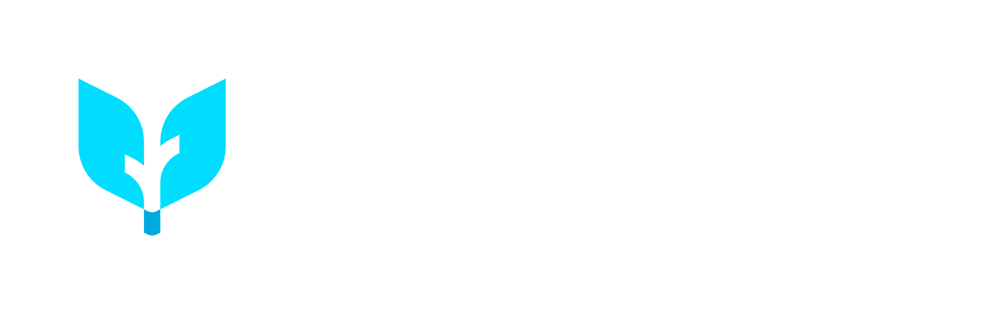

<p align="center">
  <picture>
    <source media="(prefers-color-scheme: dark)" srcset="docs/static/img/branding/agent-kernel-lockup-dark.svg">
    <source media="(prefers-color-scheme: light)" srcset="docs/static/img/branding/agent-kernel-lockup-light.svg">
    
  </picture>
</p>

<h3 align="center">The Operating System for Scalable &amp; Compliant Enterprise AI Agents</h3>

<p align="center">
  Run, orchestrate, and deploy production AI agents at scale — across frameworks and clouds — without lock-in, rewrites, or fragile glue code.
</p>

<p align="center">
  <a href="https://pypi.org/project/agentkernel/"></a>
  <a href="LICENSE"></a>
  <a href="https://discord.gg/snrPzb46uu"></a>
  <a href="https://github.com/yaalalabs/agent-kernel/stargazers"></a>
</p>

<p align="center">
  <a href="https://kernel.yaala.ai/docs">📖 Docs</a> •
  <a href="#-quick-start">🚀 Quick Start</a> •
  <a href="#-features">✨ Features</a> •
  <a href="#-deploy-anywhere">☁️ Deploy</a> •
  <a href="https://discord.gg/snrPzb46uu">💬 Discord</a> •
  <a href="DEVELOPER_GUIDE.md">🛠 Developer Guide</a>
</p>

---

## Why Agent Kernel?

Most agent frameworks help you build a *prototype*. **Agent Kernel is the platform layer that gets you to production** — with the governance, portability, and operational maturity that enterprises actually require.

|  | Agent Kernel |
|---|---|
| 🔌 **Framework-Agnostic** | Run OpenAI Agents SDK, LangGraph, CrewAI, and Google ADK side by side. Swap with 2 import lines. |
| ☁️ **Cloud-Agnostic** | The same agent code ships to AWS Lambda/ECS, Azure Functions/Container Apps, GCP (soon), or on-prem. |
| 🛡️ **Compliant by Default** | Built-in guardrails (OpenAI, AWS Bedrock), PII detection, full audit traces, jailbreak prevention. |
| 🧠 **Stateful & Knowledge-Aware** | Pluggable session stores (Redis, DynamoDB, Cosmos DB) + knowledge bases (ChromaDB, Neo4j, Starburst). |
| 💬 **Channels Built-In** | Slack, WhatsApp, Teams, Telegram, Gmail, Messenger, Instagram — out of the box. |
| 🔍 **Production Observability** | LangFuse and OpenLLMetry tracing wired in. Every agent, tool, and LLM call — visible. |
| 🤝 **Open Standards** | Native **MCP** (Model Context Protocol) and **A2A** (Agent-to-Agent) support. |
| 🆓 **Apache 2.0** | No licensing fees. No vendor lock-in. Production-ready open source. |

> ⭐ **If Agent Kernel is solving real problems for you, please star the repo — it's the single best way to help us grow.**

---

## 🚀 Quick Start

**Requirements:** Python 3.12 – 3.13.x

```bash
pip install agentkernel
```

Build a multi-agent system that runs on OpenAI Agents SDK today and LangGraph tomorrow — same code:

```python
from agentkernel.cli import CLI
from agentkernel.openai import OpenAIModule
from agents import Agent

math_agent = Agent(
    name="math",
    handoff_description="Specialist agent for math questions",
    instructions="You provide help with math problems.",
)

general_agent = Agent(
    name="general",
    handoff_description="Agent for general questions",
    instructions="You provide assistance with general queries.",
)

triage_agent = Agent(
    name="triage",
    instructions="You determine which agent to use based on the user's question.",
    handoffs=[general_agent, math_agent],
)

module = OpenAIModule([triage_agent, math_agent, general_agent])

if __name__ == "__main__":
    CLI.main()
```

That's it. Same code deploys to AWS Lambda, ECS, Azure Functions, or Container Apps with a single Terraform module. 👉 [Get Started](https://kernel.yaala.ai/docs)

---

## ✨ Features

### 🧩 Works with the Frameworks You Already Use

<p align="center">
  <b>OpenAI Agents SDK</b> &nbsp;•&nbsp; <b>LangGraph</b> &nbsp;•&nbsp; <b>CrewAI</b> &nbsp;•&nbsp; <b>Google ADK</b> &nbsp;•&nbsp; <i>Smol Agents (soon)</i> &nbsp;•&nbsp; <i>LiveKit (soon)</i>
</p>

No rewrites. No re-learning. Bring your agents — Agent Kernel handles the platform layer.

### 🛡️ Compliance & Governance — First-Class, Not an Afterthought

Enterprises can't ship agents they can't audit. Agent Kernel makes compliance the default:

- **Guardrails** — OpenAI and AWS Bedrock guardrails for PII detection, jailbreak prevention, content moderation.
- **Pre/Post Execution Hooks** — Inject policy checks, RAG context, redaction, or moderation around every agent call.
- **Full Traceability** — Every agent action, tool call, and LLM invocation logged with configurable verbosity.
- **Observability** — LangFuse and OpenLLMetry tracing with a single config line.
- **Data Residency** — Pick your cloud, your region, your storage backend. Your data stays where you need it.

### 🧠 Memory, Sessions & Knowledge Bases

| Layer | Backends |
|---|---|
| **Session / Memory** | In-memory, Redis, DynamoDB (AWS), Cosmos DB (Azure) |
| **Vector Knowledge** | ChromaDB |
| **Graph Knowledge** | Neo4j |
| **SQL Analytics** | Starburst Galaxy (Trino) |
| **Custom** | Pluggable `KnowledgeBase` interface — bring any backend |

### 💬 Messaging Channels — Out of the Box

Slack • WhatsApp • Microsoft Teams • Telegram • Gmail • Messenger • Instagram

Build once. Ship to every channel your users live on. No bespoke bot code.

### 🔌 Open Protocols

- **MCP (Model Context Protocol)** — Connect agents to external tools, data sources, and services. Optionally expose your agents *as* MCP tools.
- **A2A (Agent-to-Agent)** — Native message passing, handoffs, and coordination between agents in a shared ecosystem.

### ⚡ Built-In Execution Modes

- **Synchronous** — Classic request/response.
- **WebSocket / Async** — Streaming, long-running, real-time agent interactions.
- **Stateless MCP** — Lightweight agent-as-tool deployments.

---

## ☁️ Deploy Anywhere

Same agent code. Pick your runtime. Full Terraform modules included.

| Cloud | Serverless | Containerized |
|---|---|---|
| **AWS** | [Lambda](https://registry.terraform.io/modules/yaalalabs/ak-serverless/aws) | [ECS / Fargate](https://registry.terraform.io/modules/yaalalabs/ak-containerized/aws) |
| **Azure** | [Functions](https://registry.terraform.io/modules/yaalalabs/ak-serverless/azurerm) | [Container Apps](https://registry.terraform.io/modules/yaalalabs/ak-containerized/azurerm) |
| **GCP** | _Coming soon_ | _Coming soon_ |
| **On-Prem** | ✅ Docker image | ✅ REST API bundle |

---

## 🛠 Agent Skills — Supercharge Your Coding Assistant

Install Agent Kernel skills and Claude, Copilot, Cursor, or Windsurf become experts at building production agents — no hallucinated APIs.

```bash
ak skill install
```

| Skill | What it does |
|---|---|
| `ak-init` | Scaffold a new project — any framework, any deployment mode |
| `ak-build` | Add tools, agents, handoffs — context-aware and framework-specific |
| `ak-add-capabilities` | Wire in guardrails, tracing, sessions, MCP, A2A, hooks, multimodal |
| `ak-add-integration` | Slack, WhatsApp, Messenger, Instagram, Telegram, Gmail |
| `ak-cloud-deploy` | AWS Lambda, ECS, Azure Functions, Container Apps with full Terraform |
| `ak-test` | Fuzzy, judge, and fallback test modes + a debugging playbook |

---

## 🧪 Testing — pytest-Integrated

```bash
pytest tests/
```

Built-in fuzzy, semantic, and fallback comparison modes. CI/CD ready. Test agent behavior, not just code.

---

## 👥 Who's It For?

- **AI Startups** — Go from prototype to production in days, not quarters.
- **Software Product Companies** — Add intelligent agents to your SaaS without framework lock-in.
- **Software Services Companies** — Ship client agent solutions in weeks, not months.
- **Domain Experts** — Build production AI products without a full platform engineering team.
- **Regulated Enterprises** — Get compliance, traceability, and data residency by default.

---

## 🌐 Affiliations

Agent Kernel is proud to be:

- A member of the [Linux Foundation](https://www.linuxfoundation.org)
- A member of the [Agentic AI Foundation](https://aaif.io)

---

## 💬 Community & Support

- 📖 **Documentation:** [kernel.yaala.ai/docs](https://kernel.yaala.ai/docs)
- 💬 **Discord:** [Join the community](https://discord.gg/snrPzb46uu)
- 🐛 **Issues:** [GitHub Issues](https://github.com/yaalalabs/agent-kernel/issues)
- 📦 **PyPI:** [`pip install agentkernel`](https://pypi.org/project/agentkernel/)
- ☁️ **Terraform Registry:** [Official modules](https://registry.terraform.io/modules/yaalalabs)
- 🛠 **Developer Guide:** [DEVELOPER_GUIDE.md](DEVELOPER_GUIDE.md)

---

## License

Unless otherwise specified, all content — including all source and documentation files in this repository — is:

Copyright (c) 2025-2026 Yaala Labs.

Licensed under the Apache License, Version 2.0 (the "License"); you may not use this file except in compliance with the License. You may obtain a copy of the License at

http://www.apache.org/licenses/LICENSE-2.0

Unless required by applicable law or agreed to in writing, software distributed under the License is distributed on an "AS IS" BASIS, WITHOUT WARRANTIES OR CONDITIONS OF ANY KIND, either express or implied. See the License for the specific language governing permissions and limitations under the License.

SPDX-License-Identifier: Apache-2.0
