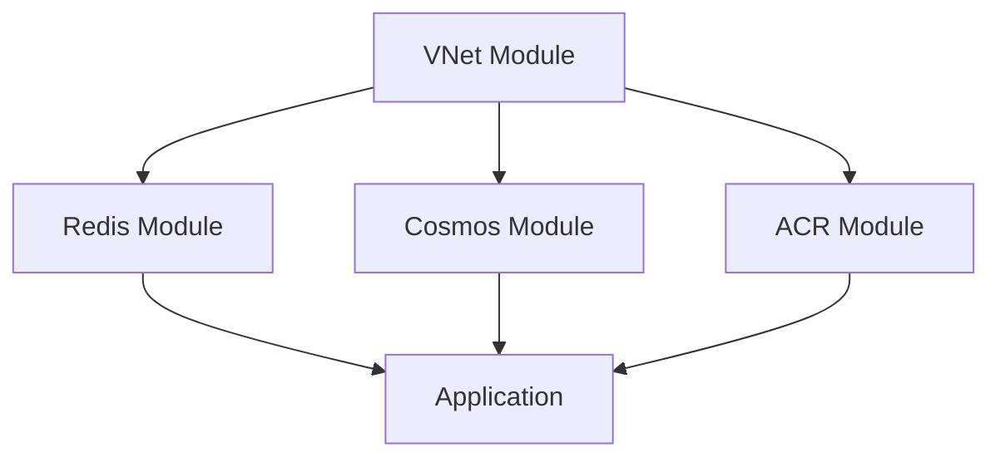

# Agent Kernel - Azure Common Infrastructure Modules

A collection of reusable Terraform modules for building Azure infrastructure, optimized for serverless and containerized applications.

## 📦 Available Modules

This package provides the following Terraform modules:

- **[ACR](modules/acr/)** - Azure Container Registry with Docker image building and private endpoint integration
- **[VNet](modules/vnet/)** - Virtual Network with specialized subnets for functions and infrastructure
- **[Redis](modules/redis/)** - Azure Managed Redis Enterprise with private endpoint configuration
- **[Cosmos](modules/cosmos/)** - Cosmos DB with Table API for session functionality

## 🚀 Quick Start

### Prerequisites

- Terraform >= 1.9.5
- Azure Provider >= 4.57.0
- Docker (for ACR module)

### Basic Usage

Each module can be used independently by referencing it as a submodule:

```hcl
# VNet Module
module "vnet" {
  source = "../common/modules/vnet"
  
  resource_group_name  = "myapp-prod-rg"
  location            = "East US"
  vnet_cidr           = "10.0.0.0/16"
  private_subnet_cidrs = ["10.0.3.0/24", "10.0.4.0/24"]
  product_alias       = "myapp"
  env_alias           = "prod"
}

# Redis Module
module "redis" {
  source = "../common/modules/redis"
  
  product_alias       = "myapp"
  env_alias           = "prod"
  module_name         = "cache"
  resource_group_name = "myapp-prod-rg"
  vnet_name          = module.vnet.vnet_name
  subnet_name        = module.vnet.private_subnet_name
  function_subnet    = module.vnet.function_subnet_name
}

# Cosmos DB Module
module "cosmos" {
  source = "../common/modules/cosmos"
  
  product_alias       = "myapp"
  env_alias           = "prod"
  module_name         = "data"
  table_name          = "session_store"
  resource_group_name = "myapp-prod-rg"
  vnet_name          = module.vnet.vnet_name
  subnet_id          = module.vnet.private_subnet_ids[0]
}

# ACR Module
module "acr" {
  source = "../common/modules/acr"
  
  product_alias       = "myapp"
  env_alias           = "prod"
  module_name         = "api"
  source_path         = "src/api"
  resource_group_name = "myapp-prod-rg"
}
```

## 📚 Module Documentation

Each module has its own comprehensive documentation:

- [ACR Module Documentation](modules/acr/README.md)
- [VNet Module Documentation](modules/vnet/README.md)
- [Redis Module Documentation](modules/redis/README.md)
- [Cosmos Module Documentation](modules/cosmos/README.md)

## 🔧 Requirements

| Name | Version |
|------|---------|
| Terraform | >= 1.9.5 |
| Azure Provider | >= 4.0.0 |
| Docker Provider | 3.6.2 (for ACR) |

## 💡 Common Patterns

### Serverless Application Stack

```hcl
# Create VNet for Azure Functions
module "vnet" {
  source = "../common/modules/vnet"
  
  resource_group_name = var.resource_group_name
  location           = var.region
  product_alias      = var.product_alias
  env_alias          = var.env_alias
}

# Create Redis cache with private endpoint
module "redis" {
  count = var.create_redis_cluster ? 1 : 0
  source = "../common/modules/redis"
  
  product_alias       = var.product_alias
  env_alias           = var.env_alias
  module_name         = var.module_name
  resource_group_name = var.resource_group_name
  vnet_name          = module.vnet.vnet_name
  subnet_name        = module.vnet.private_subnet_name
  function_subnet    = module.vnet.function_subnet_name
  is_production      = var.is_production
}

# Create Cosmos DB for session storage
module "cosmos" {
  count = var.create_cosmosdb_cluster ? 1 : 0
  source = "../common/modules/cosmos"
  
  product_alias       = var.product_alias
  env_alias           = var.env_alias
  module_name         = var.module_name
  table_name          = "session_store"
  resource_group_name = var.resource_group_name
  vnet_name          = module.vnet.vnet_name
  subnet_id          = module.vnet.private_subnet_ids[0]
}
```

### Containerized Application Stack

```hcl
# Create VNet for Container Apps
module "vnet" {
  source = "../common/modules/vnet"
  
  resource_group_name = var.resource_group_name
  location           = var.region
  product_alias      = var.product_alias
  env_alias          = var.env_alias
}

# Build and store container images
module "docker_image" {
  source = "../common/modules/acr"
  
  product_alias       = var.product_alias
  env_alias           = var.env_alias
  module_name         = var.module_name
  source_path         = var.package_path
  resource_group_name = var.resource_group_name
}

# Create Redis for caching
module "redis" {
  count = var.create_redis_cluster ? 1 : 0
  source = "../common/modules/redis"
  
  product_alias       = var.product_alias
  env_alias           = var.env_alias
  module_name         = var.module_name
  resource_group_name = var.resource_group_name
  vnet_name          = module.vnet.vnet_name
  subnet_name        = module.vnet.private_subnet_name
  function_subnet    = module.vnet.function_subnet_name
}

# Create Cosmos DB for data storage
module "cosmos" {
  count = var.create_cosmosdb_cluster ? 1 : 0
  source = "../common/modules/cosmos"
  
  product_alias       = var.product_alias
  env_alias           = var.env_alias
  module_name         = var.module_name
  table_name          = "session_store"
  resource_group_name = var.resource_group_name
  vnet_name          = module.vnet.vnet_name
  subnet_id          = module.vnet.private_subnet_ids[0]
}
```

## 🏗️ Architecture Patterns

### Network Architecture

The modules follow a consistent networking pattern:

- **VNet**: Creates specialized subnets for different purposes
  - **Infrastructure Subnet**: For private endpoints, Redis, Cosmos DB
  - **Function Subnet**: Dedicated for Azure Functions with proper delegation
- **Private Endpoints**: All data services use private endpoints for security
- **NAT Gateway**: Provides secure outbound internet access

### Security Best Practices

- **Private by Default**: All services disable public access
- **VNet Integration**: Resources communicate through private networks
- **Managed Identity**: Services use Azure AD authentication where possible
- **Encryption**: Data encrypted at rest and in transit

## 🔍 Module Dependencies



**Typical deployment order:**
1. VNet (provides networking foundation)
2. Redis, Cosmos, ACR (can be deployed in parallel)
3. Application resources (Functions, Container Apps)

## 🤝 Contributing

Contributions are welcome! Please refer to the main repository for contribution guidelines.

## 📄 License

This project is licensed under the terms specified in the LICENSE file.

## 🔗 Related Projects

- [Agent Kernel](https://github.com/yaalalabs/agent-kernel) - The main Agent Kernel project

## 📞 Support

For issues, questions, or contributions, please refer to the main repository's issue tracker.

---

## 📝 Technical Notes

This is a registry-compatible root module that contains no resources itself. All functionality is provided through submodules located in the `modules/` directory. This structure allows for:

- **Selective consumption**: Use only the modules you need
- **Independent versioning**: Each module evolves independently
- **Registry compatibility**: Conforms to Terraform registry requirements
- **Namespace isolation**: Clean module paths via `//modules/<name>` syntax

**Important**: Always reference modules using the `../common/modules/<module-name>` syntax as shown in the usage examples above.

## License

Unless otherwise specified, all content, including all source code files and documentation files in this repository are:

Copyright (c) 2025-2026 Yaala Labs.

Licensed under the Apache License, Version 2.0 (the "License"); you may not use this file except in compliance with the License. You may obtain a copy of the License at

http://www.apache.org/licenses/LICENSE-2.0

Unless required by applicable law or agreed to in writing, software distributed under the License is distributed on an "AS IS" BASIS, WITHOUT WARRANTIES OR CONDITIONS OF ANY KIND, either express or implied. See the License for the specific language governing permissions and limitations under the License.