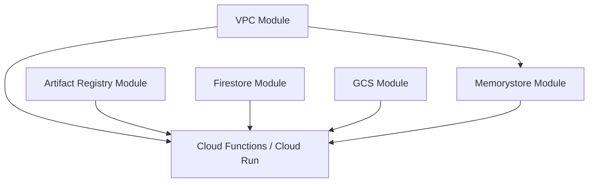

# Agent Kernel - GCP Common Infrastructure Modules

A collection of reusable Terraform modules for building GCP infrastructure, optimized for serverless and containerized applications.

## 📦 Available Modules

This package provides the following Terraform modules:

- **[Artifact Registry](modules/artifact-registry/)** - Artifact Registry with Docker image building and lifecycle policies
- **[VPC](modules/vpc/)** - VPC Network with public/private subnets, Cloud NAT, and Cloud Router
- **[Memorystore](modules/memorystore/)** - Memorystore for Redis with VPC integration and AUTH support
- **[Firestore](modules/firestore/)** - Firestore Native mode database for session storage with TTL and indexing
- **[GCS](modules/gcs/)** - Cloud Storage bucket with versioning and CMEK encryption support

## 🚀 Quick Start

### Prerequisites

- Terraform >= 1.9.5
- Google Provider >= 6.8.0
- Docker (for Artifact Registry module)
- Valid GCP credentials configured (`gcloud auth application-default login`)

### Basic Usage

Each module can be used independently by referencing it as a submodule:

```hcl
# VPC Module
module "vpc" {
  source = "../common/modules/vpc"
  # source = "yaalalabs/ak-common/google//modules/vpc"  # uncomment for registry

  project_id          = "my-gcp-project"
  region              = "us-central1"
  public_subnet_cidr  = "10.0.1.0/24"
  private_subnet_cidr = "10.0.2.0/24"
  product_alias       = "myapp"
  env_alias           = "prod"
}

# Memorystore Redis Module
module "redis" {
  source = "../common/modules/memorystore"
  # source = "yaalalabs/ak-common/google//modules/memorystore"  # uncomment for registry

  project_id    = "my-gcp-project"
  region        = "us-central1"
  product_alias = "myapp"
  env_alias     = "prod"
  module_name   = "cache"
  network_id    = module.vpc.network_id
}

# Firestore Module
module "firestore" {
  source = "../common/modules/firestore"
  # source = "yaalalabs/ak-common/google//modules/firestore"  # uncomment for registry

  project_id    = "my-gcp-project"
  region        = "us-central1"
  product_alias = "myapp"
  env_alias     = "prod"
  module_name   = "data"
}

# Artifact Registry Module
module "docker_image" {
  source = "../common/modules/artifact-registry"
  # source = "yaalalabs/ak-common/google//modules/artifact-registry"  # uncomment for registry

  project_id    = "my-gcp-project"
  region        = "us-central1"
  product_alias = "myapp"
  env_alias     = "prod"
  module_name   = "api"
  source_path   = "${path.module}/src"
}

# GCS Module
module "storage" {
  source = "../common/modules/gcs"
  # source = "yaalalabs/ak-common/google//modules/gcs"  # uncomment for registry

  project_id    = "my-gcp-project"
  region        = "us-central1"
  product_alias = "myapp"
  env_alias     = "prod"
  is_production = true
}
```

## 📚 Module Documentation

Each module has its own comprehensive documentation:

- [Artifact Registry Module Documentation](modules/artifact-registry/README.md)
- [VPC Module Documentation](modules/vpc/README.md)
- [Memorystore Module Documentation](modules/memorystore/README.md)
- [Firestore Module Documentation](modules/firestore/README.md)
- [GCS Module Documentation](modules/gcs/README.md)

## 🔧 Requirements

| Name | Version |
|------|---------|
| Terraform | >= 1.9.5 |
| Google Provider | >= 6.8.0 |
| Docker Provider | >= 3.0.0 (for Artifact Registry) |

## 💡 Common Patterns

### Serverless Application Stack

```hcl
# Create VPC for Cloud Functions
module "vpc" {
  source = "../common/modules/vpc"
  # source = "yaalalabs/ak-common/google//modules/vpc"  # uncomment for registry

  project_id    = var.project_id
  region        = var.region
  product_alias = var.product_alias
  env_alias     = var.env_alias
}

# Create Redis cache
module "redis" {
  count  = var.create_redis_cluster ? 1 : 0
  source = "../common/modules/memorystore"
  # source = "yaalalabs/ak-common/google//modules/memorystore"  # uncomment for registry

  project_id    = var.project_id
  region        = var.region
  product_alias = var.product_alias
  env_alias     = var.env_alias
  module_name   = var.module_name
  network_id    = module.vpc.network_id
}

# Create Firestore for session storage
module "firestore" {
  count  = var.create_firestore_database ? 1 : 0
  source = "../common/modules/firestore"
  # source = "yaalalabs/ak-common/google//modules/firestore"  # uncomment for registry

  project_id    = var.project_id
  region        = var.region
  product_alias = var.product_alias
  env_alias     = var.env_alias
  module_name   = var.module_name
}

# Build and store container images
module "docker_image" {
  source = "../common/modules/artifact-registry"
  # source = "yaalalabs/ak-common/google//modules/artifact-registry"  # uncomment for registry

  project_id    = var.project_id
  region        = var.region
  product_alias = var.product_alias
  env_alias     = var.env_alias
  module_name   = var.module_name
  source_path   = var.package_path
}
```

### Containerized Application Stack

```hcl
# Create VPC for Cloud Run
module "vpc" {
  source = "../common/modules/vpc"
  # source = "yaalalabs/ak-common/google//modules/vpc"  # uncomment for registry

  project_id    = var.project_id
  region        = var.region
  product_alias = var.product_alias
  env_alias     = var.env_alias
}

# Build and store container images
module "docker_image" {
  source = "../common/modules/artifact-registry"
  # source = "yaalalabs/ak-common/google//modules/artifact-registry"  # uncomment for registry

  project_id    = var.project_id
  region        = var.region
  product_alias = var.product_alias
  env_alias     = var.env_alias
  module_name   = var.module_name
  source_path   = var.package_path
}

# Create Redis for caching
module "redis" {
  count  = var.create_redis_cluster ? 1 : 0
  source = "../common/modules/memorystore"
  # source = "yaalalabs/ak-common/google//modules/memorystore"  # uncomment for registry

  project_id    = var.project_id
  region        = var.region
  product_alias = var.product_alias
  env_alias     = var.env_alias
  module_name   = var.module_name
  network_id    = module.vpc.network_id
}

# Create Firestore for data storage
module "firestore" {
  count  = var.create_firestore_database ? 1 : 0
  source = "../common/modules/firestore"
  # source = "yaalalabs/ak-common/google//modules/firestore"  # uncomment for registry

  project_id    = var.project_id
  region        = var.region
  product_alias = var.product_alias
  env_alias     = var.env_alias
  module_name   = var.module_name
}

# Create GCS for source storage
module "storage" {
  source = "../common/modules/gcs"
  # source = "yaalalabs/ak-common/google//modules/gcs"  # uncomment for registry

  project_id    = var.project_id
  region        = var.region
  product_alias = var.product_alias
  env_alias     = var.env_alias
  is_production = var.is_production
}
```

## 🏗️ Architecture Patterns

### Network Architecture

The modules follow a consistent networking pattern:

- **VPC Network**: Custom mode VPC with manually managed subnets
  - **Public Subnet**: For resources that need direct external access
  - **Private Subnet**: For Cloud Functions, Cloud Run, Redis, and Firestore connectors with Private Google Access enabled
- **Cloud NAT**: Provides secure outbound internet access for private resources via Cloud Router
- **Firewall Rules**: Internal traffic allowed between subnets, all external traffic blocked by default

### Security Best Practices

- **Private by Default**: Resources deployed in private subnets with no public IPs
- **Private Google Access**: Enables access to Google APIs without public internet
- **AUTH Enabled**: Memorystore Redis requires password-based authentication
- **Transit Encryption**: Redis connections use TLS (SERVER_AUTHENTICATION mode)
- **Uniform Bucket Access**: GCS uses IAM-only access control, no per-object ACLs
- **CMEK Support**: Cloud Storage supports customer-managed encryption keys

## 🔍 Module Dependencies



**Typical deployment order:**
1. VPC (provides networking foundation)
2. Memorystore, Firestore, Artifact Registry, GCS (can be deployed in parallel)
3. Application resources (Cloud Functions, Cloud Run)

## 🔄 Cross-Cloud Comparison

| GCP Module | AWS Equivalent | Azure Equivalent |
|------------|---------------|------------------|
| VPC Network | VPC | VNet |
| Artifact Registry | ECR | ACR |
| Cloud Storage (GCS) | S3 | Blob Storage |
| Firestore | DynamoDB | Cosmos DB |
| Memorystore Redis | ElastiCache Redis | Azure Cache for Redis |

## 🤝 Contributing

Contributions are welcome! Please refer to the main repository for contribution guidelines.

## 📄 License

This project is licensed under the terms specified in the LICENSE file.

## 🔗 Related Projects

- [Agent Kernel](https://github.com/yaalalabs/agent-kernel) - The main Agent Kernel project

## 📞 Support

For issues, questions, or contributions, please refer to the main repository's issue tracker.

---

## 📝 Technical Notes

This is a registry-compatible root module that contains no resources itself. All functionality is provided through submodules located in the `modules/` directory. This structure allows for:

- **Selective consumption**: Use only the modules you need
- **Independent versioning**: Each module evolves independently
- **Registry compatibility**: Conforms to Terraform registry requirements
- **Namespace isolation**: Clean module paths via `//modules/<name>` syntax

**Important**: Always reference modules using the `//modules/<module-name>` syntax as shown in the usage examples above.

## License

Unless otherwise specified, all content, including all source code files and documentation files in this repository are:

Copyright (c) 2025-2026 Yaala Labs.

Licensed under the Apache License, Version 2.0 (the "License"); you may not use this file except in compliance with the License. You may obtain a copy of the License at

http://www.apache.org/licenses/LICENSE-2.0

Unless required by applicable law or agreed to in writing, software distributed under the License is distributed on an "AS IS" BASIS, WITHOUT WARRANTIES OR CONDITIONS OF ANY KIND, either express or implied. See the License for the specific language governing permissions and limitations under the License.
