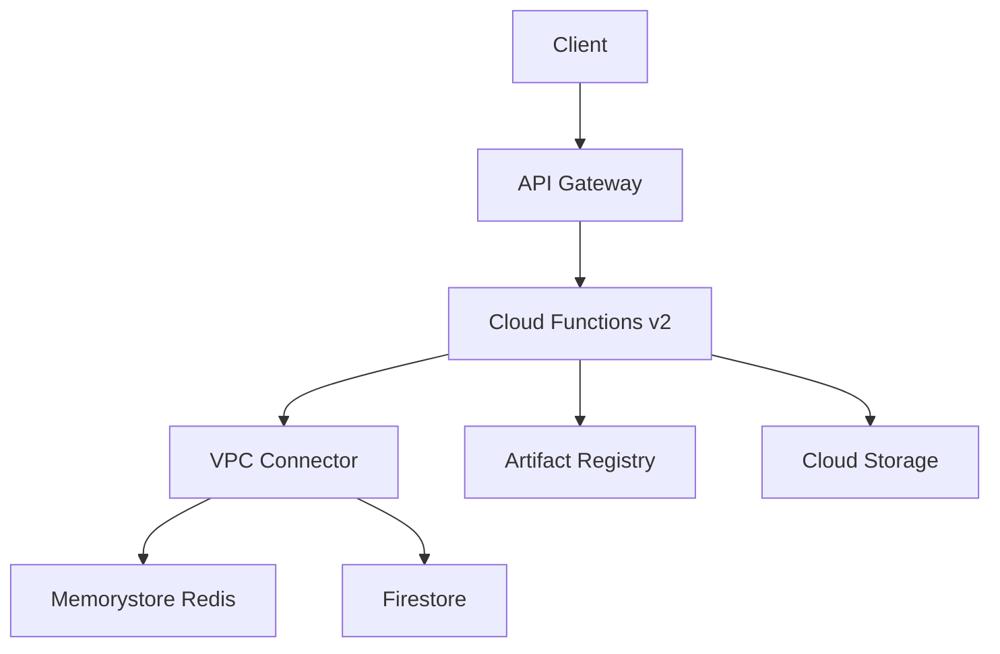

# Agent Kernel - GCP Serverless Module

A Terraform module for deploying serverless applications on GCP, combining Cloud Functions v2 with API Gateway to create production-ready APIs.

## 📋 Overview

This module provides a complete serverless deployment solution:

- ⚡ **Cloud Functions v2**: Gen2 functions built on Cloud Run with Docker image or source zip deployment
- 🌐 **API Gateway**: OpenAPI-based routing with versioned endpoints
- 🔄 **Flexible Deployment**: Support for Docker images and source code uploads
- 🔒 **Security**: Dedicated service account, VPC Connector for private networking
- 🏷️ **Best Practices**: Resource labeling and naming conventions
- 📊 **Monitoring**: Cloud Logging integration (built-in, no extra config needed)

## 📋 Requirements

| Name | Version |
|------|---------|
| Terraform | >= 1.9.5 |
| Google Provider | >= 6.8.0 |
| Docker Provider | 3.6.2 (for Image deployments) |

## 🚀 Usage

### Basic Docker Image Deployment

```hcl
module "serverless_agent" {
  source = "yaalalabs/ak-serverless/google"

  project_id    = "my-gcp-project"
  region        = "us-central1"
  product_alias = "myapp"
  env_alias     = "prod"

  module_name          = "openai"
  function_name        = "run"
  function_description = "OpenAI Agent Function"

  package_type = "Image"
  package_path = "${path.module}/deploy"

  timeout    = 60
  memory_mb  = 512

  environment_variables = {
    ENVIRONMENT = "production"
    LOG_LEVEL   = "info"
  }

  # API Gateway
  api_version    = "v1"
  api_base_path  = "api"
  agent_endpoint = "chat"
  gateway_endpoints = [
    {
      path   = "health"
      method = "GET"
    }
  ]

  tags = {
    environment = "production"
    service     = "api"
  }
}

output "api_url" {
  value = module.serverless_agent.agent_invoke_url
}
```

### With Redis and Firestore

```hcl
module "serverless_agent" {
  source = "yaalalabs/ak-serverless/google"

  project_id    = "my-gcp-project"
  region        = "us-central1"
  product_alias = "myapp"
  env_alias     = "prod"

  module_name   = "openai"
  function_name = "run"
  package_type  = "Image"
  package_path  = "${path.module}/deploy"

  # Enable session storage backends
  create_redis_cluster      = true
  create_firestore_database = true

  # API Gateway
  api_version    = "v1"
  api_base_path  = "api"
  agent_endpoint = "chat"
}
```

### Using an Existing VPC

```hcl
module "serverless_agent" {
  source = "yaalalabs/ak-serverless/google"

  project_id    = "my-gcp-project"
  region        = "us-central1"
  product_alias = "myapp"
  env_alias     = "prod"

  module_name   = "openai"
  function_name = "run"
  package_type  = "Image"
  package_path  = "${path.module}/deploy"

  # Pass existing VPC instead of creating new one
  network_id        = "projects/my-project/global/networks/my-vpc"
  private_subnet_id = "projects/my-project/regions/us-central1/subnetworks/my-subnet"
}
```

## 🏗️ Architecture



### How It Works

1. **Client** sends HTTP request to API Gateway
2. **API Gateway** routes the request based on OpenAPI spec (e.g., `/api/v1/chat` → function)
3. **Cloud Functions v2** runs your agent code (Docker image or source zip)
4. Function connects to **Redis** and **Firestore** through VPC Connector (private network)
5. Response flows back through API Gateway to the client

### Component Mapping (AWS → GCP)

| AWS Component | GCP Component |
|--------------|---------------|
| Lambda | Cloud Functions v2 |
| API Gateway (REST) | API Gateway (OpenAPI) |
| IAM Role | Service Account |
| Security Group + VPC | VPC Connector |
| CloudWatch Logs | Cloud Logging (built-in) |
| ECR | Artifact Registry |
| S3 (code storage) | GCS |
| DynamoDB | Firestore |
| ElastiCache Redis | Memorystore Redis |

## 📥 Inputs

| Name | Description | Type | Default | Required |
|------|-------------|------|---------|----------|
| project_id | GCP project ID | string | - | yes |
| region | GCP region | string | - | yes |
| product_alias | Product alias for naming | string | - | yes |
| env_alias | Environment alias | string | - | yes |
| module_name | Module name | string | - | yes |
| function_name | Cloud Function name | string | - | yes |
| package_path | Docker build context path | string | - | yes |
| package_type | Deployment type (Image/Source) | string | "Image" | no |
| timeout | Function timeout in seconds | number | 60 | no |
| memory_mb | Function memory in MB | number | 256 | no |
| max_instance_count | Max function instances | number | 10 | no |
| min_instance_count | Min function instances | number | 0 | no |
| environment_variables | Env vars for the function | map(string) | {} | no |
| api_version | API version | string | "v1" | no |
| api_base_path | API base path | string | "api" | no |
| agent_endpoint | Agent endpoint path | string | "chat" | no |
| gateway_endpoints | Additional API endpoints | list(object) | [] | no |
| network_id | Existing VPC network ID | string | null | no |
| create_redis_cluster | Create Memorystore Redis | bool | false | no |
| create_firestore_database | Create Firestore DB | bool | false | no |

## 📤 Outputs

| Name | Description |
|------|-------------|
| function_url | Direct Cloud Function HTTPS URL |
| function_name | Cloud Function resource name |
| function_service_account | Service account email |
| gateway_url | API Gateway hostname |
| agent_invoke_url | Full agent invocation URL via API Gateway |

## 🤝 Contributing

Contributions are welcome! Please refer to the main repository for contribution guidelines.

## 🔗 Related Projects

- [Agent Kernel](https://github.com/yaalalabs/agent-kernel) - The main Agent Kernel project
- [GCP Common Modules](../common/) - Shared infrastructure modules used by this module

## License

Unless otherwise specified, all content, including all source code files and documentation files in this repository are:

Copyright (c) 2025-2026 Yaala Labs.

Licensed under the Apache License, Version 2.0 (the "License"); you may not use this file except in compliance with the License. You may obtain a copy of the License at

http://www.apache.org/licenses/LICENSE-2.0

Unless required by applicable law or agreed to in writing, software distributed under the License is distributed on an "AS IS" BASIS, WITHOUT WARRANTIES OR CONDITIONS OF ANY KIND, either express or implied. See the License for the specific language governing permissions and limitations under the License.
