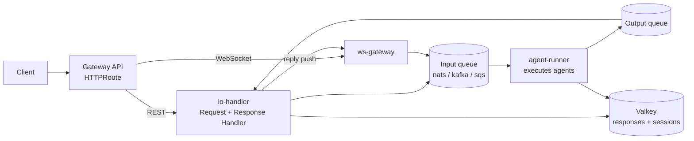

# Agent Kernel on Kubernetes

A Helm chart deploying the Agent Kernel queue-execution pipeline to any Kubernetes cluster:
an `io-handler` Deployment (Request Handler REST API + Response Handler), an `agent-runner`
Deployment (the consumers executing your agents), and an optional `ws-gateway` Deployment for
WebSocket delivery. Backing services (Valkey, NATS) ship as condition-gated dependencies of
the official charts; flavors are values files over one set of templates.



## Quick start (dev flavor)

Build the application images (see [the example](../../examples/k8s/openai-queue-mode/), which
walks this end to end on k3d, microk8s, and k3s), load them into your cluster, then:

```bash
helm dependency build ./chart
helm install ak ./chart -f ./chart/values-dev.yaml \
  --set ioHandler.image.repository=<io image> \
  --set agentRunner.image.repository=<runner image> --set image.tag=<tag> \
  --set extraEnv[0].name=OPENAI_API_KEY,extraEnv[0].value=<key>
kubectl port-forward service/ak-agent-kernel-io 8000:80
curl -s -X POST http://localhost:8000/api/v1/chat \
  -H 'Content-Type: application/json' \
  -d '{"prompt": "Hello", "session_id": "s1", "agent": "triage"}'
```

The dev flavor runs single replicas over in-cluster NATS JetStream and Valkey, with the
JetStream streams and consumers auto-provisioned at startup. The smallest possible install is
the single-process profile documented at the bottom of `values-dev.yaml`: one pod, in-process
queues, no backing services.

## What the chart installs, and what it expects

First-party templates: the two (or three) Deployments, the io `Service` (ClusterIP) and the
gateway's headless `Service`, `Gateway`/`HTTPRoute` objects (or a plain
`Service type=LoadBalancer` fallback), the `AK_*` ConfigMap, the push-token Secret, a
NetworkPolicy for the gateway pods, an optional KEDA `ScaledObject` and HPA, an optional
`ServiceMonitor`, NACK Stream/Consumer CRs, and Strimzi Kafka CRs.

Condition-gated dependencies: `valkey` (official `valkey-io/valkey-helm`) and `nats`
(official `nats-io/k8s`). Disable either to point the values at an external instance.

Documented prerequisites, deliberately never installed by this chart:

| Prerequisite | Needed when | Notes |
|---|---|---|
| Gateway API CRDs + implementation | `gateway.enabled` | Envoy Gateway (baremetal), AWS Load Balancer Controller v3+ (EKS), or any conformant implementation via `gateway.className` |
| MetalLB | baremetal LoadBalancer IPs | L2 mode needs nothing from the network team; BGP for high throughput |
| cert-manager | gateway TLS on baremetal | annotate the Gateway with your ClusterIssuer |
| KEDA | `keda.enabled` | queue-depth autoscaling of the runner tier |
| NACK controller | `natsResources.enabled` | declarative JetStream objects (production posture) |
| Strimzi operator | `kafka.enabled` | in-cluster Kafka as CRs |

## Flavors

| File | Posture |
|---|---|
| `values.yaml` | Neutral defaults: NATS transport, in-cluster NATS + Valkey, no gateway, two replicas per tier |
| `values-dev.yaml` | Micro-cluster: single replicas, `auto_provision` JetStream, TLS off, port-forward entry; single-process profile in comments |
| `values-baremetal.yaml` | Envoy Gateway class, cert-manager issuer annotation, NACK CRs, OpenEBS hostpath storage, MetalLB prerequisite |
| `values-eks.yaml` | ALB gateway class, ACM via controller annotations, EBS gp3 storage, Pod Identity for SQS; `sqs`, `kafka`, and `nats` all valid |

Flavors never fork templates: every difference is a value.

## The application image contract

The chart runs *your* images. Mirror
[examples/k8s/openai-queue-mode](../../examples/k8s/openai-queue-mode/): one Dockerfile per
component (each component's `image` block overrides the shared `image` defaults), or one
shared image whose per-Deployment `command` selects the entry file.

| Deployment | Default command | Entry point |
|---|---|---|
| io-handler | `python app_io_handler.py` | `IOHandler.run()` (pass `auth_validator=` only for the in_memory single-process profile's WebSocket co-hosting) |
| agent-runner | `python app_agent_runner.py` | registers your agent modules, then `AgentRunner.run()` |
| ws-gateway | `python app_ws_gateway.py` | `WebSocketGateway.run(auth_validator=...)` |

Your `config.yaml` (baked into the image) declares what runs: `execution.mode`, agents,
logging. The chart injects where it runs as environment variables, which override the
corresponding `config.yaml` fields (the same app/infra split the ECS Terraform deployment
uses):

| Variable | Source |
|---|---|
| `AK_EXECUTION__MODE` | `execution.mode` |
| `AK_EXECUTION__QUEUES__TYPE` | `transport.type` |
| `AK_EXECUTION__QUEUES__NATS__*` / `__KAFKA__*` | `transport.nats.*` / `transport.kafka.*` connection values |
| `AK_EXECUTION__QUEUES__INPUT__URL` / `__OUTPUT__URL` | `transport.sqs.*` (sqs transport) |
| `AK_EXECUTION__QUEUES__INPUT__*` / `__OUTPUT__*` | `transport.input.*` / `transport.output.*` |
| `AK_EXECUTION__QUEUES__BATCH_SIZE` | `transport.batchSize` |
| `AK_EXECUTION__RESPONSE_STORE__*` | `responseStore.*` (in-cluster Valkey by default) |
| `AK_SESSION__*` | `session.*` (in-cluster Valkey by default) |
| `AK_WEBSOCKET_API__PUSH_AUTH_TOKEN` | the push-token Secret (io-handler and ws-gateway pods) |
| `AK_POD_IP` | downward API, `status.podIP` (ws-gateway pods) |

Model provider credentials (e.g. `OPENAI_API_KEY`) are yours to inject through `extraEnv`,
ideally from a Secret.

## Transports

`transport.type` selects the broker; the pipeline and its semantics (per-session ordering,
bounded retry, dedup, permanent-failure replies) are identical over all of them.

- **`nats` (default, recommended on-prem)**: JetStream work-queue streams with one durable
  consumer per partition. Dev clusters set `transport.nats.autoProvision: true` and Agent
  Kernel creates the objects at startup. Production keeps it `false` and manages them
  declaratively: `natsResources.enabled` renders NACK CRs that match exactly what the
  transport verifies (streams with `workqueue` retention and the `duplicateWindow`, one
  consumer per partition filtering `<prefix>.<partition>.>` with `ackWait`,
  `maxDeliver = max_receive_count + 1`, `maxAckPending: 1`). Partitioning is computed
  client-side, so the CRs need no subject transform.
- **`kafka`**: pair with the Strimzi operator; `kafka.enabled` renders the cluster, node
  pool, and the four topics (input/output plus `.dlq` counterparts) with
  `kafka.partitions` as the up-front capacity parameter. The Kafka transport's retry/dedup
  bookkeeping follows the session store, so keep `session.type` on a shared backend.
- **`sqs`**: no broker to operate; the EKS option via Pod Identity. Set the two queue URLs.

Sizing rule: `replicas * transport.input.noOfConsumers <= partitions`, or extra consumers
find no free partition.

## WebSocket delivery (`async` / `stream` modes)

Enable the gateway tier for WebSocket modes on a broker transport:

```yaml
execution:
  mode: stream
wsGateway:
  enabled: true
  auth:
    token: <random shared secret>   # or existingSecret
```

The gateway owns client sockets and nothing else: it authenticates the handshake (your
`auth_validator`), enqueues chat frames directly to the transport, and records each
connection in the shared connection store (provided by the session backend, so `session.type`
must be a shared store such as `valkey`). Response Handlers on the io pods resolve the user's
current connections and POST each frame to the owning pod's `/internal/push`, authenticated
by the shared token; replies reach all of a user's connections on whichever gateway pod holds
them, and io/runner pods roll without dropping a single connection.

The WebSocket HTTPRoute carries raised timeouts (`gateway.websocket.requestTimeout: 0s`
disables them) and must never have request buffering enabled: Envoy Gateway deadlocks
buffered WebSocket upgrades (envoyproxy/gateway#8578). The NetworkPolicy restricts ingress to
the gateway pods to the Gateway API data plane and this release's own pods, which keeps
`/internal/push` unreachable from other cluster workloads. If WebSocket clients arrive
through the `serviceLB` fallback instead of a Gateway API implementation, that traffic comes
via kube-proxy with no pod identity and the policy blocks it on most CNIs: append an
`ipBlock` rule through `networkPolicy.extraIngress`, or set `networkPolicy.enabled: false`.

## Autoscaling and drain

- **agent-runner** scales on queue depth (`keda.enabled`, KEDA prerequisite): Kafka consumer
  lag, NATS JetStream pending messages (via the NATS monitoring endpoint on `:8222`), or SQS
  queue length, selected by `transport.type`. `minReplicaCount: 1` because cold starts are
  slow (image pull + Python imports); `maxReplicaCount` defaults to
  `partitions / input.noOfConsumers`, past which a new replica finds no free partition.
- **io-handler** scales on plain CPU (`ioHandler.autoscaling`), being request-bound.
- Drain: runner consumers observe SIGTERM, stop claiming work, and finish in-flight runs;
  `agentRunner.terminationGracePeriodSeconds` (default 120) must exceed your longest agent
  turn, and a short `preStop` sleep covers endpoint deregistration.

## Air-gapped installs

Set `global.imageRegistry` to your private registry: it prefixes the application image and
the subcharts' images. Every release publishes an `images.txt` manifest (see
[the publish workflow](../../.github/workflows/publish-chart.yaml)) listing every image the
chart references, for mirroring. The chart itself is published as an OCI artifact, so it can
be copied into the same registry and installed by digest:

```bash
helm pull oci://ghcr.io/yaalalabs/charts/agent-kernel --version <version>
helm install ak oci://registry.example.internal/charts/agent-kernel --version <version>
```

## Observability

Observability ships as recipes, not chart dependencies: nothing here adds subcharts.

**Metrics stack** (Prometheus Operator + Grafana):

```bash
helm install monitoring oci://ghcr.io/prometheus-community/charts/kube-prometheus-stack \
  -n monitoring --create-namespace
```

Then set `serviceMonitor.enabled: true` here if your image exposes an app metrics endpoint.

**Broker metrics**:

- NATS: the subchart bundles a Prometheus exporter sidecar; enable it with
  `--set nats.promExporter.enabled=true --set nats.promExporter.podMonitor.enabled=true`.
- Kafka (Strimzi): add `spec.kafka.metricsConfig` (JMX Prometheus exporter) to the Kafka CR
  via your own values overlay, and deploy Strimzi's Kafka Exporter for consumer-lag metrics
  (`spec.kafkaExporter: {}` on the Kafka CR).

**Tracing**: Agent Kernel's tracing providers (Langfuse, OpenLLMetry, Logfire) are app-level
and configured through `config.yaml`/`AK_TRACE__*` in your image; on-cluster, run one
OpenTelemetry Collector as the single funnel and point OTLP-capable providers at it:

```bash
helm install otel-collector oci://ghcr.io/open-telemetry/opentelemetry-helm-charts/opentelemetry-collector \
  -n monitoring --set mode=deployment --set image.repository=otel/opentelemetry-collector-k8s
```

**Self-hosted Langfuse** (optional companion): the official `langfuse/langfuse-k8s` chart.
Budget for it separately: Postgres + ClickHouse + Redis/Valkey + S3-compatible storage at
roughly 9+ CPU / 22+ GiB for the Langfuse profile alone. Its bundled single-replica
subcharts are smoke-test conveniences, not production settings.

## CI

`ci/ct.yaml` configures [chart-testing](https://github.com/helm/chart-testing):

```bash
ct lint --config ak-deployment/ak-k8s/ci/ct.yaml
ct install --config ak-deployment/ak-k8s/ci/ct.yaml    # against a kind cluster
```

`chart/ci/kind-smoke-values.yaml` is the values file ct installs with: the dev flavor sized
for a CI node, expecting the example image preloaded via `kind load docker-image`.

## Publishing

The chart is pushed as an OCI artifact to `oci://ghcr.io/yaalalabs/charts` by the
`publish-chart` workflow (manual dispatch per release tag), which also attaches the
`images.txt` manifest to the GitHub release.
