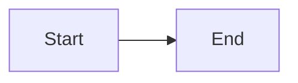

# Agent Kernel Documentation

This directory contains the comprehensive documentation for Agent Kernel, built with [Docusaurus 2](https://docusaurus.io/).

## 🚀 Quick Start

### Installation

```bash
cd docs
npm install
```

### Local Development

```bash
npm start
```

This command starts a local development server and opens up a browser window. Most changes are reflected live without having to restart the server.

### Build

```bash
npm run build
```

This command generates static content into the `build` directory and can be served using any static contents hosting service.

## 📁 Structure

```
docs/
├── docs/                    # Documentation markdown files
│   ├── intro.md            # Introduction
│   ├── installation.md     # Installation guide
│   ├── quick-start.md      # Quick start guide
│   ├── core-concepts/      # Core concepts documentation
│   ├── architecture/       # Architecture documentation
│   ├── frameworks/         # Framework integration guides
│   ├── deployment/         # Deployment guides
│   ├── api/               # API documentation
│   ├── testing/           # Testing guides
│   ├── advanced/          # Advanced features
│   └── examples/          # Examples
├── src/                   # React components and custom pages
│   └── css/              # Custom CSS
├── static/               # Static assets (images, etc.)
├── docusaurus.config.js  # Docusaurus configuration
├── sidebars.js          # Sidebar navigation
└── package.json         # Dependencies
```

## 🎨 Features

- **Mermaid Diagrams**: Rich architectural diagrams throughout
- **Code Syntax Highlighting**: Python, Bash, JSON, YAML support
- **Dark Mode**: Toggle between light and dark themes
- **Search**: Full-text search across documentation
- **Mobile Responsive**: Works great on all devices
- **Framework Tabs**: Compare different framework implementations
- **Interactive Examples**: Copy-paste ready code examples

## 📝 Writing Documentation

### Adding a New Page

1. Create a new markdown file in `docs/` or appropriate subdirectory
2. Add frontmatter:

```markdown
---
sidebar_position: 1
---

# Your Page Title

Your content here...
```

3. The page will automatically appear in the sidebar

### Using Mermaid Diagrams

````markdown

````

### Adding Code Examples

````markdown
```python
from agentkernel.cli import CLI

CLI.main()
```
````

### Using Tabs

```markdown
import Tabs from '@theme/Tabs';
import TabItem from '@theme/TabItem';

<Tabs>
<TabItem value="openai" label="OpenAI" default>

Content for OpenAI

</TabItem>
<TabItem value="crewai" label="CrewAI">

Content for CrewAI

</TabItem>
</Tabs>
```

## 🚢 Deployment

### GitHub Pages

The documentation is automatically deployed to GitHub Pages when changes are pushed to the `main` or `develop` branch.

The workflow is defined in `.github/workflows/deploy-docs.yml`.

**URL**: `https://yaalalabs.github.io/agent-kernel/`

### Manual Deployment

```bash
npm run build
npm run serve  # Test the build locally

# Deploy (if configured)
npm run deploy
```

## 🔧 Configuration

### Site Configuration

Edit `docusaurus.config.js` to change:
- Site title and tagline
- Base URL and organization name
- Theme colors
- Navbar and footer links
- Plugin configurations

### Sidebar Configuration

Edit `sidebars.js` to change:
- Sidebar structure
- Document organization
- Category grouping

## 📚 Documentation Structure

### Core Sections

1. **Getting Started**: Introduction, installation, quick start
2. **Core Concepts**: Agent, Runner, Session, Module, Runtime
3. **Architecture**: System design, execution flow, memory management
4. **Framework Integration**: OpenAI, CrewAI, LangGraph, Google ADK
5. **Deployment**: Local, AWS Serverless, AWS Containerized
6. **API & Integration**: REST API, MCP, A2A
7. **Testing**: CLI testing, automated testing
8. **Advanced Features**: Memory, RBAC, traceability, multi-agent
9. **Examples**: Practical examples and tutorials

## 🎯 Best Practices

- Keep pages focused and concise
- Use Mermaid diagrams for architecture
- Provide working code examples
- Link related pages
- Use tabs for framework-specific content
- Include both conceptual and practical information
- Update examples when API changes

## 🤝 Contributing

To contribute to the documentation:

1. Fork the repository
2. Create a feature branch
3. Make your changes in the `docs/` directory
4. Test locally with `npm start`
5. Submit a pull request

## 📄 License

The documentation is released under the same MIT License as Agent Kernel.

## 🆘 Need Help?

- [Docusaurus Documentation](https://docusaurus.io/docs)
- [Mermaid Documentation](https://mermaid.js.org/)
- [Agent Kernel GitHub](https://github.com/yaalalabs/agent-kernel)

---

**Built with ❤️ by Yaala Labs**
