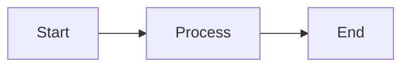

# Agent Kernel Documentation - Setup Guide

This guide will help you set up and deploy the Agent Kernel documentation to GitHub Pages.

## 📋 What's Been Created

A comprehensive Docusaurus 2 documentation site with:

### Documentation Structure
```
docs/
├── docs/
│   ├── intro.md                          # Introduction to Agent Kernel
│   ├── installation.md                   # Installation guide
│   ├── quick-start.md                    # Quick start with examples
│   ├── core-concepts/                    # Core abstractions
│   │   ├── overview.md
│   │   ├── agent.md
│   │   ├── runner.md
│   │   ├── session.md
│   │   ├── module.md
│   │   └── runtime.md
│   ├── architecture/                     # System architecture
│   │   ├── overview.md
│   │   ├── execution-flow.md
│   │   ├── session-management.md
│   │   └── memory-management.md
│   ├── frameworks/                       # Framework integration
│   │   ├── overview.md
│   │   ├── openai.md
│   │   ├── crewai.md
│   │   ├── langgraph.md
│   │   └── google-adk.md
│   ├── deployment/                       # Deployment guides
│   │   ├── overview.md
│   │   ├── local.md
│   │   ├── aws-serverless.md
│   │   ├── aws-containerized.md
│   │   └── configuration.md
│   ├── api/                             # API documentation
│   │   ├── rest-api.md
│   │   ├── mcp-server.md
│   │   └── a2a-server.md
│   ├── testing/                         # Testing guides
│   │   ├── overview.md
│   │   ├── cli-testing.md
│   │   └── automated-testing.md
│   ├── advanced/                        # Advanced features
│   │   ├── memory-management.md
│   │   ├── rbac.md
│   │   ├── traceability.md
│   │   └── multi-agent.md
│   └── examples/                        # Practical examples
│       ├── basic-agent.md
│       ├── multi-agent.md
│       └── custom-tools.md
├── blog/                                # Blog posts
│   └── 2025-10-16-welcome.md
├── src/
│   └── css/
│       └── custom.css                   # Custom styling
├── static/
│   └── img/
│       ├── logo.svg                     # Site logo
│       └── favicon.ico                  # Favicon
├── .gitignore
├── docusaurus.config.js                 # Main configuration
├── sidebars.js                          # Sidebar navigation
├── package.json                         # Dependencies
└── README.md                            # Documentation README
```

### GitHub Actions Workflow
```
.github/
└── workflows/
    └── deploy-docs.yml                  # Auto-deploy to GitHub Pages
```

## 🚀 Getting Started

### 1. Install Dependencies

```bash
cd docs
npm install
```

### 2. Run Locally

```bash
npm start
```

This will open `http://localhost:3000` in your browser.

### 3. Build for Production

```bash
npm run build
```

### 4. Test Production Build

```bash
npm run serve
```

## 🌐 GitHub Pages Deployment

### Enable GitHub Pages

1. Go to your repository settings on GitHub
2. Navigate to **Settings** > **Pages**
3. Under **Source**, select **GitHub Actions**
4. Save the settings

### Automatic Deployment

The documentation will automatically deploy when you:
- Push to `main` or `develop` branch
- Make changes in the `docs/` directory

The workflow is configured in `.github/workflows/deploy-docs.yml`

### Access Your Documentation

After deployment (takes ~2-5 minutes), your docs will be available at:

```
https://yaalalabs.github.io/agent-kernel/
```

## 🎨 Customization

### Update Site Configuration

Edit `docs/docusaurus.config.js`:

```javascript
const config = {
  title: 'Agent Kernel',              // Site title
  tagline: 'Framework-agnostic...',   // Tagline
  url: 'https://yaalalabs.github.io',
  baseUrl: '/agent-kernel/',
  organizationName: 'yaalalabs', // GitHub org
  projectName: 'agent-kernel',        // GitHub repo
  // ... more settings
};
```

### Update Colors

Edit `docs/src/css/custom.css`:

```css
:root {
  --ifm-color-primary: #2e8555;      /* Primary color */
  --ifm-color-primary-dark: #29784c; /* Darker shade */
  /* ... more colors */
}
```

### Update Logo

Replace `docs/static/img/logo.svg` with your own logo.

### Update Favicon

Replace `docs/static/img/favicon.ico` with your own favicon.

## 📝 Adding Content

### Add a New Page

1. Create `docs/docs/your-page.md`:

```markdown
---
sidebar_position: 1
---

# Your Page Title

Your content here...
```

2. The page will automatically appear in the sidebar

### Add a Blog Post

1. Create `docs/blog/YYYY-MM-DD-title.md`:

```markdown
---
slug: /blog/your-post
title: Your Blog Post
authors: [yourname]
tags: [tag1, tag2]
---

# Your Blog Post

Introduction here...

<!-- truncate -->

Full content here...
```

### Add Mermaid Diagrams

```markdown

```

## 🔧 Configuration Details

### Mermaid Support

Mermaid diagrams are enabled in `docusaurus.config.js`:

```javascript
markdown: {
  mermaid: true,
},
themes: ['@docusaurus/theme-mermaid'],
```

### Code Highlighting

Supports Python, Bash, JSON, YAML, and more:

```javascript
prism: {
  theme: prismThemes.github,
  darkTheme: prismThemes.dracula,
  additionalLanguages: ['python', 'bash', 'json', 'yaml'],
},
```

## 📊 Features Included

✅ Comprehensive documentation structure  
✅ Mermaid diagram support  
✅ Dark mode support  
✅ Mobile responsive design  
✅ Search functionality (built-in)  
✅ Code syntax highlighting  
✅ Framework comparison tabs  
✅ Auto-deploy to GitHub Pages  
✅ Blog section  
✅ SEO optimized  

## 🐛 Troubleshooting

### Build Errors

If you encounter build errors:

```bash
cd docs
rm -rf node_modules package-lock.json
npm install
npm run build
```

### GitHub Pages Not Deploying

1. Check GitHub Actions tab for errors
2. Ensure GitHub Pages is set to "GitHub Actions" source
3. Check that the workflow file exists in `.github/workflows/`
4. Verify branch names in workflow match your repo

### Mermaid Diagrams Not Rendering

Ensure you have:
1. Mermaid enabled in `docusaurus.config.js`
2. Theme installed: `@docusaurus/theme-mermaid`
3. Correct syntax in your diagrams

## 📚 Resources

- [Docusaurus Documentation](https://docusaurus.io/docs)
- [Mermaid Documentation](https://mermaid.js.org/)
- [GitHub Pages Documentation](https://docs.github.com/en/pages)

## 🎯 Next Steps

1. **Review the documentation** - Check all pages look good
2. **Customize branding** - Update logo, colors, favicon
3. **Enable GitHub Pages** - Configure in repository settings
4. **Push to GitHub** - Trigger automatic deployment
5. **Share the docs** - Link from your README

## 📞 Support

If you need help:
- Review this guide
- Check Docusaurus documentation
- Open an issue on GitHub

---

**Happy Documenting! 📖**
