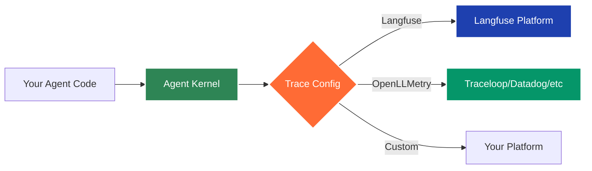

# Production-Grade Observability: Agent Kernel Integrates Langfuse and OpenLLMetry

We're excited to announce that Agent Kernel now includes comprehensive observability support through integrations with **Langfuse** and **OpenLLMetry (Traceloop)** - giving you powerful insights into your AI agent systems!

<div style={{display: 'flex', flexDirection: 'column', alignItems: 'center', gap: '2rem', margin: '2rem 0'}}>
  <div style={{display: 'flex', justifyContent: 'center'}}>
    
  </div>
  <div style={{display: 'flex', justifyContent: 'center'}}>
    
  </div>
</div>

<!-- truncate -->

## Why Observability Matters

Building production-ready AI agents isn't just about getting them to work - it's about understanding **how** they work, debugging issues efficiently, and optimizing performance. As AI agent systems grow more complex with multi-agent collaboration, tool invocations, and hierarchical workflows, having visibility into every interaction becomes critical.

With these new integrations, you can now:

- **Track Every Agent Interaction** - Monitor all LLM calls, tool invocations, and sub-agent communications in real-time
- **Debug with Confidence** - Trace request flows end-to-end with detailed execution timelines and error tracking
- **Optimize Costs** - Monitor token usage and LLM costs across all your agent operations
- **Ensure Quality** - Evaluate agent performance with built-in analytics and metrics
- **Production-Ready Monitoring** - Get alerts, dashboards, and insights for mission-critical agent deployments

## Extensible Architecture

Agent Kernel's traceability is built on a simple plugin architecture. You configure which platform to use, and Agent Kernel handles the rest.



**Key Benefits:**

- **No Code Changes**: Switch platforms by changing one config value
- **Consistent Interface**: All platforms work the same way with your agents
- **Easy to Extend**: Add your own observability platform in minutes

All you need to do:

```yaml
# config.yaml
trace:
  enabled: true
  type: langfuse  # or openllmetry, or your-custom-platform
```

## Two Powerful Options

We're giving you the flexibility to choose the observability platform that best fits your needs:

### Langfuse

[Langfuse](https://langfuse.com) is an open-source LLM engineering platform specialized for AI applications. It provides:

- **Rich Analytics Dashboard** - Visualize agent execution patterns and performance metrics
- **Prompt Management** - Track and version your prompts across deployments
- **Evaluation Framework** - Built-in tools to evaluate agent quality and accuracy
- **Cost Tracking** - Detailed token usage and cost analysis per agent
- **Team Collaboration** - Share traces and insights with your team
- **Self-Hosting Option** - Deploy within your infrastructure for complete data control

Perfect for teams that want a specialized LLM-focused observability solution with rich evaluation capabilities.

<div style={{textAlign: 'center', margin: '2rem 0'}}>
  
  <p style={{fontStyle: 'italic', color: '#666', fontSize: '0.9em', marginTop: '0.5rem'}}>Langfuse dashboard showing agent traces and analytics</p>
</div>

### OpenLLMetry (Traceloop)

[OpenLLMetry](https://www.traceloop.com) is an OpenTelemetry-based solution offering flexibility to integrate with your existing observability stack:

- **OpenTelemetry Standards** - Industry-standard telemetry data compatible with any backend
- **Multi-Backend Support** - Send traces to Traceloop, Datadog, New Relic, Honeycomb, and more
- **Distributed Tracing** - Track requests across multiple services and microservices
- **Automatic Instrumentation** - Zero-code instrumentation for popular LLM frameworks
- **Performance Monitoring** - Track latency, throughput, and resource utilization
- **Custom Metrics** - Add custom spans and metrics for domain-specific tracking

Ideal for teams already using OpenTelemetry or wanting to integrate AI agent observability into existing monitoring infrastructure.

<div style={{textAlign: 'center', margin: '2rem 0'}}>
  
  <p style={{fontStyle: 'italic', color: '#666', fontSize: '0.9em', marginTop: '0.5rem'}}>OpenLLMetry dashboard showing distributed traces</p>
</div>

## Getting Started is Simple

### Installation

Choose your preferred observability platform and install the corresponding extra:

```bash
# Install with Langfuse support
pip install agentkernel[langfuse]

# Or with OpenLLMetry support  
pip install agentkernel[openllmetry]

# Combine with your agent framework
pip install agentkernel[openai,langfuse]
pip install agentkernel[langgraph,openllmetry]
pip install agentkernel[crewai,langfuse]
pip install agentkernel[adk,openllmetry]
```

### Configuration

Enable tracing with just a configuration change - **no code modifications needed**:

**For Langfuse:**

```yaml
# config.yaml
trace:
  enabled: true
  type: langfuse
```

Set your Langfuse credentials as environment variables:

```bash
export LANGFUSE_PUBLIC_KEY=pk-lf-...
export LANGFUSE_SECRET_KEY=sk-lf-...
export LANGFUSE_HOST=https://cloud.langfuse.com
```

**For OpenLLMetry:**

```yaml
# config.yaml
trace:
  enabled: true
  type: openllmetry
```

Set your Traceloop credentials:

```bash
export TRACELOOP_API_KEY=your-api-key
export TRACELOOP_BASE_URL=https://api.traceloop.com
```

That's it! Your agents will now automatically send traces to your chosen platform.

## What Gets Traced

Agent Kernel provides comprehensive tracing across all framework integrations:

- **Agent Execution Flow** - Complete trace of agent request lifecycles
- **LLM API Calls** - All calls to OpenAI, Anthropic, Google, and other providers
- **Tool Invocations** - Track when and how agents use tools
- **Sub-Agent Communication** - Monitor hierarchical and collaborative agent interactions
- **Token Usage & Costs** - Detailed metrics for cost optimization
- **Performance Metrics** - Latency, throughput, and execution time
- **Error Tracking** - Capture and analyze failures for debugging

<div style={{textAlign: 'center', margin: '2rem 0'}}>
  
  <p style={{fontStyle: 'italic', color: '#666', fontSize: '0.9em', marginTop: '0.5rem'}}>Example trace showing detailed agent execution flow</p>
</div>


<div style={{textAlign: 'center', margin: '2rem 0'}}>
  
  <p style={{fontStyle: 'italic', color: '#666', fontSize: '0.9em', marginTop: '0.5rem'}}>Example trace showing details of multiple agent invocations of one session (thread)</p>
</div>

## Framework Support

Both observability platforms support all Agent Kernel framework integrations:

- **OpenAI Agents** - Full tracing support for OpenAI's agent framework
- **LangGraph** - Trace complex graph-based agent workflows
- **CrewAI** - Monitor multi-agent crew collaborations
- **Google ADK** - Track agent development kit interactions

No matter which framework you use, you get the same comprehensive observability.

## Privacy & Security First

We understand that data security is paramount, especially when working with sensitive AI applications. Both platforms offer robust privacy options:

### Self-Hosting

- **Langfuse** - Deploy Langfuse within your own infrastructure using Docker or Kubernetes
- **OpenLLMetry** - Use custom OpenTelemetry backends or self-hosted Traceloop instances

### Data Control

- Keep all trace data within your VPC or on-premise systems
- Perfect for regulated industries (healthcare, finance, government)
- Meet compliance requirements (GDPR, HIPAA, SOC 2)
- Configure data retention policies to match your needs

### Best Practices

- Store credentials securely using environment variables or secret managers
- Never commit API keys to version control
- Use TLS/SSL for all connections (enabled by default)
- Regularly rotate API keys
- Implement access controls in your tracing platform

## Minimal Performance Impact

We've designed these integrations to have minimal overhead:

- **Asynchronous Tracing** - Traces are sent in the background without blocking agent execution
- **Batch Processing** - Events are batched for efficient network usage
- **Configurable Sampling** - Control trace volume for high-traffic scenarios
- **Optimized Payloads** - Only essential data is transmitted

In our testing, tracing adds less than 5% overhead to agent execution time.

## Real-World Use Cases

### Development & Debugging

During development, use tracing to:
- Understand agent decision-making processes
- Debug unexpected behaviors
- Optimize prompt engineering
- Test different agent configurations

### Production Monitoring

In production environments:
- Set up alerts for errors or performance degradation
- Monitor cost trends and optimize token usage
- Track SLA compliance
- Analyze user interaction patterns

### Quality Assurance

For QA and evaluation:
- Compare agent versions side-by-side
- Run A/B tests on different prompts
- Evaluate accuracy and quality metrics
- Generate test reports

## Example: Viewing Traces

Once tracing is enabled, you'll see detailed execution traces in your platform dashboard:

**In Langfuse:**
1. Log in to your Langfuse dashboard
2. Navigate to **Traces**
3. View detailed execution traces with:
   - Complete conversation history
   - LLM calls with prompts and responses
   - Token usage and costs per request
   - Agent execution timeline
   - Custom tags and metadata

**In OpenLLMetry/Traceloop:**
1. Access your Traceloop dashboard or configured backend
2. Navigate to **Traces** or **Observability**
3. Explore:
   - Distributed trace timeline
   - LLM API calls with full context
   - Performance metrics and latency
   - Error details and stack traces
   - Custom spans and metrics

<div style={{display: 'flex', justifyContent: 'space-between', gap: '1rem', margin: '2rem 0', flexWrap: 'wrap'}}>
  <div style={{flex: '1', minWidth: '300px'}}>
    
    <p style={{fontStyle: 'italic', color: '#666', fontSize: '0.9em', marginTop: '0.5rem', textAlign: 'center'}}>Langfuse trace detail view</p>
  </div>
  <div style={{flex: '1', minWidth: '300px'}}>
    
    <p style={{fontStyle: 'italic', color: '#666', fontSize: '0.9em', marginTop: '0.5rem', textAlign: 'center'}}>OpenLLMetry trace detail view</p>
  </div>
</div>


## Get Started Today

Ready to gain visibility into your AI agents? Here's how to get started:

1. **Install Agent Kernel with observability support**:
   ```bash
   pip install agentkernel[langfuse]
   # or
   pip install agentkernel[openllmetry]
   ```

2. **Sign up for your chosen platform**:
   - [Langfuse Cloud](https://cloud.langfuse.com) (or [self-host](https://langfuse.com/docs/deployment/self-host))
   - [Traceloop](https://www.traceloop.com) (or use your OpenTelemetry backend)

3. **Configure your credentials** and enable tracing in your `config.yaml`

4. **Run your agents** and watch the traces flow in!

Check out our comprehensive [Traceability and Observability documentation](https://kernel.yaala.ai/docs/advanced/traceability) for detailed setup instructions, troubleshooting tips, and best practices.

## Want to Use a Different Platform?

Agent Kernel's plugin architecture makes it easy to integrate your own observability platform. If you're already using a different monitoring solution or have specific requirements, you can add support in just a few steps.

### How to Add Your Own Platform

1. **Implement the BaseTrace Interface**

Create a new class that extends `BaseTrace` and implements the required methods:

```python
from agentkernel.trace.base import BaseTrace
from agentkernel.core import Runner

class MyCustomTrace(BaseTrace):
    def __init__(self):
        self._client = None
    
    def init(self):
        # Initialize your tracing client
        self._client = MyTracingClient(
            api_key=os.getenv("MY_TRACE_API_KEY")
        )
    
    def openai(self) -> Runner:
        from .openai_runner import MyCustomOpenAIRunner
        return MyCustomOpenAIRunner(self._client)
    
    def langgraph(self) -> Runner:
        from .langgraph_runner import MyCustomLangGraphRunner
        return MyCustomLangGraphRunner(self._client)
    
    def crewai(self) -> Runner:
        from .crewai_runner import MyCustomCrewAIRunner
        return MyCustomCrewAIRunner(self._client)
    
    def adk(self) -> Runner:
        from .adk_runner import MyCustomADKRunner
        return MyCustomADKRunner(self._client)
```

2. **Create Framework-Specific Runners**

Each runner wraps the framework's execution with your tracing logic:

```python
from agentkernel.openai.openai import OpenAIRunner
from agentkernel.core import Session

class MyCustomOpenAIRunner(OpenAIRunner):
    def __init__(self, client):
        super().__init__()
        self._client = client
    
    async def run(self, agent, session: Session, prompt):
        # Start a trace span
        with self._client.start_span("agent-execution") as span:
            span.set_attribute("session_id", session.id)
            span.set_attribute("prompt", prompt)
            
            # Run the agent
            result = await super().run(agent=agent, prompt=prompt, session=session)
            
            span.set_attribute("result", result)
            return result
```

3. **Initialize the module with the custom runner**

Initialize the module with your custom runner

```python
OpenAIModule([general_agent], runner=MyCustomOpenAIRunner())
```

Custom runner supercedes all other trace configurations

```bash
export MY_TRACE_API_KEY=your-api-key
```

That's it! Your custom observability platform is now integrated with Agent Kernel.

### Example Use Cases

- **Proprietary Monitoring Systems**: Integrate with your company's internal monitoring tools
- **Compliance Requirements**: Route traces to approved, compliant systems
- **Custom Aggregation**: Combine multiple backends or add custom processing
- **Cost Optimization**: Use cheaper or self-hosted alternatives

The extensible architecture ensures you're never locked into a specific platform.


## Conclusion

Agent Kernel continues to deliver on its promise of making AI agent development seamless and production-ready. These observability features represent another step toward giving developers the tools they need to build, monitor, and scale AI agents with confidence.

Whether you choose Langfuse for its specialized LLM analytics or OpenLLMetry for its OpenTelemetry compatibility, you now have enterprise-grade observability at your fingertips.

Try it out and let us know what you think! We'd love to hear about your experience with observability in Agent Kernel.

---
