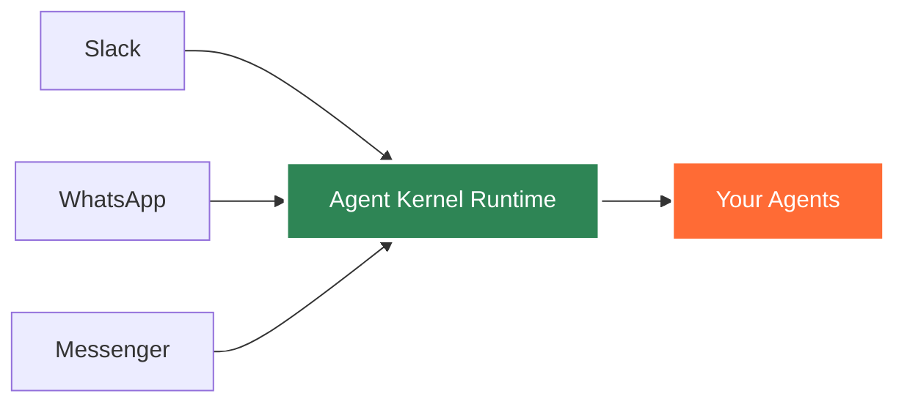

# Connect Everywhere: Agent Kernel Now Supports Slack, WhatsApp, and Messenger

We're thrilled to announce that Agent Kernel now seamlessly integrates with the world's most popular messaging platforms - **Slack**, **WhatsApp**, and **Facebook Messenger**! Deploy your AI agents where your users already are, and deliver intelligent conversational experiences across multiple channels.

<div style={{display: 'flex', justifyContent: 'center', gap: '3rem', margin: '2rem 0', flexWrap: 'wrap', alignItems: 'center'}}>
  
  
  
</div>

<!-- truncate -->

## Why Multi-Platform Messaging Matters

Your users don't live in a single app - they're on Slack for work, WhatsApp for personal communication, and Messenger for social connections. With Agent Kernel's messaging integrations, you can deploy the **same AI agent** across all these platforms without writing platform-specific code.

Whether you're building:
- **Customer support bots** that handle inquiries 24/7
- **Internal productivity assistants** for team collaboration
- **Sales and lead generation agents** that engage prospects
- **Notification and alert systems** with two-way interaction
- **Personal assistants** that help users manage their daily tasks

Agent Kernel makes it simple to reach your audience on their preferred platform.

## 🚀 Available Now: Three Major Platforms

### Slack Integration

Deploy your agents as Slack bots that can participate in channels, respond to direct messages, and integrate seamlessly with your team's workflow.

**Perfect for:**
- Internal knowledge bases and FAQs
- DevOps automation and incident response
- Team productivity and scheduling assistants
- Code review and development helpers
- Onboarding and training bots

**Key Features:**
- Real-time message processing via webhooks
- Support for threads and mentions
- Interactive components support

[Read the Slack Integration Guide →](/docs/integrations/slack)

### WhatsApp Integration

Reach over 2 billion users worldwide by deploying your agents on WhatsApp Business API.

**Perfect for:**
- Customer support and service
- Order tracking and notifications
- Appointment scheduling and reminders
- Marketing campaigns and lead nurturing
- Community engagement and support

**Key Features:**
- WhatsApp Cloud API integration
- Message templates for outbound messaging
- Session management and context retention
- Verification and security built-in

[Read the WhatsApp Integration Guide →](/docs/integrations/whatsapp)

### Facebook Messenger Integration

Connect with Facebook's massive user base through intelligent Messenger bots.

**Perfect for:**
- E-commerce customer service
- Social media engagement
- Event information and registration
- Content delivery and newsletters
- Brand interaction and loyalty programs

**Key Features:**
- Webhook integration with Facebook Graph API
- Persistent menu and get started button
- User profile access for personalization
- Automated message handling

[Read the Messenger Integration Guide →](/docs/integrations/messenger)

## How It Works: Simple and Powerful

Agent Kernel's messaging integrations are built on a consistent architecture that makes multi-platform deployment straightforward:

```python
from agentkernel.api import RESTAPI
from agentkernel.openai import OpenAIModule
from agentkernel.slack import AgentSlackRequestHandler
from agentkernel.whatsapp import AgentWhatsAppRequestHandler
from agentkernel.messenger import AgentMessengerRequestHandler
from agents import Agent as OpenAIAgent

# Create your agent once
general_agent = OpenAIAgent(
    name="support-bot",
    instructions="You are a helpful customer support agent."
)

# Initialize with your agent
OpenAIModule([general_agent])

# Deploy to all platforms - same agent, different handlers
if __name__ == "__main__":
    handlers = [
        AgentSlackRequestHandler(),
        AgentWhatsAppRequestHandler(),
        AgentMessengerRequestHandler()
    ]
    RESTAPI.run(handlers)
```

That's it! Your agent is now available on all three platforms.

### 🚀 Unified Features Across Platforms

All messaging integrations share these powerful capabilities:

✓ **Real-Time Processing** - Webhook-based message handling with low latency  
✓ **Session Management** - Automatic conversation context across messages  
✓ **Built-in Security** - Request verification and authentication handled automatically  
✓ **Framework Agnostic** - Works with LangGraph, OpenAI Agents SDK, CrewAI, Google ADK, and custom frameworks

## 🚀 Coming Soon: Even More Platforms

We're actively working on integrations for:

<div style={{display: 'flex', justifyContent: 'center', gap: '2rem', margin: '2rem 0', flexWrap: 'wrap', alignItems: 'center'}}>
  <div style={{textAlign: 'center'}}>
    
    <p style={{marginTop: '0.5rem', fontSize: '0.9rem'}}>Instagram</p>
  </div>
  <div style={{textAlign: 'center'}}>
    
    <p style={{marginTop: '0.5rem', fontSize: '0.9rem'}}>Gmail</p>
  </div>
  <div style={{textAlign: 'center'}}>
    
    <p style={{marginTop: '0.5rem', fontSize: '0.9rem'}}>Telegram</p>
  </div>
</div>

Want to see support for a specific platform? [Join our Discord](https://discord.gg/snrPzb46uu) and let us know!

## 🚀 Architecture: Built for Scale

Agent Kernel's pluggable architecture makes it easy to add new integrations:



All messaging integrations are designed with production deployments in mind:

▸ **Stateless Design** - Handle messages without instance state concerns  
▸ **Session Persistence** - Conversation context stored in Redis or in-memory  
▸ **Horizontal Scaling** - Deploy multiple instances behind a load balancer  
▸ **Observability** - Full tracing with Langfuse or OpenLLMetry integration

## 🚀 Getting Started in Minutes

Each integration comes with comprehensive documentation and example code:

1. **Choose your platform** - Start with the one your users are on
2. **Set up API credentials** - Follow our step-by-step guides
3. **Configure your agent** - Use any framework you prefer
4. **Deploy** - Serverless, containerized, or AWS deployment options

### Quick Start Example

```python
from agentkernel.api import RESTAPI
from agentkernel.openai import OpenAIModule
from agentkernel.slack import AgentSlackRequestHandler
from agents import Agent as OpenAIAgent

# Create your agent
agent = OpenAIAgent(
    name="slack-bot",
    instructions="You are a helpful assistant."
)

OpenAIModule([agent])

# Run the API server
if __name__ == "__main__":
    RESTAPI.run([AgentSlackRequestHandler()])
```

Deploy with our [AWS Serverless module](/docs/deployment/aws-serverless) or [containerized deployment](/docs/deployment/aws-containerized)!

## Security and Compliance

All integrations implement industry-standard security practices:

🔒 **Request Verification** - Cryptographic validation of incoming webhooks  
🔒 **Secure Credentials** - Environment variable-based token management  
🔒 **Data Privacy** - No message storage (uses your session store)

## Want to Add More Integrations? We Need You!

Agent Kernel is **open source**, and we're actively looking for contributors to help expand our messaging platform integrations! Whether you want to add a new platform or improve existing ones, we'd love your help.

### How to Contribute an Integration

Adding a new messaging platform integration is straightforward:

1. **Fork the Repository** - Start with [our GitHub repo](https://github.com/yaalalabs/agent-kernel)

2. **Follow the Pattern** - Check existing implementations in `src/agentkernel/`:
   - `slack/` - Slack integration example
   - `whatsapp/` - WhatsApp integration example
   - `messenger/` - Messenger integration example

3. **Implement the Handler** - Create a handler class following the same pattern

4. **Add Documentation** - Write a guide similar to our existing integration docs

5. **Submit a PR** - We review contributions quickly and provide feedback

### Resources

- [Contributing Guide](https://github.com/yaalalabs/agent-kernel/blob/develop/CONTRIBUTING.md) - How to contribute
- [Developer Guide](https://github.com/yaalalabs/agent-kernel/blob/develop/DEVELOPER_GUIDE.md) - Setup and workflow
- [Discord Community](https://discord.gg/snrPzb46uu) - Get help from maintainers

Contributors get credited in docs, featured in our community showcase, and help shape Agent Kernel's future!

**Questions?** Join our [Discord](https://discord.gg/snrPzb46uu) and ask in the `#general` channel.

## Join the Community

We'd love to hear about what you're building with Agent Kernel's messaging integrations!

💬 [Join our Discord](https://discord.gg/snrPzb46uu) - Get help and share your projects  
⭐ [Star us on GitHub](https://github.com/yaalalabs/agent-kernel) - Follow development  
📖 [Read the Docs](/docs) - Comprehensive guides and API reference

## What's Next?

We're working on Instagram, Gmail, Telegram, and more! Stay tuned for updates.

---

**Ready to deploy your AI agents to messaging platforms?**

→ [Get Started with Slack](/docs/integrations/slack)  
→ [Get Started with WhatsApp](/docs/integrations/whatsapp)  
→ [Get Started with Messenger](/docs/integrations/messenger)

Questions? [Join our Discord](https://discord.gg/snrPzb46uu) or [open an issue on GitHub](https://github.com/yaalalabs/agent-kernel/issues).
