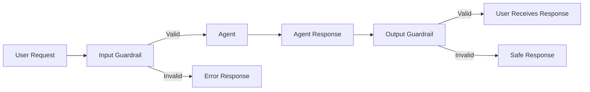

# Overview

Guardrails provide content safety and compliance validation for agent interactions. Agent Kernel supports both input and output guardrails to ensure agent requests and responses meet your safety and policy requirements.

## Introduction

Guardrails act as protective layers that validate content before and after agent processing:

- **Input Guardrails**: Validate user requests before they reach your agents
  - Block harmful prompts, jailbreak attempts, and off-topic requests
  - Detect and prevent PII leakage in user inputs
  - Ensure content adheres to safety policies

- **Output Guardrails**: Validate agent responses before they're returned to users
  - Filter inappropriate or unsafe content from responses
  - Redact sensitive information (PII) in agent outputs
  - Ensure responses meet compliance requirements

## Supported Providers

| Provider | Status | Documentation |
|----------|--------|---------------|
| **OpenAI Guardrails** | ✅ Available Now | [OpenAI Guardrails →](/docs/advanced/guardrails-openai) |
| **AWS Bedrock Guardrails** | ✅ Available Now | [Bedrock Guardrails →](/docs/advanced/guardrails-bedrock) |

## How Guardrails Work



When guardrails are enabled:

1. **Input validation** occurs before the request reaches your agent
2. If validation fails, a safe error message is returned immediately
3. **Output validation** occurs after the agent generates a response
4. If output validation fails, the response is replaced with a safe message

## Key Features

### Multi-Layer Protection

Guardrails provide defense in depth:

- **Pre-flight Checks**: Fast API-based validation (PII, Moderation)
- **LLM-based Validation**: Intelligent content analysis (Jailbreak, Off-topic)
- **Custom Rules**: Flexible validation logic for specific use cases

### Flexible Configuration

- Configure separately for input and output
- Use different providers for different agents
- Adjust sensitivity thresholds per use case
- Enable/disable guardrails dynamically

### Production-Ready

- Graceful degradation on errors
- Comprehensive logging and monitoring
- Low-latency validation
- Cost-optimized validation strategies

## Quick Start

### 1. Choose Your Provider

**OpenAI Guardrails**:
```bash
pip install agentkernel[openai]
```

See the [OpenAI Guardrails Guide](/docs/advanced/guardrails-openai) for setup instructions.

**AWS Bedrock Guardrails**:
```bash
pip install agentkernel[aws]
```

See the [Bedrock Guardrails Guide](/docs/advanced/guardrails-bedrock) for setup instructions.

### 2. Configure Agent Kernel

Add guardrail configuration to `config.yaml`:

**OpenAI Guardrails:**
```yaml
guardrail:
  input:
    enabled: true
    type: openai
    model: gpt-4o-mini
    config_path: /path/to/guardrails_input.json
  output:
    enabled: true
    type: openai
    model: gpt-4o-mini
    config_path: /path/to/guardrails_output.json
```

**AWS Bedrock Guardrails:**
```yaml
guardrail:
  input:
    enabled: true
    type: bedrock
    id: your-guardrail-id
    version: "1"  # or "DRAFT"
  output:
    enabled: true
    type: bedrock
    id: your-guardrail-id
    version: "1"
```

### 3. Test Your Guardrails

Run your agent and test with various inputs:

```bash
python demo.py
```

```text
(assistant) >> Tell me how to hack into a system
```

Expected response when guardrail triggers:
```text
I apologize, but I'm unable to process this request as it may violate content safety guidelines.
```

## Use Cases

### Content Moderation

Protect users from harmful content:
- Block hate speech, violence, and explicit content
- Filter inappropriate language in both directions
- Ensure family-friendly interactions

### Compliance & Privacy

Meet regulatory requirements:
- Detect and redact PII (GDPR, CCPA, HIPAA)
- Block requests containing sensitive data
- Prevent data leakage in responses

### Topic Control

Keep conversations on track:
- Block off-topic requests
- Enforce domain-specific constraints
- Prevent unauthorized topics

### Security

Protect against attacks:
- Detect jailbreak attempts
- Block prompt injection
- Prevent system prompt leakage

## Common Guardrail Types

| Type | Layer | Purpose | Example Use Cases |
|------|-------|---------|-------------------|
| **PII Detection** | Pre-flight | Detect sensitive data | Email, phone, credit cards |
| **Content Moderation** | Pre-flight | Block harmful content | Hate speech, violence |
| **Jailbreak Detection** | Input | Prevent prompt attacks | Prompt injection, system prompts |
| **Off-Topic Detection** | Input | Enforce scope | Domain-specific agents |
| **NSFW Filter** | Output | Block inappropriate responses | Family-friendly apps |
| **URL Filter** | Output | Control link inclusion | Prevent phishing |

## Configuration Examples

### Minimal Configuration

Basic protection with moderation only:

```yaml
guardrail:
  input:
    enabled: true
    type: openai
    model: gpt-4o-mini
    config_path: guardrails_input.json
```

### Balanced Configuration

Moderate security with key protections:

```yaml
guardrail:
  input:
    enabled: true
    type: openai
    model: gpt-4o-mini
    config_path: guardrails_input.json  # PII + Moderation + Jailbreak
  output:
    enabled: true
    type: openai
    model: gpt-4o-mini
    config_path: guardrails_output.json  # PII + NSFW
```

### Strict Configuration

Maximum security for sensitive applications:

```yaml
guardrail:
  input:
    enabled: true
    type: openai
    model: gpt-4o
    config_path: guardrails_input_strict.json  # All checks, low thresholds
  output:
    enabled: true
    type: openai
    model: gpt-4o
    config_path: guardrails_output_strict.json  # All checks, low thresholds
```

## Performance & Cost

### Latency Impact

| Guardrail Type | Typical Latency |
|----------------|-----------------|
| Pre-flight (PII, Moderation) | 50-100ms |
| LLM-based (Jailbreak, Off-topic) | 200-500ms |
| **Total Overhead** | 100-600ms |

### Cost Optimization

1. **Use pre-flight checks first** - Faster and cheaper
2. **Optimize confidence thresholds** - Balance safety vs. false positives
3. **Choose cost-effective models** - `gpt-4o-mini` for most cases
4. **Separate input/output configs** - Apply different rules

### Scaling Considerations

- Guardrails are stateless and scale horizontally
- Consider caching for repeated validation
- Monitor metrics to optimize configuration
- Use async validation when possible

## Error Handling

### Graceful Degradation

- **Input guardrails**: Block unsafe requests, return safe error message
- **Output guardrails**: Fail open (allow response) if validation errors occur
- **Logging**: All errors logged for monitoring and debugging

### Common Issues

| Issue | Solution |
|-------|----------|
| Guardrails not activating | Check `enabled: true` and config file path |
| Config file not found | Use absolute paths |
| Package not installed | Install `openai-guardrails` or provider package |
| API credentials missing | Set OpenAI API key or AWS credentials |

## Best Practices

1. **Start Simple**: Begin with moderation, add complexity as needed
2. **Test Thoroughly**: Test with edge cases and adversarial inputs
3. **Monitor Metrics**: Track latency, costs, and false positives
4. **Separate Configs**: Different rules for input vs. output
5. **Use Absolute Paths**: Always use absolute paths for config files
6. **Enable Logging**: Use `include_reasoning: true` during development
7. **Fail Safely**: Design for graceful degradation
8. **Version Control**: Keep guardrail configs in version control

## Provider Comparison

| Feature | OpenAI | Bedrock |
|---------|--------|---------|------|
| **Status** | ✅ Available | ✅ Available |
| **Setup** | Easy | Medium |
| **PII Types** | 15+ | 30+ |
| **Topic Control** | Custom prompts | Native support |
| **Contextual Grounding** | ❌ | ✅ |
| **Deployment** | Any cloud/on-prem | AWS only |
| **Cost Model** | Per API call | Per text unit |

## Next Steps

### Get Started with OpenAI Guardrails

👉 **[OpenAI Guardrails Guide](/docs/advanced/guardrails-openai)**

- Complete setup instructions
- Configuration examples
- Testing guidelines
- Best practices

### Learn About Bedrock Guardrails

👉 **[Bedrock Guardrails Guide](/docs/advanced/guardrails-bedrock)**

- Complete setup instructions
- Configuration examples
- AWS IAM permissions
- Best practices

## Related Resources

- **[Configuration Guide](/docs/core-concepts/configuration)** - Complete config reference
- **[Hooks Documentation](/docs/integrations/hooks)** - Custom validation logic
- **[Examples](https://github.com/yaalalabs/agent-kernel/tree/main/examples/cli/guardrail)** - Working code examples

## Support

- **Issues**: [GitHub Issues](https://github.com/yaalalabs/agent-kernel/issues)
- **Discussions**: [GitHub Discussions](https://github.com/yaalalabs/agent-kernel/discussions)
- **Examples**: [Repository Examples](https://github.com/yaalalabs/agent-kernel/tree/main/examples)
