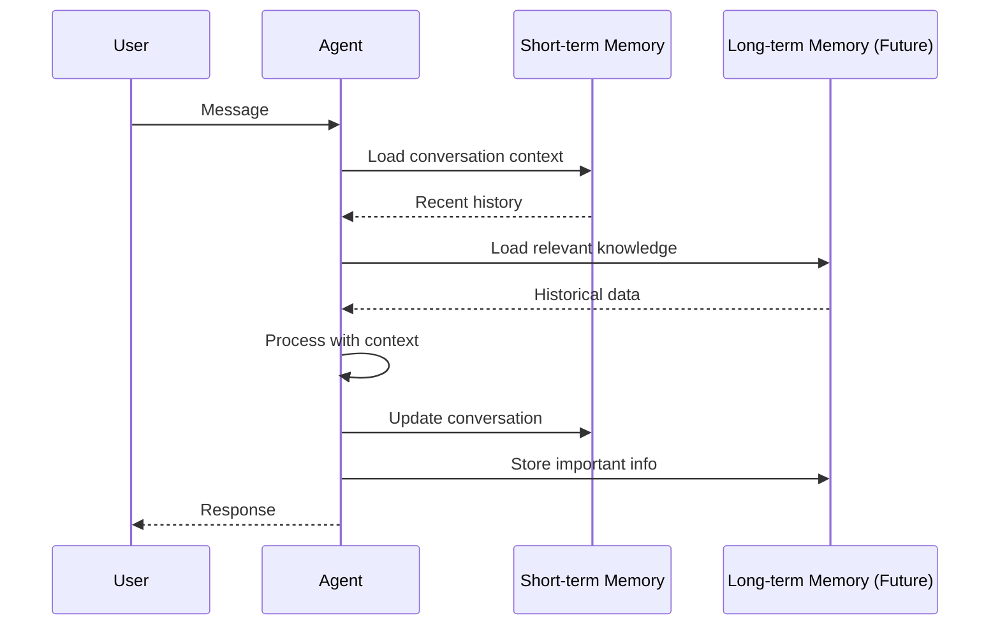

# Memory Management

Agent Kernel provides pluggable memory management capabilities.

## Short-term Memory

Managed via Session objects for conversational context.

### In-Memory Storage

```bash
export AK_SESSION_STORAGE=in_memory
```

**Use cases:**
- Development
- Testing
- Single-process applications
- Non-critical data

**Limitations:**
- Lost on restart
- Single process only
- No persistence

### Redis Storage

```bash
export AK_SESSION_STORAGE=redis
export AK_REDIS_URL=redis://localhost:6379
export AK_REDIS_PASSWORD=your-password
export AK_SESSION_TTL=3600  # 1 hour
```

**Use cases:**
- Production deployments
- Multi-process applications
- Distributed systems
- Session persistence required

**Benefits:**
- Persistent across restarts
- Shared across instances
- Configurable TTL
- High performance

## Memory Architecture



## Best Practices

### Short-term Memory

- Use Redis in production
- Set appropriate TTL
- Monitor memory usage
- Clean up old sessions

```python
# Configure TTL
export AK_SESSION_TTL=7200  # 2 hours
```

### Long-term Memory (Available soon!)

- Index frequently accessed data
- Implement data retention policies
- Back up important data
- Monitor storage costs


## Summary

- Short-term memory for conversation context
- Long-term memory for persistent knowledge
- Redis recommended for production
- Framework-specific long-term storage options
- Configurable TTL and retention
- Custom backends supported
