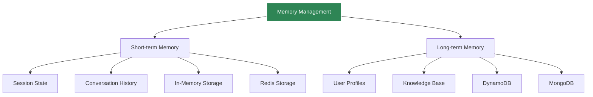
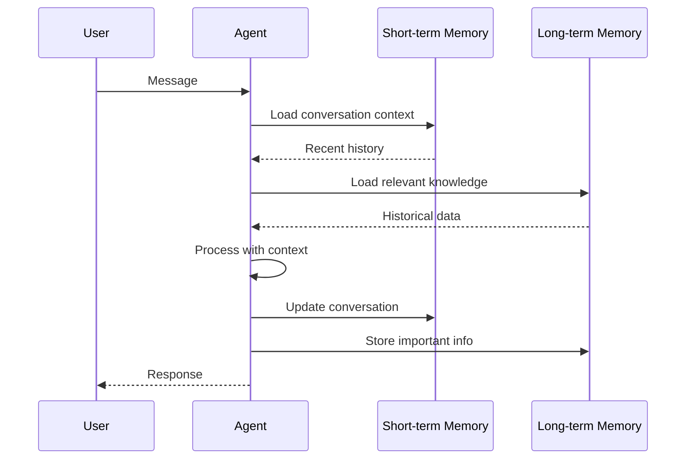

# Memory Management

Agent Kernel provides pluggable memory management for both short-term and long-term storage.

## Memory Types



## Short-term Memory

Managed via Session objects for conversational context.

### In-Memory Storage

```bash
export AK_SESSION_STORAGE=in-memory
```

**Use cases:**
- Development
- Testing
- Single-process applications
- Non-critical data

**Limitations:**
- Lost on restart
- Single process only
- No persistence

### Redis Storage

```bash
export AK_SESSION_STORAGE=redis
export AK_REDIS_URL=redis://localhost:6379
export AK_REDIS_PASSWORD=your-password
export AK_SESSION_TTL=3600  # 1 hour
```

**Use cases:**
- Production deployments
- Multi-process applications
- Distributed systems
- Session persistence required

**Benefits:**
- Persistent across restarts
- Shared across instances
- Configurable TTL
- High performance

## Long-term Memory

Framework-specific implementations for persistent knowledge.

### DynamoDB (AWS)

```python
from langgraph.checkpoint.dynamodb import DynamoDBSaver

checkpointer = DynamoDBSaver(
    table_name="agent_memory",
    region_name="us-east-1"
)

# Use with LangGraph
graph = workflow.compile(checkpointer=checkpointer)
```

Configuration:

```bash
export DYNAMODB_TABLE=agent_memory
export AWS_REGION=us-east-1
```

### MongoDB

```python
from langgraph.checkpoint.mongodb import MongoDBSaver

checkpointer = MongoDBSaver(
    connection_string="mongodb://localhost:27017",
    db_name="agent_memory"
)
```

Configuration:

```bash
export MONGODB_URI=mongodb://localhost:27017
export MONGODB_DB=agent_memory
```

## Memory Architecture



## Best Practices

### Short-term Memory

- Use Redis in production
- Set appropriate TTL
- Monitor memory usage
- Clean up old sessions

```python
# Configure TTL
export AK_SESSION_TTL=7200  # 2 hours
```

### Long-term Memory

- Index frequently accessed data
- Implement data retention policies
- Back up important data
- Monitor storage costs

### Memory Optimization

```python
# Limit conversation history
MAX_HISTORY_MESSAGES = 20

# Store only essential data
session.set("summary", summarized_history)
# Don't store: session.set("all_messages", all_messages)
```

## Custom Memory Backend

Implement custom storage:

```python
from agentkernel.core import SessionStorage

class CustomStorage(SessionStorage):
    def get(self, session_id: str) -> dict:
        # Your implementation
        pass
    
    def set(self, session_id: str, data: dict):
        # Your implementation
        pass
    
    def delete(self, session_id: str):
        # Your implementation
        pass

# Register custom storage
Runtime.register_storage(CustomStorage())
```

## Monitoring

Track memory usage:

```python
# Redis monitoring
from agentkernel.core import Runtime

runtime = Runtime.get()
stats = runtime.get_storage_stats()

print(f"Active sessions: {stats['session_count']}")
print(f"Memory used: {stats['memory_mb']} MB")
```

## Summary

- Short-term memory for conversation context
- Long-term memory for persistent knowledge
- Redis recommended for production
- Framework-specific long-term storage options
- Configurable TTL and retention
- Custom backends supported
