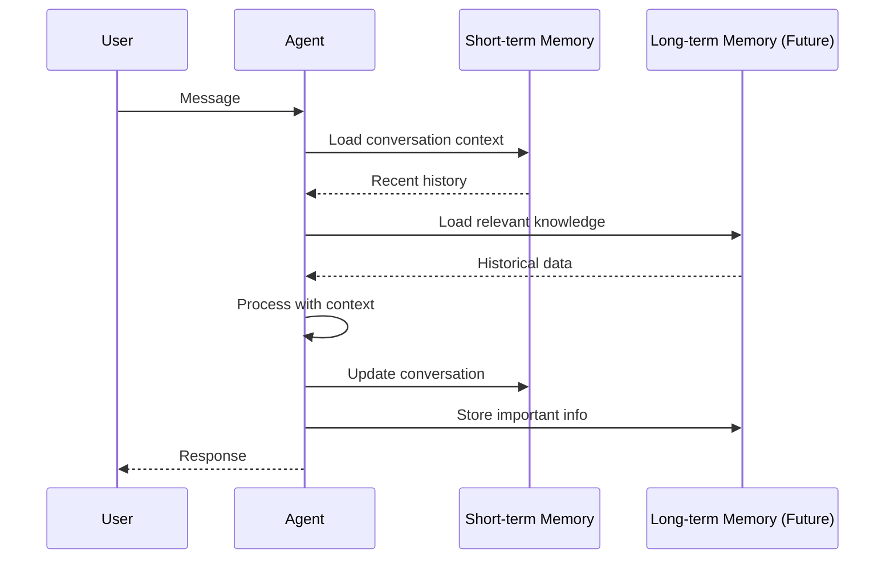

# Memory Management

Agent Kernel provides pluggable memory management capabilities.

## Short-term Memory

Managed via Session objects for conversational context.

### In-Memory Storage

```bash
export AK_SESSION__TYPE=in_memory
```

**Use cases:**
- Development
- Testing
- Single-process applications
- Non-critical data

**Limitations:**
- Lost on restart
- Single process only
- No persistence

### Redis Storage

```bash
export AK_SESSION__TYPE=redis
export AK_SESSION__REDIS__URL=redis://localhost:6379
export AK_SESSION__REDIS__PASSWORD=your-password
export AK_SESSION__REDIS__TTL=3600  # 1 hour
```

**Use cases:**
- Production deployments
- Multi-process applications
- Distributed systems
- Session persistence required

**Benefits:**
- Persistent across restarts
- Shared across instances
- Configurable TTL
- High performance

### DynamoDB Storage

```bash
export AK_SESSION__TYPE=dynamodb
export AK_SESSION__DYNAMODB__TABLE_NAME=agent-kernel-sessions
export AK_SESSION__DYNAMODB__TTL=3600  # 1 hour (0 to disable)
```

**Use cases:**
- AWS serverless deployments (Lambda)
- Auto-scaling requirements
- AWS-native infrastructure
- Serverless architectures

**Benefits:**
- Fully managed, serverless
- Auto-scaling capacity
- AWS-native integration
- No server maintenance
- Pay-per-use pricing

**Requirements:**
- DynamoDB table with partition key `session_id` (String)
- DynamoDB table with sort key `key` (String)
- Appropriate AWS IAM permissions
- Optional: TTL attribute `expiry_time` enabled on the table
- DynamoDB table and necessary permissions will be created automatically if you use the Agent Kernel provided terraform modules

## Memory Architecture



## Best Practices

### Short-term Memory

- Use Redis in production
- Set appropriate TTL
- Monitor memory usage
- Clean up old sessions

```bash
# Configure TTL for Redis
export AK_SESSION__REDIS__TTL=7200  # 2 hours

# Configure TTL for DynamoDB
export AK_SESSION__DYNAMODB__TTL=7200  # 2 hours
```

### Long-term Memory (Available soon!)

- Index frequently accessed data
- Implement data retention policies
- Back up important data
- Monitor storage costs


## Summary

- Short-term memory for conversation context
- Long-term memory for persistent knowledge
- Redis recommended for containerized production deployments
- DynamoDB recommended for non-performance critical AWS serverless deployments
- Framework-specific long-term storage options
- Configurable TTL and retention
- Custom backends supported
