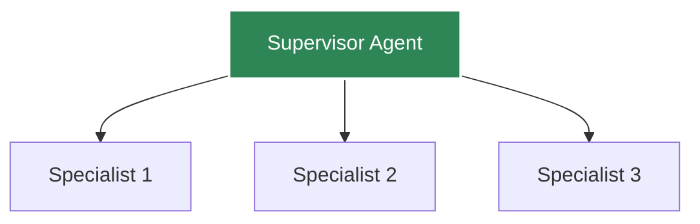
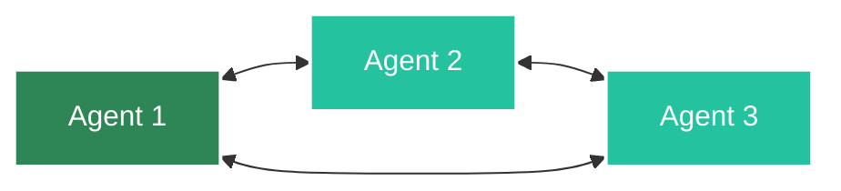
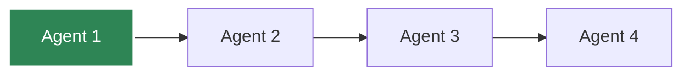

# Multi-Agent Systems

Build collaborative agent systems with Agent Kernel.

## Architecture Patterns

### Supervisor Pattern



### Peer-to-Peer Pattern



### Pipeline Pattern



## Supervisor Pattern Example

```python
from crewai import Agent as CrewAgent
from agentkernel.crewai import CrewAIModule

# Supervisor coordinates work
supervisor = CrewAgent(
    role="supervisor",
    goal="Coordinate work between specialists",
    backstory="You delegate tasks to specialist agents",
    verbose=False,
)

# Specialists
researcher = CrewAgent(
    role="researcher",
    goal="Research topics",
    backstory="You are an expert researcher",
    verbose=False,
)

writer = CrewAgent(
    role="writer",
    goal="Write content",
    backstory="You are a skilled writer",
    verbose=False,
)

reviewer = CrewAgent(
    role="reviewer",
    goal="Review content",
    backstory="You are a detail-oriented reviewer",
    verbose=False,
)

CrewAIModule([supervisor, researcher, writer, reviewer])
```

## Agent Handoff

### OpenAI Agents Handoff

```python
from agents import Agent as OpenAIAgent, Handoff

# Agents can hand off to each other
general_agent = OpenAIAgent(
    name="general",
    instructions="General assistance",
    handoff=[Handoff(target="specialist")]
)

specialist_agent = OpenAIAgent(
    name="specialist",
    instructions="Specialized help",
)
```

### CrewAI Task Delegation

```python
from crewai import Task, Crew

# Define tasks
research_task = Task(
    description="Research the topic",
    agent=researcher
)

write_task = Task(
    description="Write content based on research",
    agent=writer,
    context=[research_task]  # Depends on research
)

# Create crew
crew = Crew(
    agents=[researcher, writer],
    tasks=[research_task, write_task]
)
```

## Communication Patterns

### Direct Communication

```python
# Agent A calls Agent B directly
runtime = Runtime.get()
agent_b = runtime.get_agent("agent_b")
result = await agent_b.runner.run(agent_b, session, message_from_a)
```

### Message Passing

```python
# Use session to pass messages
session.set("message_for_agent_b", {
    "from": "agent_a",
    "content": "Here's the research data"
})
```

### A2A Protocol

```python
# Enable A2A for inter-agent communication
# AK_A2A_ENABLED=true

# Agents can discover and call each other
```

## State Sharing

### Shared Session

```python
# All agents share the same session
session_id = "team-project-123"
session = runtime.get_session(session_id)

# Agent 1 updates state
await agent1.runner.run(agent1, session, "Task 1")

# Agent 2 reads Agent 1's state
await agent2.runner.run(agent2, session, "Task 2")
```

### Shared Context

```python
# Store shared context in session
session.set("project_data", {
    "topic": "Machine Learning",
    "requirements": ["research", "write", "review"],
    "progress": {"research": "complete"}
})
```

## Error Handling

```python
from agentkernel.core import Runtime

async def execute_multi_agent_workflow(session):
    runtime = Runtime.get()
    
    try:
        # Step 1: Research
        researcher = runtime.get_agent("researcher")
        research = await researcher.runner.run(researcher, session, "Research ML")
        
        # Step 2: Write
        writer = runtime.get_agent("writer")
        content = await writer.runner.run(writer, session, "Write article")
        
        # Step 3: Review
        reviewer = runtime.get_agent("reviewer")
        review = await reviewer.runner.run(reviewer, session, "Review article")
        
        return review
        
    except Exception as e:
        # Handle failures
        print(f"Workflow failed: {e}")
        # Implement retry or fallback logic
```

## Best Practices

- **Clear Responsibilities**: Each agent has a focused role
- **Explicit Handoff**: Define when and how agents hand off work
- **Shared Context**: Use sessions for state sharing
- **Error Handling**: Handle agent failures gracefully
- **Monitoring**: Track multi-agent interactions
- **Testing**: Test agent collaboration scenarios

## Complex Example

```python
from agentkernel.core import Runtime

class ResearchPipeline:
    def __init__(self):
        self.runtime = Runtime.get()
        self.planner = self.runtime.get_agent("planner")
        self.researcher = self.runtime.get_agent("researcher")
        self.analyzer = self.runtime.get_agent("analyzer")
        self.writer = self.runtime.get_agent("writer")
        self.reviewer = self.runtime.get_agent("reviewer")
    
    async def execute(self, topic: str, session_id: str):
        session = self.runtime.get_session(session_id)
        
        # Plan the research
        plan = await self.planner.runner.run(
            self.planner, session, f"Plan research on {topic}"
        )
        
        # Conduct research
        research = await self.researcher.runner.run(
            self.researcher, session, f"Research: {plan}"
        )
        
        # Analyze findings
        analysis = await self.analyzer.runner.run(
            self.analyzer, session, f"Analyze: {research}"
        )
        
        # Write report
        report = await self.writer.runner.run(
            self.writer, session, f"Write report: {analysis}"
        )
        
        # Review and finalize
        final = await self.reviewer.runner.run(
            self.reviewer, session, f"Review: {report}"
        )
        
        return final

# Usage
pipeline = ResearchPipeline()
result = await pipeline.execute("Quantum Computing", "project-1")
```

## Summary

- Multiple collaboration patterns supported
- Agent handoff and delegation
- Shared state via sessions
- Error handling and retry logic
- Best practices for agent teams
