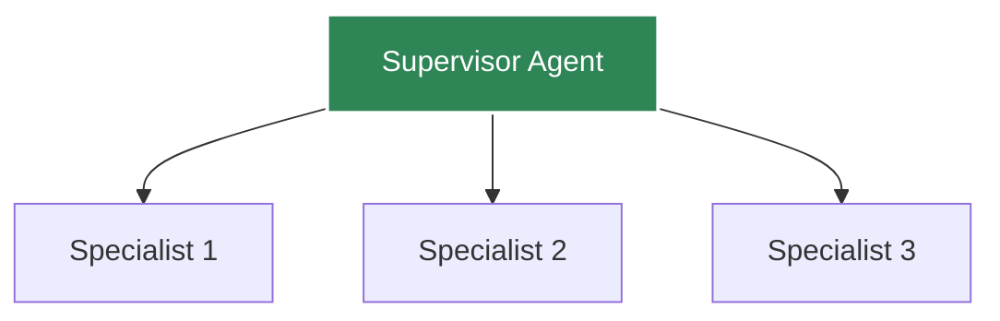

# Multi-Agent Systems

Build collaborative agent systems with Agent Kernel.

## Architecture Patterns

### Supervisor Pattern

### Peer-to-Peer Pattern

### Pipeline Pattern

Support and documentation to be available soon!