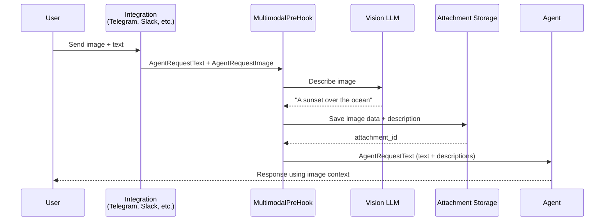
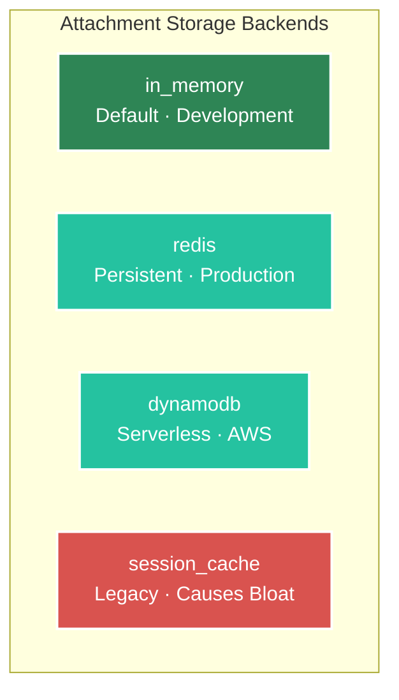

# Multimodal Attachments

Agent Kernel supports **multimodal input processing** — users can send images and files alongside text, and the framework automatically handles description generation, storage, and context injection.

## Overview



### Key Design Decisions

- **No raw binary in session history** — Images/files are stored externally; only text descriptions enter the conversation. This prevents session bloat.
- **Pluggable storage** — Choose between in-memory, Redis, or DynamoDB depending on your deployment.
- **Automatic description** — A vision-capable LLM generates brief descriptions of each attachment.
- **System tool for recall** — The agent can call `analyze_attachments` to retrieve previously stored images/files.

## Enabling Multimodal Support

### Environment Variables

```bash
export AK_MULTIMODAL__ENABLED=true
```

### Configuration File

```yaml
multimodal:
  enabled: true
  max_attachments: 10                 # Max attachments per session
  description_max_length: 200         # Max chars for auto-generated descriptions
  storage_type: in_memory             # Default — no session bloat
```

## Attachment Storage

Attachments are stored **outside** the session to prevent session bloat. The storage backend is independent of your session storage — you can use Redis sessions with in-memory attachment storage, or vice versa.



### In-Memory (Default)

Fast, ephemeral storage. Attachments live in a module-level dictionary — not inside the session object.

```bash
export AK_MULTIMODAL__STORAGE_TYPE=in_memory
```

| Trait | Value |
|-------|-------|
| **Session bloat** | ❌ None |
| **Persistence** | ❌ Lost on restart |
| **Setup** | ✅ None required |
| **Best for** | Development, testing |

### Redis

Persistent storage for production. Requires a Redis server.

```bash
export AK_MULTIMODAL__STORAGE_TYPE=redis
export AK_MULTIMODAL__REDIS__URL=redis://localhost:6379
export AK_MULTIMODAL__REDIS__KEY_PREFIX=ak:attachments:
export AK_MULTIMODAL__REDIS__TTL=3600
```

| Trait | Value |
|-------|-------|
| **Session bloat** | ❌ None |
| **Persistence** | ✅ Across restarts |
| **Setup** | 🔧 Redis server |
| **Best for** | Containerized production |

### DynamoDB

Serverless storage for AWS deployments.

```bash
export AK_MULTIMODAL__STORAGE_TYPE=dynamodb
export AK_MULTIMODAL__DYNAMODB__TABLE_NAME=ak-attachments
export AK_MULTIMODAL__DYNAMODB__REGION=us-east-1
export AK_MULTIMODAL__DYNAMODB__TTL=3600
```

| Trait | Value |
|-------|-------|
| **Session bloat** | ❌ None |
| **Persistence** | ✅ Fully managed |
| **Setup** | 🔧 AWS account + table |
| **Best for** | AWS Lambda deployments |

### Session Cache (Legacy)

:::warning
This stores attachments **inside** the session object, causing session size to grow with each attachment. Use only for backward compatibility.
:::

```bash
export AK_MULTIMODAL__STORAGE_TYPE=session_cache
```


## The `analyze_attachments` System Tool

When multimodal is enabled, a system tool called `analyze_attachments` is automatically registered on all agents. This allows the agent to retrieve and re-analyze previously stored attachments.

```python
# The agent can call this internally:
analyze_attachments(session_id="user-123", query="What breed is the dog?")
```

The tool:
1. Retrieves all stored attachments for the session
2. Sends them (with the query) to the vision LLM
3. Returns a detailed analysis

This enables multi-turn conversations about images:

```
User: [sends photo of a dog]
Agent: I see a golden retriever sitting in a park.

User: What breed is it exactly?
Agent: [calls analyze_attachments] It's a Golden Retriever, approximately 2-3 years old...
```

## Configuration Reference

### Full `config.yaml` Example

```yaml
multimodal:
  enabled: true
  max_attachments: 10
  description_max_length: 200
  storage_type: in_memory          # in_memory | redis | dynamodb | session_cache

  redis:
    url: "redis://localhost:6379"
    key_prefix: "ak:attachments:"
    ttl: 3600

  dynamodb:
    table_name: "ak-attachments"
    region: "us-east-1"
    ttl: 3600
```

### Environment Variables

```bash
# Core
export AK_MULTIMODAL__ENABLED=true
export AK_MULTIMODAL__MAX_ATTACHMENTS=10
export AK_MULTIMODAL__DESCRIPTION_MAX_LENGTH=200
export AK_MULTIMODAL__STORAGE_TYPE=in_memory

# Redis storage
export AK_MULTIMODAL__REDIS__URL=redis://localhost:6379
export AK_MULTIMODAL__REDIS__KEY_PREFIX=ak:attachments:
export AK_MULTIMODAL__REDIS__TTL=3600

# DynamoDB storage
export AK_MULTIMODAL__DYNAMODB__TABLE_NAME=ak-attachments
export AK_MULTIMODAL__DYNAMODB__REGION=us-east-1
export AK_MULTIMODAL__DYNAMODB__TTL=3600
```

## Storage Backend Comparison

| Feature | In-Memory | Redis | DynamoDB | Session Cache |
|---------|-----------|-------|----------|---------------|
| **Session Bloat** | ❌ None | ❌ None | ❌ None | ⚠️ Yes |
| **Persistence** | ❌ Lost on restart | ✅ Persistent | ✅ Persistent | ✅ With session |
| **Multi-Process** | ❌ Single process | ✅ Distributed | ✅ Distributed | Depends on session |
| **Setup** | ✅ None | 🔧 Redis server | 🔧 AWS account | ✅ None |
| **Best For** | Development | Production | Serverless | Legacy only |

## Supported Integrations

Multimodal attachments are supported on the following platforms:

| Platform | Images | Files | Notes |
|----------|--------|-------|-------|
| **Telegram** | ✅ | ✅ | Photos + documents |
| **REST API** | ✅ | ✅ | Via `AgentRequestImage` / `AgentRequestFile` |
| **CLI** | ❌ | ❌ | Text only |

## Related Documentation

- **[Session Management](/docs/core-concepts/session)** — Session storage and caching
- **[Execution Hooks](/docs/integrations/hooks)** — How PreHooks and PostHooks work
- **[Configuration](/docs/core-concepts/configuration)** — Complete configuration reference
- **[Telegram Integration](/docs/integrations/telegram)** — Telegram-specific file handling
