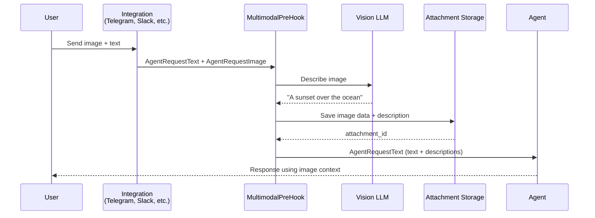
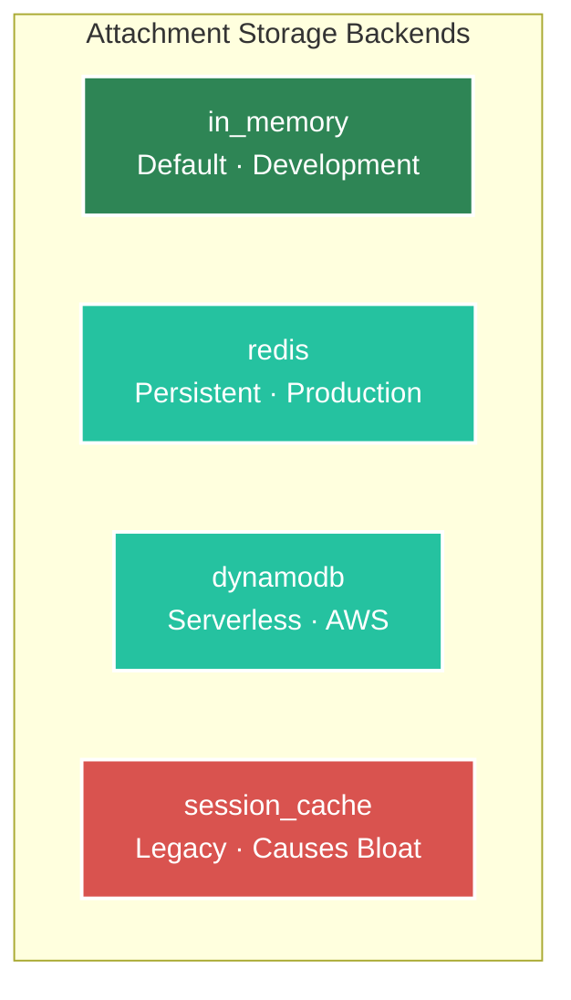

# Multimodal Attachments

Agent Kernel supports **multimodal input processing**: users can send images and files alongside text, and the framework automatically handles description generation, storage, and context injection.

## Overview


```mermaid
sequenceDiagram
    participant User
    participant Integration as Integration<br/>(Telegram, Slack, etc.)
    participant PreHook as MultimodalPreHook
    participant LLM as Vision LLM
    participant Storage as Attachment Storage
    participant Agent

    User->>Integration: Send image + text
    Integration->>PreHook: AgentRequestText + AgentRequestImage
    PreHook->>LLM: Describe image
    LLM-->>PreHook: "A sunset over the ocean"
    PreHook->>Storage: Save image data + description
    Storage-->>PreHook: attachment_id
    PreHook->>Agent: AgentRequestText (text + descriptions)
    Agent-->>User: Response using image context
```

### Key Design Decisions

- **No raw binary in session history**: Images/files are stored externally; only text descriptions enter the conversation. This prevents session bloat.
- **Pluggable storage**: Choose between in-memory, Redis, or DynamoDB depending on your deployment.
- **Automatic description**: A vision-capable LLM generates brief descriptions of each attachment.
- **System tool for recall**: The agent can call `analyze_attachments` to retrieve previously stored images/files.

## Enabling Multimodal Support

### Environment Variables

```bash
export AK_MULTIMODAL__ENABLED=true
```

### Configuration File

```yaml
multimodal:
  enabled: true
  max_attachments: 10                 # Max attachments per session
  description_max_length: 200         # Max chars for auto-generated descriptions
  storage_type: in_memory             # Default - no session bloat
```

## Attachment Source Forms

`AgentRequestImage.image_data` and `AgentRequestFile.file_data` accept several source forms, and what
`MultimodalPreHook` does with each differs. Only inline bytes can be described by a vision model or
stored — a URL is a reference to something the hook never reads.

| Source form | Example | Described | Stored | Reaches the agent |
|---|---|---|---|---|
| Bare base64 | `iVBORw0KGgo...` | ✅ | ✅ | As a description, plus an `attachment_id` |
| `data:` URI, base64 | `data:image/png;base64,iVBOR...` | ✅ | ✅ | As above. The URI's own media type wins over `mime_type` |
| `data:` URI, no base64 marker | `data:text/plain,hello` | ❌ | ❌ | Passed through untouched |
| `http://` / `https://` URL | `https://cdn.example.com/a.png` | ❌ | ❌ | Passed through untouched |
| `s3://` URL | `s3://bucket/key.pdf` | ❌ | ❌ | Passed through untouched |

"Passed through untouched" is the important row. The hook neither describes nor stores these, and — as
of the source-form work — it no longer *strips* them either: the request travels on to the framework
adapter with the URL intact, so an adapter that can fetch a URL itself (as several can) gets the chance
to. Previously they were consumed and dropped, so the agent saw nothing at all.

A `data:` URI with an empty payload (`data:image/png;base64,`) is dropped rather than forwarded, since
there are no bytes to describe and nothing for an adapter to fetch. Scheme and media-type matching is
case-insensitive.

:::warning With Conversation Thread Support enabled, only bare base64 is safe
The table above describes the **thread-off** path. When threads are enabled,
`ConversationThreadManager.store_attachments` stores `image_data` / `file_data` verbatim before the
hook runs and does no source-form classification — so a `data:` URI or a URL is persisted corrupted,
and the description the agent later sees is of those corrupted bytes. Bare base64 is unaffected. This
is a known limitation: send bare base64 when threads are on.
:::

## Attachment Storage

Attachments are stored **outside** the session to prevent session bloat. The storage backend is independent of your session storage; you can use Redis sessions with in-memory attachment storage, or vice versa.


```mermaid
graph TB
    subgraph "Attachment Storage Backends"
        A[in_memory<br/>Default · Development]
        B[redis<br/>Persistent · Production]
        C[dynamodb<br/>Serverless · AWS]
        D[session_cache<br/>Legacy · Causes Bloat]
    end

    style A fill:#2e8555,stroke:#fff,stroke-width:2px,color:#fff
    style B fill:#25c2a0,stroke:#fff,stroke-width:2px,color:#fff
    style C fill:#25c2a0,stroke:#fff,stroke-width:2px,color:#fff
    style D fill:#d9534f,stroke:#fff,stroke-width:2px,color:#fff
```

### In-Memory (Default)

Fast, ephemeral storage. Attachments live in a module-level dictionary, not inside the session object.

```bash
export AK_MULTIMODAL__STORAGE_TYPE=in_memory
```

| Trait | Value |
|-------|-------|
| **Session bloat** | ❌ None |
| **Persistence** | ❌ Lost on restart |
| **Setup** | ✅ None required |
| **Best for** | Development, testing |

### Redis

Persistent storage for production. Requires a Redis server.

```bash
export AK_MULTIMODAL__STORAGE_TYPE=redis
export AK_MULTIMODAL__REDIS__URL=redis://localhost:6379
export AK_MULTIMODAL__REDIS__PREFIX=ak:attachments:
export AK_MULTIMODAL__REDIS__TTL=3600
```

| Trait | Value |
|-------|-------|
| **Session bloat** | ❌ None |
| **Persistence** | ✅ Across restarts |
| **Setup** | 🔧 Redis server |
| **Best for** | Containerized production |

### DynamoDB

Serverless storage for AWS deployments.

```bash
export AK_MULTIMODAL__STORAGE_TYPE=dynamodb
export AK_MULTIMODAL__DYNAMODB__TABLE_NAME=ak-attachments
export AK_MULTIMODAL__DYNAMODB__REGION=us-east-1
export AK_MULTIMODAL__DYNAMODB__TTL=3600
```

| Trait | Value |
|-------|-------|
| **Session bloat** | ❌ None |
| **Persistence** | ✅ Fully managed |
| **Setup** | 🔧 AWS account + table |
| **Best for** | AWS Lambda deployments |

### Session Cache (Legacy)

:::warning
This stores attachments **inside** the session object, causing session size to grow with each attachment. Use only for backward compatibility.
:::

```bash
export AK_MULTIMODAL__STORAGE_TYPE=session_cache
```


## The `analyze_attachments` System Tool

When multimodal is enabled, a system tool called `analyze_attachments` is automatically registered on all agents. This allows the agent to retrieve and re-analyze previously stored attachments.

```python
# attachment_ids usually come from the multimodal storage layer
analyze_attachments(
    attachment_ids=["att_123", "att_456"],
    prompt="What breed is the dog?",
)
```

The tool:
1. Takes a list of attachment IDs (returned when attachments are stored by the multimodal pre-hook or storage backend; see the attachment_id in the sequence diagram above)
2. Fetches those attachments from storage
3. Sends them (with the prompt) to the vision LLM
4. Returns a detailed analysis

This enables multi-turn conversations about images:

```
User: [sends photo of a dog]
Agent: I see a golden retriever sitting in a park.

User: What breed is it exactly?
Agent: [calls analyze_attachments] It's a Golden Retriever, approximately 2-3 years old...
```

## Configuration Reference

### Full `config.yaml` Example

```yaml
multimodal:
  enabled: true
  max_attachments: 10
  description_max_length: 200
  storage_type: in_memory          # in_memory | redis | dynamodb | session_cache

  redis:
    url: "redis://localhost:6379"
    prefix: "ak:attachments:"
    ttl: 3600

  dynamodb:
    table_name: "ak-attachments"
    region: "us-east-1"
    ttl: 3600
```

### Environment Variables

```bash
# Core
export AK_MULTIMODAL__ENABLED=true
export AK_MULTIMODAL__MAX_ATTACHMENTS=10
export AK_MULTIMODAL__DESCRIPTION_MAX_LENGTH=200
export AK_MULTIMODAL__STORAGE_TYPE=in_memory

# Redis storage
export AK_MULTIMODAL__REDIS__URL=redis://localhost:6379
export AK_MULTIMODAL__REDIS__PREFIX=ak:attachments:
export AK_MULTIMODAL__REDIS__TTL=3600

# DynamoDB storage
export AK_MULTIMODAL__DYNAMODB__TABLE_NAME=ak-attachments
export AK_MULTIMODAL__DYNAMODB__REGION=us-east-1
export AK_MULTIMODAL__DYNAMODB__TTL=3600
```

## Storage Backend Comparison

| Feature | In-Memory | Redis | DynamoDB | Session Cache |
|---------|-----------|-------|----------|---------------|
| **Session Bloat** | ❌ None | ❌ None | ❌ None | ⚠️ Yes |
| **Persistence** | ❌ Lost on restart | ✅ Persistent | ✅ Persistent | ✅ With session |
| **Multi-Process** | ❌ Single process | ✅ Distributed | ✅ Distributed | Depends on session |
| **Setup** | ✅ None | 🔧 Redis server | 🔧 AWS account | ✅ None |
| **Best For** | Development | Production | Serverless | Legacy only |

## Supported Integrations

Multimodal attachments are supported on the following platforms:

| Platform | Images | Files | Notes |
|----------|--------|-------|-------|
| **Telegram** | ✅ | ✅ | Photos + documents |
| **Teams** | ✅ | ✅ | Inline images + uploaded files; audio/video rejected, `api.max_file_size` enforced while streaming |
| **REST API** | ✅ | ✅ | Via `AgentRequestImage` / `AgentRequestFile` |
| **CLI** | ❌ | ❌ | Text only |

## Related Documentation

- **[Session Management](/docs/core-concepts/session)**: Session storage and caching
- **[Execution Hooks](/docs/integrations/hooks)**: How PreHooks and PostHooks work
- **[Configuration](/docs/core-concepts/configuration)**: Complete configuration reference
- **[Telegram Integration](/docs/integrations/telegram)**: Telegram-specific file handling
- **[Teams Integration](/docs/integrations/teams)**: Teams-specific attachment handling
