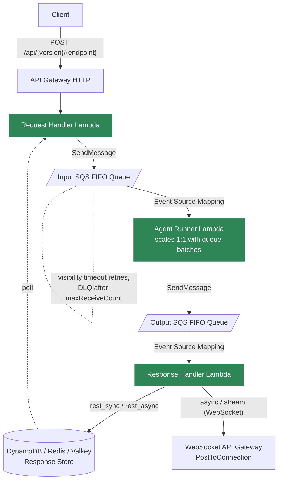
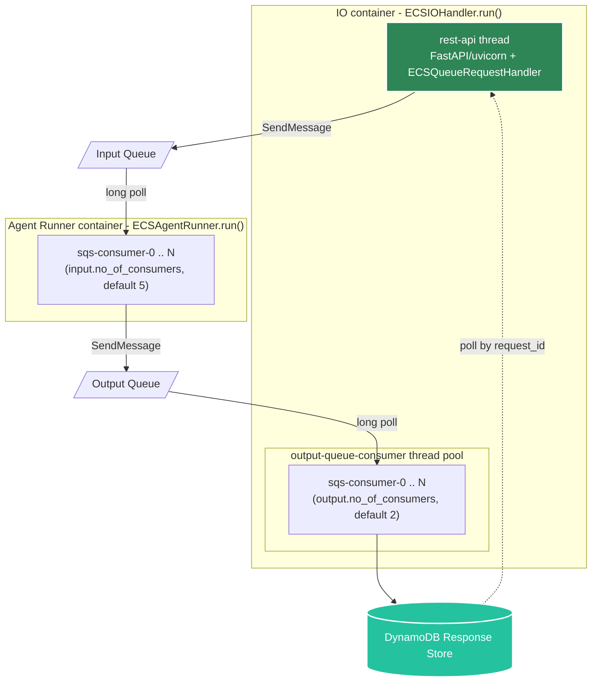
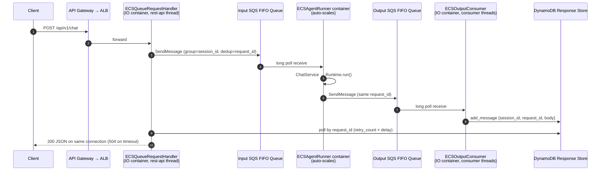

# Queue Mode Guide

Queue mode is Agent Kernel's chat execution pipeline
([#495](https://github.com/yaalalabs/agent-kernel/issues/495)): every chat request travels

```
Request Handler → Input Queue → Agent Runner → Output Queue → Response Handler
```

with the queue transport and the process topology selected by configuration. This guide covers
the pipeline itself, [running it locally](#running-queue-mode-locally-in_memory) with the default
`in_memory` transport, and the AWS deployments: Lambda (serverless) and ECS (containerized):
where the queues are durable SQS FIFO queues.

---

## What Is Queue Mode?

Queue mode decouples the HTTP request from the agent processing by placing a queue between the
caller and the Agent Runner. This gives you:

- **Backpressure control**: the queue absorbs burst traffic.
- **Ordered processing per session**: the message group (`session_id`) keeps chat turns in order
  while different sessions run in parallel.
- **Automatic retries**: unacknowledged messages are redelivered, up to `max_receive_count`;
  after that a permanent-failure error is delivered so the caller never hangs.
- **Deduplication**: a per-request deduplication ID prevents the same message being processed twice.

The queue transport is pluggable via `execution.queues.type`:

| Transport | Status | Where the components run |
|-----------|--------|--------------------------|
| `in_memory` | ✅ the default | All five components as threads in one process (local, single-container) |
| `sqs` | ✅ | Two-process topology on AWS; also the transport behind the Lambda and ECS deployment adapters below |
| `kafka` | ✅ (`pip install agentkernel[kafka]`) | Kubernetes / on-prem two-process topology |
| `nats` (recommended on-prem) | ✅ (`pip install agentkernel[nats]`) | Kubernetes / on-prem two-process topology |

Delivery sub-modes (`execution.mode`):

| Mode | What the caller does | How they get the response |
|------|---------------------|---------------------------|
| **REST Sync** (also when unset) | POST → wait | Same HTTP response (server awaits the response store) |
| **REST Async** | POST → get a `request_id` | Later GET with the `request_id` |
| **Stream** | POST | SSE token chunks (REST surface); WebSocket `STREAM_CHUNK`s (AWS) |
| **Async** | WebSocket frame | WebSocket `CHAT_RESPONSE` push (AWS) |

:::note
[Conversation-thread](./threads) recording does not apply in queue mode: threads are served by
`AgentThreadRequestHandler`, which is mounted as an explicit handler and therefore executes
inline, outside the pipeline.
:::

---

## Running Queue Mode Locally (`in_memory`)

A bare `RESTAPI.run()` (no explicit handlers) boots the whole pipeline in one process: that is
the default for every REST example. The `in_memory` transport reproduces the full queue
semantics (per-session FIFO, bounded retry with the permanent-failure path, deduplication,
batch fetch) without any backing service; what it does not provide is durability, so broker
transports remain the production choice for multi-process deployments.

```yaml
execution:
  mode: rest_sync          # rest_sync (default when unset) | rest_async | stream
  queues:
    type: in_memory        # the default; spelled out for clarity
    input:
      max_receive_count: 3 # deliveries before a message is permanently failed
      no_of_consumers: 2   # agent-runner worker threads (parallel sessions)
    output:
      no_of_consumers: 1
    in_memory:
      ack_wait: 300        # seconds before an unacknowledged message is redelivered
      dedup_window: 300    # seconds within which duplicate request ids are dropped
  response_store:
    retry_count: 60        # with delay: how long a rest_sync caller waits (60 × 1s)
    delay: 1
```

:::caution Long agent runs and the local wait budgets
Unlike the old inline path (which waited indefinitely), the pipeline bounds its waits, so two
knobs matter for slow, LLM-bound agent turns:

- **`response_store.retry_count × delay`** is how long a `rest_sync` caller (or the SSE bridge
  between chunks) waits before returning a 504/error frame. The local default is 60 × 1 s.
- **`queues.in_memory.ack_wait`** (default 300 s) is when an unacknowledged message is
  redelivered and the run executed again, up to `max_receive_count`. Redelivery exists to rescue
  stuck worker threads: keep it above your longest expected agent run.
:::

On startup:

```
ak.api.http - INFO - in_memory queue transport resolved: starting the single-process pipeline topology
ak.pipeline.io_handler - INFO - IOHandler starting: mode=rest_sync, transport=in_memory, topology=single-process
```

All three REST delivery modes work locally: `rest_sync`, `rest_async` accept-then-poll, and
`stream` over SSE: switchable per run with `AK_EXECUTION__MODE`. See
[`examples/api/openai`](https://github.com/yaalalabs/agent-kernel/tree/develop/examples/api/openai)
for curl walkthroughs of each, and [Local Deployment](../deployment/local) for the local flow
diagram.

**Activation rule**: only a bare `RESTAPI.run()` on the base class runs the pipeline. Surfaces
constructed with explicit handlers (`RESTAPI.run([MyHandler()])`, the thread handler, messaging
integrations) and subclasses (`AWSRestAPI`, `AWSWebsocketAPI`) keep their existing execution
paths unchanged.

---

## Running Queue Mode on Kafka

Install the extra (`pip install agentkernel[kafka]`) and configure the broker; topics are
pre-provisioned by your cluster tooling (Strimzi CRs or the chart), never created by the app:

```yaml
execution:
  mode: rest_sync
  queues:
    type: kafka
    kafka:
      bootstrap_servers: "kafka-bootstrap:9092"
      input_topic: agent-input
      output_topic: agent-output
      group_id: agent-kernel        # consumers append "-input" / "-output"
      dlq_suffix: ".dlq"            # permanently failed records are produced to <topic>.dlq
      retry_backoff: 2.0            # seconds before an in-process retry
      client_config:                # merged into both clients (SASL, TLS, tuning)
        security.protocol: SASL_SSL
        sasl.mechanism: SCRAM-SHA-512
  response_store:                   # required: the two processes must share it
    type: valkey
    valkey:
      url: "valkey://valkey:6379"
```

The IO process runs `IOHandler.run()` (REST API + Response Handler) and the runner process runs
`AgentRunner.run()`, exactly as on SQS. (`RESTAPI.run()` boots the whole pipeline in one process
only when the transport resolves to `in_memory`, so on a broker transport the IO side is started
explicitly.)

A runnable version of all of this, including a single-broker Docker stack and a small harness that
provisions topics and lets you inspect the queues and dead-letter topics, is in
[`examples/transport/kafka`](https://github.com/yaalalabs/agent-kernel/tree/develop/examples/transport/kafka).

Three Kafka-specific behaviors worth knowing, all consequences of Kafka having no per-message
acknowledgement model:

- **Partitions, not sessions, set your concurrency.** The record key is the `session_id`, so a
  session's messages stay ordered. Kafka then gives each partition to one consumer thread, which
  works through it one message at a time, so two sessions sharing a partition wait for each other
  and threads beyond the partition count never receive work at all. Keep
  `no_of_consumers x replicas` at or below the partition count (32 is the chart default); Agent
  Kernel logs the ratio at startup and warns when a topic has too few partitions for the
  consumers configured against it. Adding partitions later re-maps session keys, so size up
  front.
- **Retry bookkeeping follows your session store.** Delivery counts and deduplication are
  reconstructed by Agent Kernel, not the broker. With `session.type: redis` or `valkey` they are
  stored there and survive a pod restart; with any other session type they are process-local and
  Agent Kernel logs a warning at startup, because a message that crashes its worker would then
  reset its own delivery count.
- **No visibility timeout.** An unacknowledged record comes back through the in-process retry or,
  if the pod dies, when its uncommitted offset is reassigned. Nothing redelivers a record while
  the worker is alive but stuck, so `max.poll.interval.ms` defaults to 15 minutes here (rather
  than librdkafka's 5) to keep a long agent turn from being mistaken for a dead consumer. When a
  rebalance does take a partition away, buffered work for it is dropped so the new owner is the
  only one processing it.

A note on offsets: consumers use `auto.offset.reset: earliest`, so a consumer group starting for
the first time reads a topic from its oldest retained record rather than skipping ahead. That is
what keeps a cold start from losing requests produced before the consumers were ready, but it
also means pointing a **new** `group_id` at a topic with history replays that history. Use
dedicated topics for the pipeline, keep retention short (24-72 hours is plenty), and treat a
`group_id` change as a deliberate replay.

---

## Running Queue Mode on NATS JetStream

The recommended on-prem broker: one static Go binary, an official Helm chart, and NACK CRDs for
declarative streams. Install the extra (`pip install agentkernel[nats]`) and configure it:

```yaml
execution:
  mode: rest_sync
  queues:
    type: nats
    nats:
      url: "nats://nats:4222"
      input_stream: AGENT_REQUESTS
      input_subject_prefix: chat.req
      output_stream: AGENT_REPLIES
      output_subject_prefix: chat.out
      partitions: 32          # sessions hash to a partition; caps concurrent work
      ack_wait: 300           # visibility timeout: must exceed your longest agent turn
      retry_backoff: 2.0      # nak delay before a redelivery
      auto_provision: false   # true for local/dev; leave false where NACK CRs own the objects
  response_store:             # required: the two processes must share it
    type: valkey
    valkey:
      url: "valkey://valkey:6379"
```

Process layout is identical to the other broker transports: `IOHandler.run()` in one process,
`AgentRunner.run()` in the other.

JetStream is the closest fit of any backend here, because the server provides most of what the
pipeline needs rather than the client rebuilding it: `ack_wait` is the visibility timeout,
`num_delivered` is an exact delivery count, `max_deliver` enforces the ceiling server-side,
`Nats-Msg-Id` plus the stream's duplicate window is deduplication, and `term()` is the terminal
disposition. There is no bookkeeping store and no dead-letter topic to provision.

Three things to know:

- **Partitions set your concurrency**, as on Kafka, but the server enforces it. Sessions hash to a
  partition subject, each served by a durable consumer with `max_ack_pending: 1`, so a session's
  turns stay ordered and at most `partitions` messages are in flight cluster-wide. Agent Kernel logs
  the ratio at startup and warns when partitions are fewer than the configured consumers. Changing
  the count re-maps sessions, so size it up front.
- **`ack_wait` must exceed your longest turn.** It defaults to 300 seconds here rather than
  JetStream's usual 30, because it is a visibility timeout: a turn that outlives it is redelivered
  and the agent runs again.
- **`auto_provision` is off by default.** Locally, turn it on and Agent Kernel creates the streams
  and per-partition consumers at startup. In production, leave it off so a missing stream or consumer
  fails loudly at startup, naming the object, instead of being silently created with defaults
  alongside your NACK CRs.

---


## How It Works in Lambda (Serverless)

### Components



In `stream` mode the Agent Runner Lambda (`ServerlessStreamAgentRunner`) sends **one output-queue message per token chunk**, and the Response Handler broadcasts each as a `STREAM_CHUNK` WebSocket message.

### SQS Queue Design

Both queues are **FIFO** with:

| Setting | Purpose |
|---------|---------|
| `MessageGroupId = SessionID` | Preserves order within a session |
| `MessageDeduplicationId` | Prevents the agent running the same turn twice |
| `MessageVisibilityTimeout` | Makes undeleted messages reappear for retry |
| `MessageRetentionPeriod` | Auto-deletes stuck messages, breaks infinite loops |
| DLQ (optional) | Catches messages that exceed `maxReceiveCount` |

### REST Sync Flow

1. Client sends `POST /api/v1/chat`.
2. **Request Handler Lambda** puts the message on the Input Queue, then **polls DynamoDB**
   until the response appears, and returns it on the same HTTP connection.
3. **Agent Runner Lambda** is triggered by the Input Queue ESM, processes the message,
   puts the response on the Output Queue, and returns `batchItemFailures` for anything
   that failed (so those messages come back for retry).
4. **Response Handler Lambda** is triggered by the Output Queue ESM and writes the
   response to DynamoDB (keyed by SessionID, with a TTL).

Failure handling:
- If the Agent Runner Lambda crashes, the message reappears after the visibility timeout.
- Partial failures are reported via `batchItemFailures`; only those messages stay in the
  queue for retry.
- If the Response Handler fails to write DynamoDB, the message stays on the Output Queue
  and is retried.

### REST Async Flow

Same as REST Sync except:

1. The `POST` returns immediately (202) with a `request_id`.
2. The client polls `GET /api/v1/chat?request_id=...&session_id=...` (query params, no path
   segment) to retrieve the result. Same path as the `POST`, differentiated by HTTP method.
3. `request_id` is the only lookup key. `session_id` is optional and used only for
   logging/error messages: it is not validated against the stored reply.

### WebSocket (Async) Mode

1. Client connects via WebSocket (API Gateway WebSocket).
2. **WS Connection Handler Lambda** stores the connection ID in DynamoDB.
3. Messages are put on the Input Queue (same Agent Runner pipeline).
4. **Response Handler Lambda** reads from the Output Queue and calls
   `execute-api:ManageConnections` (PostToConnection) to push the response back to the
   client over the still-open WebSocket.

### Terraform Modules (Serverless)

Located under `ak-deployment/ak-aws/serverless/modules/`:

| Module | Role |
|--------|------|
| `queues/` | Creates Input and Output SQS FIFO queues |
| `request-handler/` | Request Handler Lambda + optional SQS send permission |
| `agent-runner/` | Agent Runner Lambda + ESM binding to Input Queue |
| `response-handler/` | Response Handler Lambda + ESM binding to Output Queue |
| `api-gateway/` | HTTP API Gateway wiring |
| `websocket-api-gateway/` | WebSocket API Gateway |
| `ws-connection-handler/` | WebSocket connection lifecycle Lambda |

---

## How Queue Mode Works in ECS (Containerized)

The ECS deployment uses the same pipeline as Lambda, **except Lambda functions are
replaced by long-running ECS services**. The IO container runs two threads via
`ThreadRunner`; the Agent Runner is a separate ECS service that extends `ECSSQSConsumer`.

Both `ECSSQSConsumer` subclasses (`ECSAgentRunner` and `ECSOutputConsumer`) are
themselves internally multi-threaded: `ECSSQSConsumer.run()` starts `num_consumers`
independent long-lived threads (also via `ThreadRunner`), each running its own
blocking long-poll loop against the same queue. So "Thread 2" of the IO container
is really `output.no_of_consumers` output-queue-polling threads, and the Agent Runner
container runs `input.no_of_consumers` input-queue-polling threads, not a single loop.
The defaults differ per queue: `execution.queues.input.no_of_consumers` defaults to **5**
and `execution.queues.output.no_of_consumers` defaults to **2** (ECS only; both ignored
by Lambda). If any consumer thread crashes, `ThreadRunner` triggers a
graceful shutdown: it sets a shared `shutdown_event`, waits for the sibling consumer
threads in that same pool to finish their current poll/message and return, then calls
`os._exit(1)` so ECS restarts the whole task. The REST API thread does not check
`shutdown_event`; it is simply terminated along with everything else the moment
`os._exit(1)` fires.



:::note
**WebSocket delivery is available on ECS in both `async` and `stream` modes**: see
[WebSocket (Async/Stream) Mode in ECS](#websocket-asyncstream-mode-in-ecs) below. `rest_sync` and
`rest_async` always deliver replies through the response store; `async`/`stream` always push over
the WebSocket connection instead.
:::

### Python Class Hierarchy

| Class | Container | Role |
|-------|-----------|------|
| `ECSIOHandler` | IO container | Entrypoint: starts Thread 1 + Thread 2 via `ThreadRunner`; Thread 1 is `AWSRestAPI` (`rest_sync`/`rest_async`) or `AWSWebsocketAPI` (`async`/`stream`), selected by `execution.mode` |
| `ECSQueueRequestHandler` | IO container / Thread 1 (REST modes) | FastAPI: `POST /api/v1/chat` enqueues; `GET /api/v1/chat?request_id=...&session_id=...` polls (query params only, no path segment) |
| `ECSWebSocketRequestHandler` / `ECSWebSocketSystemRequestHandler` | IO container / Thread 1 (WebSocket modes) | Chat + custom routes, and `$connect`/`$disconnect`/`$default` respectively: see [WebSocket (Async/Stream) Mode in ECS](#websocket-asyncstream-mode-in-ecs) |
| `ECSOutputConsumer` | IO container / Thread 2 | Extends `ECSSQSConsumer`; runs `output.no_of_consumers` (default 2) threads polling Output Queue → response store |
| `ECSAgentRunner` | Agent Runner container | Extends `ECSSQSConsumer`; runs `input.no_of_consumers` (default 5) threads polling Input Queue, running the agent, sending to Output Queue |
| `ECSSQSConsumer` | both | Extends `RawQueueConsumer`; spins up `num_consumers` poll-loop threads via `ThreadRunner`. Since #495 its batch/retry/permanent-failure machinery is the shared `ConsumerLoop` (`agentkernel.pipeline.consumer`) bound to the SQS classmethod surface: public behavior unchanged |
| `ConsumerLoop` | shared (pipeline) | The generic consumer machinery every transport uses: batch fetch, receive-count check, permanent-failure-then-ack flow, `ThreadRunner` wiring |
| `RawQueueConsumer` | shared (Lambda + ECS) | Internal abstract base (`deployment/aws/core/raw_queue_consumer.py`) declaring `poll`, `process_message`, `on_permanent_failure`, `delete_message`; also the base of `LambdaSQSConsumer` (the Lambda-side equivalent, which leaves `poll`/`delete_message` unimplemented since the SQS Event Source Mapping handles those for Lambda) |
| `ThreadRunner` | both | Runs N callables as peer threads; on a crash it either exits immediately or, if the failing task opts into `graceful=True` (the SQS consumer pools do), sets a shared `shutdown_event` and waits for sibling tasks in that same `run()` call to finish before calling `os._exit(1)` |

### Request Flow: REST Sync



### Request Flow: REST Async

Identical infrastructure to REST Sync. The difference is purely in `ECSQueueRequestHandler`:

- `POST /api/v1/chat` returns **202 Accepted** with a `request_id` immediately after
  enqueuing (Thread 1 does not wait on DynamoDB).
- `GET /api/v1/chat?request_id=...&session_id=...` (query params, no path segment) reads from
  the DynamoDB Response Store by `request_id` and returns the result, or `404 NOT_FOUND` if
  nothing is there yet (`session_id` is optional and used only for logging, not validated
  against the stored reply).

### WebSocket (Async/Stream) Mode in ECS

Set `execution_mode = "async"` or `"stream"` (with `queue_mode = true`) to combine the queue
pipeline above with a WebSocket API Gateway instead of an HTTP API:

1. Client connects to `wss://<endpoint>/<stage>?token=<jwt>`. Thread 1 runs `AWSWebsocketAPI`
   instead of `AWSRestAPI`; `$connect` authenticates via the registered `AuthValidator`
   (mandatory) and stores `user_id` ↔ `connection_id` in a DynamoDB connections table.
2. A `chat` frame (`{"route": "chat", "body": {...}}`) is enqueued to the Input Queue exactly
   like REST Async: the framework never runs the agent inline in this mode.
3. `ECSAgentRunner` processes it in `async` mode exactly as in REST modes, then forwards the
   connection's `endpoint_url` as a custom SQS attribute to the Output Queue. In `stream` mode,
   `ECSAgentRunner.run()` dispatches to `ECSStreamAgentRunner` instead (re-checking
   `execution.mode` on every call, mirroring `ECSIOHandler.run`'s dispatch): it runs the agent via
   `ChatService.process_stream_chat_sync()` and sends **one Output Queue message per streamed
   chunk** (each carrying the forwarded `endpoint_url`), instead of one message for the full
   reply.
4. `ECSOutputConsumer` branches on `execution.mode`: `async` pushes a `CHAT_RESPONSE` over the
   WebSocket connection via `PostToConnection`; `stream` pushes each Output Queue message as its
   own `STREAM_CHUNK` (using the forwarded `endpoint_url` + `user_id`), terminated by a chunk with
   `"done": true`. Neither mode falls back to the response store: that path only runs for
   `rest_sync`/`rest_async`.
5. Custom routes (registered with `AWSWebsocketAPI.register`) bypass the queue entirely: they
   are answered directly by Thread 1, the same as chat frames in direct (non-queue) WebSocket
   mode.

Direct (non-queue) WebSocket mode works the same way minus the queue hop: `chat` runs the agent
inline via `ChatService` and the reply is pushed immediately, no `ECSAgentRunner` or Output Queue
involved. In `stream` mode, direct-mode chat runs
`ChatService.process_stream_chat_async()` and broadcasts each chunk as it's produced instead of
waiting for the full reply.

See the [AWS Containerized WebSocket
Mode](../deployment/aws-containerized.md#websocket-mode) docs for the full Terraform
configuration, IAM, and wire protocol, and
[`examples/aws-containerized/openai-stream-queue-mode`](https://github.com/yaalalabs/agent-kernel/tree/develop/examples/aws-containerized/openai-stream-queue-mode)
for a full queue-mode streaming example (or
[`openai-stream`](https://github.com/yaalalabs/agent-kernel/tree/develop/examples/aws-containerized/openai-stream)
for the direct-mode variant).

### Entrypoint Code

**IO container, `app_rest_service.py`** (no agent definitions):

```python
from agentkernel.aws import ECSIOHandler

runner = ECSIOHandler.run

if __name__ == "__main__":
    runner()
```

**Agent Runner container, `app_agent_runner.py`**:

```python
from agentkernel.aws import ECSAgentRunner
from agentkernel.openai import OpenAIModule

OpenAIModule([...])  # agent definitions here only

handler = ECSAgentRunner.run

if __name__ == "__main__":
    handler()
```

### Required AWS Resources

- `aws_sqs_queue`: Input Queue (FIFO)
- `aws_sqs_queue`: Output Queue (FIFO)
- `aws_dynamodb_table`: Response Store (keyed by `request_id`, with TTL)
- IAM for IO container task role: `sqs:SendMessage` on Input Queue; `sqs:ReceiveMessage / DeleteMessage / ChangeMessageVisibility` on Output Queue; `dynamodb:PutItem / GetItem / Query / DeleteItem` on Response Store
- IAM for Agent Runner task role: `sqs:ReceiveMessage / DeleteMessage / ChangeMessageVisibility` on Input Queue; `sqs:SendMessage` on Output Queue

All of these are provisioned automatically by the `yaalalabs/ak-containerized/aws` Terraform module when `queue_mode = true`.

### Required Environment Variables

IO container:

```
AK_EXECUTION__QUEUES__INPUT__URL                   = <input-queue-url>
AK_EXECUTION__QUEUES__OUTPUT__URL                  = <output-queue-url>
AK_EXECUTION__QUEUES__OUTPUT__NO_OF_CONSUMERS      = <no_of_consumers>       # output-queue consumer threads, default 5
AK_EXECUTION__QUEUES__BATCH_SIZE                   = <batch_size>           # Terraform-set only, never in config.yaml
AK_EXECUTION__RESPONSE_STORE__DYNAMODB__TABLE_NAME = <response-store-table-name>
```

Agent Runner container:

```
AK_EXECUTION__QUEUES__INPUT__URL               = <input-queue-url>
AK_EXECUTION__QUEUES__OUTPUT__URL              = <output-queue-url>
AK_EXECUTION__QUEUES__INPUT__MAX_RECEIVE_COUNT = <max_receive_count>
AK_EXECUTION__QUEUES__INPUT__NO_OF_CONSUMERS   = <no_of_consumers>  # input-queue consumer threads, default 5
AK_EXECUTION__QUEUES__BATCH_SIZE               = <batch_size>      # Terraform-set only, never in config.yaml
```

> The Terraform module deliberately sets the app-level `MAX_RECEIVE_COUNT` to **one below**
> the SQS redrive `maxReceiveCount`. That way the application writes a graceful error
> response (to the response store) on its final attempt *before* SQS moves the message to
> the dead-letter queue, so the HTTP caller never hangs waiting for a reply.

### Scaling the Agent Runner ECS Service

Unlike Lambda (which auto-scales 1:1 with queue batches), ECS needs an explicit scaling
policy. The recommended approach is **backlog-per-task target tracking**:

1. A Lambda function (EventBridge rule, 1-minute schedule) reads
   `ApproximateNumberOfMessages` from the Input Queue and the current running task count.
2. It computes `BacklogPerTask = queueDepth / max(runningTasks, 1)` and publishes
   this as a custom CloudWatch metric (`Custom/ECS/BacklogPerTask`).
3. An ECS Target Tracking policy scales the Agent Runner service to keep
   `BacklogPerTask` at or below `backlog_target`.

The `scaling_config` block in the `yaalalabs/ak-containerized/aws` module provisions
this automatically. See the [AWS Containerized deployment docs](../deployment/aws-containerized.md#auto-scaling-for-resilience) for details.

### Key Differences vs Lambda

| Aspect | Lambda | ECS |
|--------|--------|-----|
| Input Queue trigger | Event Source Mapping (push) | `ECSAgentRunner` polls (`ECSSQSConsumer.run`) |
| Partial failure | `batchItemFailures` return value | Failed messages not deleted, visibility timeout retries |
| Scaling | Automatic, 1 Lambda per batch | `backlog-per-task` target tracking policy |
| Response Handler | Separate Lambda triggered by Output Queue ESM | `ECSOutputConsumer` (Thread 2 in IO container) |
| Crash recovery | Lambda restarts automatically | `ThreadRunner` drains sibling consumer threads gracefully, then calls `os._exit(1)` → ECS restarts the task |

---

## Summary: Implementation Status

**Queue transports (the #495 pipeline):**

| Transport | Status | Notes |
|-----------|--------|-------|
| `in_memory` | ✅ | The default: single-process pipeline, full semantics minus durability |
| `sqs` | ✅ | Two-process topology on AWS, wire-compatible with the Lambda/ECS adapters below |
| `kafka` | ✅ | confluent-kafka client, per-session ordering by record key, DLQ topics, Strimzi-provisioned clusters. Needs the `kafka` extra and an `execution.queues.kafka` block; see the notes below |
| `nats` (recommended on-prem) | ✅ | JetStream work-queue streams, partitioned per-session ordering, server-side delivery counts and dedup. Needs the `nats` extra and an `execution.queues.nats` block |
| Kubernetes Helm chart (baremetal + EKS) | Upcoming | Two-Deployment topology, KEDA autoscaling |

**AWS deployment components:**

| Component | Lambda | ECS |
|-----------|--------|-----|
| Input/Output SQS Queues | ✅ `modules/queues/` | ✅ `modules/queues/` (same TF module) |
| Agent Runner | ✅ `modules/agent-runner/` | ✅ `ECSAgentRunner` (`akagentrunner.py`) |
| IO Handler / REST Service | ✅ `modules/request-handler/` | ✅ `ECSIOHandler` (`ecs_io_handler.py`) |
| Output Queue Consumer | ✅ `modules/response-handler/` (separate Lambda) | ✅ `ECSOutputConsumer` (Thread 2 in IO container) |
| DynamoDB Response Store | ✅ serverless stack | ✅ containerized stack |
| Thread management | N/A | ✅ `ThreadRunner` (`deployment/common/thread_runner.py`) |
| WebSocket Mode (`async`) | ✅ `modules/websocket-api-gateway/` + `modules/ws-connection-handler/` | ✅ WebSocket API Gateway + VPC Link V1/NLB + DynamoDB connections table (`api_gateway_ws.tf`); direct and queue variants both supported |
| Streaming Mode (`stream`) | ✅ `ServerlessStreamAgentRunner` → one SQS message per chunk → WebSocket `STREAM_CHUNK` | ✅ `ECSStreamAgentRunner` → one SQS message per chunk → WebSocket `STREAM_CHUNK` (queue mode); `ChatService.process_stream_chat_async` inline (direct mode) |
