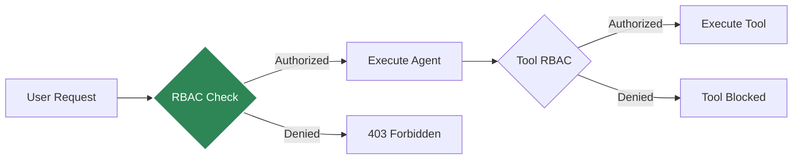

# Role-Based Access Control (RBAC)

Control access to agents and tools based on user roles.

## Overview



## Agent-Level RBAC

Restrict access to specific agents:

```python
from agentkernel.core import Runtime, RBACPolicy

# Define policy
policy = RBACPolicy()
policy.allow_agent("admin_agent", roles=["admin"])
policy.allow_agent("general_agent", roles=["user", "admin"])

# Apply policy
runtime = Runtime.get()
runtime.set_rbac_policy(policy)
```

## Tool-Level RBAC

Control tool access within agents:

```python
from crewai import Agent, Tool

# Define tool with RBAC
delete_tool = Tool(
    name="delete_data",
    description="Delete data",
    func=delete_func,
    required_roles=["admin"]  # Only admins can use
)

safe_tool = Tool(
    name="read_data",
    description="Read data",
    func=read_func,
    required_roles=["user", "admin"]  # Users and admins
)

agent = Agent(
    role="data_manager",
    tools=[delete_tool, safe_tool]
)
```

## User Context

Pass user roles with requests:

```python
# REST API
{
  "agent": "admin_agent",
  "message": "Delete user data",
  "session_id": "user-123",
  "user_context": {
    "user_id": "user-123",
    "roles": ["admin"]
  }
}
```

## RBAC Configuration

```yaml
rbac:
  enabled: true
  policies:
    agents:
      admin_agent:
        roles: ["admin"]
      data_analyst:
        roles: ["analyst", "admin"]
      general_agent:
        roles: ["user", "analyst", "admin"]
    
    tools:
      delete_data:
        roles: ["admin"]
      export_data:
        roles: ["analyst", "admin"]
      read_data:
        roles: ["user", "analyst", "admin"]
```

## Custom RBAC Implementation

```python
from agentkernel.core import RBACProvider

class CustomRBAC(RBACProvider):
    def can_access_agent(self, user_context: dict, agent_name: str) -> bool:
        # Your custom logic
        user_roles = user_context.get("roles", [])
        return "admin" in user_roles or agent_name == "general"
    
    def can_use_tool(self, user_context: dict, tool_name: str) -> bool:
        # Your custom logic
        pass

# Register
runtime = Runtime.get()
runtime.set_rbac_provider(CustomRBAC())
```

## Integration with Auth Systems

### OAuth/JWT

```python
from agentkernel.api import create_app
from your_auth import verify_jwt

app = create_app()

@app.middleware("http")
async def auth_middleware(request, call_next):
    token = request.headers.get("Authorization")
    user_context = verify_jwt(token)
    request.state.user_context = user_context
    return await call_next(request)
```

### API Keys

```python
API_KEYS = {
    "key-123": {"roles": ["user"]},
    "key-admin": {"roles": ["admin"]}
}

@app.middleware("http")
async def apikey_middleware(request, call_next):
    api_key = request.headers.get("X-API-Key")
    user_context = API_KEYS.get(api_key, {"roles": []})
    request.state.user_context = user_context
    return await call_next(request)
```

## Audit Logging

Track RBAC decisions:

```python
from agentkernel.core import Runtime

runtime = Runtime.get()
runtime.enable_rbac_logging()

# Logs will include:
# - User ID
# - Requested agent/tool
# - Roles
# - Access decision (allow/deny)
# - Timestamp
```

## Best Practices

- Implement least privilege principle
- Audit RBAC decisions
- Use roles, not individual users
- Test RBAC policies thoroughly
- Document role requirements
- Monitor unauthorized access attempts
- Rotate API keys regularly

## Summary

- Agent-level and tool-level RBAC
- Configurable policies
- Custom RBAC providers
- Integration with auth systems
- Audit logging support
