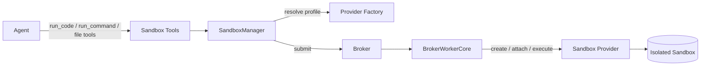

# Sandbox

Agent Kernel's **sandbox capability** gives agents a first-class, permission-bounded way to
**execute code and shell commands, work in a persistent workspace, and read/write files** in
an isolated environment. When enabled, agents automatically gain a set of sandbox tools and
the usage guidance is injected into their system prompt, so your agent code stays free of
sandbox mechanics.

## Overview



For a deeper look at the internals behind this diagram (class contracts, broker and worker
flows, session lifecycle, error hierarchy), see
[Architecture → Sandbox Internals](../architecture/sandbox-internals.md).

Key design points:

- **Self-describing.** With `sandbox.enabled: true`, Agent Kernel attaches the sandbox tools
  to agents and injects their usage into the system prompt. Your agent's own instructions
  never need to mention the sandbox.
- **Config-driven.** Everything — provider, isolation, lifetime, permissions, identity — is
  chosen in `config.yaml` through **workload profiles**. No code changes to switch backends.
- **Pluggable and honest.** Providers are selected by short name or a dotted path to your own
  `SandboxProvider` subclass. Each provider **declares the capabilities it actually supports**
  (isolation tier, shell, files, policy enforcement, user identity); Agent Kernel never
  pretends two backends are interchangeable on security grounds.
- **Fail closed.** A permission or identity requirement a provider cannot honor is **rejected**
  under `strict` mode, never silently downgraded.

:::caution No isolation with `local_subprocess`
The default demo provider, `local_subprocess`, runs code **directly on the host with no
isolation**. It is for development and testing only. Production deployments should use an
isolating provider such as `docker`.
:::

## Enabling the sandbox

Add a `sandbox` block to `config.yaml`. The minimal form uses the **single-backend sugar** —
set a `type` and its config block, and a `default` profile is synthesized for you:

```yaml
sandbox:
  enabled: true
  type: local_subprocess       # provider short name (or a dotted path to your own provider)
  local_subprocess: {}         # the provider's config block
  broker:
    flavor: thread             # local default; see Broker flavors
```

Everything is inert when `sandbox.enabled` is `false` (the default): no tools are attached, no
hooks run, and no provider dependencies are imported.

## Agent tools

When enabled, every in-scope agent gains eight tools. All return JSON strings; the execution and
file tools echo a `sandbox_session_id` (the session tools return session lists/ids and
`check_sandbox_task` its status). Machinery failures come back as `{"error": ...}` rather than
raising.

| Tool | Purpose |
|---|---|
| `run_code(code, language, sandbox_session_id, profile)` | Execute code; returns stdout, stderr, exit_code. |
| `run_command(command, sandbox_session_id, profile)` | Execute a shell command. |
| `write_sandbox_file(path, content, sandbox_session_id, profile)` | Write a UTF-8 text file into the workspace. |
| `read_sandbox_file(path, sandbox_session_id, profile)` | Read a UTF-8 text file (truncated to `tool_output_max_chars`). |
| `check_sandbox_task(task_id)` | Poll a long-running execution that returned `status: pending`. |
| `list_sandbox_sessions()` | List the sandbox sessions in the conversation (id, name, profile, status). |
| `new_sandbox_session(name, profile)` | Create a fresh, empty session; returns its `sandbox_session_id`. |
| `destroy_sandbox_session(sandbox_session_id)` | Destroy a session and its sandbox. |

`tool_output_max_chars` (default `8000`) bounds how much stdout/stderr or file content is
returned to the model.

### Restricting tools to specific agents

By default the tools attach to **all** agents. To limit them to named agents, set `agents`:

```yaml
sandbox:
  enabled: true
  agents: [coder, data_analyst]   # only these agents get the sandbox tools + prompt
  type: local_subprocess
  local_subprocess: {}
```

Omit `agents` for the current "all agents" behavior; an empty list attaches to none.

## Workload profiles

A **profile** bundles a provider, a lifetime (`scope`), a permission `policy`, and an
`identity` mode. Agents pick a profile per call via the `profile=` argument; the injected
guidance lists the configured profiles. Define them explicitly for multi-profile setups:

```yaml
sandbox:
  enabled: true
  default_profile: workspace
  profiles:
    workspace:                 # persistent, for multi-step work
      type: local_subprocess
      scope: per_session
      idle_timeout: 21600      # 6 hours
      local_subprocess: {}
    scratch:                   # throwaway, one sandbox per execution
      type: local_subprocess
      scope: per_call
      local_subprocess: {}
  broker:
    flavor: thread
```

### Scopes

| Scope | Lifetime | Use for |
|---|---|---|
| `per_session` (default) | One sandbox per AK session; workspace persists across turns. | Multi-step work, notebooks, iterative coding. |
| `per_call` | A fresh sandbox per execution, torn down immediately after. | One-off, stateless computations. |
| `per_runtime` | A single shared sandbox per profile, process-wide. | Shared warm environments (executions serialized; no pooling in v1). |

### Sessions

Each sandbox is addressed by a `sandbox_session_id`. State (files, workspace) persists per id:
the agent reuses the id from a previous result to continue in the same environment, or omits it
for the profile's default session. Session ids are **system-assigned** — the agent creates new
ones with `new_sandbox_session` (optionally naming them) and finds earlier ones with
`list_sandbox_sessions`, rather than inventing ids.

Sessions belonging to one AK session are namespace-isolated: they live in that session's
non-volatile cache, so one conversation can never address another's sandboxes. (`per_runtime`
is the deliberate exception — a single shared entry per profile in process memory.)

### Idle timeout and recreation notices

Every profile has an `idle_timeout` (default `1800` s). When a session is touched after being
idle past that window, its sandbox is reset (workspace discarded) and recreated under the same
id. The same recreation happens if a backend sandbox has vanished (self-heal). Either way the
reset is **surfaced to the agent** as a `notice` field on the result, and the injected guidance
tells the agent to relay it — so a wiped workspace is reported, never silently hidden.

## Policy and permissions

A profile's `policy` block is the permission and resource envelope for an execution:

```yaml
profiles:
  guarded:
    type: docker
    scope: per_session
    policy:
      network_egress: deny        # allow | deny | allowlist
      network_allow: []           # domains/CIDRs when egress is 'allowlist'
      fs_allow_read: []           # filesystem paths readable (empty = provider default)
      fs_allow_write: []          # filesystem paths writable
      cpu: 1.0                    # CPU cores
      memory_mb: 512              # memory limit (MB)
      timeout: 30.0               # per-execution wall-clock seconds (always enforced)
      strict: true                # fail closed on unenforceable dimensions
    docker:
      image: python:3.12-slim
```

**Enforcement is per-provider, and unenforceable is not the same as ignored.** Each provider
declares which policy dimensions it can enforce. When a profile sets a non-default dimension
the provider cannot enforce:

- `strict: true` (default) → the execution is **rejected** with a policy error. Security is
  never silently downgraded.
- `strict: false` → it proceeds, with a one-time warning naming the unenforced dimensions.

`timeout` is always enforceable (framework-side), so it never triggers a strict rejection.

## Identity

Sandboxed code can run under the **agent's** identity or the **invoking user's** identity. Two
settings drive this:

- `profile.identity.mode` — `agent` (default) or `user`.
- `sandbox.principal_resolver` — a dotted path to a `PrincipalResolver` that maps the current
  session/agent to a `SandboxPrincipal`. Omitted → the built-in `AgentPrincipalResolver` (the
  agent's own identity).

```yaml
sandbox:
  enabled: true
  principal_resolver: myapp.identity.SessionUserPrincipalResolver
  profiles:
    secure:
      type: myapp.providers.MyIdentityProvider   # a provider that declares principal_user=True
      identity:
        mode: user
```

The shipped `local_subprocess` and `docker` providers declare `principal_user=False`, so
`identity.mode: user` needs a bring-your-own provider (dotted path) or a planned cloud provider
(kubernetes via impersonation, bedrock_agentcore / ec2_ssm via `sts:AssumeRole`).

The resolver runs agent-side (it has the session in context); the resolved principal travels
in the broker request and is enforced provider-side where the credentials live. **Fail-closed
rule:** a `user`-mode profile requires both a provider that supports user identity and a
resolver that actually returned a user-mode principal — otherwise the execution is rejected. A
user-scoped request can never silently fall back to the agent identity.

See the [end-to-end identity example](https://github.com/yaalalabs/agent-kernel/tree/develop/examples/sandbox/identity)
for a REST app that authenticates each request and runs code under the caller's identity.

## Providers

Providers are selected per profile by `type`. Each declares an honest **isolation tier** so you
know the boundary you are getting:

| Tier | Boundary |
|---|---|
| `none` | No isolation boundary (host process). |
| `os_policy` | OS-level confinement (seccomp/Seatbelt/bubblewrap). |
| `container` | Shared-kernel namespaces (containers). |
| `syscall_filter` | User-space kernel (gVisor-style). |
| `micro_vm` | Firecracker / managed micro-VM. |
| `wasm` | In-process WebAssembly runtime. |

Providers available today:

| Provider | Extra | Isolation | Notes |
|---|---|---|---|
| `local_subprocess` | — (stdlib) | `none` | Runs on the host. Dev/test only. Shell + files + `python`/`bash`. |
| `docker` | `sandbox-docker` | `container` | Container per sandbox (`sleep infinity`); files via archives; `pip install`. Maps `deny`→`network_mode: none`, cpu/memory→limits, fs→read-only rootfs + writable workdir. Requires a Docker daemon. |

Additional providers (`e2b`, `daytona`, `kubernetes`, `bedrock_agentcore`, `ec2_ssm`) and the
AWS `sqs` broker for queue-based deployments are planned in later iterations.

### `docker` setup

```bash
pip install "agentkernel[sandbox-docker]"
```

```yaml
sandbox:
  enabled: true
  type: docker
  docker:
    image: python:3.12-slim     # any image with python
  broker:
    flavor: thread
```

### Bring your own provider

Any dotted path to a `SandboxProvider` subclass works as a `type`, so you can plug in a backend
Agent Kernel doesn't ship:

```yaml
profiles:
  custom:
    type: mypackage.providers.MyProvider   # your SandboxProvider subclass
    scope: per_session
    params:                                 # validated by your provider's config_model, if any
      endpoint: https://sandboxes.internal
```

Subclass `SandboxProvider` (and `Sandbox`), declare `capabilities`, and implement `create` and
`destroy` (plus `attach` when you declare `capabilities.attach`, and the operations your
capabilities advertise). The reusable `SandboxProviderContract` test suite (in
`agentkernel.sandbox.testing`) asserts the ABC semantics your provider must honor.

## Broker flavors

The **broker** decouples the agent from execution. It is chosen with `sandbox.broker.flavor`:

| Flavor | Where it runs | Use for |
|---|---|---|
| `thread` (default) | A dedicated daemon thread + event loop in the agent process. | CLI and REST deployments. |
| `embedded` | Inline in the caller's event loop (always synchronous). | Simple/co-located execution and tests. |

`wait_timeout` (default `60` s) bounds how long a synchronous call waits before the execution is
**promoted** to a background task (thread flavor): `run_code`/`run_command` then return
`{"status": "pending", "task_id": ...}`, and the agent polls with `check_sandbox_task`.
`wait_timeout: 0` always promotes. The `embedded` flavor is always synchronous and never
promotes, so `wait_timeout` does not apply to it.

The AWS `sqs` broker (a remote worker plane with queue-based delivery for serverless/queue-mode
deployments) is planned in a later iteration.

## Configuration reference

The `sandbox` block, with defaults:

```yaml
sandbox:
  enabled: false                 # master switch
  agents: null                   # list of agent names to attach to; null = all agents
  default_profile: default       # profile used when a call omits profile=
  principal_resolver: null       # dotted path to a PrincipalResolver; null = AgentPrincipalResolver
  tool_output_max_chars: 8000    # truncation limit for tool output

  broker:
    flavor: thread               # thread | embedded | (sqs, planned) | dotted path
    wait_timeout: 60.0           # seconds before a sync wait promotes to a task (0 = always promote)

  profiles:                      # named workload profiles
    <name>:
      type: local_subprocess     # provider short name or dotted path (required)
      scope: per_session         # per_call | per_session | per_runtime
      idle_timeout: 1800         # seconds of inactivity before reset-on-touch
      identity:
        mode: agent              # agent | user
      policy:
        network_egress: allow    # allow | deny | allowlist
        network_allow: []
        fs_allow_read: []
        fs_allow_write: []
        cpu: null                # CPU cores
        memory_mb: null          # memory limit (MB)
        timeout: 120.0           # per-execution wall-clock seconds
        strict: true             # fail closed on unenforceable policy
      params: {}                 # passed to a dotted-path (BYO) provider
      # ...one provider config block matching `type`, e.g.:
      local_subprocess:
        workdir: null            # base dir for per-sandbox working dirs; null = system temp
      docker:
        image: python:3.12-slim
        runtime: docker
        attach_to: null          # existing container id to attach to (mode 3)

  # Single-backend sugar (used only when `profiles` is empty): synthesizes profiles[default_profile]
  type: null                     # provider short name or dotted path
  scope: null                    # scope for the synthesized profile
  local_subprocess: null         # (and the other provider config blocks)
```

All fields are overridable by environment variables with the `AK_` prefix and `__` nesting,
e.g. `AK_SANDBOX__ENABLED=true`, `AK_SANDBOX__BROKER__FLAVOR=embedded`,
`AK_SANDBOX__TOOL_OUTPUT_MAX_CHARS=4000`.

## Examples

- [`sandbox/basic`](https://github.com/yaalalabs/agent-kernel/tree/develop/examples/sandbox/basic) — enable the sandbox, run code, persist a workspace, manage named sessions.
- [`sandbox/profiles`](https://github.com/yaalalabs/agent-kernel/tree/develop/examples/sandbox/profiles) — multiple profiles with different scopes; the agent routes per call.
- [`sandbox/policy`](https://github.com/yaalalabs/agent-kernel/tree/develop/examples/sandbox/policy) — policy/permissions on the docker provider: an enforced envelope plus the fail-closed `strict` model for what docker cannot enforce.
- [`sandbox/docker`](https://github.com/yaalalabs/agent-kernel/tree/develop/examples/sandbox/docker) — the `docker` provider: container-isolated execution with policy actually enforced (`network_egress: deny` → no network).
- [`sandbox/identity`](https://github.com/yaalalabs/agent-kernel/tree/develop/examples/sandbox/identity) — a REST app running sandboxed code under the authenticated end user's identity, end-to-end.
