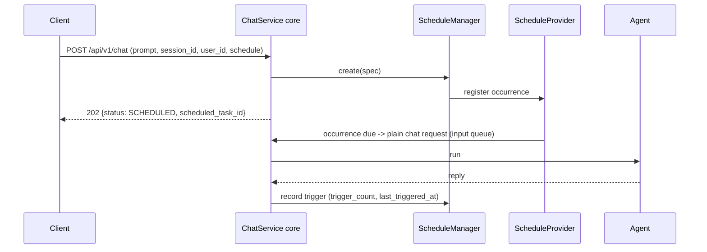

# Scheduling

Agent Kernel supports **deferred and recurring chat execution**: a chat request that carries a
`schedule` block is not run immediately — it is registered as a scheduled task and acknowledged
with HTTP 202. When an occurrence is due, the configured provider delivers the stored prompt back
into the input queue as a plain chat request, and the normal execution path runs it.

## Overview



### Key Design Decisions

- **A `schedule` block in `config.yaml` is what enables the capability.** Its presence is the
  enabled-check (the same pattern conversation threads use) — no block, no interception, no tools.
- **Two backends, chosen independently**: a **provider** that owns the timers and delivers
  occurrences, and a **store** that persists the task records. Today only `local` (an in-process
  scheduler thread) and `in_memory` are built in; `eventbridge`, `redis`, `valkey`, and `dynamodb`
  are planned.
- **The `local` provider and `in_memory` store are single-process only.** `ScheduleManager` fails
  fast at startup if either is combined with a broker transport (`sqs`/`kafka`/`nats`) or a shared
  store — on a broker transport, the management routes (`IOHandler` process) would amend timers a
  different process (the agent runner) actually owns.
- **Creation has exactly three paths**, all sharing the same validation: the chat API's `schedule`
  block, the agent's own `create_schedule` tool, and any bring-your-own caller of
  `ScheduleManager.create`. There is deliberately **no POST** on the management REST API.
- **`PUT` is full-replacement**, not a merge: an amendment naming any of `at`/`cron`/`timezone`/
  `session_mode` rebuilds the whole occurrence rule from what it carries (omitted fields fall back
  to their defaults, never to the stored values). An amendment naming none of them leaves the rule
  untouched, which is how a prompt-only or pause/resume amendment works.
- **Optional, pluggable authorization**: you supply an `Authoriser` that validates a ****** against
  *your* authentication provider; without one, the management routes are open.

## Enabling Scheduling

Add a `schedule` block to `config.yaml` — a bare block is enough for local development:

```yaml
schedule:
  provider:
    type: local           # local (the only built-in today), or a dotted path to a ScheduleProvider
  store:
    type: in_memory        # in_memory (the only built-in today), or a dotted path to a ScheduleStore
  agents: [planner]        # optional: agents the schedule tools attach to (omitted = all agents)
```

This alone deferring chats via the chat API's `schedule` block and gives every scoped agent the
five scheduling tools. To also expose the management REST API, mount
`ScheduleRESTRequestHandler` alongside your app's other handlers:

```python
from agentkernel.pipeline import IOHandler
from agentkernel.schedule import ScheduleRESTRequestHandler

IOHandler.run(handlers=[ScheduleRESTRequestHandler()])
```

or, with the full REST API:

```python
from agentkernel.api import RESTAPI
from agentkernel.schedule import ScheduleRESTRequestHandler

RESTAPI.run(handlers=[ScheduleRESTRequestHandler()])
```

## Deferring a Chat Request

Send a `schedule` block on a normal chat request instead of running it immediately. Exactly one of
`at` or `cron` is required:

```bash
# One-time — `at` is a local wall-clock timestamp read in `timezone`, and must be in the future
curl -i -X POST http://localhost:8000/api/v1/chat \
  -H "Content-Type: application/json" \
  -d '{"prompt": "Send me the daily summary", "session_id": "ses-1", "user_id": "alice",
       "schedule": {"at": "2030-01-31T09:00:00", "timezone": "Asia/Colombo"}}'

# Recurring — `cron` is a standard 5-field expression
curl -i -X POST http://localhost:8000/api/v1/chat \
  -H "Content-Type: application/json" \
  -d '{"prompt": "Send the weekly report", "session_id": "ses-2", "user_id": "alice",
       "schedule": {"cron": "0 9 * * 1", "timezone": "Asia/Colombo", "session_mode": "new"}}'
```

The acknowledgement comes back as **202**, not 200 — the request was accepted, not executed:

```json
{"result":"{\"status\": \"SCHEDULED\", \"scheduled_task_id\": \"74ca19a5-e610-4e39-8264-541ec6ab5352\", \"session_id\": \"ses-1\"}","session_id":"ses-1"}
```

| Field | Required | Description |
|---|---|---|
| `at` | one of `at`/`cron` | ISO-8601 local timestamp, must be in the future |
| `cron` | one of `at`/`cron` | Standard 5-field cron expression |
| `timezone` | no (default UTC) | IANA timezone `at`/`cron` are interpreted in |
| `session_mode` | no (default `reuse`) | `reuse` continues the originating `session_id` on every occurrence; `new` runs each occurrence in its own fresh session |

An unusable schedule is rejected at creation rather than at fire time (a past `at`, an
unparseable `cron`, or an unregistered named agent all return 400).

## Agent-Facing Tools

When a `schedule` block is present, `SystemToolFactory` attaches five tools to every scoped agent
(`schedule.agents`, or all agents if omitted) — the agent's own instructions need not mention
scheduling, the guidance is injected into its system prompt automatically:

- `create_schedule` — register a new scheduled task
- `list_schedules` — list the acting user's scheduled tasks
- `get_schedule` — read one scheduled task
- `update_schedule` — full-replacement amendment (matches the `PUT` route)
- `delete_schedule` — cancel a scheduled task

Every tool acts as the **acting user** — an agent can never reach another user's schedules, and a
run with no user identity gets an error result rather than an anonymous create:

```bash
curl -X POST http://localhost:8000/api/v1/chat \
  -H "Content-Type: application/json" \
  -d '{"prompt": "Every weekday at 8am in Asia/Colombo, remind me to review the overnight alerts.",
       "session_id": "ses-3", "user_id": "alice"}'
```

## Managing Schedules

With `ScheduleRESTRequestHandler` mounted:

```bash
# List a user's schedules (most recently updated first, cursor-paginated)
curl "http://localhost:8000/api/v1/schedules?user_id=alice"

# Read one schedule
curl http://localhost:8000/api/v1/schedules/{task_id}

# Amend a schedule — PUT replaces the full amendable state, so send every value
curl -X PUT http://localhost:8000/api/v1/schedules/{task_id} \
  -H "Content-Type: application/json" \
  -d '{"prompt": "Send the weekly report", "cron": "0 8 * * 1", "timezone": "Asia/Colombo",
       "session_mode": "new", "status": "paused"}'

# Cancel a schedule — the record survives as the audit trail
curl -X DELETE http://localhost:8000/api/v1/schedules/{task_id}
```

`trigger_count`, `last_triggered_at`, and `last_request_id` on the returned task track its
occurrences, so a fired one-time task reads back as `"status": "completed"` with
`"trigger_count": 1`.

## Authorization

Scheduling routes are **open** until you supply an `Authoriser`:

```python
from typing import Optional
from agentkernel.api import RESTAPI
from agentkernel.auth import Authoriser
from agentkernel.schedule import ScheduleRESTRequestHandler


class MyAuthoriser(Authoriser):
    def authorise(self, token: str) -> Optional[str]:
        return my_auth_provider.resolve(token)


RESTAPI.run(handlers=[ScheduleRESTRequestHandler(authoriser=MyAuthoriser())])
```

With an `Authoriser` configured, listings are forced to the resolved user and the single-task
routes enforce ownership (403 on another user's schedule). Without one, the routes are open.

:::caution Open until configured
Without an `Authoriser`, any caller can list, read, amend, or cancel any schedule. Deploy behind
network-level access controls until one is configured.
:::

## Backends

```yaml
schedule:
  provider:
    type: local             # only built-in provider today; eventbridge is planned
  store:
    type: in_memory          # only built-in store today; redis, valkey, dynamodb are planned
  agents: [planner]          # optional: omitted = all agents
```

Store backends default to `ttl: 0` (unlike threads: a schedule must not silently expire) and the
Redis/Valkey key prefix is `ak:schedule:`. Any short name other than `local`/`in_memory` raises
`AKConfigError` today, since the alternative backends' config blocks are declared but inert.

:::note Env-var enablement
The same failure mode threads have applies here: any `AK_SCHEDULE__*` environment variable
materializes the `schedule` block and enables the capability with its default (`local`/
`in_memory`) backends.
:::

## Examples

- [`examples/api/schedule-openai`](https://github.com/yaalalabs/agent-kernel/tree/develop/examples/api/schedule-openai): one-time and recurring chat deferral, the management REST API, and agent-driven scheduling
