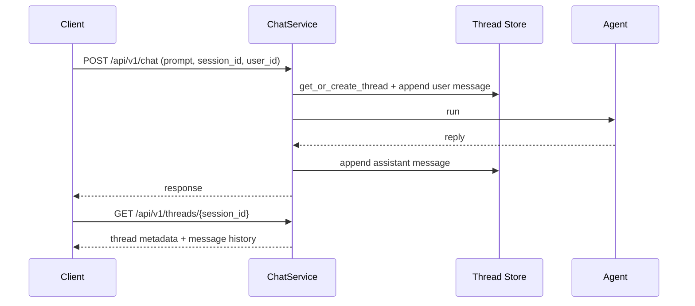

# Conversation Threads

Agent Kernel supports **persistent, named conversation threads** — every chat exchange is recorded against its
`session_id` and becomes readable over REST, so UIs can show a user's conversation list and full history across
restarts and devices.

## Overview



### Key Design Decisions

- **A thread is keyed by `session_id`** — no separate thread id. The thread is auto-created on a session's
  first chat request; every later request with the same `session_id` appends to it.
- **`user_id` becomes required** on every chat request once threads are enabled; requests without it are
  rejected with 400.
- **Pluggable storage** — in-memory, Redis, DynamoDB, Firestore, or Cosmos DB.
- **Optional, pluggable authorization** — you supply an `Authoriser` that validates a Bearer token against
  *your* authentication provider; Agent Kernel never authenticates users itself.
- **Streaming included** — with `execution.mode: stream`, the user message is recorded before the stream
  starts and the assistant message is assembled from the streamed deltas on completion.

:::caution Platform scope
Do not enable Conversation Thread Support for agents deployed on platforms with native thread management
(Slack, Microsoft Teams). Those platforms own the conversation history; AK threads alongside them would create
duplicate, divergent state.
:::

## Enabling Thread Support

Add a `thread` block to `config.yaml` — its presence turns the feature on:

```yaml
thread:
  type: memory        # memory | redis | dynamodb | firestore | cosmosdb
```

## Chat Request Fields

| Field | Required | Applied | Description |
|---|---|---|---|
| `session_id` | yes | every request | Identifies the thread |
| `user_id` | yes (once threads are enabled) | at creation | Owning user; also enables user-scoped listing |
| `group_id` | no | at creation only | Caller-defined group/project scope for listing |
| `thread_name` | no | at creation only | Display name; when absent, the name is auto-derived from the first prompt (first 80 characters, trimmed at a word boundary) |

```bash
curl -X POST http://localhost:8000/api/v1/chat \
  -H "Content-Type: application/json" \
  -d '{"prompt": "What is the capital of France?", "session_id": "ses-1", "user_id": "alice", "thread_name": "Capitals quiz"}'
```

## Reading Threads

Two read endpoints are mounted automatically when threads are enabled:

```bash
# List threads (metadata only), filtered by user and/or group
curl "http://localhost:8000/api/v1/threads?user_id=alice"

# Get one thread with its message history
curl "http://localhost:8000/api/v1/threads/ses-1"
```

Both endpoints paginate: pass `limit` (default 50, max 200) and the opaque `cursor` returned as `next_cursor`
in the previous page (`null` on the last page).

## Authorization

Thread routes are **open** until you supply an `Authoriser` — a small base class you subclass to validate the
Bearer token against your own authentication provider and resolve the caller's `user_id`:

```python
from typing import Optional
from agentkernel.api import RESTAPI, AgentRESTRequestHandler, ThreadRESTRequestHandler
from agentkernel.core.thread import Authoriser


class MyAuthoriser(Authoriser):
    def authorise(self, token: str) -> Optional[str]:
        # Validate the token with your auth provider (JWT, introspection, API key lookup, ...)
        # Return the resolved user_id, or None to reject.
        return my_auth_provider.resolve(token)


RESTAPI.run(handlers=[AgentRESTRequestHandler(), ThreadRESTRequestHandler(authoriser=MyAuthoriser())])
```

With an `Authoriser` configured:

- Requests must carry `Authorization: Bearer <token>` — missing/malformed headers and rejected tokens get 401.
- Listings are always scoped to the authorised user.
- Reading another user's thread returns 403.

:::caution Open until configured
Without an `Authoriser`, any caller who knows a `session_id` can read its thread. Deploy behind network-level
access controls until one is configured.
:::

## Storage Backends

```yaml
# Redis
thread:
  type: redis
  redis:
    url: "redis://localhost:6379"
    prefix: "ak:thread:"
    ttl: 2592000                   # seconds; 0 disables expiry

# DynamoDB — table needs partition key `session_id` (S) and sort key `sk` (S)
thread:
  type: dynamodb
  dynamodb:
    table_name: "ak-agent-threads"
    ttl: 2592000                   # item TTL in seconds; 0 disables

# Firestore
thread:
  type: firestore
  firestore:
    collection_name: "ak-agent-threads"
    project_id: "my-gcp-project"   # optional — inferred from ADC when omitted
    database_id: "(default)"       # optional
    ttl: 2592000                   # seconds; 0 disables

# Cosmos DB (Table API, partitioned by session_id — no TTL support)
thread:
  type: cosmosdb
  cosmosdb:
    connection_string: "..."
    table_name: "akagentthreads"
```

## Attachments in Thread Mode

Attachment support is still decided by `multimodal.enabled` — the `thread` block alone is text-only:

- **`thread` only**: requests carrying images/files are rejected with 400.
- **`thread` + `multimodal.enabled: true`**: attachment bytes are saved to the multimodal attachment store and
  each thread message keeps only an `attachment_id` reference. Use a shared attachment store (`in_memory`,
  `redis`, or `dynamodb`) — `storage_type: session_cache` is rejected in thread mode.

```yaml
multimodal:
  enabled: true
  storage_type: in_memory

thread:
  type: memory
```

## Examples

- [`examples/api/thread-openai`](https://github.com/yaalalabs/agent-kernel/tree/develop/examples/api/thread-openai) — text-only threads with a demo `Authoriser`
- [`examples/api/multimodal/thread-openai`](https://github.com/yaalalabs/agent-kernel/tree/develop/examples/api/multimodal/thread-openai) — threads with image/file attachments
