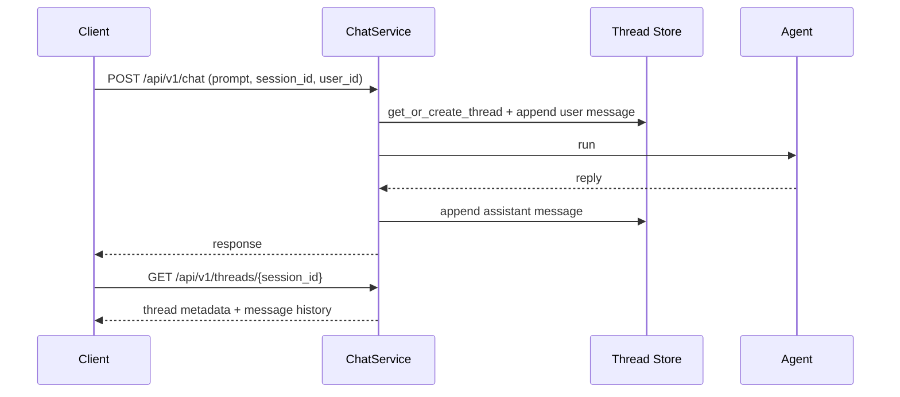

# Conversation Threads

Agent Kernel supports **persistent, named conversation threads**: every chat exchange is recorded against its
`session_id` and becomes readable over REST, so UIs can show a user's conversation list and full history across
restarts and devices.

## Overview



### Key Design Decisions

- **A thread is keyed by `session_id`**, with no separate thread id. The thread is auto-created on a session's
  first chat request; every later request with the same `session_id` appends to it.
- **`user_id` becomes required** on every chat request once threads are enabled; requests without it are
  rejected with 400.
- **Pluggable storage**: in-memory, Redis, DynamoDB, Firestore, or Cosmos DB.
- **Optional, pluggable authorization**: you supply an `Authoriser` that validates a Bearer token against
  *your* authentication provider; Agent Kernel never authenticates users itself.
- **Streaming included**: with `execution.mode: stream`, the user message is recorded before the stream
  starts and the assistant message is assembled from the streamed deltas on completion.

:::caution Platform scope
Do not enable Conversation Thread Support for agents deployed on platforms with native thread management
(Slack, Microsoft Teams). Those platforms own the conversation history; AK threads alongside them would create
duplicate, divergent state.
:::

## Enabling Thread Support

Add a `thread` block to `config.yaml`; its presence turns the feature on:

```yaml
thread:
  type: memory        # memory | redis | valkey | dynamodb | firestore | cosmosdb
```

## Chat Request Fields

| Field | Required | Applied | Description |
|---|---|---|---|
| `session_id` | yes | every request | Identifies the thread |
| `user_id` | yes (once threads are enabled) | at creation | Owning user; also enables user-scoped listing |
| `group_id` | no | at creation only | Caller-defined group/project scope for listing |
| `thread_name` | no | any request | Sets (at creation) or renames (afterwards) the display name and locks it against automatic naming; blank values are ignored. When absent at creation, the name comes from the naming strategy (see below) |

```bash
curl -X POST http://localhost:8000/api/v1/chat \
  -H "Content-Type: application/json" \
  -d '{"prompt": "What is the capital of France?", "session_id": "ses-1", "user_id": "alice", "thread_name": "Capitals quiz"}'
```

## Thread Naming

When a thread is created without a `thread_name`, its display name is generated by the active
**`ThreadNamingStrategy`**. The built-in default makes a single LiteLLM call at thread creation (model
from `thread.naming.model`, default `gpt-4o-mini`; API keys are read from the environment) asking for a
concise title of at most `thread.naming.max_length` characters. Gibberish or meaningless first prompts
get a generic title ("New conversation") instead of becoming the name. The call happens once per thread,
inline on the session's first chat request (~0.5–2s), never on later messages.

Naming never fails thread creation: if `litellm` is not installed (it is an optional dependency; install
it with the `thread` extra, `pip install "agentkernel[thread]"`), no API key is present, or the model call
errors, the name falls back to a truncated prompt prefix: the first `max_length` characters, trimmed at a
word boundary and suffixed with an ellipsis. The fallback is never silent: a missing `litellm` is warned
about once at startup with the install hint, and every failed naming call logs a warning.

```yaml
thread:
  type: memory
  naming:
    model: gpt-4o-mini  # LiteLLM model used to generate thread names
    max_length: 80      # max auto-generated name length
```

Override the strategy by subclassing and registering your subclass once at startup. Override
`build_instruction` to keep the built-in LLM call with your own prompt, or override `generate_name` for
any other logic (optionally calling `self._complete(instruction)` to reuse the LLM call machinery):

```python
from agentkernel.core.thread import ConversationThreadManager, ThreadNamingStrategy


class MyNaming(ThreadNamingStrategy):
    def build_instruction(self, prompt: str) -> str:
        return f"Reply with a three-word title for a conversation starting with: {prompt}"


ConversationThreadManager.set_naming_strategy(MyNaming())
```

Threads whose name was explicitly supplied (a `thread_name` on any chat request) are marked
`name_locked: true` in their metadata and are never renamed automatically. No naming call is made for them.

## Reading Threads

Two read endpoints are mounted automatically when threads are enabled:

```bash
# List threads (metadata only), filtered by user and/or group
curl "http://localhost:8000/api/v1/threads?user_id=alice"

# Get one thread with its message history
curl "http://localhost:8000/api/v1/threads/ses-1"
```

Both endpoints paginate: pass `limit` (default 50, max 200) and the opaque `cursor` returned as `next_cursor`
in the previous page (`null` on the last page).

## Renaming Threads

There is no dedicated rename endpoint. Send `thread_name` on any later chat request for the same
`session_id` to rename its thread. Only the name changes (every other thread field is fixed at creation),
the thread is marked `name_locked: true`, and blank names are ignored. Resending the same `thread_name` on
every request is cheap: the name is only written when it actually changes.

```bash
curl -X POST http://localhost:8000/api/v1/chat \
  -H "Content-Type: application/json" \
  -d '{"prompt": "And of Italy?", "session_id": "ses-1", "user_id": "alice", "thread_name": "European capitals"}'
```

## Authorization

Thread routes are **open** until you supply an `Authoriser`, a small base class you subclass to validate the
Bearer token against your own authentication provider and resolve the caller's `user_id`:

```python
from typing import Optional
from agentkernel.api import RESTAPI, AgentRESTRequestHandler, ThreadRESTRequestHandler
from agentkernel.core.thread import Authoriser


class MyAuthoriser(Authoriser):
    def authorise(self, token: str) -> Optional[str]:
        # Validate the token with your auth provider (JWT, introspection, API key lookup, ...)
        # Return the resolved user_id, or None to reject.
        return my_auth_provider.resolve(token)


RESTAPI.run(handlers=[AgentRESTRequestHandler(), ThreadRESTRequestHandler(authoriser=MyAuthoriser())])
```

With an `Authoriser` configured:

- Requests must carry `Authorization: Bearer <token>`; missing/malformed headers and rejected tokens get 401.
- Listings are always scoped to the authorised user.
- Reading another user's thread returns 403. (Renaming flows through the chat request and rides its trust
  model: whoever can chat on a `session_id` can rename its thread.)

:::caution Open until configured
Without an `Authoriser`, any caller who knows a `session_id` can read its thread. Deploy behind network-level
access controls until one is configured.
:::

## Storage Backends

```yaml
# Redis
thread:
  type: redis
  redis:
    url: "redis://localhost:6379"
    prefix: "ak:thread:"
    ttl: 2592000                   # seconds; 0 disables expiry

# Valkey (Redis-protocol compatible; requires the `valkey` extra)
thread:
  type: valkey
  valkey:
    url: "valkey://localhost:6379"
    prefix: "ak:thread:"
    ttl: 2592000                   # seconds; 0 disables expiry

# DynamoDB - table needs partition key `session_id` (S) and sort key `sk` (S)
thread:
  type: dynamodb
  dynamodb:
    table_name: "ak-agent-threads"
    ttl: 2592000                   # item TTL in seconds; 0 disables

# Firestore
thread:
  type: firestore
  firestore:
    collection_name: "ak-agent-threads"
    project_id: "my-gcp-project"   # optional, inferred from ADC when omitted
    database_id: "(default)"       # optional
    ttl: 2592000                   # seconds; 0 disables

# Cosmos DB (Table API, partitioned by session_id, no TTL support)
thread:
  type: cosmosdb
  cosmosdb:
    connection_string: "..."
    table_name: "akagentthreads"
```

## Deploying the Thread Store

On AWS and GCP the thread store is provisioned by Terraform and enabled by **environment variables**, so a
deployed stack needs no committed `thread:` block at all:

| Cloud | Flag | Provisions |
|---|---|---|
| AWS serverless + containerized | `create_dynamodb_thread_table` | A DynamoDB table (partition `session_id`, sort `sk`, TTL on `expiry_time`, no GSI) |
| GCP serverless + containerized | `create_firestore_thread_collection` | Nothing new — reuses the database from `create_firestore_database`; the collection is created on first write |

:::warning AK_THREAD__TYPE must be set alongside the connection variables
Thread is the one `AK_*` store where Terraform injects the **type** as well as the connection detail.
Session can rely on `session: {type: dynamodb}` in the committed `config.yaml`; thread is
deployment-toggled, so there is no declared type to fall back on. If `AK_THREAD__DYNAMODB__TABLE_NAME`
is set without `AK_THREAD__TYPE=dynamodb`, the feature still switches on but `thread.type` falls back to
its `memory` default — threads run in-memory and are lost on every cold start, with no error. The
built-in Terraform flags always inject both; wire both if you set these by hand.
:::

Redis/Valkey thread storage has no Terraform flag: point `AK_THREAD__TYPE=redis|valkey` plus the URL at
whatever cluster `create_redis_cluster`/`create_valkey_cluster` already provisions, via the generic
`environment_variables` passthrough.

## Attachments in Thread Mode

Attachment support is still decided by `multimodal.enabled`; the `thread` block alone is text-only:

- **`thread` only**: requests carrying images/files are rejected with 400.
- **`thread` + `multimodal.enabled: true`**: attachment bytes are saved to the multimodal attachment store and
  each thread message keeps only an `attachment_id` reference. Use a shared attachment store (`in_memory`,
  `redis`, or `dynamodb`); `storage_type: session_cache` is rejected in thread mode.

```yaml
multimodal:
  enabled: true
  storage_type: in_memory

thread:
  type: memory
```

## Examples

- [`examples/api/thread-openai`](https://github.com/yaalalabs/agent-kernel/tree/develop/examples/api/thread-openai): text-only threads with a demo `Authoriser`
- [`examples/api/multimodal/thread-openai`](https://github.com/yaalalabs/agent-kernel/tree/develop/examples/api/multimodal/thread-openai): threads with image/file attachments
