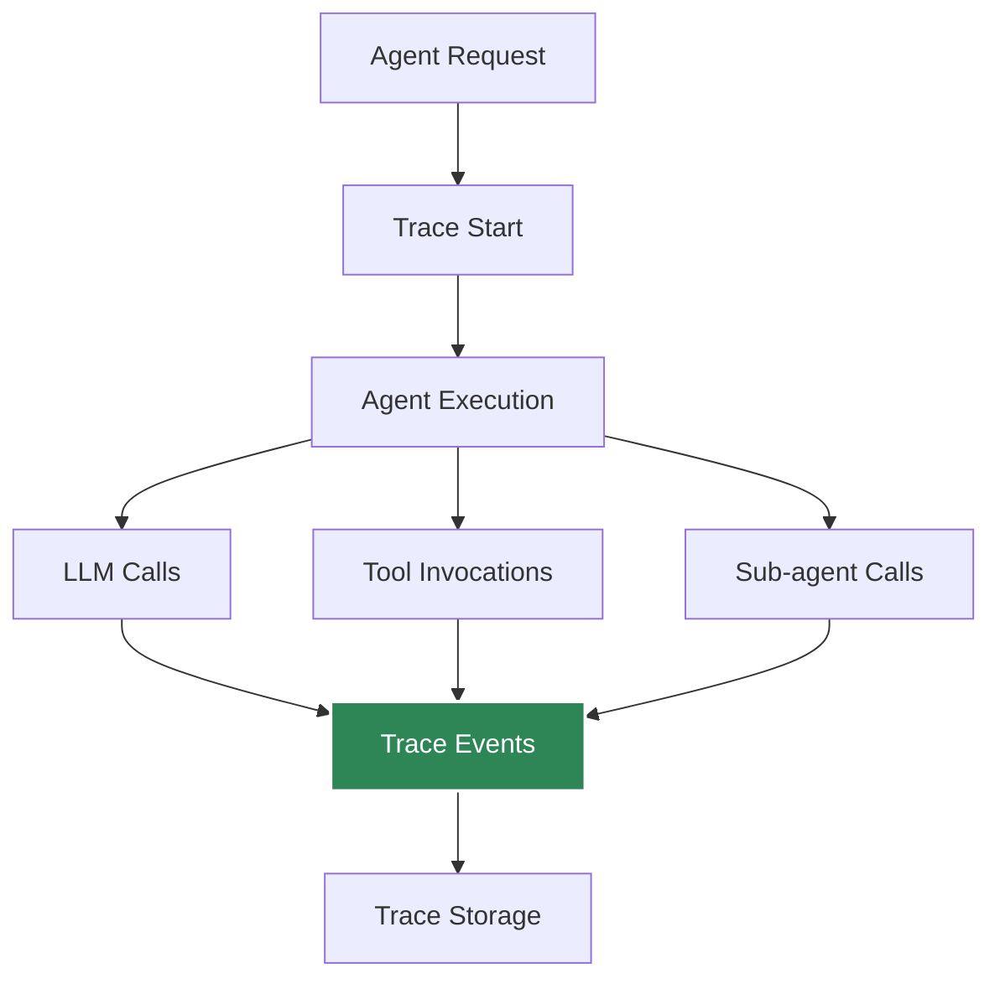

# Traceability

Available soon!

Track and audit all agent operations for debugging and compliance. 

## Overview

Agent Kernel provides comprehensive traceability across all agent operations.

```mermaid
graph TB
    A[Agent Request] --> B[Trace Start]
    B --> C[Agent Execution]
    C --> D[LLM Calls]
    C --> E[Tool Invocations]
    C --> F[Sub-agent Calls]
    D --> G[Trace Events]
    E --> G
    F --> G
    G --> H[Trace Storage]
    
    style G fill:#2e8555,stroke:#fff,stroke-width:2px,color:#fff
```

