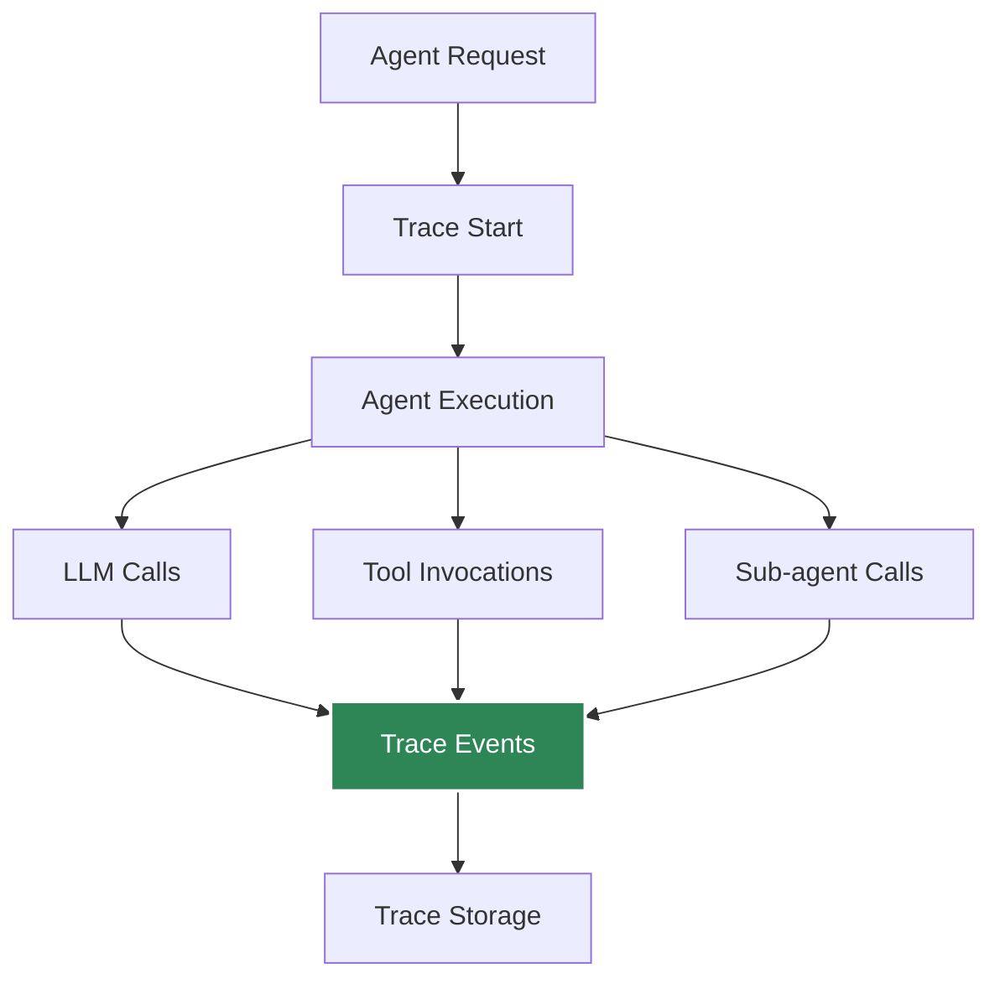

# Traceability

Track and audit all agent operations for debugging and compliance.

## Overview

Agent Kernel provides comprehensive traceability across all agent operations.



## Enabling Tracing

```bash
export AK_TRACING_ENABLED=true
export AK_TRACING_LEVEL=INFO  # DEBUG, INFO, WARNING
```

Or programmatically:

```python
from agentkernel.core import Runtime

runtime = Runtime.get()
runtime.enable_tracing(level="INFO")
```

## Trace Levels

### DEBUG
Captures everything:
- All LLM calls with prompts and responses
- Tool invocations with parameters
- Agent state changes
- Session updates
- Performance metrics

### INFO
Captures key events:
- Agent executions
- LLM calls (summary)
- Tool invocations (summary)
- Errors and warnings

### WARNING
Captures only issues:
- Errors
- Warnings
- Failed operations

## Trace Data

Each trace includes:

```json
{
  "trace_id": "abc-123",
  "timestamp": "2025-10-16T10:30:00Z",
  "agent": "assistant",
  "session_id": "user-123",
  "user_context": {
    "user_id": "user-123",
    "roles": ["user"]
  },
  "events": [
    {
      "type": "agent_start",
      "timestamp": "2025-10-16T10:30:00.100Z",
      "agent": "assistant"
    },
    {
      "type": "llm_call",
      "timestamp": "2025-10-16T10:30:00.500Z",
      "model": "gpt-4",
      "prompt_tokens": 150,
      "completion_tokens": 80,
      "duration_ms": 1200
    },
    {
      "type": "tool_invocation",
      "timestamp": "2025-10-16T10:30:01.800Z",
      "tool": "search_database",
      "parameters": {"query": "python"},
      "result": "Found 42 results",
      "duration_ms": 250
    },
    {
      "type": "agent_complete",
      "timestamp": "2025-10-16T10:30:02.000Z",
      "total_duration_ms": 1900
    }
  ]
}
```

## Viewing Traces

### CLI

```bash
ak-trace view --trace-id abc-123
```

### API

```http
GET /traces/abc-123
```

### Dashboard

Access trace dashboard:

```bash
ak-trace dashboard --port 8080
```

## Trace Storage

### CloudWatch (AWS)

```bash
export AK_TRACING_BACKEND=cloudwatch
export AK_CLOUDWATCH_LOG_GROUP=/agentkernel/traces
```

### File-based

```bash
export AK_TRACING_BACKEND=file
export AK_TRACE_FILE=traces.jsonl
```

### Custom Backend

```python
from agentkernel.core import TraceBackend

class CustomTraceBackend(TraceBackend):
    def write_trace(self, trace_data: dict):
        # Your implementation
        pass

runtime = Runtime.get()
runtime.set_trace_backend(CustomTraceBackend())
```

## Trace Analysis

### Performance Analysis

```python
from agentkernel.trace import TraceAnalyzer

analyzer = TraceAnalyzer("traces.jsonl")

# Analyze performance
stats = analyzer.performance_stats()
print(f"Avg response time: {stats['avg_duration_ms']}ms")
print(f"95th percentile: {stats['p95_duration_ms']}ms")

# Find slow operations
slow_traces = analyzer.find_slow_traces(threshold_ms=5000)
for trace in slow_traces:
    print(f"Trace {trace['trace_id']}: {trace['duration_ms']}ms")
```

### Cost Analysis

```python
# Analyze LLM costs
cost_report = analyzer.cost_analysis()
print(f"Total tokens: {cost_report['total_tokens']}")
print(f"Estimated cost: ${cost_report['estimated_cost']}")
```

### Error Analysis

```python
# Find errors
errors = analyzer.find_errors(time_range="24h")
for error in errors:
    print(f"{error['timestamp']}: {error['error_message']}")
```

## Compliance & Audit

### GDPR Compliance

```python
# Delete user traces
from agentkernel.trace import TraceManager

manager = TraceManager()
manager.delete_user_traces(user_id="user-123")
```

### Audit Reports

```python
# Generate audit report
report = manager.generate_audit_report(
    start_date="2025-10-01",
    end_date="2025-10-16",
    include_pii=False
)
```

## Best Practices

- Enable tracing in production
- Use INFO level for production (DEBUG for troubleshooting)
- Store traces securely
- Implement retention policies
- Monitor trace storage costs
- Sanitize PII from traces
- Use trace IDs for support requests
- Analyze traces regularly for optimization

## Integration with Observability

### OpenTelemetry

```python
from agentkernel.observability import OpenTelemetryTracer

tracer = OpenTelemetryTracer()
runtime = Runtime.get()
runtime.set_tracer(tracer)
```

### Datadog

```python
from agentkernel.observability import DatadogTracer

tracer = DatadogTracer(api_key="your-key")
runtime.set_tracer(tracer)
```

## Summary

- Comprehensive operation tracking
- Multiple trace levels
- Flexible storage backends
- Performance and cost analysis
- Compliance support
- Integration with observability tools
