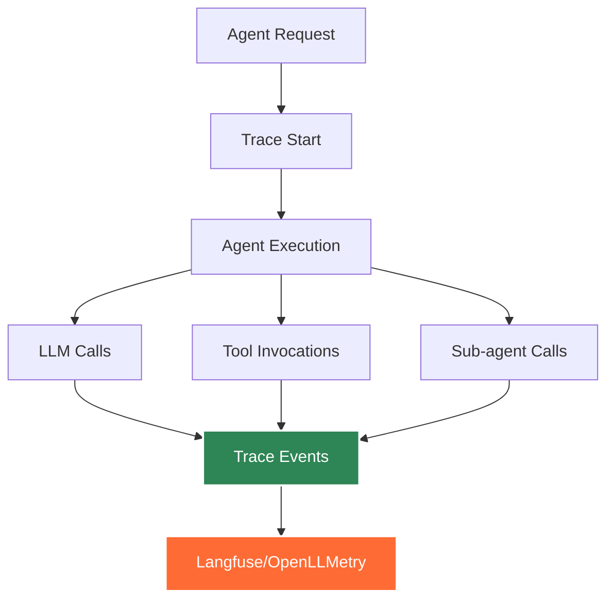

# Traceability and Observability

Track, monitor, and debug all agent operations with built-in tracing and observability features.

## Overview

Agent Kernel provides comprehensive observability capabilities through integration with popular tracing platforms. Monitor agent execution, debug issues, and gain insights into your AI agent systems.



## Supported Platforms

Agent Kernel supports the following observability platforms:

- **Langfuse** - Open-source LLM engineering platform for tracing, evaluating, and monitoring AI applications
- **OpenLLMetry (Traceloop)** - OpenTelemetry-based observability for LLM applications with support for multiple backends

## Getting Started with Langfuse

### Installation

Install Agent Kernel with Langfuse support:

```bash
pip install agentkernel[langfuse]
```

Or if you need multiple framework integrations:

```bash
# OpenAI with Langfuse
pip install agentkernel[openai,langfuse]

# LangGraph with Langfuse
pip install agentkernel[langgraph,langfuse]

# CrewAI with Langfuse
pip install agentkernel[crewai,langfuse]

# Google ADK with Langfuse
pip install agentkernel[adk,langfuse]
```

### Configuration

#### Method 1: Configuration File

Create or update `config.yaml`:

```yaml
trace:
  enabled: true
  type: langfuse
```

#### Method 2: Environment Variables

```bash
export AK_TRACE__ENABLED=true
export AK_TRACE__TYPE=langfuse
```

With tracing enabled in config, all agent interactions will be automatically traced to Langfuse.


### Langfuse Credentials

Configure Langfuse credentials via environment variables:

```bash
export LANGFUSE_PUBLIC_KEY=pk-lf-...
export LANGFUSE_SECRET_KEY=sk-lf-...
export LANGFUSE_HOST=https://cloud.langfuse.com  # or your self-hosted instance
```

Or add them to your `.env` file:

```env
LANGFUSE_PUBLIC_KEY=pk-lf-...
LANGFUSE_SECRET_KEY=sk-lf-...
LANGFUSE_HOST=https://cloud.langfuse.com
```

### Getting Langfuse Credentials

1. Sign up for a free account at [https://cloud.langfuse.com](https://cloud.langfuse.com)
2. Create a new project
3. Navigate to **Settings** → **API Keys**
4. Copy your Public Key and Secret Key

For self-hosted Langfuse, see the [Langfuse documentation](https://langfuse.com/docs/deployment/self-host).

## Getting Started with OpenLLMetry (Traceloop)

### Installation

Install Agent Kernel with OpenLLMetry support:

```bash
pip install agentkernel[openllmetry]
```

Or if you need multiple framework integrations:

```bash
# OpenAI with OpenLLMetry
pip install agentkernel[openai,openllmetry]

# LangGraph with OpenLLMetry
pip install agentkernel[langgraph,openllmetry]

# CrewAI with OpenLLMetry
pip install agentkernel[crewai,openllmetry]

# Google ADK with OpenLLMetry
pip install agentkernel[adk,openllmetry]
```

### Configuration

#### Method 1: Configuration File

Create or update `config.yaml`:

```yaml
trace:
  enabled: true
  type: openllmetry
```

#### Method 2: Environment Variables

```bash
export AK_TRACE__ENABLED=true
export AK_TRACE__TYPE=openllmetry
```

### OpenLLMetry Credentials

Configure Traceloop credentials via environment variables:

```bash
export TRACELOOP_API_KEY=your-api-key
# Optional: for self-hosted instances
export TRACELOOP_BASE_URL=https://api.traceloop.com
```

Or add them to your `.env` file:

```env
TRACELOOP_API_KEY=your-api-key
TRACELOOP_BASE_URL=https://api.traceloop.com
```

### Getting Traceloop Credentials

1. Sign up for an account at [https://www.traceloop.com](https://www.traceloop.com)
2. Create a new project
3. Navigate to **Settings** → **API Keys**
4. Copy your API key

For self-hosted deployment or other backends (like Datadog, New Relic, Honeycomb), see the [Traceloop documentation](https://www.traceloop.com/docs/openllmetry/getting-started).

### OpenLLMetry Features

OpenLLMetry provides:
- **OpenTelemetry Standards**: Industry-standard telemetry data
- **Multiple Backends**: Send traces to Traceloop, Datadog, New Relic, Honeycomb, and more
- **Automatic Instrumentation**: Zero-code instrumentation for popular LLM frameworks
- **Performance Monitoring**: Track latency, token usage, and costs
- **Distributed Tracing**: Follow requests across multiple services

## What Gets Traced

When tracing is enabled, Agent Kernel automatically captures:

### Execution Metrics
- **Request/Response**: Full input prompts and agent responses
- **Latency**: Execution time for each agent interaction
- **Token Usage**: Input and output tokens consumed

### Agent Context
- **Agent Name**: Which agent handled the request
- **Session ID**: Conversation session identifier
- **Metadata**: Custom metadata and tags

### LLM Interactions
- **Model Calls**: All LLM API calls with parameters
- **Prompt Templates**: Resolved prompts sent to models
- **Completions**: Model responses and reasoning

### Tool Usage
- **Tool Invocations**: Which tools were called
- **Tool Parameters**: Arguments passed to tools
- **Tool Results**: Return values and execution status

## Viewing Traces

### In Langfuse

After running your agents with Langfuse tracing enabled:

1. Log in to your Langfuse dashboard
2. Navigate to **Traces**
3. View detailed execution traces including:
   - Full conversation flow
   - LLM calls with prompts and completions
   - Tool invocations
   - Performance metrics
   - Token consumption

**Langfuse Features:**
- **Search and Filter**: Find specific traces by agent, session, or metadata
- **Timeline View**: See execution flow and timing
- **Cost Analysis**: Track token usage and estimated costs
- **Error Tracking**: Debug failed executions
- **Performance Metrics**: Latency analysis and bottleneck identification

### In OpenLLMetry/Traceloop

After running your agents with OpenLLMetry tracing enabled:

1. Log in to your Traceloop dashboard (or your configured backend)
2. Navigate to **Traces** or **Observability**
3. View detailed execution traces including:
   - Distributed trace timeline
   - LLM API calls with full context
   - Token usage and costs
   - Performance metrics
   - Error details

**OpenLLMetry/Traceloop Features:**
- **OpenTelemetry Standards**: Compatible with any OpenTelemetry backend
- **Multi-Backend Support**: View traces in Traceloop, Datadog, New Relic, etc.
- **Distributed Tracing**: Track requests across multiple services
- **Custom Metrics**: Add custom spans and metrics
- **Real-time Monitoring**: Live trace streaming and alerts


## Troubleshooting

### Langfuse Issues

**Traces Not Appearing:**

1. **Check Credentials**: Verify `LANGFUSE_PUBLIC_KEY`, `LANGFUSE_SECRET_KEY`, and `LANGFUSE_HOST` are set correctly
2. **Verify Configuration**: Ensure `trace.enabled` is set to `true` and `trace.type` is `langfuse`
3. **Check Installation**: Confirm `agentkernel[langfuse]` is installed
4. **Review Logs**: Look for trace initialization messages in your application logs

**Authentication Errors:**

```bash
# Verify your Langfuse credentials
python -c "from langfuse import Langfuse; client = Langfuse(); print(client.auth_check())"
```

This should return `True` if credentials are valid.

### OpenLLMetry Issues

**Traces Not Appearing:**

1. **Check Credentials**: Verify `TRACELOOP_API_KEY` is set correctly
2. **Verify Configuration**: Ensure `trace.enabled` is set to `true` and `trace.type` is `openllmetry`
3. **Check Installation**: Confirm `agentkernel[openllmetry]` is installed
4. **Review Logs**: Look for Traceloop initialization messages in your application logs

**Connection Errors:**

```bash
# Verify your Traceloop setup
python -c "from traceloop.sdk import Traceloop; Traceloop.init(app_name='test'); print('Success')"
```

### Performance Impact

Tracing adds minimal overhead:
- **Latency**: < 50ms per request
- **Memory**: Negligible (~1-2MB)
- **Network**: Async batched uploads to minimize impact

## Best Practices

1. **Enable in All Environments**: Use tracing in development, staging, and production
2. **Set Appropriate TTLs**: Configure data retention in Langfuse settings
3. **Use Tags**: Add meaningful tags for better organization
4. **Monitor Costs**: Track token usage to manage LLM costs
5. **Review Regularly**: Set up alerts for errors and performance degradation

## Privacy and Security

### Data Handling

When tracing is enabled:
- All prompts and completions are sent to your chosen tracing platform
- **Langfuse**: Data sent to Langfuse cloud or self-hosted instance
- **OpenLLMetry**: Data sent to Traceloop or configured OpenTelemetry backend
- Ensure compliance with your data privacy requirements
- Consider self-hosting for sensitive data

### Security Best Practices

1. **Protect Credentials**: Never commit API keys to version control
2. **Use Environment Variables**: Store credentials securely
3. **Rotate Keys**: Regularly rotate API keys
4. **Network Security**: Use TLS/SSL for all connections (enabled by default)

### Compliance

For regulated industries:
- Use self-hosted instances within your infrastructure
- Configure appropriate data retention policies
- Implement access controls in your tracing platform
- Review and redact sensitive information before tracing

## Self-Hosting Options

### Self-Hosting Langfuse

For maximum control and privacy, self-host Langfuse:

1. Follow the [Langfuse self-hosting guide](https://langfuse.com/docs/deployment/self-host)
2. Update your configuration:

```bash
export LANGFUSE_HOST=https://langfuse.your-domain.com
```

### OpenLLMetry with Custom Backends

OpenLLMetry supports multiple backends via OpenTelemetry:

**Datadog:**
```bash
export TRACELOOP_BASE_URL=https://api.datadoghq.com
export DD_API_KEY=your-datadog-api-key
```

**New Relic:**
```bash
export TRACELOOP_BASE_URL=https://otlp.nr-data.net
export NEW_RELIC_LICENSE_KEY=your-license-key
```

**Honeycomb:**
```bash
export TRACELOOP_BASE_URL=https://api.honeycomb.io
export HONEYCOMB_API_KEY=your-api-key
```

**Self-Hosted OpenTelemetry Collector:**
```bash
export TRACELOOP_BASE_URL=http://your-otel-collector:4318
```

See [OpenLLMetry documentation](https://www.traceloop.com/docs/openllmetry/integrations) for more backend options.

## Roadmap

Upcoming observability features:

- **Custom Spans**: Manual span creation for custom tracking
- **Trace Sampling**: Configurable sampling strategies
- **Metric Exports**: Prometheus and StatsD integrations
- **Real-time Dashboards**: Built-in monitoring dashboards
- **Anomaly Detection**: Automatic detection of unusual patterns
- **Enhanced Correlation**: Better correlation between traces and logs

## Related Resources

- [Langfuse Documentation](https://langfuse.com/docs)
- [Traceloop/OpenLLMetry Documentation](https://www.traceloop.com/docs)
- [Configuration Guide](../core-concepts/configuration.md)

## Summary

- Enable observability with simple configuration
- **Two Platform Options**: Choose between Langfuse and OpenLLMetry
- **Langfuse**: Specialized LLM observability platform with rich analytics
- **OpenLLMetry**: OpenTelemetry-based solution with multi-backend support
- Comprehensive trace data including LLM calls, tools, and performance
- Minimal performance impact
- Self-hosting and custom backend options for data privacy
- Production-ready for all framework integrations (OpenAI, LangGraph, CrewAI, Google ADK)
