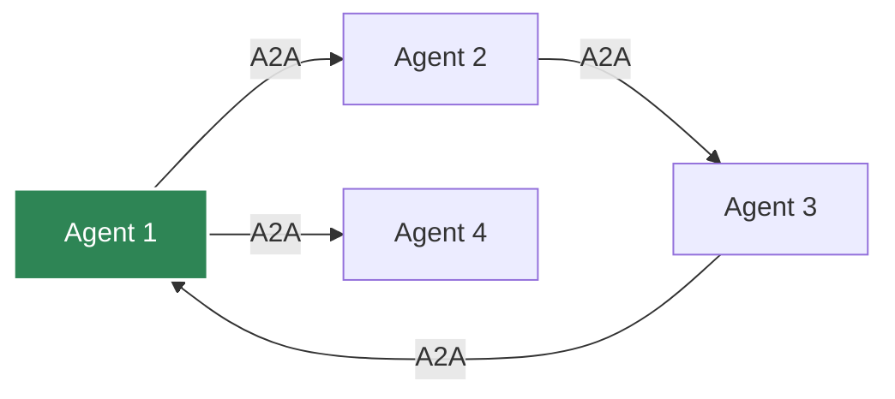

# A2A Server

Enable Agent-to-Agent (A2A) communication for agent collaboration.

## What is A2A?

A2A is a protocol for agents to discover and communicate with each other across different systems.

## Enabling A2A

```bash
export AK_A2A_ENABLED=true
export AK_A2A_URL=https://your-domain.com/a2a
export AK_A2A_PORT=8002
```

## Starting A2A Server

```python
from agentkernel.a2a import A2AServer

if __name__ == "__main__":
    server = A2AServer()
    server.run()
```

## Agent Capabilities

Agents automatically generate A2A capability cards:

```json
{
  "name": "assistant",
  "description": "General assistant agent",
  "url": "https://your-domain.com/a2a/assistant",
  "version": "0.1.2b17",
  "capabilities": {
    "input_modes": ["text"],
    "output_modes": ["text"],
    "skills": [
      {
        "name": "general_assistance",
        "description": "Provide general help"
      }
    ]
  }
}
```

## Agent Discovery

```http
GET /a2a/agents
```

Response:

```json
{
  "agents": [
    {
      "name": "assistant",
      "url": "https://your-domain.com/a2a/assistant"
    }
  ]
}
```

## Agent Communication

```http
POST /a2a/assistant/message
```

Request:

```json
{
  "message": "Hello from another agent!",
  "sender_id": "agent-123"
}
```

## Multi-Agent Network



## Best Practices

- Implement authentication between agents
- Handle network failures gracefully
- Monitor cross-agent communication
- Document agent capabilities clearly
- Use semantic versioning for agents
