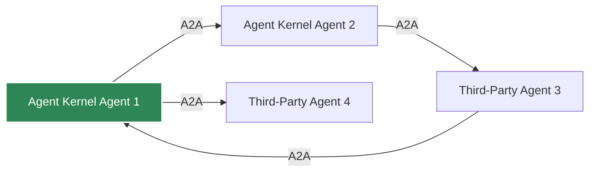

# A2A Server

Enable Agent-to-Agent (A2A) communication for agent collaboration.

## What is A2A?

A2A is a protocol for agents to discover and communicate with each other across different systems.

## Enabling A2A

```bash
export AK_A2A_ENABLED=true
export AK_A2A_URL=https://your-domain.com/a2a
export AK_A2A_PORT=8002
```

or
```yaml
a2a:
  enabled: true
  port: 8000
  url: https://your-domain.com/a2a
```

## Starting A2A Server

```python
from agentkernel.api import RESTAPI

if __name__ == "__main__":
    RESTAPI.run()
```

## Agent Capabilities

Agents automatically generate A2A capability cards:

## Agent Discovery

```http
GET /a2a/agents
```

Response:

```json
{
  "agents": [
    {
      "name": "assistant",
      "url": "https://your-domain.com/a2a/assistant"
    }
  ]
}
```

## Agent Communication

```http
POST /a2a/assistant/message
```

Request:

```json
{
  "message": "Hello from another agent!",
  "sender_id": "agent-123"
}
```

## Multi-Agent Network


