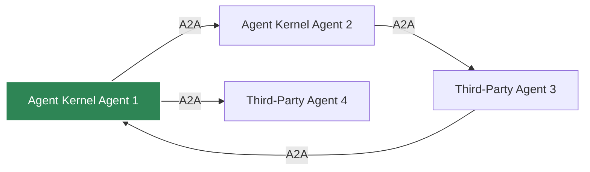

# A2A Server

Enable Agent-to-Agent (A2A) communication for agent collaboration.

## What is A2A?

A2A is a protocol for agents to discover and communicate with each other across different systems.

## Enabling A2A

```bash
export AK_A2A__ENABLED=true
export AK_A2A__URL=https://your-domain.com/a2a
export AK_A2A__AGENTS="*"            # or a comma-separated list of agent names
export AK_A2A__TASK_STORE_TYPE=in_memory  # 'in_memory' or 'redis'
```

or

```yaml
a2a:
  enabled: true
  url: https://your-domain.com/a2a
  agents:
    - "*"          # expose all agents (or list specific agent names)
  task_store_type: in_memory
```

The A2A routes are mounted on the main REST API server under `/a2a`; use `api.port` (or `AK_API__PORT`) to change the port.

## Starting A2A Server

```python
from agentkernel.api import RESTAPI

if __name__ == "__main__":
    RESTAPI.run()
```

## Agent Capabilities

Each exposed agent automatically publishes an A2A **agent card** (via the framework adapter's `get_a2a_card()`), describing its name, description, and endpoint.

## Agent Discovery

List all exposed agent cards:

```http
GET /a2a/catalog
```

Each agent also serves its own well-known card:

```http
GET /a2a/{agent}/.well-known/agent-card.json
```

## Agent Communication

Each agent is mounted under `/a2a/{agent}` with the standard A2A protocol routes (provided by the A2A SDK's REST adapter):

| Route | Purpose |
|-------|---------|
| `POST /a2a/{agent}/v1/message:send` | Send a message to the agent |
| `POST /a2a/{agent}/v1/message:stream` | Send a message with streamed protocol responses |
| `GET /a2a/{agent}/v1/tasks` | List tasks |
| `GET /a2a/{agent}/v1/tasks/{id}` | Get a task |
| `POST /a2a/{agent}/v1/tasks/{id}:cancel` | Cancel a task |
| `GET /a2a/{agent}/v1/tasks/{id}:subscribe` | Subscribe to task updates |
| `GET /a2a/{agent}/v1/card` | Get the agent card |

Incoming A2A messages are executed through the same `AgentService` pipeline as REST requests: hooks, guardrails, and session persistence all apply.

## Multi-Agent Network


```mermaid
graph LR
    A[Agent Kernel Agent 1] -->|A2A| B[Agent Kernel Agent 2]
    B -->|A2A| C[Third-Party Agent 3]
    C -->|A2A| A
    A -->|A2A| D[Third-Party Agent 4]

    style A fill:#2e8555,stroke:#fff,stroke-width:2px,color:#fff
```
