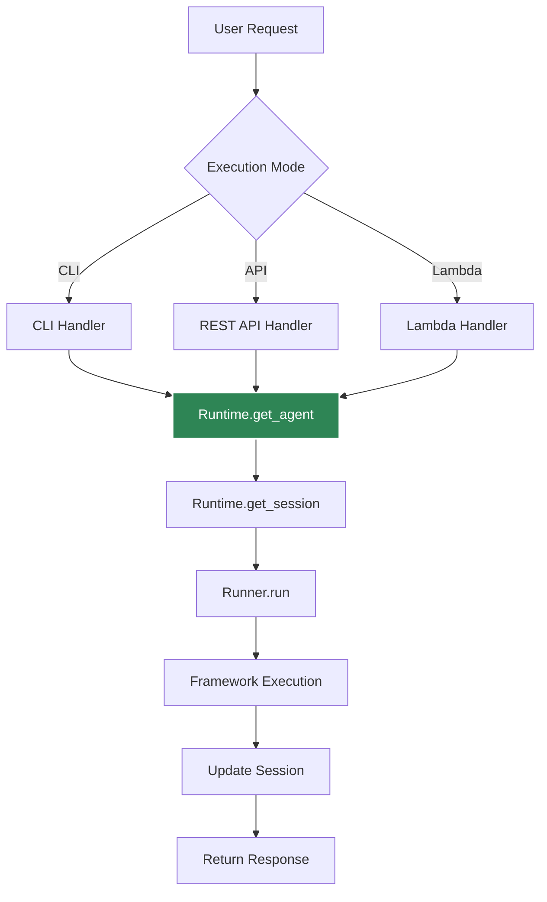
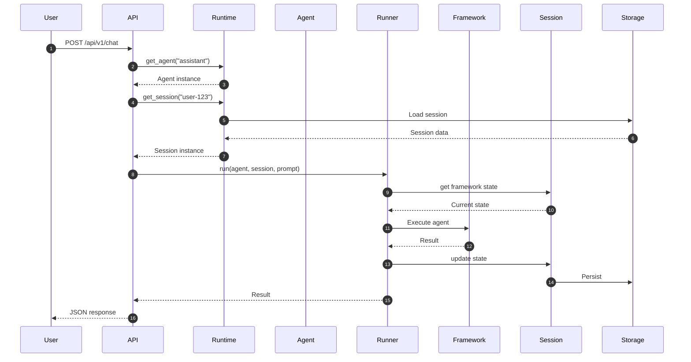

# Execution Flow

How requests flow through Agent Kernel from user input to agent response.

## Request Lifecycle



## Detailed Flow

### 1. Request Reception

The request enters through one of the execution modes:

- **CLI**: Interactive terminal input
- **REST API**: HTTP POST to `/api/v1/chat` endpoint
- **AWS Lambda**: Lambda event
- **MCP/A2A**: Protocol-specific request

### 2. Agent Resolution

```python
runtime = Runtime.get()
agent = runtime.get_agent(agent_name)
```

### 3. Session Management

```python
session = runtime.get_session(session_id)
# Loads existing session or creates new one
```

### 4. Agent Execution

```python
result = await agent.runner.run(agent, session, prompt)
```

### 5. Response Return

Result is formatted and returned to the user through the appropriate channel.

## Timing Diagram



