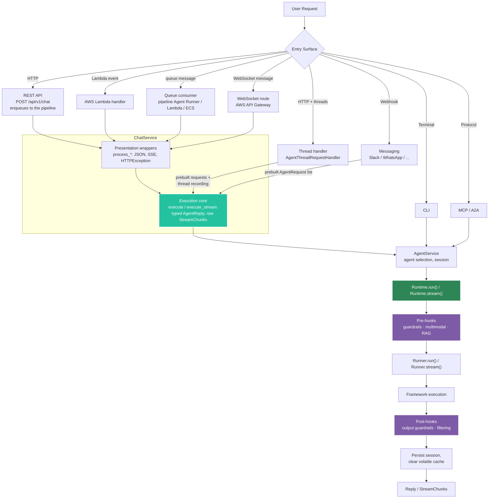
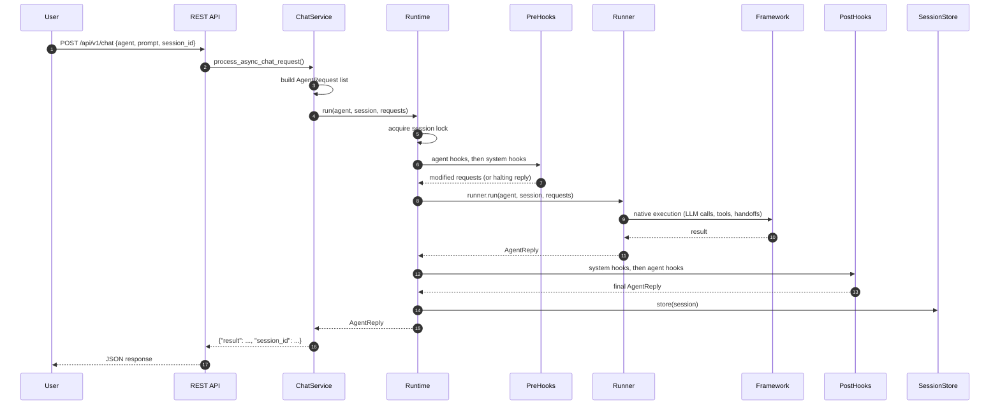
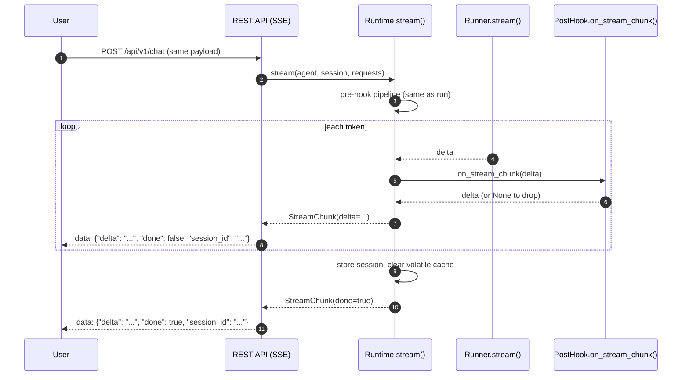
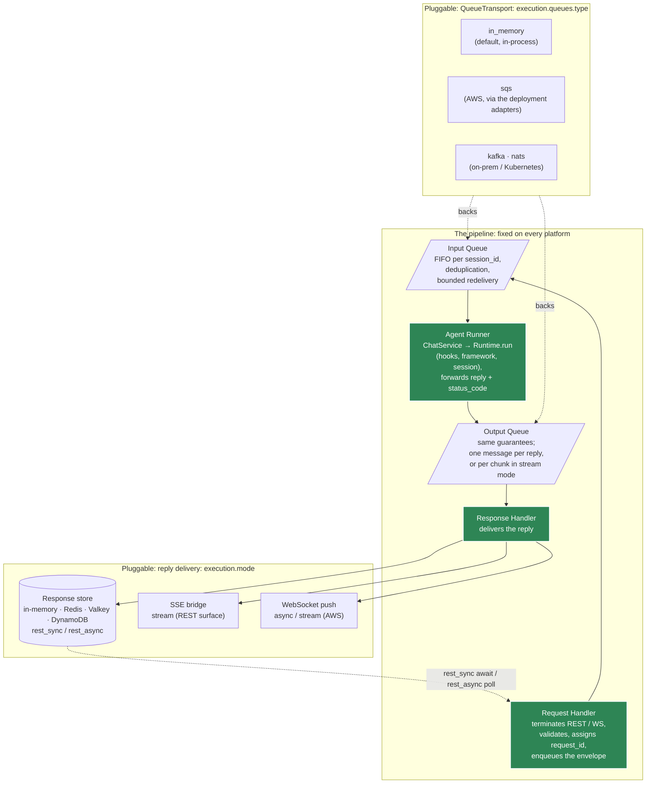
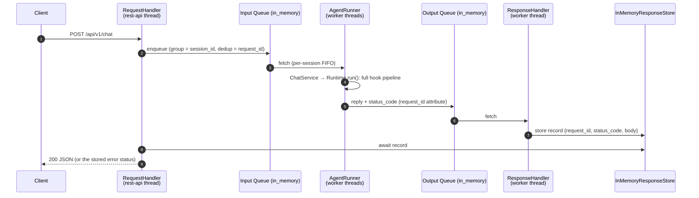
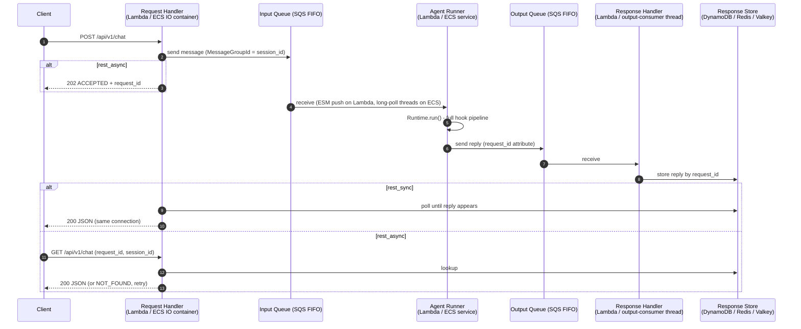
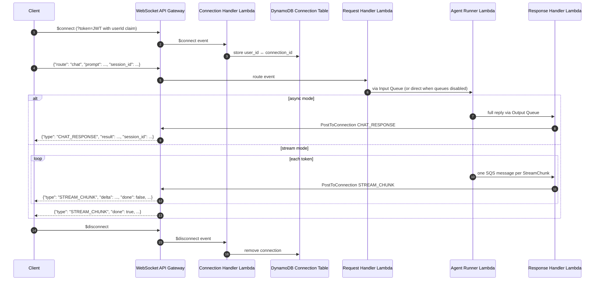
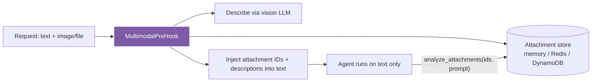

# Execution Flow

How requests flow through Agent Kernel from user input to agent response: synchronously, streamed, or through queues.

## Request Lifecycle

Every execution surface converges on the same runtime pipeline, but they enter through distinct service layers: HTTP-shaped surfaces call the **ChatService presentation wrappers** (`process_*`), channels that own their transport (messaging integrations, the thread handler) call the **ChatService execution core** (`execute`/`execute_stream`) with prebuilt request lists, and stateful clients (CLI, A2A, MCP) use **AgentService** directly. Everything then flows through `Runtime.run()` (or `Runtime.stream()`) → pre-hooks → `Runner` → framework → post-hooks → session persistence.


```mermaid
graph TD
    A[User Request] --> B{Entry Surface}
    B -->|Terminal| C[CLI]
    B -->|HTTP| D[REST API<br/>POST /api/v1/chat<br/>enqueues to the pipeline]
    B -->|HTTP + threads| TH[Thread handler<br/>AgentThreadRequestHandler]
    B -->|Lambda event| E[AWS Lambda handler]
    B -->|queue message| Q[Queue consumer<br/>pipeline Agent Runner / Lambda / ECS]
    B -->|WebSocket message| F[WebSocket route<br/>AWS API Gateway]
    B -->|Protocol| P[MCP / A2A]
    B -->|Webhook| MSG[Messaging<br/>Slack / WhatsApp / ...]

    subgraph CS[ChatService]
        PRES["Presentation wrappers<br/>process_*: JSON, SSE, HTTPException"]
        CORE["Execution core<br/>execute / execute_stream:<br/>typed AgentReply, raw StreamChunks"]
    end

    D --> PRES
    E --> PRES
    Q --> PRES
    F --> PRES
    PRES --> CORE
    TH -->|"prebuilt requests +<br/>thread recording"| CORE
    MSG -->|"prebuilt AgentRequest list"| CORE

    AS["AgentService<br/>agent selection, session"]
    CORE --> AS
    C --> AS
    P --> AS

    AS --> H["Runtime.run() / Runtime.stream()"]
    H --> I[Pre-hooks<br/>guardrails · multimodal · RAG]
    I --> J["Runner.run() / Runner.stream()"]
    J --> K[Framework execution]
    K --> L[Post-hooks<br/>output guardrails · filtering]
    L --> M[Persist session,<br/>clear volatile cache]
    M --> N[Reply / StreamChunks]

    style H fill:#2e8555,stroke:#fff,stroke-width:2px,color:#fff
    style I fill:#7d5ba6,stroke:#fff,stroke-width:2px,color:#fff
    style L fill:#7d5ba6,stroke:#fff,stroke-width:2px,color:#fff
    style CORE fill:#25c2a0,stroke:#fff,stroke-width:2px,color:#fff
```

### Which layer does new code call?

- A new HTTP-shaped surface that returns JSON/SSE with the standard error shapes calls the
  presentation wrappers (`process_*`).
- A new channel or integration that owns its own transport, reply formatting, and error UX calls the
  core (`execute`/`execute_stream`), passing a prebuilt request list when it builds its own
  attachments.
- An interactive or stateful client that manages agent and session lifecycle itself (REPL-like)
  uses `AgentService`.
- Cross-cutting behavior that must apply to every run regardless of surface goes in a `Runtime`
  pre/post hook, not in a service layer.
- Entry surfaces never call `Runtime` directly.

For the underlying distinction between the two services (stateful conversation object vs stateless
request processor), see [ChatService vs AgentService](./overview#chatservice-vs-agentservice).

## Detailed Flow

### 1. Request Reception

The request enters through one of the execution surfaces:

- **CLI**: interactive terminal input
- **REST API**: HTTP `POST /api/v1/chat` (JSON) or `POST /api/v1/chat-multipart` (file uploads)
- **Thread handler**: the same REST routes served by `AgentThreadRequestHandler` with conversation-thread recording, plus the thread read routes
- **AWS Lambda**: API Gateway event routed by the `Lambda` handler
- **SQS queue**: in queue mode, a request message consumed by the agent-runner Lambda or ECS consumer threads
- **WebSocket**: a message on the configured chat route via AWS API Gateway WebSocket (async/stream modes)
- **MCP/A2A**: protocol-specific request against the mounted `/mcp` or `/a2a` routes
- **Messaging platforms**: webhook events from Slack, WhatsApp, Messenger, Instagram, Telegram, Teams, or Gmail

### 2. Request Building and Agent Resolution

The `ChatService` execution core validates the payload and builds a list of typed requests (`AgentRequestText`, `AgentRequestImage`, `AgentRequestFile`, plus `AgentRequestAny` entries for any additional context fields). Callers that construct their own request lists (messaging integrations downloading platform attachments, the thread handler) pass them in and the builder is skipped. The core then selects the agent and session through `AgentService`:

```python
from agentkernel.core.service import AgentService

service = AgentService()
service.select(name="assistant", session_id="user-123")  # loads or creates the session
```

Under the hood the agent registry lives on the runtime:

```python
from agentkernel.core import Runtime

runtime = Runtime.current()
agent = runtime.agents().get("assistant")
session = runtime.sessions().get("user-123") or runtime.sessions().new("user-123")
```

When chat is served by the thread handler (`AgentThreadRequestHandler`), `user_id` is required and the user message (with any attachments) is recorded to the [conversation thread](../advanced/threads) before the run. Other surfaces do not record threads.

### 3. Agent Execution

`Runtime.run()` acquires the session lock, runs the hook pipeline, and delegates to the framework-specific runner:

```python
reply = await runtime.run(agent, session, requests)
```

1. **Session lock**: `async with session` serializes concurrent requests per session and makes `Session.current()` available.
2. **Pre-hooks**: agent hooks first, then system hooks (input guardrails, multimodal preprocessing). A pre-hook may rewrite the request list or halt by returning an `AgentReply`.
3. **`Runner.run()`**: converts requests to the framework's native format, restores framework session state, executes, and converts the result back to an `AgentReply` (`AgentReplyText`, `AgentReplyImage`, or `AgentReplyAny` for structured output).
4. **Post-hooks**: system hooks (output guardrails) first, then agent hooks.
5. **Persistence**: the session store saves the session; the volatile cache is cleared in a `finally` block.

### 4. Response Return

The reply travels back through the surface it arrived on: JSON body for REST, Lambda response for API Gateway, a message on the output queue in queue mode, or a WebSocket push. The thread handler also appends the assistant reply to the conversation thread.

## Synchronous Flow (Sequence)


```mermaid
sequenceDiagram
    autonumber
    participant User
    participant API as REST API
    participant CS as ChatService
    participant RT as Runtime
    participant Pre as PreHooks
    participant Run as Runner
    participant FW as Framework
    participant Post as PostHooks
    participant Store as SessionStore

    User->>API: POST /api/v1/chat {agent, prompt, session_id}
    API->>CS: process_async_chat_request()
    CS->>CS: build AgentRequest list
    CS->>RT: run(agent, session, requests)
    RT->>RT: acquire session lock
    RT->>Pre: agent hooks, then system hooks
    Pre-->>RT: modified requests (or halting reply)
    RT->>Run: runner.run(agent, session, requests)
    Run->>FW: native execution (LLM calls, tools, handoffs)
    FW-->>Run: result
    Run-->>RT: AgentReply
    RT->>Post: system hooks, then agent hooks
    Post-->>RT: final AgentReply
    RT->>Store: store(session)
    RT-->>CS: AgentReply
    CS-->>API: {"result": ..., "session_id": ...}
    API-->>User: JSON response
```

## Streaming Flow (`execution.mode: stream`)

With `execution.mode: stream`, the REST API switches `POST /api/v1/chat` (and `/chat-multipart`) to a Server-Sent Events response, driven by `Runtime.stream()`:


```mermaid
sequenceDiagram
    autonumber
    participant User
    participant API as REST API (SSE)
    participant RT as Runtime.stream()
    participant Run as Runner.stream()
    participant Post as PostHook.on_stream_chunk()

    User->>API: POST /api/v1/chat (same payload)
    API->>RT: stream(agent, session, requests)
    RT->>RT: pre-hook pipeline (same as run)
    loop each token
        Run-->>RT: delta
        RT->>Post: on_stream_chunk(delta)
        Post-->>RT: delta (or None to drop)
        RT-->>API: StreamChunk(delta=...)
        API-->>User: data: {"delta": "...", "done": false, "session_id": "..."}
    end
    RT->>RT: store session, clear volatile cache
    RT-->>API: StreamChunk(done=true)
    API-->>User: data: {"delta": "...", "done": true, "session_id": "..."}
```

- If a pre-hook halts (e.g., an input guardrail trips), the stream yields a single `StreamChunk` with `error` set and `done: true`.
- **Framework support**: OpenAI Agents SDK, LangGraph, and Google ADK stream natively. CrewAI and Smolagents raise `NotImplementedError` in stream mode.
- On AWS serverless and AWS ECS containerized, the same `StreamChunk`s are delivered as WebSocket `STREAM_CHUNK` messages instead of SSE; see below.

## The Queue Pipeline Abstraction

Chat execution is one fixed abstraction with pluggable edges
([#495](https://github.com/yaalalabs/agent-kernel/issues/495)). The **five logical components
and the message envelope between them never change**; what varies by configuration is the queue
transport underneath, the reply delivery path, and how the components map onto processes:


```mermaid
graph TB
    subgraph PIPE["The pipeline: fixed on every platform"]
        direction LR
        RH["Request Handler<br/>terminates REST / WS,<br/>validates, assigns request_id,<br/>enqueues the envelope"]
        IQ[/"Input Queue<br/>FIFO per session_id,<br/>deduplication,<br/>bounded redelivery"/]
        AR["Agent Runner<br/>ChatService → Runtime.run<br/>(hooks, framework, session),<br/>forwards reply + status_code"]
        OQ[/"Output Queue<br/>same guarantees;<br/>one message per reply,<br/>or per chunk in stream mode"/]
        RESP["Response Handler<br/>delivers the reply"]
        RH --> IQ --> AR --> OQ --> RESP
    end

    subgraph TRANS["Pluggable: QueueTransport: execution.queues.type"]
        direction LR
        MEM["in_memory<br/>(default, in-process)"]
        SQS["sqs<br/>(AWS, via the deployment adapters)"]
        KN["kafka · nats<br/>(on-prem / Kubernetes)"]
    end

    subgraph DELIV["Pluggable: reply delivery: execution.mode"]
        direction LR
        RS[("Response store<br/>in-memory · Redis · Valkey · DynamoDB<br/>rest_sync / rest_async")]
        SSE["SSE bridge<br/>stream (REST surface)"]
        WS["WebSocket push<br/>async / stream (AWS)"]
    end

    TRANS -.->|backs| IQ
    TRANS -.->|backs| OQ
    RESP --> RS
    RESP --> SSE
    RESP --> WS
    RS -.->|"rest_sync await / rest_async poll"| RH

    style RH fill:#2e8555,stroke:#fff,stroke-width:2px,color:#fff
    style AR fill:#2e8555,stroke:#fff,stroke-width:2px,color:#fff
    style RESP fill:#2e8555,stroke:#fff,stroke-width:2px,color:#fff
```

What the abstraction fixes, and what it leaves open:

- **Fixed**: the five components, the normalized message envelope (`body`, routing attributes
  `request_id`/`user_id`/`endpoint_url`/`status_code`, `group_id`, dedup id, receive count), and
  the failure contract: a message that exhausts `max_receive_count` triggers a permanent-failure
  error reply, so the caller never hangs.
- **Pluggable**: the queue transport (`in_memory` default; `sqs` on AWS via the deployment
  adapters; `kafka`/`nats` for on-prem / Kubernetes), the response store backend, and the reply
  delivery path per `execution.mode`.
- **Shared machinery**: the Agent Runner and Response Handler are both driven by `ConsumerLoop`
 : one implementation of batch fetch, receive-count checking, and the
  permanent-failure-then-acknowledge flow, reused by every transport (the ECS `ECSSQSConsumer`
  runs on it too).
- **Topology is configuration**: single-process (all five components as threads: the local
  default), two-process (IO + agent runner over a broker: AWS ECS today), or three-way (AWS
  Lambda). See the [architecture overview](./overview#the-queue-execution-pipeline) for the
  topology diagrams.

## Queue Pipeline Flow (default, in-process)

Chat requests on the REST surface run through the queue execution pipeline above. With the
default `in_memory` transport, a bare `RESTAPI.run()` boots all five components as threads in one
process: the flow below is identical to the AWS broker flow further down, with the queues living
in process memory:


```mermaid
sequenceDiagram
    autonumber
    participant Client
    participant RH as RequestHandler<br/>(rest-api thread)
    participant IQ as Input Queue (in_memory)
    participant AR as AgentRunner<br/>(worker threads)
    participant OQ as Output Queue (in_memory)
    participant RSH as ResponseHandler<br/>(worker thread)
    participant RS as InMemoryResponseStore

    Client->>RH: POST /api/v1/chat
    RH->>IQ: enqueue (group = session_id, dedup = request_id)
    IQ->>AR: fetch (per-session FIFO)
    AR->>AR: ChatService → Runtime.run(): full hook pipeline
    AR->>OQ: reply + status_code (request_id attribute)
    OQ->>RSH: fetch
    RSH->>RS: store record {request_id, status_code, body}
    RH->>RS: await record
    RH-->>Client: 200 JSON (or the stored error status)
```

- `rest_sync` (and unset mode) waits server-side; `rest_async` returns `202 ACCEPTED` +
  `request_id` for polling; `stream` fans each token out as its own output-queue message and the
  request handler bridges them to the open SSE response.
- Failed messages are redelivered up to `max_receive_count`, then a permanent-failure error is
  delivered so the caller never hangs. Duplicate `request_id`s are dropped within the dedup window.
- Surfaces mounted with explicit handlers (the thread handler, messaging integrations, custom
  handlers) do not enqueue: they keep their direct inline execution.
- Try it: [`examples/api/openai`](https://github.com/yaalalabs/agent-kernel/tree/develop/examples/api/openai)
  walks all three modes with curl.

## Queue-Based Flow (AWS)

On AWS the same pipeline runs over durable SQS FIFO queues, with the components split across
Lambda functions or ECS containers. This is the recommended production topology on AWS for both
Lambda and ECS:


```mermaid
sequenceDiagram
    autonumber
    participant Client
    participant RH as Request Handler<br/>(Lambda / ECS IO container)
    participant IQ as Input Queue (SQS FIFO)
    participant AR as Agent Runner<br/>(Lambda / ECS service)
    participant OQ as Output Queue (SQS FIFO)
    participant RSH as Response Handler<br/>(Lambda / output-consumer thread)
    participant RS as Response Store<br/>(DynamoDB / Redis / Valkey)

    Client->>RH: POST /api/v1/chat
    RH->>IQ: send message (MessageGroupId = session_id)
    alt rest_async
        RH-->>Client: 202 ACCEPTED + request_id
    end
    IQ->>AR: receive (ESM push on Lambda, long-poll threads on ECS)
    AR->>AR: Runtime.run() - full hook pipeline
    AR->>OQ: send reply (request_id attribute)
    OQ->>RSH: receive
    RSH->>RS: store reply by request_id
    alt rest_sync
        RH->>RS: poll until reply appears
        RH-->>Client: 200 JSON (same connection)
    else rest_async
        Client->>RH: GET /api/v1/chat (request_id, session_id)
        RH->>RS: lookup
        RH-->>Client: 200 JSON (or NOT_FOUND, retry)
    end
```

- `rest_sync` holds the HTTP connection and polls the response store server-side; `rest_async` returns a `request_id` immediately for the client to poll.
- Conversation-thread recording does not apply in queue mode; threads are a feature of the thread handler on the self-hosted REST API (see [Conversation Threads](../advanced/threads)).
- FIFO queues use `MessageGroupId = session_id` (per-session ordering) and deduplication IDs; failed messages are retried after the visibility timeout, and dead-letter queues catch messages exceeding `max_receive_count`.
- See the [Queue Mode Guide](../advanced/queue-mode-guide) for retry/DLQ details and ECS threading internals.

## WebSocket Flow (AWS Serverless)

In `async` and `stream` modes, clients hold a WebSocket connection to API Gateway. Connection IDs are recorded in DynamoDB by a connection-handler Lambda, and replies are pushed back through the still-open socket:


```mermaid
sequenceDiagram
    autonumber
    participant Client
    participant WSGW as WebSocket API Gateway
    participant CH as Connection Handler Lambda
    participant CT as DynamoDB Connection Table
    participant RH as Request Handler Lambda
    participant AR as Agent Runner Lambda
    participant RSH as Response Handler Lambda

    Client->>WSGW: $connect (?token=JWT with userId claim)
    WSGW->>CH: $connect event
    CH->>CT: store user_id ↔ connection_id
    Client->>WSGW: {"route": "chat", "prompt": ..., "session_id": ...}
    WSGW->>RH: route event
    RH->>AR: via Input Queue (or direct when queues disabled)
    alt async mode
        AR->>RSH: full reply via Output Queue
        RSH->>WSGW: PostToConnection CHAT_RESPONSE
        WSGW-->>Client: {"type": "CHAT_RESPONSE", "result": ..., "session_id": ...}
    else stream mode
        loop each token
            AR->>RSH: one SQS message per StreamChunk
            RSH->>WSGW: PostToConnection STREAM_CHUNK
            WSGW-->>Client: {"type": "STREAM_CHUNK", "delta": ..., "done": false, ...}
        end
        WSGW-->>Client: {"type": "STREAM_CHUNK", "done": true, ...}
    end
    Client->>WSGW: $disconnect
    WSGW->>CH: $disconnect event
    CH->>CT: remove connection
```

See [AWS Serverless Deployment](../deployment/aws-serverless) for configuration, authentication, and Terraform wiring.

## Mode Selection Cheat Sheet

| `execution.mode` | Transport | Reply delivery | Queues | Response store | Available on |
|------------------|-----------|----------------|--------|----------------|--------------|
| *(unset)* / default | HTTP | JSON on the same connection | - | - | Everywhere `RESTAPI`/CLI runs |
| `rest_sync` | HTTP | JSON on the same connection (server polls store) | Required | Required | AWS Lambda, AWS ECS |
| `rest_async` | HTTP | Client polls with `request_id` | Required | Required | AWS Lambda, AWS ECS |
| `async` | WebSocket | Single `CHAT_RESPONSE` push | Optional | Not used | AWS Lambda, AWS ECS |
| `stream` | SSE (REST) or WebSocket (AWS serverless, AWS ECS) | Token-level `StreamChunk`s | Optional (WebSocket path) | Not used | REST API surfaces; AWS Lambda WebSocket; AWS ECS WebSocket |

## Multimodal Flow

When multimodal support is enabled and a request carries images or files, the system pre-hook transforms the request before the agent sees it:


```mermaid
graph LR
    A[Request: text + image/file] --> B[MultimodalPreHook]
    B --> C[Describe via vision LLM]
    B --> D[(Attachment store<br/>memory / Redis / DynamoDB)]
    B --> E[Inject attachment IDs + descriptions into text]
    E --> F[Agent runs on text only]
    F -->|"analyze_attachments(ids, prompt)"| D

    style B fill:#7d5ba6,stroke:#fff,stroke-width:2px,color:#fff
```

The agent's conversation history stays free of binary data; the auto-registered `analyze_attachments` tool retrieves stored attachments on demand. See [Multimodal](../advanced/multimodal).
