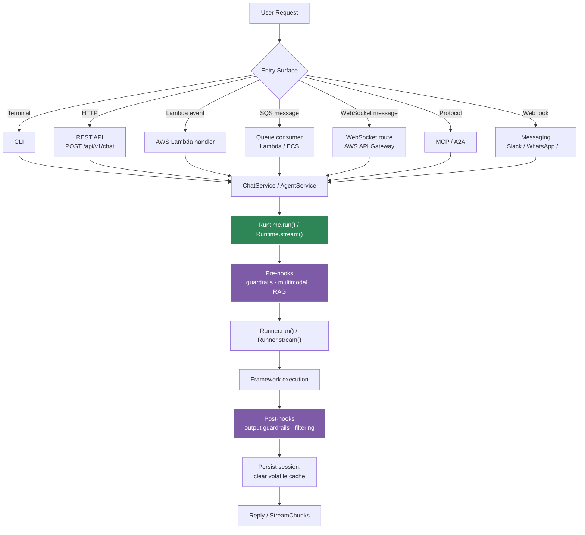
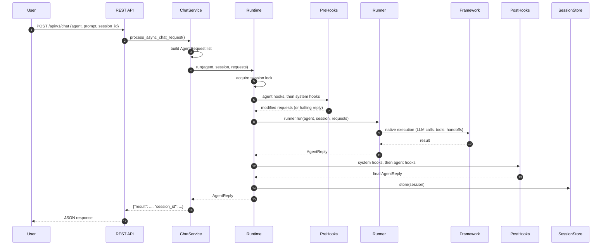
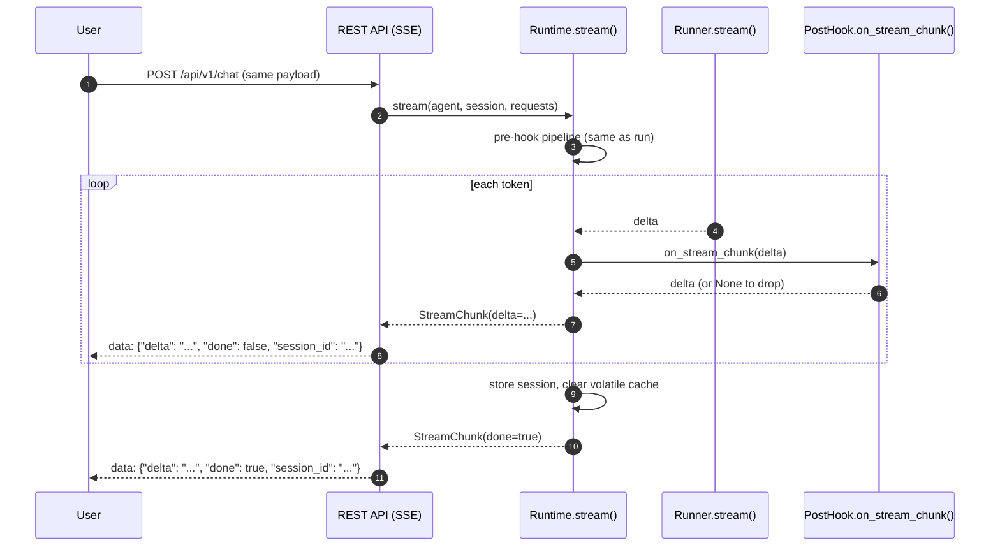
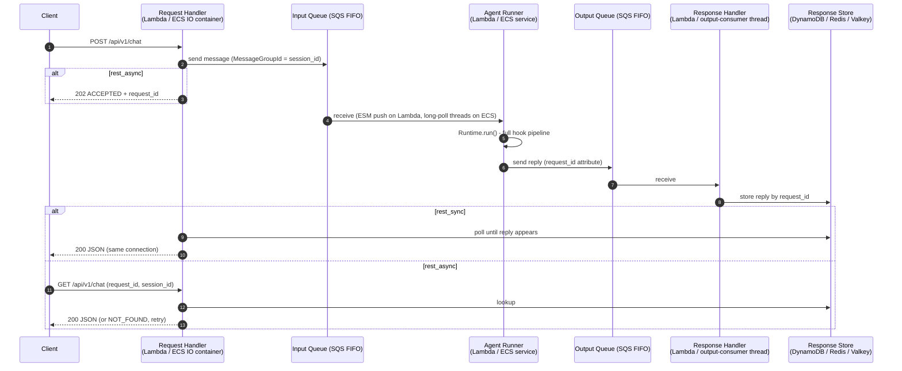
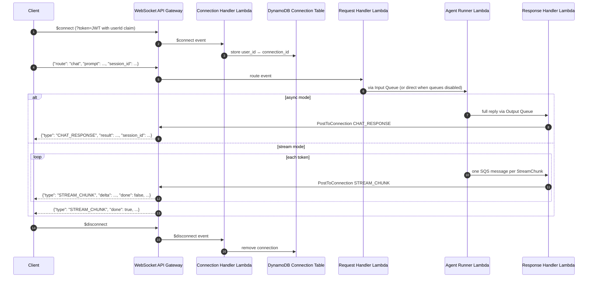
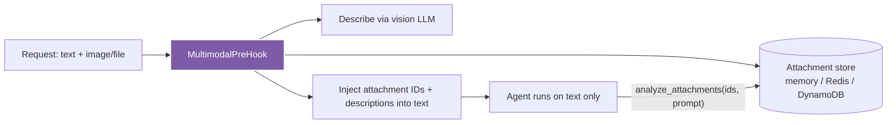

# Execution Flow

How requests flow through Agent Kernel from user input to agent response: synchronously, streamed, or through queues.

## Request Lifecycle

Every execution surface converges on the same core pipeline: `ChatService`/`AgentService` → `Runtime.run()` (or `Runtime.stream()`) → pre-hooks → `Runner` → framework → post-hooks → session persistence.


```mermaid
graph TD
    A[User Request] --> B{Entry Surface}
    B -->|Terminal| C[CLI]
    B -->|HTTP| D[REST API<br/>POST /api/v1/chat]
    B -->|Lambda event| E[AWS Lambda handler]
    B -->|SQS message| Q[Queue consumer<br/>Lambda / ECS]
    B -->|WebSocket message| F[WebSocket route<br/>AWS API Gateway]
    B -->|Protocol| P[MCP / A2A]
    B -->|Webhook| MSG[Messaging<br/>Slack / WhatsApp / ...]

    C --> G[ChatService / AgentService]
    D --> G
    E --> G
    Q --> G
    F --> G
    P --> G
    MSG --> G

    G --> H["Runtime.run() / Runtime.stream()"]
    H --> I[Pre-hooks<br/>guardrails · multimodal · RAG]
    I --> J["Runner.run() / Runner.stream()"]
    J --> K[Framework execution]
    K --> L[Post-hooks<br/>output guardrails · filtering]
    L --> M[Persist session,<br/>clear volatile cache]
    M --> N[Reply / StreamChunks]

    style H fill:#2e8555,stroke:#fff,stroke-width:2px,color:#fff
    style I fill:#7d5ba6,stroke:#fff,stroke-width:2px,color:#fff
    style L fill:#7d5ba6,stroke:#fff,stroke-width:2px,color:#fff
```

## Detailed Flow

### 1. Request Reception

The request enters through one of the execution surfaces:

- **CLI**: interactive terminal input
- **REST API**: HTTP `POST /api/v1/chat` (JSON) or `POST /api/v1/chat-multipart` (file uploads)
- **AWS Lambda**: API Gateway event routed by the `Lambda` handler
- **SQS queue**: in queue mode, a request message consumed by the agent-runner Lambda or ECS consumer threads
- **WebSocket**: a message on the configured chat route via AWS API Gateway WebSocket (async/stream modes)
- **MCP/A2A**: protocol-specific request against the mounted `/mcp` or `/a2a` routes
- **Messaging platforms**: webhook events from Slack, WhatsApp, Messenger, Instagram, Telegram, Teams, or Gmail

### 2. Request Building and Agent Resolution

`ChatService` validates the payload and builds a list of typed requests (`AgentRequestText`, `AgentRequestImage`, `AgentRequestFile`, plus `AgentRequestAny` entries for any additional context fields). It then selects the agent and session through `AgentService`:

```python
from agentkernel.core.service import AgentService

service = AgentService()
service.select(name="assistant", session_id="user-123")  # loads or creates the session
```

Under the hood the agent registry lives on the runtime:

```python
from agentkernel.core import Runtime

runtime = Runtime.current()
agent = runtime.agents().get("assistant")
session = runtime.sessions().get("user-123") or runtime.sessions().new("user-123")
```

If [conversation threads](../advanced/threads) are enabled, `user_id` is required and the thread manager records the user message (and stores any attachments) before the run.

### 3. Agent Execution

`Runtime.run()` acquires the session lock, runs the hook pipeline, and delegates to the framework-specific runner:

```python
reply = await runtime.run(agent, session, requests)
```

1. **Session lock**: `async with session` serializes concurrent requests per session and makes `Session.current()` available.
2. **Pre-hooks**: agent hooks first, then system hooks (input guardrails, multimodal preprocessing). A pre-hook may rewrite the request list or halt by returning an `AgentReply`.
3. **`Runner.run()`**: converts requests to the framework's native format, restores framework session state, executes, and converts the result back to an `AgentReply` (`AgentReplyText`, `AgentReplyImage`, or `AgentReplyAny` for structured output).
4. **Post-hooks**: system hooks (output guardrails) first, then agent hooks.
5. **Persistence**: the session store saves the session; the volatile cache is cleared in a `finally` block.

### 4. Response Return

The reply travels back through the surface it arrived on: JSON body for REST, Lambda response for API Gateway, a message on the output queue in queue mode, or a WebSocket push. Thread-enabled deployments also append the assistant reply to the conversation thread.

## Synchronous Flow (Sequence)


```mermaid
sequenceDiagram
    autonumber
    participant User
    participant API as REST API
    participant CS as ChatService
    participant RT as Runtime
    participant Pre as PreHooks
    participant Run as Runner
    participant FW as Framework
    participant Post as PostHooks
    participant Store as SessionStore

    User->>API: POST /api/v1/chat {agent, prompt, session_id}
    API->>CS: process_async_chat_request()
    CS->>CS: build AgentRequest list
    CS->>RT: run(agent, session, requests)
    RT->>RT: acquire session lock
    RT->>Pre: agent hooks, then system hooks
    Pre-->>RT: modified requests (or halting reply)
    RT->>Run: runner.run(agent, session, requests)
    Run->>FW: native execution (LLM calls, tools, handoffs)
    FW-->>Run: result
    Run-->>RT: AgentReply
    RT->>Post: system hooks, then agent hooks
    Post-->>RT: final AgentReply
    RT->>Store: store(session)
    RT-->>CS: AgentReply
    CS-->>API: {"result": ..., "session_id": ...}
    API-->>User: JSON response
```

## Streaming Flow (`execution.mode: stream`)

With `execution.mode: stream`, the REST API switches `POST /api/v1/chat` (and `/chat-multipart`) to a Server-Sent Events response, driven by `Runtime.stream()`:


```mermaid
sequenceDiagram
    autonumber
    participant User
    participant API as REST API (SSE)
    participant RT as Runtime.stream()
    participant Run as Runner.stream()
    participant Post as PostHook.on_stream_chunk()

    User->>API: POST /api/v1/chat (same payload)
    API->>RT: stream(agent, session, requests)
    RT->>RT: pre-hook pipeline (same as run)
    loop each token
        Run-->>RT: delta
        RT->>Post: on_stream_chunk(delta)
        Post-->>RT: delta (or None to drop)
        RT-->>API: StreamChunk(delta=...)
        API-->>User: data: {"delta": "...", "done": false, "session_id": "..."}
    end
    RT->>RT: store session, clear volatile cache
    RT-->>API: StreamChunk(done=true)
    API-->>User: data: {"delta": "...", "done": true, "session_id": "..."}
```

- If a pre-hook halts (e.g., an input guardrail trips), the stream yields a single `StreamChunk` with `error` set and `done: true`.
- **Framework support**: OpenAI Agents SDK, LangGraph, and Google ADK stream natively. CrewAI and Smolagents raise `NotImplementedError` in stream mode.
- On AWS serverless and AWS ECS containerized, the same `StreamChunk`s are delivered as WebSocket `STREAM_CHUNK` messages instead of SSE; see below.

## Queue-Based Flow (AWS)

In queue mode (`execution.queues.*` configured), the HTTP request and the agent execution are decoupled by SQS FIFO queues. This is the recommended production topology on AWS for both Lambda and ECS:


```mermaid
sequenceDiagram
    autonumber
    participant Client
    participant RH as Request Handler<br/>(Lambda / ECS IO container)
    participant IQ as Input Queue (SQS FIFO)
    participant AR as Agent Runner<br/>(Lambda / ECS service)
    participant OQ as Output Queue (SQS FIFO)
    participant RSH as Response Handler<br/>(Lambda / output-consumer thread)
    participant RS as Response Store<br/>(DynamoDB / Redis / Valkey)

    Client->>RH: POST /api/v1/chat
    RH->>IQ: send message (MessageGroupId = session_id)
    alt rest_async
        RH-->>Client: 202 ACCEPTED + request_id
    end
    IQ->>AR: receive (ESM push on Lambda, long-poll threads on ECS)
    AR->>AR: Runtime.run() - full hook pipeline
    AR->>OQ: send reply (request_id attribute)
    OQ->>RSH: receive
    RSH->>RS: store reply by request_id
    alt rest_sync
        RH->>RS: poll until reply appears
        RH-->>Client: 200 JSON (same connection)
    else rest_async
        Client->>RH: GET /api/v1/chat (request_id, session_id)
        RH->>RS: lookup
        RH-->>Client: 200 JSON (or NOT_FOUND, retry)
    end
```

- `rest_sync` holds the HTTP connection and polls the response store server-side; `rest_async` returns a `request_id` immediately for the client to poll.
- FIFO queues use `MessageGroupId = session_id` (per-session ordering) and deduplication IDs; failed messages are retried after the visibility timeout, and dead-letter queues catch messages exceeding `max_receive_count`.
- See the [Queue Mode Guide](../advanced/queue-mode-guide) for retry/DLQ details and ECS threading internals.

## WebSocket Flow (AWS Serverless)

In `async` and `stream` modes, clients hold a WebSocket connection to API Gateway. Connection IDs are recorded in DynamoDB by a connection-handler Lambda, and replies are pushed back through the still-open socket:


```mermaid
sequenceDiagram
    autonumber
    participant Client
    participant WSGW as WebSocket API Gateway
    participant CH as Connection Handler Lambda
    participant CT as DynamoDB Connection Table
    participant RH as Request Handler Lambda
    participant AR as Agent Runner Lambda
    participant RSH as Response Handler Lambda

    Client->>WSGW: $connect (?token=JWT with userId claim)
    WSGW->>CH: $connect event
    CH->>CT: store user_id ↔ connection_id
    Client->>WSGW: {"route": "chat", "prompt": ..., "session_id": ...}
    WSGW->>RH: route event
    RH->>AR: via Input Queue (or direct when queues disabled)
    alt async mode
        AR->>RSH: full reply via Output Queue
        RSH->>WSGW: PostToConnection CHAT_RESPONSE
        WSGW-->>Client: {"type": "CHAT_RESPONSE", "result": ..., "session_id": ...}
    else stream mode
        loop each token
            AR->>RSH: one SQS message per StreamChunk
            RSH->>WSGW: PostToConnection STREAM_CHUNK
            WSGW-->>Client: {"type": "STREAM_CHUNK", "delta": ..., "done": false, ...}
        end
        WSGW-->>Client: {"type": "STREAM_CHUNK", "done": true, ...}
    end
    Client->>WSGW: $disconnect
    WSGW->>CH: $disconnect event
    CH->>CT: remove connection
```

See [AWS Serverless Deployment](../deployment/aws-serverless) for configuration, authentication, and Terraform wiring.

## Mode Selection Cheat Sheet

| `execution.mode` | Transport | Reply delivery | Queues | Response store | Available on |
|------------------|-----------|----------------|--------|----------------|--------------|
| *(unset)* / default | HTTP | JSON on the same connection | - | - | Everywhere `RESTAPI`/CLI runs |
| `rest_sync` | HTTP | JSON on the same connection (server polls store) | Required | Required | AWS Lambda, AWS ECS |
| `rest_async` | HTTP | Client polls with `request_id` | Required | Required | AWS Lambda, AWS ECS |
| `async` | WebSocket | Single `CHAT_RESPONSE` push | Optional | Not used | AWS Lambda, AWS ECS |
| `stream` | SSE (REST) or WebSocket (AWS serverless, AWS ECS) | Token-level `StreamChunk`s | Optional (WebSocket path) | Not used | REST API surfaces; AWS Lambda WebSocket; AWS ECS WebSocket |

## Multimodal Flow

When multimodal support is enabled and a request carries images or files, the system pre-hook transforms the request before the agent sees it:


```mermaid
graph LR
    A[Request: text + image/file] --> B[MultimodalPreHook]
    B --> C[Describe via vision LLM]
    B --> D[(Attachment store<br/>memory / Redis / DynamoDB)]
    B --> E[Inject attachment IDs + descriptions into text]
    E --> F[Agent runs on text only]
    F -->|"analyze_attachments(ids, prompt)"| D

    style B fill:#7d5ba6,stroke:#fff,stroke-width:2px,color:#fff
```

The agent's conversation history stays free of binary data; the auto-registered `analyze_attachments` tool retrieves stored attachments on demand. See [Multimodal](../advanced/multimodal).
