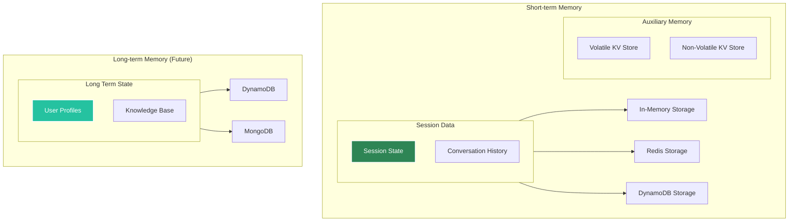

# Memory Management

Agent Kernel supports pluggable memory backends for both short-term, long-term storage and auxiliary needs. These are bound to the session of the conversation and automatically saved and loaded for each session, when needed. 

## Memory Architecture



## Short-term Memory

This memory is not directly manipulatable by you, but it is automatically changed when the Agents are executed and conversations happen. This memory is part of your LLM context. Hence adding large content (e.g. file content) to the context is not recommended.


**Storage Options:**
- In-memory (development)
- Redis (production)
- DynamoDB (AWS serverless)

## Long-term Memory
This will be a knowledge base that has been collected over a time for a specific user or a session. It will be stored separately and added to the context at a start of a session.

Available soon!

## Auxiliary Memory
Agent Kernel also supports an "Auxiliary memory" which is not part of the LLM context. This memory can be used to store additional data to support Tools without worrying about the context lengths. You can directly store/retrieve from this memory and add to the conversational state as required. Consider this as built-in key value DB.  You can select either volatile or non volatile key value store or both. 

**Note**: Non-volatile KV Store uses the same memory store type (i.e. InMemory, DynamoDB, Redis) you select for the short term memory.

You can manipulate Auxiliary memory in Pre/Post Hooks and Tools

```python
# when you have the session object directly
v_cache: KeyValueCache = session.get_volatile_cache()
nv_cache: KeyValueCache = session.get_non_volatile_cache()

# when you dont have the session object, you can use the GlobalRuntime.instance().get_volatile_cache()
v_cache: KeyValueCache = GlobalRuntime.instance().get_volatile_cache()
nv_cache: KeyValueCache =  GlobalRuntime.instance().get_non_volatile_cache()
```
A comprehensive example is provided in **[examples/memory/key_value_cache/](https://github.com/yaalalabs/agent-kernel/tree/develop/examples/memory/key_value_cache)**
## Configuration

```bash
# Short-term (session) - Redis
export AK_SESSION__TYPE=redis
export AK_SESSION__REDIS__URL=redis://localhost:6379

# Short-term (session) - DynamoDB
export AK_SESSION__TYPE=dynamodb
export AK_SESSION__DYNAMODB__TABLE_NAME=agent-kernel-sessions
```
