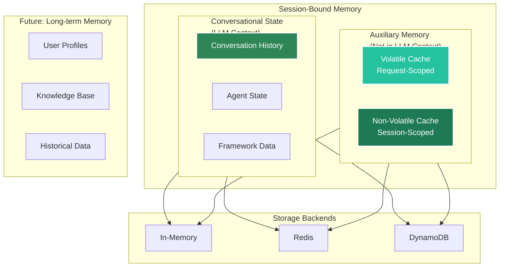
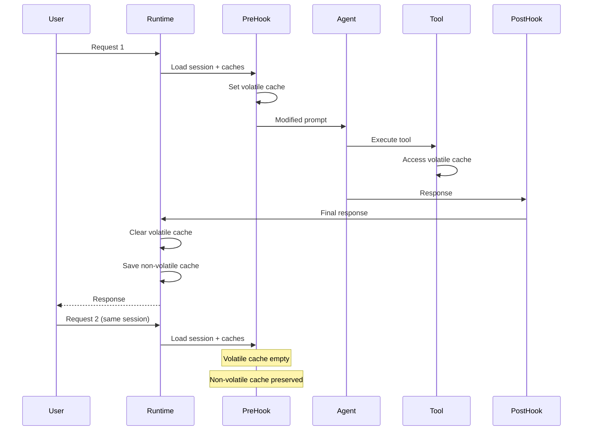

# Memory Management

Agent Kernel provides a sophisticated memory management system with multiple layers designed for different use cases and lifecycles. Understanding these layers helps you build efficient, context-aware agents that don't bloat LLM prompts.

## Memory Architecture



## Memory Layers

Agent Kernel provides three distinct memory layers, each with different purposes and lifecycles.

### 1. Conversational State (Short-term Memory)

**Purpose**: Store conversation history and agent state that becomes part of the LLM context.

**Lifecycle**: Session-scoped, persists across multiple requests within a session.

**Characteristics**:
- ✅ Automatically managed by framework adapters
- ✅ Included in LLM context window
- ✅ Persists across agent invocations
- ⚠️ Contributes to token usage
- ⚠️ Should not contain large data (files, documents)

**Managed By**: Framework-specific runners (OpenAI, LangGraph, CrewAI, ADK)

**What's Stored**:
- User messages and agent responses
- Multi-turn conversation history
- Agent state and context
- Framework-specific metadata

**You Don't Manage This Directly**: The framework adapters automatically handle conversation persistence.

[Learn about session management →](/docs/core-concepts/session)

### 2. Auxiliary Memory (Smart Caching)

**Purpose**: Store additional data needed by tools and hooks **without bloating the LLM context**.

Agent Kernel provides two types of auxiliary caches with identical APIs but different lifecycles:

#### Volatile Cache (Request-Scoped)

**Lifecycle**: Cleared automatically after each request completes.

**Perfect For**:
- 📄 RAG context retrieved from knowledge bases
- 📁 File contents loaded for processing
- 🧮 Intermediate calculation results
- 🔄 Temporary processing data
- 🎯 Request-specific metadata

**Benefits**:
- ✅ Keeps LLM prompts clean and focused
- ✅ Reduces token usage and costs
- ✅ Auto-cleanup - no memory leaks
- ✅ Fast access during request lifecycle

**Example Use Cases**:
```python
# Store RAG context in pre-hook
v_cache.set("rag_context", retrieved_documents)

# Access in tool without passing through LLM
def my_tool():
    context = v_cache.get("rag_context")
    # Process context...

# Automatically cleared after request
```

#### Non-Volatile Cache (Session-Scoped)

**Lifecycle**: Persists throughout the entire session, across multiple requests.

**Perfect For**:
- ⚙️ User preferences and settings
- 🏷️ Session metadata and tags
- 📊 Analytics and tracking data
- 🔐 Authorization context
- 💾 Configuration data

**Benefits**:
- ✅ Survives across multiple requests
- ✅ Shared between hooks and tools
- ✅ Not included in LLM context
- ✅ Same backend as session storage

**Example Use Cases**:
```python
# Store user preferences
nv_cache.set("user_language", "es")
nv_cache.set("user_timezone", "America/New_York")

# Access in subsequent requests
def my_hook():
    lang = nv_cache.get("user_language")
    # Customize response based on preference...
```

### 3. Long-term Memory (Coming Soon)

**Purpose**: Persistent knowledge base and user profiles that span multiple sessions.

**Planned Features**:
- User profile storage
- Historical interaction analysis
- Knowledge base integration
- Cross-session learning

**Status**: Under development

## Using Auxiliary Memory

### Accessing Caches

You can access auxiliary memory in two ways:

#### Method 1: From Session Object

When you have direct access to the session:

```python
from agentkernel import Prehook, Session
from agentkernel.core.memory import KeyValueCache

class MyHook(Prehook):
    async def on_run(self, session: Session, agent, requests):
        # Get caches from session
        v_cache: KeyValueCache = session.get_volatile_cache()
        nv_cache: KeyValueCache = session.get_non_volatile_cache()
        
        # Use the caches
        v_cache.set("temp_data", "value")
        user_pref = nv_cache.get("user_language")
        
        return requests
```

#### Method 2: From Global Runtime

When you don't have session access (e.g., in tools):

```python
from agentkernel.core import GlobalRuntime
from agentkernel.core.memory import KeyValueCache

def my_tool():
    # Get caches from global runtime
    v_cache: KeyValueCache = GlobalRuntime.instance().get_volatile_cache()
    nv_cache: KeyValueCache = GlobalRuntime.instance().get_non_volatile_cache()
    
    # Use the caches
    context = v_cache.get("rag_context")
    settings = nv_cache.get("user_settings")
```

### KeyValueCache API

Both volatile and non-volatile caches implement the same `KeyValueCache` interface:

```python
# Set a value
cache.set(key: str, value: Any)

# Get a value (returns None if not found)
value = cache.get(key: str) -> Any | None

# Get with default value
value = cache.get(key: str, default: Any) -> Any

# Check if key exists
exists = cache.has(key: str) -> bool

# Delete a key
cache.delete(key: str)

# Clear all keys
cache.clear()

# Get all keys
keys = cache.keys() -> list[str]
```

### Complete Example

See a comprehensive example with RAG context injection:

**[examples/memory/key-value-cache/](https://github.com/yaalalabs/agent-kernel/tree/develop/examples/memory/key-value-cache)**

This example demonstrates:
- Using volatile cache for RAG context
- Using non-volatile cache for user preferences
- Accessing caches from hooks and tools
- Best practices for memory management
## Common Patterns and Use Cases

### Pattern 1: RAG Context Injection

Use volatile cache to inject retrieved context without bloating prompts:

```python
from agentkernel import Prehook
from agentkernel.core.model import AgentRequestText

class RAGHook(Prehook):
    def __init__(self, knowledge_base):
        self.knowledge_base = knowledge_base
    
    async def on_run(self, session, agent, requests):
        if requests and isinstance(requests[0], AgentRequestText):
            prompt = requests[0].text
        else:
            return requests
        
        # Retrieve relevant context
        context = self.knowledge_base.search(prompt)
        
        # Store in volatile cache (not in LLM context)
        v_cache = session.get_volatile_cache()
        v_cache.set("rag_context", context)
        v_cache.set("search_query", prompt)
        
        # Inject concise reference into prompt
        enriched_prompt = f"""[Context available in cache]

Question: {prompt}

Use the context from the knowledge base to answer."""
        
        return [AgentRequestText(text=enriched_prompt)]
    
    def name(self):
        return "RAGHook"
```

**Benefits**:
- ✅ Full context available to tools via cache
- ✅ LLM prompt stays clean and focused
- ✅ Reduced token usage
- ✅ Auto-cleanup after request

### Pattern 2: User Preferences

Store user settings persistently across requests:

```python
from agentkernel import Prehook

class UserPreferencesHook(Prehook):
    async def on_run(self, session, agent, requests):
        nv_cache = session.get_non_volatile_cache()
        
        # Check for existing preferences
        if not nv_cache.has("user_initialized"):
            # First-time user - set defaults
            nv_cache.set("user_language", "en")
            nv_cache.set("user_timezone", "UTC")
            nv_cache.set("user_initialized", True)
        
        # Get preferences
        lang = nv_cache.get("user_language")
        tz = nv_cache.get("user_timezone")
        
        # Use preferences to customize behavior
        # ...
        
        return requests
```

### Pattern 3: Multi-Stage Processing

Share intermediate results between hooks and tools:

```python
# In pre-hook: Process and cache data
class DataPreprocessorHook(Prehook):
    async def on_run(self, session, agent, requests):
        v_cache = session.get_volatile_cache()
        
        # Expensive preprocessing
        processed_data = self.preprocess(requests)
        
        # Cache for tools
        v_cache.set("preprocessed_data", processed_data)
        v_cache.set("processing_timestamp", time.time())
        
        return requests

# In tool: Access cached data
def my_analysis_tool():
    from agentkernel.core import GlobalRuntime
    
    v_cache = GlobalRuntime.instance().get_volatile_cache()
    data = v_cache.get("preprocessed_data")
    
    # Use preprocessed data without reprocessing
    results = analyze(data)
    return results
```

### Pattern 4: Session Analytics

Track session metadata without affecting LLM context:

```python
class AnalyticsHook(Prehook):
    async def on_run(self, session, agent, requests):
        nv_cache = session.get_non_volatile_cache()
        
        # Track interaction count
        count = nv_cache.get("interaction_count", default=0)
        nv_cache.set("interaction_count", count + 1)
        
        # Track topics discussed
        topics = nv_cache.get("topics", default=[])
        if requests and isinstance(requests[0], AgentRequestText):
            detected_topic = self.detect_topic(requests[0].text)
            if detected_topic not in topics:
                topics.append(detected_topic)
                nv_cache.set("topics", topics)
        
        # Store session start time
        if not nv_cache.has("session_start"):
            nv_cache.set("session_start", time.time())
        
        return requests
```

## Storage Backend Configuration

Both conversational state and auxiliary memory use the same storage backend configured for sessions:

```bash
# Configure storage type
export AK_SESSION__TYPE=redis  # Options: 'in_memory', 'redis', 'dynamodb'

# Redis configuration
export AK_SESSION__REDIS__URL=redis://localhost:6379
export AK_SESSION__REDIS__PASSWORD=your-password
export AK_SESSION__REDIS__TTL=604800  # 7 days
export AK_SESSION__REDIS__PREFIX=ak:sessions:

# DynamoDB configuration
export AK_SESSION__DYNAMODB__TABLE_NAME=agent-kernel-sessions
export AK_SESSION__DYNAMODB__TTL=604800  # 7 days (0 to disable)

# Optional: Enable session caching
export AK_SESSION__CACHE__SIZE=256
```

**All memory layers share the same backend**:
- Conversational state → Stored in session
- Non-volatile cache → Stored in session
- Volatile cache → In-memory only (always cleared after request)

[See session configuration details →](/docs/core-concepts/session)

## Best Practices

### Choose the Right Memory Layer

**Use Conversational State For**:
- ✅ User messages and agent responses
- ✅ Multi-turn conversation flow
- ✅ Information that should influence LLM decisions

**Use Volatile Cache For**:
- ✅ RAG context and retrieved documents
- ✅ File contents and large data
- ✅ Intermediate processing results
- ✅ Request-specific temporary data

**Use Non-Volatile Cache For**:
- ✅ User preferences and settings
- ✅ Session metadata and analytics
- ✅ Configuration data
- ✅ Cross-request shared state

### Avoid Common Mistakes

**❌ Don't: Store large files in conversational state**
```python
# Wrong - bloats LLM context
session.set("file_content", large_file_data)
```

**✅ Do: Use volatile cache for large data**
```python
# Correct - keeps context clean
v_cache.set("file_content", large_file_data)
```

**❌ Don't: Put user preferences in volatile cache**
```python
# Wrong - cleared after each request
v_cache.set("user_language", "es")
```

**✅ Do: Use non-volatile cache for persistent data**
```python
# Correct - persists across requests
nv_cache.set("user_language", "es")
```

### Memory Lifecycle Understanding



### Performance Optimization

**Enable Session Caching** (with sticky sessions):
```bash
export AK_SESSION__CACHE__SIZE=256
```

**Benefits**:
- Faster session access
- Reduced backend I/O
- Lower costs (especially DynamoDB)

**Requirement**: Use with sticky sessions or consistent routing

### Monitoring and Debugging

**Track cache usage in logs**:
```python
class DebugHook(Prehook):
    async def on_run(self, session, agent, requests):
        v_cache = session.get_volatile_cache()
        nv_cache = session.get_non_volatile_cache()
        
        # Log cache contents for debugging
        print(f"Volatile cache keys: {v_cache.keys()}")
        print(f"Non-volatile cache keys: {nv_cache.keys()}")
        
        return requests
```

**Monitor cache sizes**:
```python
def get_cache_stats(session):
    nv_cache = session.get_non_volatile_cache()
    
    # Count items
    item_count = len(nv_cache.keys())
    
    # Estimate size (approximate)
    total_size = 0
    for key in nv_cache.keys():
        value = nv_cache.get(key)
        total_size += len(str(value))
    
    return {
        "items": item_count,
        "estimated_bytes": total_size
    }
```

## Summary

Agent Kernel's memory management provides three distinct layers:

**Conversational State** (Short-term Memory):
- Automatically managed by framework adapters
- Part of LLM context
- Session-scoped persistence
- Contains conversation history

**Volatile Cache** (Request-scoped):
- Temporary storage for large data
- Not in LLM context
- Cleared after each request
- Perfect for RAG context, files, intermediate results

**Non-Volatile Cache** (Session-scoped):
- Persistent auxiliary storage
- Not in LLM context
- Survives across requests
- Perfect for preferences, metadata, analytics

**Key Takeaways**:
- Use the right memory layer for your data
- Keep LLM context clean with auxiliary caches
- Leverage volatile cache for request-scoped data
- Store preferences in non-volatile cache
- All layers share the same storage backend

## Related Documentation

- **[Session Management](/docs/core-concepts/session)** - Detailed session configuration and lifecycle
- **[Execution Hooks](/docs/integrations/hooks)** - Access memory in pre/post-execution hooks
- **[Configuration](/docs/core-concepts/configuration)** - Storage backend configuration
- **[Examples](https://github.com/yaalalabs/agent-kernel/tree/develop/examples/memory/key-value-cache)** - Complete working examples
- **[AWS Serverless](/docs/deployment/aws-serverless)** - DynamoDB configuration for Lambda
- **[AWS Containerized](/docs/deployment/aws-containerized)** - Redis configuration for ECS
