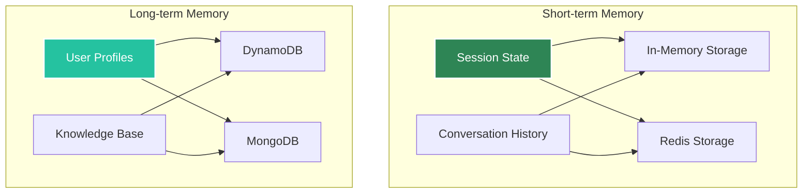

# Memory Management

Agent Kernel supports pluggable memory backends for both short-term and long-term storage.

## Memory Architecture



## Short-term Memory

Managed via Session objects:

```python
# Conversation history stored in session
session.set("conversation_history", messages)
```

**Storage Options:**
- In-memory (development)
- Redis (production)

## Long-term Memory

Framework-specific implementations:

```python
# LangGraph with DynamoDB
from langgraph.checkpoint.dynamodb import DynamoDBSaver

checkpointer = DynamoDBSaver(table_name="agent_memory")
```

**Storage Options:**
- AWS DynamoDB
- MongoDB
- Custom implementations

## Configuration

```bash
# Short-term (session)
export AK_SESSION_STORAGE=redis
export AK_REDIS_URL=redis://localhost:6379

# Long-term (framework-specific)
export DYNAMODB_TABLE=agent_memory
export MONGODB_URI=mongodb://localhost:27017
```
