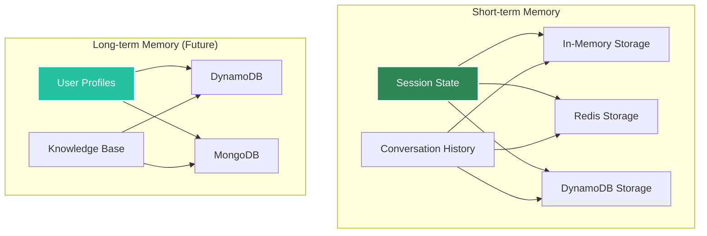

# Memory Management

Agent Kernel supports pluggable memory backends for both short-term and long-term storage.

## Memory Architecture



## Short-term Memory

Managed via Session objects:

```python
# Conversation history stored in session
session.set("session_id", data)
```

**Storage Options:**
- In-memory (development)
- Redis (production)
- DynamoDB (AWS serverless)

## Long-term Memory

Available soon!

## Configuration

```bash
# Short-term (session) - Redis
export AK_SESSION__TYPE=redis
export AK_SESSION__REDIS__URL=redis://localhost:6379

# Short-term (session) - DynamoDB
export AK_SESSION__TYPE=dynamodb
export AK_SESSION__DYNAMODB__TABLE_NAME=agent-kernel-sessions
```
