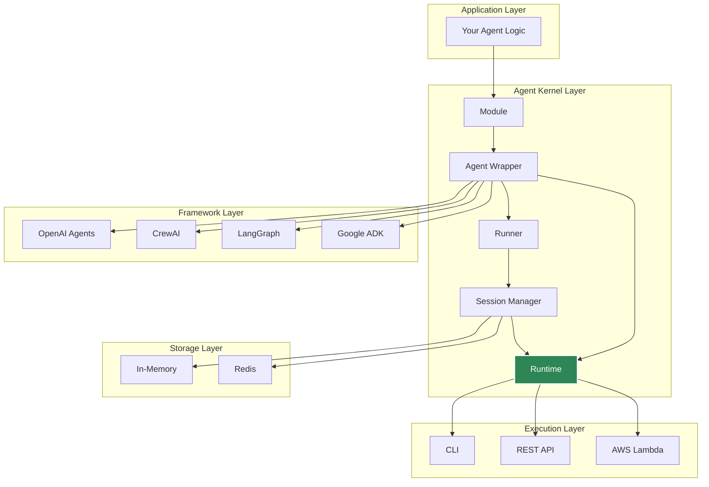
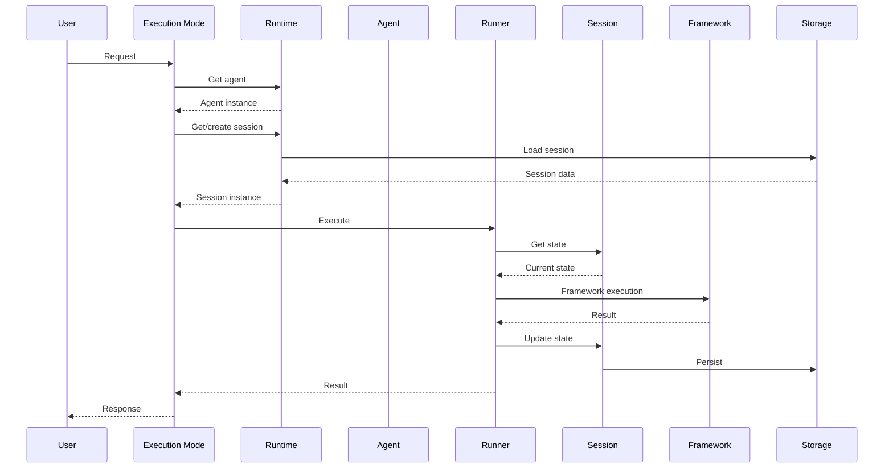

# Architecture Overview

Understanding Agent Kernel's architecture helps you build robust, scalable AI agent systems.

## High-Level Architecture

## Key Design Principles

### 1. Framework Agnostic

Agent Kernel provides a thin adapter layer that doesn't impose its own opinions on agent logic.

### 2. Minimal Overhead

The framework adds minimal latency and complexity - it's primarily orchestration and state management.

### 3. Production Ready

Built-in support for:
- Session persistence
- Multi-agent coordination
- Distributed deployment
- Error handling and retry
- Observability and tracing

### 4. Extensible

Easy to add:
- New framework adapters
- Custom storage backends
- Additional execution modes
- Custom middleware

## Component Interactions

## Next Steps

- [Execution Flow](./execution-flow)
- [Session Management](./session-management)
- [Memory Management](./memory-management)
