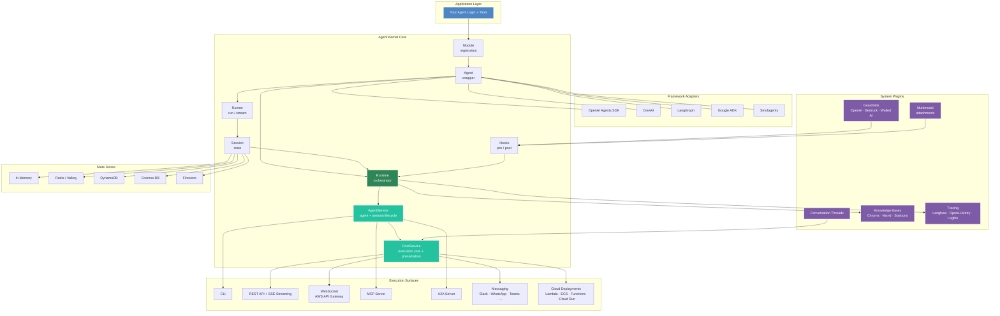
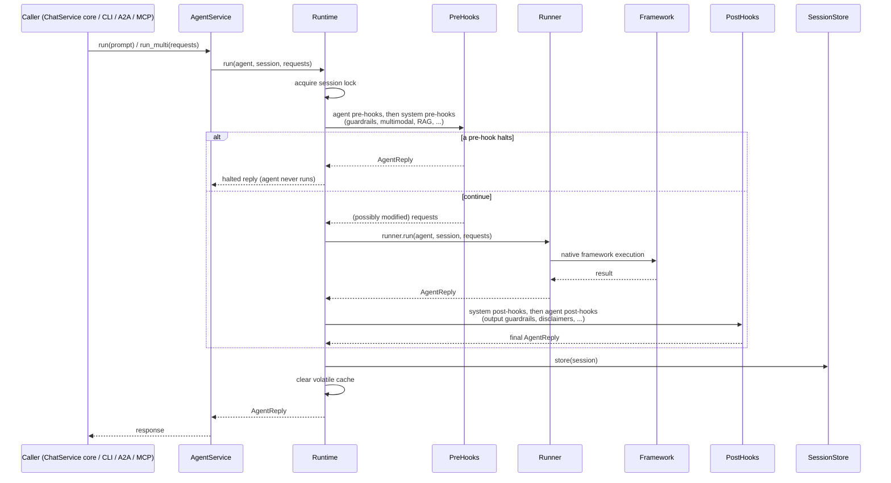
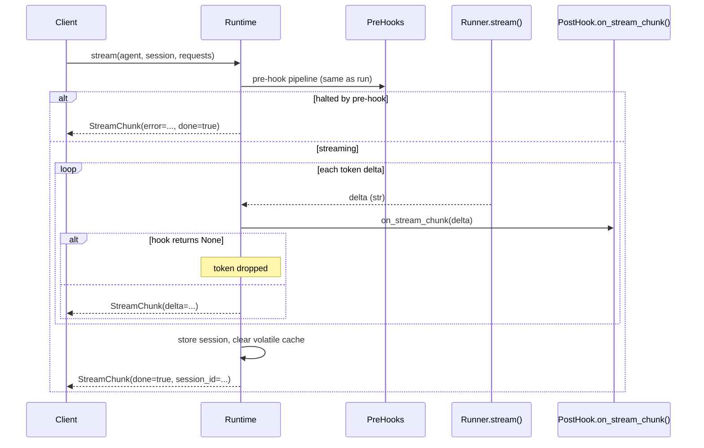
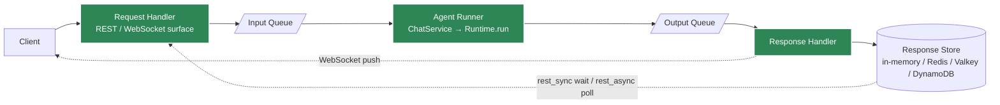

# Architecture Overview

Understanding Agent Kernel's architecture helps you build robust, scalable AI agent systems.

## High-Level Architecture

Agent Kernel sits between your agent logic (written in any supported framework) and the surfaces that expose it to the world: CLI, REST/SSE, WebSocket, MCP, A2A, messaging platforms, and cloud deployment targets.

```mermaid
graph TB
    subgraph APP["Application Layer"]
        A[Your Agent Logic + Tools]
    end

    subgraph AK["Agent Kernel Core"]
        B[Module<br/>registration]
        C[Agent<br/>wrapper]
        D[Runner<br/>run / stream]
        F[Runtime<br/>orchestrator]
        E[Session<br/>state]
        HK[Hooks<br/>pre / post]
        AS[AgentService<br/>agent + session lifecycle]
        SVC[ChatService<br/>execution core + presentation]
    end

    subgraph FW["Framework Adapters"]
        G[OpenAI Agents SDK]
        H[CrewAI]
        I[LangGraph]
        J[Google ADK]
        SA[Smolagents]
    end

    subgraph SYS["System Plugins"]
        GR[Guardrails<br/>OpenAI · Bedrock · Walled AI]
        MM[Multimodal<br/>attachments]
        TH[Conversation Threads]
        KB[Knowledge Bases<br/>Chroma · Neo4j · Starburst]
        TR[Tracing<br/>Langfuse · OpenLLMetry · Logfire]
    end

    subgraph STORE["State Stores"]
        K[In-Memory]
        L[Redis / Valkey]
        M[DynamoDB]
        N[Cosmos DB]
        FS[Firestore]
    end

    subgraph EXEC["Execution Surfaces"]
        O[CLI]
        P[REST API + SSE Streaming]
        WS[WebSocket<br/>AWS API Gateway]
        Q[MCP Server]
        R[A2A Server]
        MSG[Messaging<br/>Slack · WhatsApp · Teams · ...]
        DEP[Cloud Deployments<br/>Lambda · ECS · Functions · Cloud Run]
    end

    A --> B
    B --> C
    C --> D
    C --> F
    D --> E
    E --> F
    HK --> F
    F --> AS
    AS --> SVC

    C --- G
    C --- H
    C --- I
    C --- J
    C --- SA

    GR --> HK
    MM --> HK
    TH --> SVC
    F --> KB
    F --> TR

    E --> K
    E --> L
    E --> M
    E --> N
    E --> FS

    AS --> O
    SVC --> P
    SVC --> WS
    AS --> Q
    AS --> R
    SVC --> MSG
    SVC --> DEP

    style A fill:#4e85c5,stroke:#fff,stroke-width:2px,color:#fff
    style F fill:#2e8555,stroke:#fff,stroke-width:2px,color:#fff
    style SVC fill:#25c2a0,stroke:#fff,stroke-width:2px,color:#fff
    style AS fill:#25c2a0,stroke:#fff,stroke-width:2px,color:#fff
    style KB fill:#7d5ba6,stroke:#fff,stroke-width:2px,color:#fff
    style GR fill:#7d5ba6,stroke:#fff,stroke-width:2px,color:#fff
    style MM fill:#7d5ba6,stroke:#fff,stroke-width:2px,color:#fff
    style TH fill:#7d5ba6,stroke:#fff,stroke-width:2px,color:#fff
    style TR fill:#7d5ba6,stroke:#fff,stroke-width:2px,color:#fff
```

**Layers at a glance:**

| Layer | Components | Responsibility |
|-------|-----------|----------------|
| Application | Your agents and tools | Domain logic, written with any supported framework |
| Core | `Module`, `Agent`, `Runner`, `Session`, `Runtime`, hooks, `AgentService` (agent/session lifecycle for stateful clients), `ChatService` (execution core `execute`/`execute_stream` plus HTTP presentation wrappers `process_*`) | Framework-agnostic orchestration, state, and the run/stream pipeline |
| Framework adapters | OpenAI Agents SDK, CrewAI, LangGraph, Google ADK, Smolagents | Wrap native agents behind the core abstractions |
| System plugins | Guardrails, multimodal, conversation threads, knowledge bases, tracing | Cross-cutting features implemented as hooks, tools, and services |
| State stores | In-memory, Redis, Valkey, DynamoDB, Cosmos DB, Firestore | Pluggable persistence for sessions, threads, attachments, and responses |
| Execution surfaces | CLI, REST (JSON + SSE), WebSocket, MCP, A2A, messaging integrations, cloud deployments | How requests reach the runtime and how replies get back out |

## ChatService vs AgentService

Two services sit between the execution surfaces and the `Runtime`, and they solve different problems.
`AgentService` is a **stateful conversation object**: it holds one selected agent and one session, and
the caller drives its lifecycle. `ChatService` is a **stateless chat-request processor**: every call
carries the full request envelope, and agent/session resolution happens fresh per request.

| | `AgentService` | `ChatService` |
|---|----------------|---------------|
| Statefulness | Stateful: holds the selected agent and session across calls (`select()`, `new()`, `clear()`, `load()`) | Stateless: a fresh agent/session resolution on every call |
| Input | A prompt string (`run`) or an `AgentRequest` list (`run_multi`/`stream_multi`) | A `BaseChatRequest` envelope (prompt, agent, session_id, user_id, ...), optionally with a prebuilt `AgentRequest` list |
| Validation and building | None: the caller prepares everything | Validates the envelope; builds the request list from the payload, or accepts a prebuilt one |
| Output | Typed `AgentReply` / raw `StreamChunk`s | Execution core: typed reply plus session id. Presentation wrappers: JSON dicts, SSE frames, `HTTPException` |
| Error handling | Exceptions propagate | Core: exceptions propagate. Wrappers: `ValueError` maps to 400, anything else to 500 |
| Callers today | CLI, A2A, MCP | REST handler and deployment adapters (wrappers); messaging integrations and the thread handler (core) |

**Use `ChatService`** when handling chat traffic where each request arrives self-contained with its
`session_id`: the presentation wrappers (`process_*`) if you want the standard HTTP shapes, or the
execution core (`execute`/`execute_stream`) if your surface owns its own transport, reply formatting,
and error UX.

**Use `AgentService`** when building an interactive or stateful client that owns a running
conversation: selecting agents, reusing one session across turns, clearing or recreating it. The CLI's
`!select` / `!new` / `!clear` commands are the canonical example.

They are layers, not alternatives: the ChatService core drives `AgentService` internally for agent
selection and session loading, so going through `ChatService` never bypasses `AgentService` semantics.
And neither layer should be skipped: entry surfaces never call `Runtime` directly, and behavior that
must apply to every run regardless of surface belongs in a `Runtime` pre/post hook. See the
[execution flow](./execution-flow) for the per-surface layering diagram and call rubric.

## Key Design Principles

### 1. Framework Agnostic

All core abstractions (`Session`, `Agent`, `Runner`, `Module`, `Runtime`) are framework-independent. Framework-specific logic lives exclusively in adapter modules; the same hooks, tools, session stores, and deployment targets work with every supported framework, and agents from different frameworks can run side by side in one runtime.

### 2. Minimal Overhead

The kernel adds minimal latency and complexity; it's primarily orchestration and state management around your framework's native execution.

### 3. Config-Driven Behavior

All runtime behavior is governed by `AKConfig` (Pydantic-based), loaded from YAML/JSON files and environment variables (`AK_` prefix, `__` for nesting). The same application code switches between synchronous REST, SSE streaming, queue-backed async, and WebSocket delivery purely through configuration.

### 4. Production Ready

Built-in support for:
- Multi-cloud session persistence (AWS, Azure, GCP)
- Token-level streaming (SSE over REST, WebSocket on AWS serverless)
- Queue-pipeline execution everywhere: in-process by default, SQS-backed on Lambda and ECS, Kafka and NATS JetStream for on-prem / Kubernetes (deployed by the [Helm chart](../deployment/onprem-kubernetes))
- Input/output guardrails and PII redaction
- Multi-agent coordination and multimodal attachments
- Observability and tracing (Langfuse, OpenLLMetry, Logfire)

### 5. Extensible

Pluggable via well-defined interfaces:
- New framework adapters (`Agent`/`Runner`/`Module`/`ToolBuilder` subclasses)
- Custom session, thread, and attachment storage backends
- Custom guardrail and tracing providers
- Pre/post execution hooks
- Knowledge base backends

## The Run Pipeline

`Runtime.run()` is the heart of every execution surface. It wraps the framework call with session locking, hooks, and persistence:

```mermaid
sequenceDiagram
    participant U as Caller (ChatService core / CLI / A2A / MCP)
    participant SVC as AgentService
    participant R as Runtime
    participant PH as PreHooks
    participant Run as Runner
    participant F as Framework
    participant PoH as PostHooks
    participant Store as SessionStore

    U->>SVC: run(prompt) / run_multi(requests)
    SVC->>R: run(agent, session, requests)
    R->>R: acquire session lock
    R->>PH: agent pre-hooks, then system pre-hooks<br/>(guardrails, multimodal, RAG, ...)
    alt a pre-hook halts
        PH-->>R: AgentReply
        R-->>SVC: halted reply (agent never runs)
    else continue
        PH-->>R: (possibly modified) requests
        R->>Run: runner.run(agent, session, requests)
        Run->>F: native framework execution
        F-->>Run: result
        Run-->>R: AgentReply
        R->>PoH: system post-hooks, then agent post-hooks<br/>(output guardrails, disclaimers, ...)
        PoH-->>R: final AgentReply
    end
    R->>Store: store(session)
    R->>R: clear volatile cache
    R-->>SVC: AgentReply
    SVC-->>U: response
```

Key properties:

- **Session locking**: `async with session` serializes concurrent requests for the same session and sets the session as the current context (`Session.current()` works anywhere inside the run).
- **Pre-hooks** can rewrite the request list or halt execution by returning an `AgentReply` (this is how input guardrails block a request before the LLM sees it).
- **Post-hooks** can transform the reply (output guardrails, disclaimers, redaction).
- **Persistence and cleanup** always run: the session is stored and the volatile cache cleared even if the run raises.

## The Streaming Pipeline

`Runtime.stream()` is the streaming counterpart, sharing the same pre-hook pipeline but yielding `StreamChunk` objects as tokens arrive:

```mermaid
sequenceDiagram
    participant U as Client
    participant R as Runtime
    participant PH as PreHooks
    participant Run as Runner.stream()
    participant PoH as PostHook.on_stream_chunk()

    U->>R: stream(agent, session, requests)
    R->>PH: pre-hook pipeline (same as run)
    alt halted by pre-hook
        R-->>U: StreamChunk(error=..., done=true)
    else streaming
        loop each token delta
            Run-->>R: delta (str)
            R->>PoH: on_stream_chunk(delta)
            alt hook returns None
                Note over R: token dropped
            else
                R-->>U: StreamChunk(delta=...)
            end
        end
        R->>R: store session, clear volatile cache
        R-->>U: StreamChunk(done=true, session_id=...)
    end
```

- Each `StreamChunk` carries `delta`, `done`, `error`, and `session_id` fields.
- Post-hooks can filter or redact individual tokens via `on_stream_chunk()`; returning `None` drops the token.
- Delivery depends on the surface: the REST API serves chunks as **Server-Sent Events** (`text/event-stream`); AWS serverless and AWS ECS containerized WebSocket modes push each chunk as a separate `STREAM_CHUNK` WebSocket message (optionally through SQS queues).
- OpenAI Agents SDK, LangGraph, and Google ADK stream natively; CrewAI and Smolagents do not support token streaming (their runners raise `NotImplementedError` in stream mode).

See [Execution Flow](./execution-flow) for the full request lifecycle including the queue-based and WebSocket paths.

## The Queue Execution Pipeline

Chat execution is built on one logical pipeline
([#495](https://github.com/yaalalabs/agent-kernel/issues/495)): every chat request travels five
components, with the queue transport and the process topology selected purely by configuration.

```mermaid
graph LR
    CL[Client] --> RH[Request Handler<br/>REST / WebSocket surface]
    RH --> IQ[/Input Queue/]
    IQ --> AR[Agent Runner<br/>ChatService → Runtime.run]
    AR --> OQ[/Output Queue/]
    OQ --> RSH[Response Handler]
    RSH --> RS[(Response Store<br/>in-memory / Redis / Valkey / DynamoDB)]
    RSH -. WebSocket push .-> CL
    RS -. rest_sync wait / rest_async poll .-> RH

    style RH fill:#2e8555,stroke:#fff,stroke-width:2px,color:#fff
    style AR fill:#2e8555,stroke:#fff,stroke-width:2px,color:#fff
    style RSH fill:#2e8555,stroke:#fff,stroke-width:2px,color:#fff
```

The queue transport is a pluggable backend (`execution.queues.type`):

| Transport | Status | Durability | Typical use |
|-----------|--------|------------|-------------|
| `in_memory` | ✅ the default | In-process only | Local development, single-container deployments: full queue semantics (per-session FIFO, bounded retry, deduplication) with zero backing services |
| SQS | ✅ on AWS Lambda and ECS (via the deployment adapters) | Durable, FIFO | Production on AWS |
| `kafka`, `nats` | ✅ (`kafka`/`nats` extras) | Durable | Production on-prem / Kubernetes |

**One pipeline, three topologies.** The logical components map onto processes per deployment:

```mermaid
graph TB
    subgraph SP["Single-process (in_memory: the default)"]
        direction LR
        SP1[REST API thread] --> SP2[agent-runner threads] --> SP3[response-handler threads]
    end
    subgraph TP["Two-process (broker transport: AWS ECS today)"]
        direction LR
        TP1["IO container<br/>Request Handler + Response Handler"] <--> TPQ[/broker queues/] <--> TP2["Agent Runner container<br/>auto-scaled consumer pool"]
    end
    subgraph LM["Three-way (AWS Lambda)"]
        direction LR
        LM1[Request Handler λ] --> LMQ1[/SQS/] --> LM2[Agent Runner λ] --> LMQ2[/SQS/] --> LM3[Response Handler λ]
    end
```

- **Single-process**: a bare `RESTAPI.run()` boots all five components as threads in one process:
  this is what local REST and single-container cloud deployments run. Sessions are processed in
  order and in parallel across worker threads, failed messages retry up to `max_receive_count`,
  and duplicates are dropped: the same semantics as the broker transports, minus durability.
- **Two-process**: the IO process (request handler + response handler) and the agent-runner
  process scale independently over a durable broker. Today this is AWS ECS Fargate with SQS; see
  [AWS Containerized](../deployment/aws-containerized).
- **Three-way**: on AWS Lambda the three roles are three functions wired by SQS event source
  mappings; see [AWS Serverless](../deployment/aws-serverless).

The activation rule: a bare `RESTAPI.run()` (no explicit handlers) runs the pipeline; surfaces
constructed with explicit handlers (the thread handler, messaging integrations, custom handlers)
and the `AgentService` clients (CLI, A2A, MCP) keep their direct execution paths. The client
receives the reply either by **polling** the response store (`rest_sync` waits server-side,
`rest_async` polls with a `request_id`), by **SSE** (`stream` on the REST surface), or by
**WebSocket push** (`async`/`stream` on AWS today).

## Next Steps

- [Execution Flow](./execution-flow): request lifecycle across all execution modes
- [Session Management](/docs/core-concepts/session): detailed session configuration
- [Memory Management](./memory-management): advanced memory features
- [Knowledge Bases](../advanced/knowledge-bases.md): knowledge backends and KB routing
- [Deployment Overview](../deployment/overview): choosing a deployment mode
