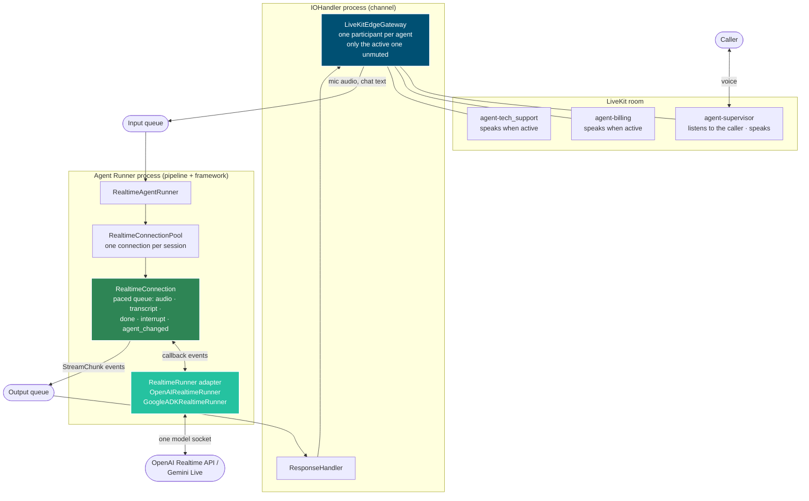
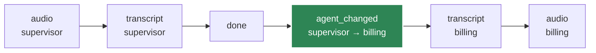
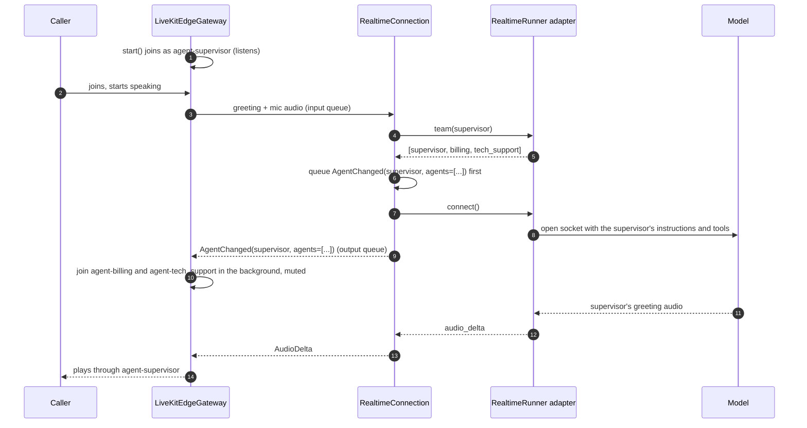
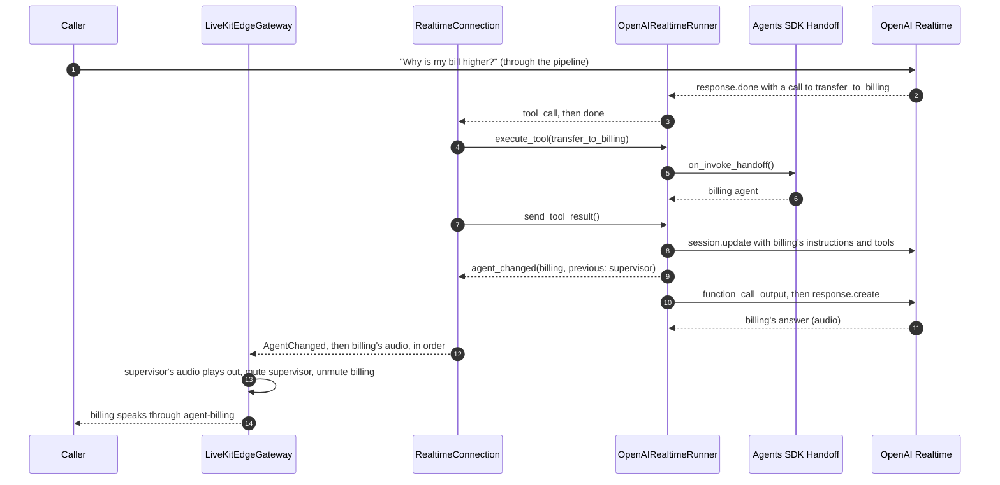
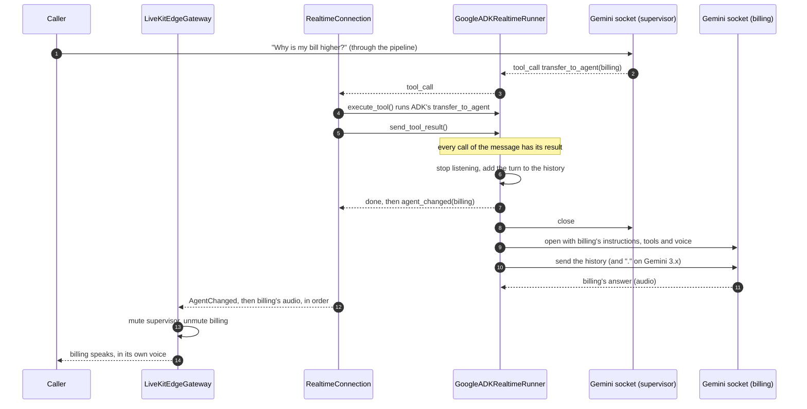

# Realtime Voice Internals

How realtime voice works under the hood: the components, the contract between them, and the runtime flows, including **multi-agent handoffs** (a supervisor handing the call to a specialist and back). This page is for contributors and for anyone writing a custom realtime adapter or a new voice channel. For setting up a voice agent, see the [LiveKit integration](../integrations/livekit.md).

## Component view

Realtime voice is split into three layers with one shared contract between them. The **channel** owns everything the caller sees and hears. The **pipeline** keeps every output in order and paces audio at playback speed. The **framework adapter** talks to the model and runs the framework's own handoffs. The channel never imports a framework SDK, and an adapter never imports pipeline or channel types: they share only the stream events, among them `AgentChanged`.

The queues work the same on every transport. With `in_memory`, both boxes run in one process. With `kafka`, `nats` or `sqs`, they are two processes, and the gateway never sees the agents: everything it learns about them, including the team it shows in the room, arrives through the output queue.

What stays fixed whatever the number of agents:

| Thing | Is |
|---|---|
| One LiveKit room | One AK session |
| One AK session | One `RealtimeConnection` in the pool |
| Model socket | OpenAI: one for the whole call. Gemini: one at a time |
| Registered agents | Only the entry agent. Specialists are reached through the framework's own handoff graph |

## The adapter contract

A `RealtimeRunner` adapter talks to the model and reports what it does through the `callback` the pool gives to `connect()`. The pool owns everything around the socket: pacing, barge-in decisions, tool execution scopes and queue emission.

| Callback event | Meaning | How the pool emits it |
|---|---|---|
| `audio_delta` | A piece of the model's audio | Paced at playback speed |
| `transcript_delta` | A piece of the model's transcript | In order with its audio |
| `tool_call` | The model called a function (a tool, or a handoff) | Runs `execute_tool()`, then `send_tool_result()` |
| `done` | The model's turn ended | In order, after its audio |
| `interrupt` / `speech_started` | The caller spoke over the model | Drops unheard audio and text, keeps `done` and `agent_changed` |
| `agent_changed` | A handoff moved the call to another agent | In order: after the old agent's output, before the new agent's |
| `error` | The socket failed | Tells the caller, then replaces the connection |

Two more members of the contract:

- **`team(agent)`** returns every agent the conversation can hand off to, the starting agent first. The default is the agent alone; the OpenAI and ADK adapters walk their agent graph. It is read before connecting.
- When a connection opens, the pool itself emits the first `AgentChanged`, naming the starting agent and the team. An adapter reports only the changes after that.

## Keeping output in order

Every output of one connection goes through one queue, in the order the model produced it. The transcript rides with its audio instead of ahead of it, and `AgentChanged` sits exactly between two agents' output. Without that, the new agent's words could reach the room while the previous agent's audio is still playing, and be shown as the previous agent's.

On a barge-in, the queued audio and transcript are dropped (the caller will not hear them), but a queued `done` and `agent_changed` are kept: a handoff that already happened stays true.

## Starting a call: announcing the team

The gateway starts as **one** participant, the one that listens to the caller. When the first model connection opens, the pool announces the starting agent with the adapter's team, and the gateway joins every other agent in the background, muted.

A reconnect announces the team again, and only the agents not in the room yet join. An agent that cannot join speaks through the first participant, with a warning.

## Handoff flow: OpenAI (same socket)

The OpenAI Realtime API can change a session's instructions and tools while the socket is open, with `session.update`. A handoff therefore keeps the socket, and the conversation, which lives in the OpenAI session, stays where it is. This is how the OpenAI Agents SDK's own realtime session runs a handoff. Each handoff is offered to the model as a function (`transfer_to_billing`) and runs through the same path as a tool.

- A tool called in the same response as a handoff still runs as the agent that called it.
- Only the first handoff of a response is performed; any other is answered as not performed.
- The socket's model and voice cannot change, so every agent speaks with the entry agent's model and voice.

## Handoff flow: Google ADK (new socket)

A Gemini Live session's instructions, tools and voice are fixed when the socket opens. A transfer therefore opens a new socket configured for the new agent and seeds it with the conversation so far, which is what ADK's own live runner does. The model calls ADK's own `transfer_to_agent` tool; any tool that sets `tool_context.actions.transfer_to_agent` transfers too, as ADK allows.

The history the adapter keeps and replays is what ADK's session records, minus the audio:

| In the history | From |
|---|---|
| What the caller said | Gemini's transcription of the caller |
| What the agent said | Gemini's transcript of its own audio |
| Text AK sent (for example the greeting) | `send_text()` |
| Every tool call and its result | Each answered tool-call message |

The caller hears a short gap (about 1 to 2 seconds) while the new socket opens; what the caller says during it is not heard.

## OpenAI and Google ADK side by side

| | OpenAI | Google ADK |
|---|---|---|
| Handoff offered as | One function per handoff (`transfer_to_billing`) | ADK's `transfer_to_agent` |
| Who can hand off to whom | Each agent's `handoffs` list | Sub-agents, parent and peers (ADK's rules) |
| Model socket on a handoff | Kept; `session.update` | Replaced; new socket + history |
| Conversation memory | In the OpenAI session | Replayed by AK from its history |
| Gap on a handoff | None | About 1 to 2 seconds |
| Voice | One voice for every agent | Each agent's own voice |
| Checked at connect | Handoffs that filter or nest the history are rejected | Every reachable agent must be an `LlmAgent` with a Live model and a string instruction |

## Where each piece lives

| Piece | Module | Owns |
|---|---|---|
| `AgentChanged` | `agentkernel.core.event` | The speaker-change event, with the team on the first one |
| `RealtimeRunner` | `agentkernel.core.realtime.runner` | The adapter contract, `team()`, shared cleanup |
| `RealtimeConnectionPool`, `RealtimeConnection` | `agentkernel.pipeline.realtime_pool` | Connections per session, ordering, pacing, tool scopes |
| `OpenAIRealtimeRunner` | `agentkernel.framework.openai` | OpenAI socket, handoffs by `session.update` |
| `GoogleADKRealtimeRunner` | `agentkernel.framework.adk` | Gemini socket, transfers by reconnect + history |
| `LiveKitEdgeGateway` | `agentkernel.integration.livekit` | Room, one participant per agent, who is heard and unmuted |
| `StatefulEdgeAdapter` | `agentkernel.integration.adapter` | The interface a new voice channel (for example WhatsApp calling or SIP) implements; it can ignore `AgentChanged` |
