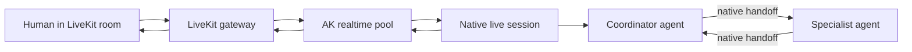

Agent Kernel uses a native live agent session for each call. The OpenAI Agents SDK or Google ADK decides which agent speaks, runs that agent's tools, and handles handoffs. Agent Kernel carries audio and text between that session and the LiveKit room.

```mermaid
flowchart LR
    H[Human in LiveKit room] --> G[LiveKit gateway]
    G --> P[AK realtime pool]
    P --> N[Native live session]
    N --> A[Coordinator agent]
    A -->|native handoff| B[Specialist agent]
    B -->|native handoff| A
    N --> P --> G --> H
```

## Who owns what

| Component | Responsibility |
| --- | --- |
| LiveKit gateway | Room participants, caller audio and chat, playback, and the active speaker's participant |
| AK realtime pool | One connection per AK session, input conversion, output pacing, queue delivery, interruptions, and cleanup |
| OpenAI `RealtimeSession` or ADK `Runner.run_live()` | Model connection, agent turns, native tools, tool results, handoffs, and native session state |

The gateway never sends an agent participant's own audio or chat back to the model. The SDK conversation stays in one AK session even when the speaking agent changes. For example, a coordinator can invite billing to answer, billing can call its invoice tool, and billing can hand the conversation back. The pool only receives the speaker changes and output.

## Runner contract

`RealtimeRunner` is the shared input and output contract. An adapter accepts caller audio with `append_audio()` and text with `send_text()`. Its callback reports `audio_delta`, `transcript_delta`, `agent_changed`, `interrupt`, `speech_started`, `done`, or `error`. The pool paces these events in order, so the next speaker is announced before their first output. An ADK workflow container does not speak; its first speaking node is announced when ADK identifies it.

The pool does **not** execute tools. A custom runner that emits the old `tool_call` callback fails the connection with a clear error. Native tools are declared on the native agent and executed by its SDK.

The pool's output queue can hold audio before LiveKit plays it. Sending audio to that queue does not prove the caller heard it. OpenAI's native playback estimate is used until the LiveKit edge can report actual playout. Interruption clears queued output that the caller has not heard.

## Native adapters

- **OpenAI:** the entry agent is an `agents.realtime.RealtimeAgent`. One SDK `RealtimeRunner` and `RealtimeSession` serve the call. `RealtimeAgent.handoffs` select the next agent. `Module.run_options(agent, model_config=...)` sets the session model and voice.
- **Google ADK:** one `Runner.run_live()` and one `LiveRequestQueue` serve the call. `Event.author` identifies the speaker. ADK handles transfers and any Gemini connection changes. Speaking agents in a live workflow use `mode='chat'` or `mode='task'`; ADK does not run `ParallelAgent` or `LoopAgent` in live mode. Use `Gemini(speech_config=...)` for a speaking agent's voice, or `RunConfig.speech_config` for a session voice.

Realtime runs native agent tools only. In `execution.mode: realtime`, AK skips automatic system tools (multimodal, sandbox, schedule, knowledge base) and their prompt guidance, even when those capabilities are enabled. Other execution modes still attach them as configured.

AK pre/post hooks and AK guardrails do not automatically run during native live turns. Use the SDK's own live hooks and guardrails where supported. A tool needing human approval or confirmation cannot continue through this LiveKit edge because the room has no decision path; the adapter reports an error rather than approving it.

## Connection lifetime

Each AK session has its own native session and queue. Closing one call closes its resources without closing another call. A failed native session produces a terminal error and is removed; a later input starts a new native session. AK does not replay a transcript or restore a call after a process restart.
