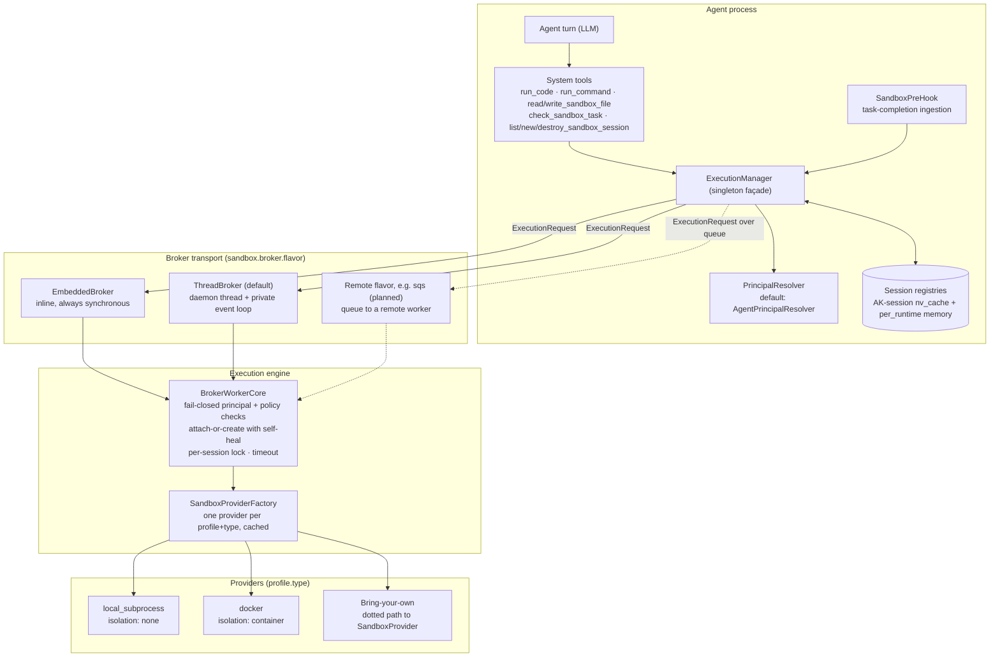
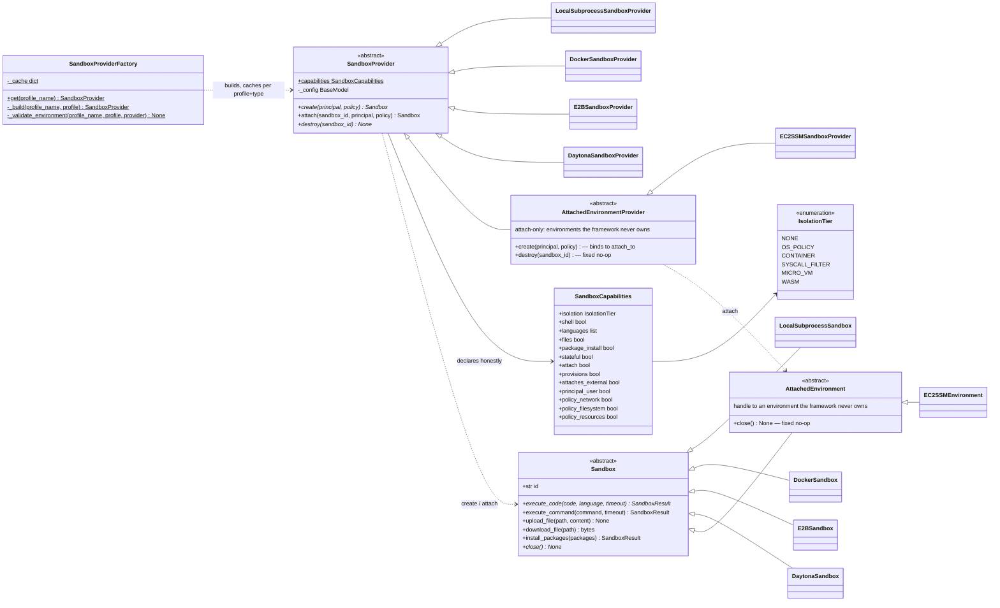
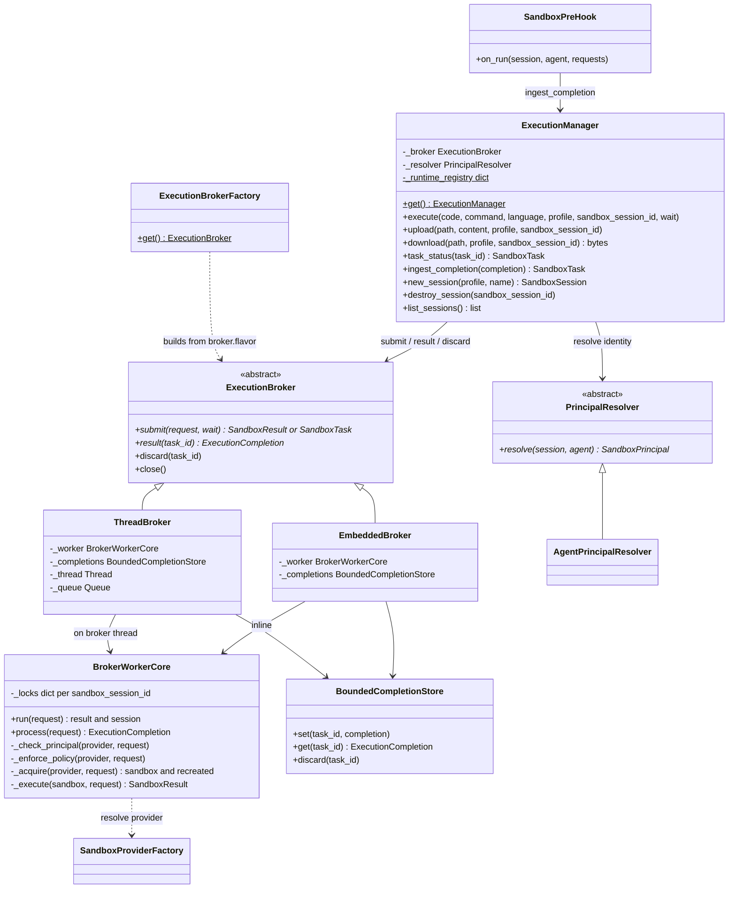
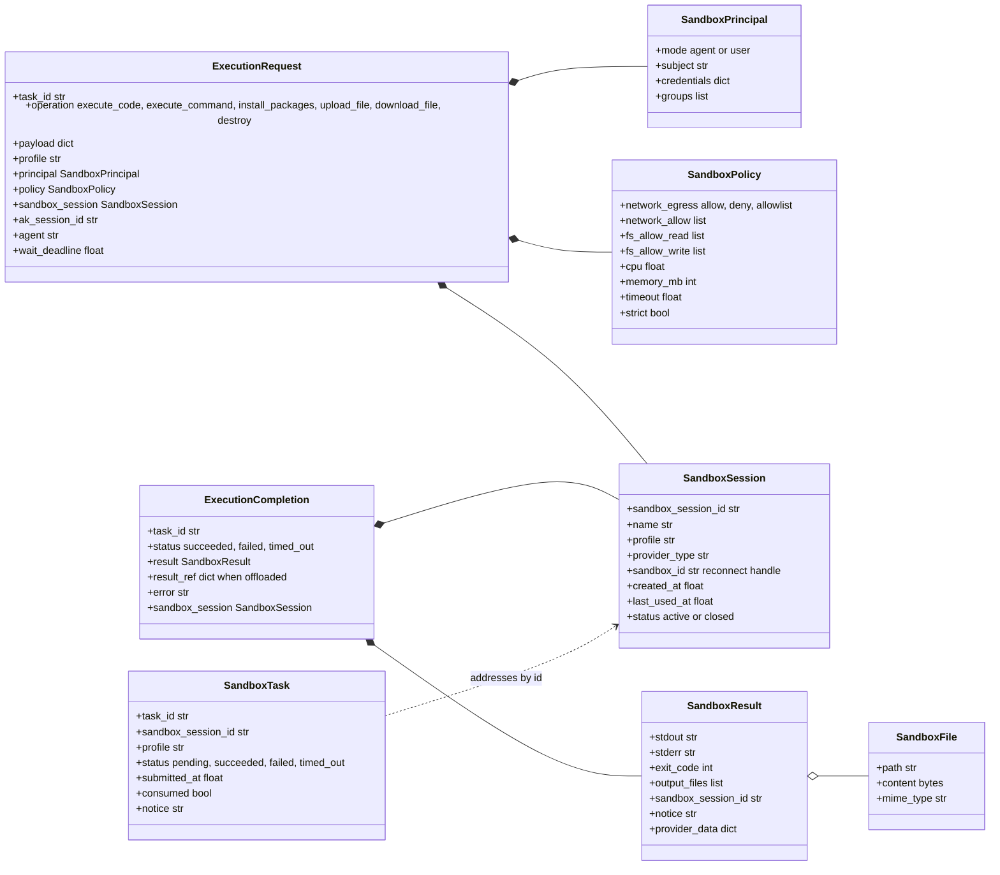
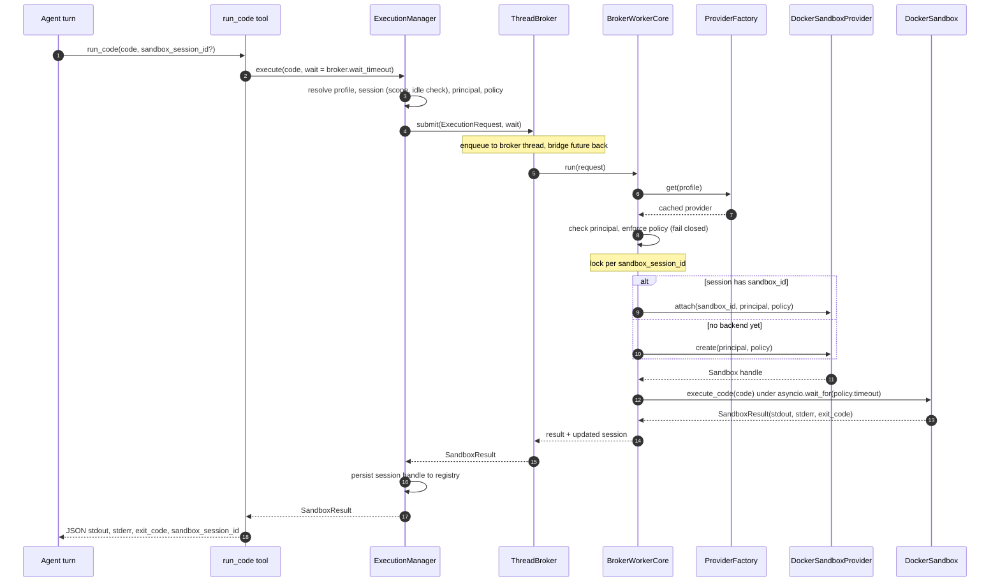
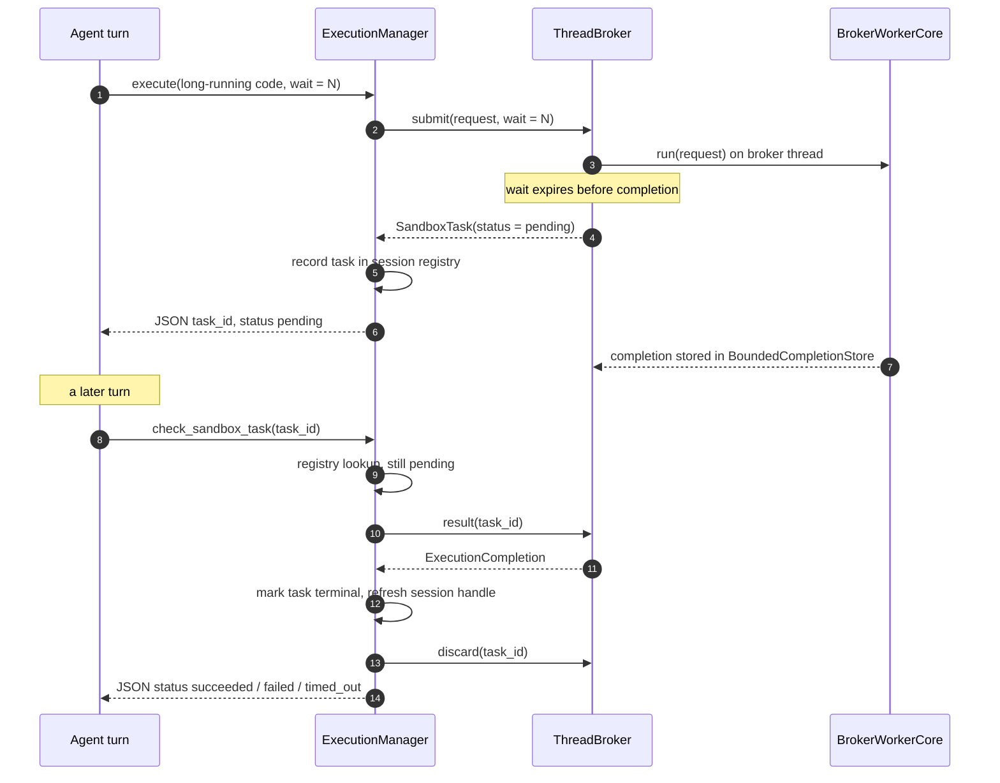
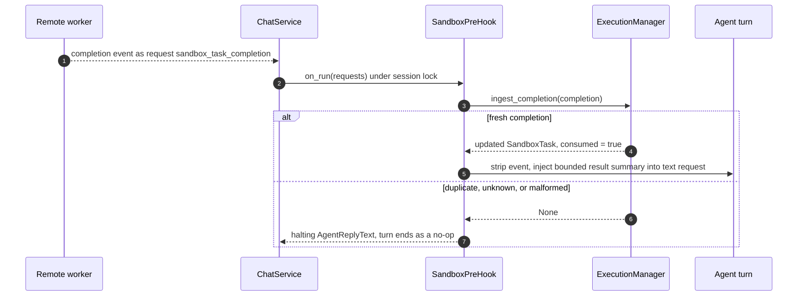
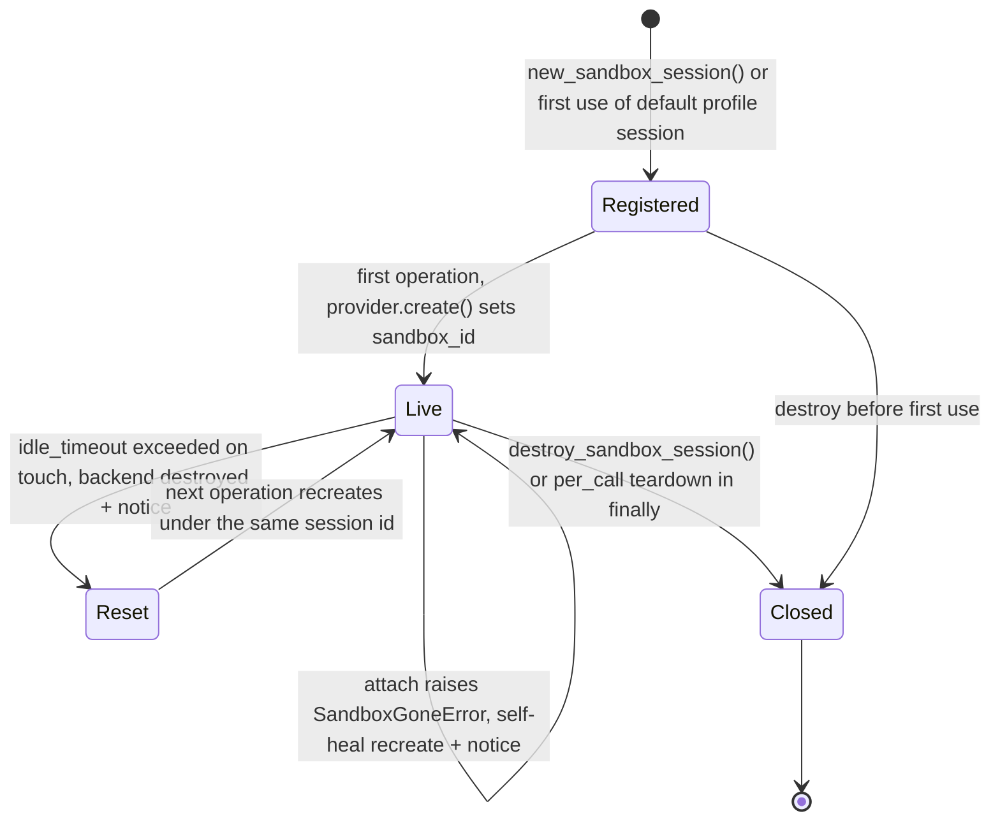
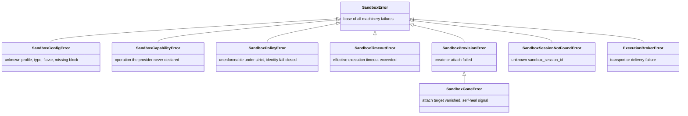

# Sandbox Internals

How the [sandbox capability](../advanced/sandbox.md) works under the hood: the components involved, the class contracts, and the runtime flows. This page is for contributors and for anyone plugging in a custom provider, broker, or principal resolver. For enabling and configuring the sandbox, see the [Sandbox guide](../advanced/sandbox.md).

## Component view

The capability is split into three layers with one wire contract between them. Everything the agent sees lives in the agent process (tools, `ExecutionManager`, registries). The **broker** is a transport seam: in-process flavors call the worker engine directly, while remote flavors ship the same `ExecutionRequest` over a queue. The worker engine is the only component that touches providers.

A `ExecutionRequest` is **self-sufficient**: it carries the resolved principal, the policy, and the full sandbox-session handle (including the provider reconnect id), so a remote worker needs nothing else to execute it.

## The execution contract

Only four methods are mandatory across all backends: `execute_code` (with `language="python"`), `close`, `create`, and `destroy`. Every richer operation is optional and raises `SandboxCapabilityError` unless the provider both declares it in `capabilities` and overrides it. Declaring only what the backend truly enforces is the core security rule ("capability honesty").

**Attached environments:** `AttachedEnvironment` / `AttachedEnvironmentProvider` are the public bases
for backends that connect to something the framework never owns (an EC2 instance, a running
pod, a production service). The provider base fixes `create` (binds to the configured
`attach_to`) and `destroy` (no-op); the handle base fixes `close` (no-op). Profiles selecting
such a backend must declare `environment: attached`, validated by the factory against the
`provisions` / `attaches_external` capability flags.

**Result discipline:** a failing *program* (non-zero exit, exception in user code) comes back as a `SandboxResult` with `exit_code != 0`. Exceptions are reserved for failures of the sandbox *machinery* (see [Error hierarchy](#error-hierarchy)).

## The control plane

`ExecutionManager` is a process-wide singleton (mirroring `ConversationThreadManager`). `ExecutionManager.get()` returning `None` is the feature-disabled check every tool performs. Both in-process brokers delegate to the same `BrokerWorkerCore`; the difference is only where it runs and whether a bounded wait can promote the execution to a background task.

Two enforcement gates run inside `BrokerWorkerCore.run()` before any provider call, both fail-closed:

- **Principal:** a profile demanding `identity.mode: user` requires a provider declaring `principal_user` *and* a resolver that actually produced a user principal; otherwise the request is rejected.
- **Policy:** every non-default policy dimension (network, filesystem, cpu/memory) is checked against the provider's declared `policy_*` capabilities; unenforceable under `strict: true` raises `SandboxPolicyError`. See [Policy and permissions](../advanced/sandbox.md#policy-and-permissions) for the user-facing semantics.

## Data and wire models

All models are Pydantic. The left column is what travels between manager and worker; the right column is what the capability stores and returns. `SandboxSession` is the cross-turn handle: a stable `sandbox_session_id` minted by the manager, plus the provider-scoped `sandbox_id` used to reconnect.

## Synchronous execution flow

The common path with the default `thread` broker: the manager resolves everything agent-side, the worker enforces everything execution-side, and the result is stamped with the `sandbox_session_id` the agent reuses on the next call.

## Promotion and task polling

When `wait_timeout` expires before the execution finishes, `ThreadBroker.submit` returns a pending `SandboxTask` while the run continues on the broker thread. The agent polls with `check_sandbox_task`; the manager persists the completed run's session handle so later calls attach to the promoted run's sandbox instead of orphaning it.

Remote flavors can also *push* the completion back: the event re-enters as an `AgentRequestAny(name="sandbox_task_completion")` and `SandboxPreHook` consumes it under the session lock before the agent's turn.

This is the at-least-once dedup: the `consumed` flag on `SandboxTask` guarantees a re-delivered completion never triggers a second agent turn.

## Session lifecycle

A session handle outlives any single backend sandbox. Idle expiry and a vanished backend (`SandboxGoneError` on attach) both recreate under the *same* `sandbox_session_id`, and both attach a `notice` to the next result: recreation is never silent. The scopes themselves (`per_session`, `per_call`, `per_runtime`) are described in the [Sandbox guide](../advanced/sandbox.md#scopes).

## Error hierarchy

Every machinery failure derives from `SandboxError`. `SandboxGoneError` doubles as a protocol signal: raised by `attach`, it tells the worker to self-heal by recreating the backend under the same session id — unless the profile declares `environment: attached`, in which case the worker never provisions a replacement (the framework does not own the environment) and surfaces the `SandboxGoneError` instead. For the same reason, the worker's `destroy` operation on an attached profile only drops the session binding and never calls the provider's `destroy`. Tools never raise into the framework: any of these is caught at the tool layer and returned to the agent as an `{"error": ...}` JSON string.

## Where each piece lives

All paths are under `ak-py/src/agentkernel/`.

| File | Contents |
|---|---|
| `sandbox/base.py` | `Sandbox` and `SandboxProvider` ABCs, the public bring-your-own surface |
| `sandbox/model.py` | `SandboxCapabilities`, `SandboxResult`, `SandboxSession`, `SandboxTask`, `SandboxPrincipal`, `SandboxPolicy`, `IsolationTier` |
| `sandbox/manager.py` | `ExecutionManager` singleton façade, session and task registries, scope handling |
| `sandbox/tools.py` | The eight system tools plus the system-prompt guidance injected via the first tool's description |
| `sandbox/hooks.py` | `SandboxPreHook` for push-based task-completion ingestion with dedup |
| `sandbox/principal.py` | `PrincipalResolver` ABC and the default `AgentPrincipalResolver` |
| `sandbox/factory.py` | `SandboxProviderFactory` and `ExecutionBrokerFactory`, lazy imports and dotted-path escape hatches |
| `sandbox/errors.py` | The `SandboxError` hierarchy |
| `sandbox/broker/base.py` | `ExecutionBroker` ABC, `ExecutionRequest`, `ExecutionCompletion`, `BoundedCompletionStore` |
| `sandbox/broker/worker.py` | `BrokerWorkerCore`, the flavor-independent execution engine |
| `sandbox/broker/embedded.py`, `thread.py` | The two in-process broker flavors |
| `sandbox/providers/` | `local_subprocess.py` and `docker.py` reference providers |
| `sandbox/testing.py` | Public `SandboxProviderContract` test suite for new providers |
