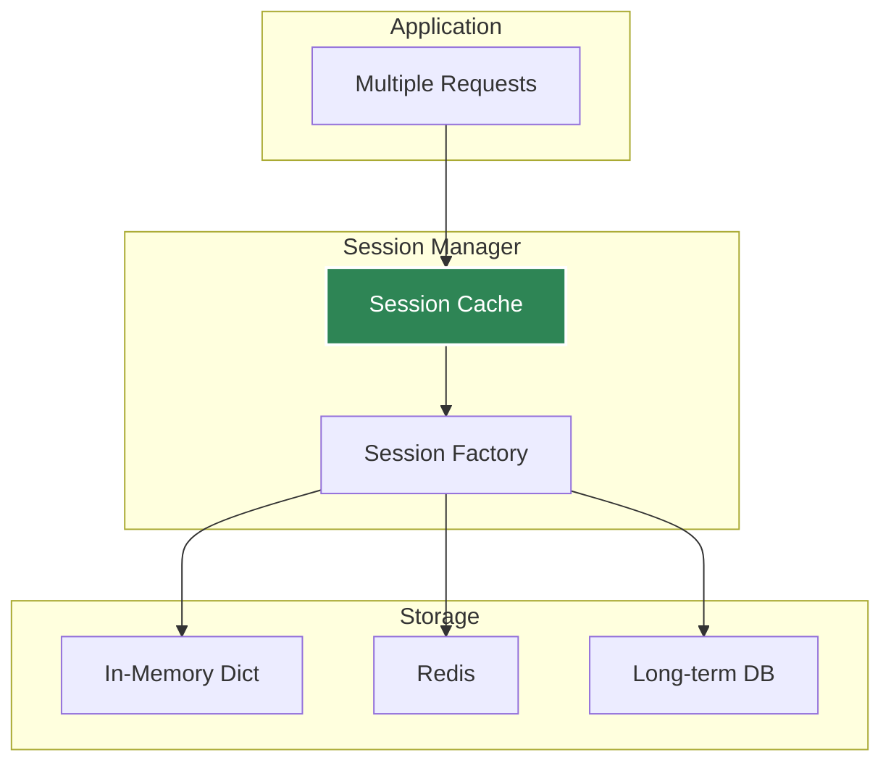
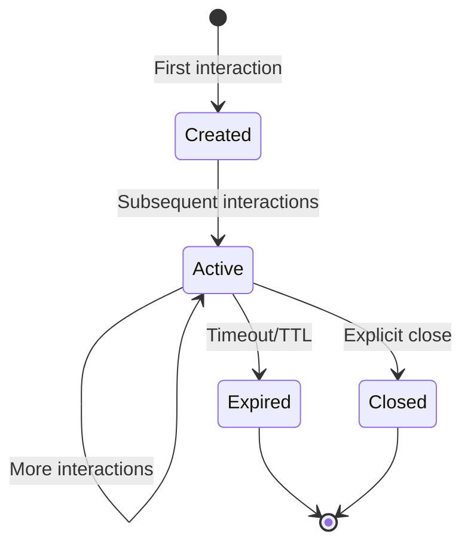

# Session Management

How Agent Kernel manages conversation state across interactions.

## Session Architecture



## Storage Options

### In-Memory (Development)

```bash
export AK_SESSION_STORAGE=in_memory
```

- Fast, no setup required
- Data lost on restart
- Single-process only

### Redis (Production)

```bash
export AK_SESSION_STORAGE=redis
export AK_REDIS_URL=redis://localhost:6379
```

- Persistent
- Multi-process/distributed
- Configurable TTL

## Session Lifecycle



## Best Practices

- Use unique session IDs per user conversation
- Configure appropriate TTL in production
- Use Redis for distributed deployments
- Monitor session storage size
