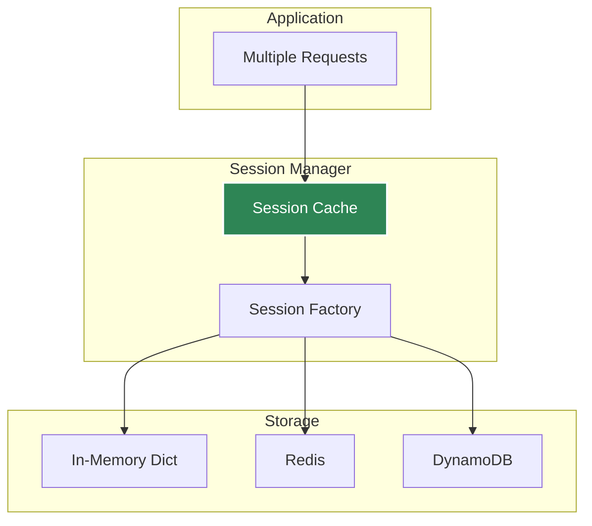
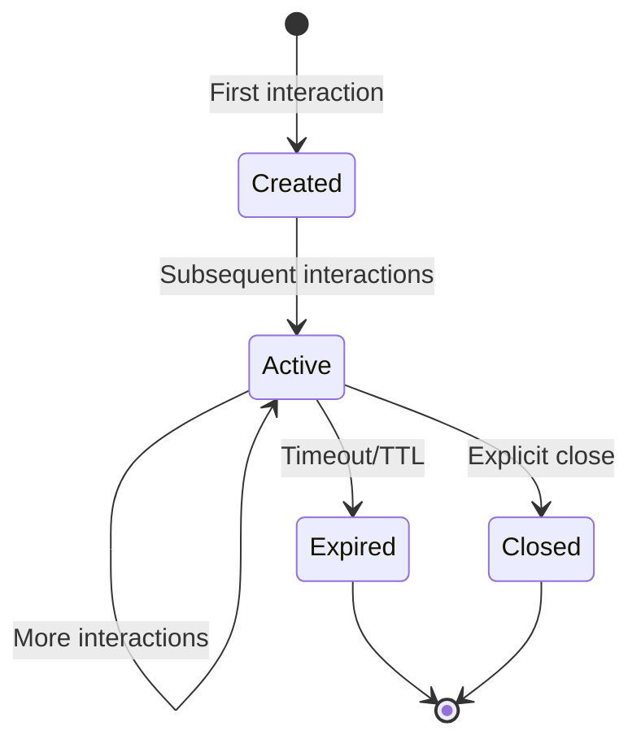

# Session Management

How Agent Kernel manages conversation state across interactions.

## Session Architecture



## Storage Options

### In-Memory (Development)

```bash
export AK_SESSION__TYPE=in_memory
```

- Fast, no setup required
- Data lost on restart
- Single-process only

### Redis (Production)

```bash
export AK_SESSION__TYPE=redis
export AK_SESSION__REDIS__URL=redis://localhost:6379
```

- Persistent
- Multi-process/distributed
- Configurable TTL

### DynamoDB (AWS Serverless)

```bash
export AK_SESSION__TYPE=dynamodb
export AK_SESSION__DYNAMODB__TABLE_NAME=agent-kernel-sessions
```

- Serverless, fully managed
- Auto-scaling
- AWS-native integration
- Configurable TTL

## Session Lifecycle



## Best Practices

- Use unique session IDs per user conversation
- Configure appropriate TTL in production
- Use Redis for distributed/containerized deployments
- Use DynamoDB for AWS serverless deployments
- Monitor session storage size
