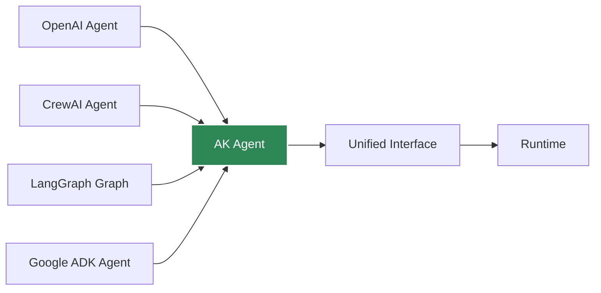
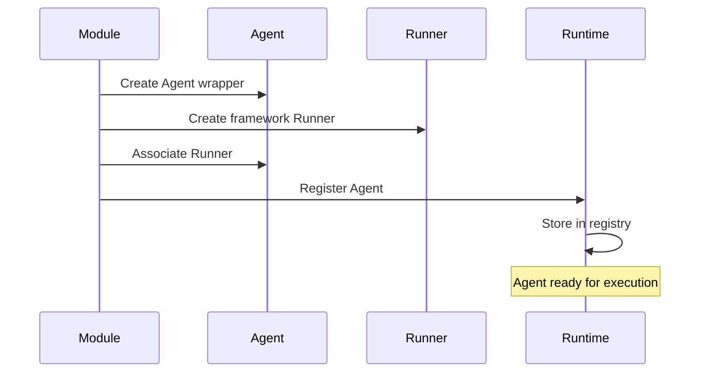
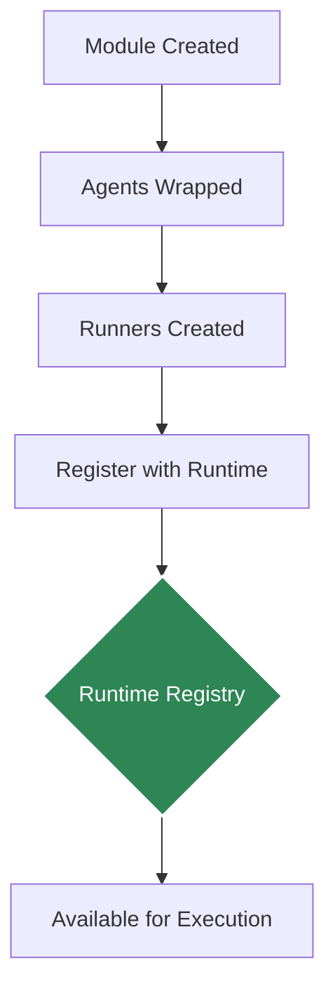

# Agent

The **Agent** is the core abstraction that wraps framework-specific agent implementations, providing a unified interface across all supported frameworks.

## Overview



## What is an Agent?

An Agent in Agent Kernel is a wrapper that:

1. **Encapsulates** framework-specific agent implementations
2. **Provides** a consistent interface for agent interaction
3. **Associates** each agent with a Runner for execution
4. **Enables** framework-agnostic agent management

## Creating Agents

Agents are created by framework-specific Modules. You don't typically instantiate Agent directly.

import Tabs from '@theme/Tabs';
import TabItem from '@theme/TabItem';


<Tabs>
<TabItem value="openai" label="OpenAI Agents" default>

```python
from agents import Agent as OpenAIAgent
from agentkernel.openai import OpenAIModule

# Define OpenAI agent
openai_agent = OpenAIAgent(
    name="assistant",
    instructions="You are a helpful assistant",
)

# Module creates AK Agent wrapper
OpenAIModule([openai_agent])

# AK Agent is automatically created with:
# - name: "assistant" (from openai_agent.name)
# - runner: OpenAIRunner instance
```
</TabItem>
<TabItem value="crewai" label="CrewAI">

```python
from crewai import Agent as CrewAgent
from agentkernel.crewai import CrewAIModule

# Define CrewAI agent
crew_agent = CrewAgent(
    role="researcher",
    goal="Research topics",
    backstory="You are a researcher",
)

# Module creates AK Agent wrapper
CrewAIModule([crew_agent])

# AK Agent is automatically created with:
# - name: "researcher" (from crew_agent.role)
# - runner: CrewAIRunner instance
```
</TabItem>
<TabItem value="langgraph" label="LangGraph">

```python
from langgraph.graph import StateGraph
from agentkernel.langgraph import LangGraphModule

# Define and compile graph
graph = StateGraph(...)
compiled = graph.compile()
compiled.name = "assistant"

# Module creates AK Agent wrapper
LangGraphModule([compiled])

# AK Agent is automatically created with:
# - name: "assistant" (from compiled.name)
# - runner: LangGraphRunner instance
```
</TabItem>
</Tabs>

## Agent Lifecycle



## Multi-Agent Systems

Agent Kernel supports multiple agents working together. It also supports agents from multiple frameworks running together in the same runtime.

```python
from crewai import Agent as CrewAgent
from agents import Agent as OpenAIAgent
from agentkernel.crewai import CrewAIModule
from agentkernel.openai import OpenAIModule

# Define multiple agents
supervisor = CrewAgent(role="supervisor", ...)
specialist1 = CrewAgent(role="specialist1", ...)
specialist2 = CrewAgent(role="specialist2", ...)
specialist3= OpenAIAgent(role="specialist3", ...)

# Register all agents
CrewAIModule([supervisor, specialist1, specialist2])
OpenAIModule([specialist2])

# All agents are now available
from agentkernel.core import Runtime
runtime = Runtime.get()

supervisor_agent = runtime.get_agent("supervisor")
specialist1_agent = runtime.get_agent("specialist1")
specialist2_agent = runtime.get_agent("specialist2")
specialist3_agent = runtime.get_agent("specialist3")
```

Agent interactions are handled by the underlying framework's collaboration mechanisms.

## Agent Capabilities

### A2A (Agent-to-Agent) Support

Agents can be exposed for A2A communication:

```python
# Enable A2A in configuration
# AK_A2A_ENABLED=true
# AK_A2A_URL=https://your-domain.com/a2a

# Agents automatically generate A2A capability cards
# describing their skills and interfaces
```

or

```yaml
a2a:
    enabled: true
```

### MCP (Model Context Protocol) Support

Agents can be exposed as MCP tools:

```python
# Enable MCP in configuration
# AK_MCP_ENABLED=true

# Agents become callable as MCP tools
# from other AI systems
```

or

```yaml
mcp:
    enabled: true
```

## Best Practices

### Naming Conventions

Use descriptive, unique names for your agents:

```python
# Good
agent = CrewAgent(role="math_specialist", ...)

# Less clear
agent = CrewAgent(role="agent1", ...)
```

### Agent Specialization

Design agents with clear, focused responsibilities:

```python
# Specialized agents
research_agent = CrewAgent(
    role="researcher",
    goal="Research and gather information",
    backstory="You are an expert researcher",
)

writer_agent = CrewAgent(
    role="writer",
    goal="Write clear documentation",
    backstory="You are a technical writer",
)
```

## Advanced Usage

### Agent Properties

#### Name

Every agent has a unique name used for identification:

```python
from agentkernel.core import Runtime

runtime = Runtime.get()

# Get agent by name
agent = runtime.get_agent("assistant")
print(agent.name)  # "assistant"
```

The name is derived from framework-specific properties:
- **OpenAI**: `agent.name`
- **CrewAI**: `agent.role`
- **LangGraph**: `graph.name`
- **Google ADK**: `agent.name`

#### Runner

Each agent has an associated Runner that handles execution:

```python
agent = runtime.get_agent("assistant")
runner = agent.runner

# Runner executes the agent
result = await runner.run(agent, session, prompt)
```

### Agent Registration

Agents are automatically registered with the Runtime when a Module is instantiated:



#### Accessing Registered Agents

```python
from agentkernel.core import Runtime

runtime = Runtime.get()

# Get a specific agent
agent = runtime.get_agent("assistant")

# List all registered agents
all_agents = runtime.get_all_agents()
for name, agent in all_agents.items():
    print(f"Agent: {name}")
```

### Framework-Specific Agent Wrappers

Each framework has its own Agent implementation that extends the base Agent class:

#### OpenAIAgent

```python
class OpenAIAgent(Agent):
    def __init__(self, name: str, agent: OpenAIAgentType, runner: OpenAIRunner):
        super().__init__(name, runner)
        self._agent = agent
    
    @property
    def agent(self) -> OpenAIAgentType:
        return self._agent
```

Access the underlying framework agent:

```python
from agentkernel.core import Runtime

runtime = Runtime.get()
ak_agent = runtime.get_agent("assistant")

# Access the underlying OpenAI agent
openai_agent = ak_agent.agent
```

#### CrewAIAgent

```python
class CrewAIAgent(Agent):
    def __init__(self, name: str, agent: CrewAgent, runner: CrewAIRunner):
        super().__init__(name, runner)
        self._agent = agent
    
    @property
    def agent(self) -> CrewAgent:
        return self._agent
```

#### LangGraphAgent

```python
class LangGraphAgent(Agent):
    def __init__(self, name: str, graph: CompiledGraph, runner: LangGraphRunner):
        super().__init__(name, runner)
        self._graph = graph
    
    @property
    def graph(self) -> CompiledGraph:
        return self._graph
```


#### Custom Agent Metadata

Store custom metadata with agents:

```python
# Framework agents can have custom attributes
crew_agent = CrewAgent(
    role="analyst",
    goal="Analyze data",
    backstory="You are a data analyst",
    # Custom metadata
    metadata={"department": "analytics", "priority": "high"}
)
```

### Dynamic Agent Selection

Select agents dynamically based on custom logic based on request:

```python
from agentkernel.core import Runtime

def route_to_agent(query: str) -> str:
    """Route query to appropriate agent"""
    if "math" in query.lower():
        return "math_specialist"
    elif "code" in query.lower():
        return "code_assistant"
    else:
        return "general"

runtime = Runtime.get()
agent_name = route_to_agent(user_query)
agent = runtime.get_agent(agent_name)
```

## Summary

- **Agent** wraps framework-specific implementations
- Provides **unified interface** across frameworks
- Automatically created by **Modules**
- Registered with **Runtime** for global access
- Associated with a **Runner** for execution
- Supports **multi-agent** collaboration
- Can be exposed via **A2A** and **MCP** protocols

## Next Steps

- [Learn about Runners](./runner) - Understand execution strategies
- [Explore Sessions](./session) - Manage conversation state
- [Framework Integration](../frameworks/overview) - Framework-specific details
- [Multi-Agent Systems](../advanced/multi-agent) - Build agent teams

---

**Need help?** Check the [API Reference](../api/rest-api) or [open an issue](https://github.com/yaalalabs/agent-kernel/issues)!
