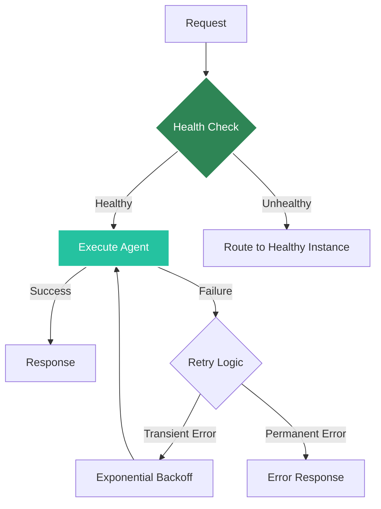

# Fault Tolerance

Agent Kernel provides comprehensive fault tolerance capabilities to ensure your AI agents remain available and resilient in production environments. The platform implements multiple layers of fault tolerance across different deployment modes.

## Overview

Fault tolerance in Agent Kernel encompasses:
- **Infrastructure-level resilience** - Automatic recovery from hardware and system failures
- **Application-level recovery** - Graceful handling of application errors and crashes
- **State persistence** - Preservation of conversation state across failures
- **Health monitoring** - Continuous health checks and automatic remediation
- **Retry mechanisms** - Intelligent retry logic for transient failures (available soon)



## Deployment-Specific Fault Tolerance

### AWS Containerized (ECS/Fargate)

ECS deployments provide the most comprehensive fault tolerance features with extensive configurability:

#### Multi-AZ Deployment
- Tasks automatically distributed across multiple Availability Zones
- Survives entire AZ failures without service interruption
- Application Load Balancer routes traffic only to healthy tasks

#### Task-Level Fault Tolerance
- **Automatic task replacement** - Failed tasks automatically restarted
- **Desired count enforcement** - ECS maintains configured task count
- **Rolling deployments** - Zero-downtime updates with gradual task replacement
- **Health checks** - Container-level and application-level health monitoring

#### Configurable Redundancy ahnd health Settings
```hcl
# Example Terraform configuration
ecs_desired_count = 3              # Number of tasks to maintain
ecs_health_check_endpoint = "/health"
```

#### Service Auto-Scaling (Available soon)
- Scale out during high load, scale in during low load
- Target tracking based on CPU, memory, or request count
- Scheduled scaling for predictable traffic patterns
- Maintains service capacity during failures

#### Network Resilience
- Connection draining ensures graceful shutdown
- Load balancer health checks every 5-30 seconds
- Unhealthy targets automatically removed from rotation
- Circuit breaker patterns prevent cascade failures

**Best Practices:**
- Run minimum of 2 tasks across different AZs
- Configure appropriate health check intervals
- Set reasonable grace periods for startup
- Use target tracking auto-scaling for dynamic loads

### AWS Serverless (Lambda)

Lambda deployments are inherently fault-tolerant with AWS-managed infrastructure:

#### Built-In Resilience
- **Multi-AZ by default** - Lambda functions automatically run across availability zones
- **Automatic retry** - Failed invocations retried automatically (available soon)
- **No server management** - AWS handles all infrastructure failures
- **Infinite scaling** - Automatically scales to handle any load


#### State Persistence
- Use DynamoDB for serverless-native state management
- DynamoDB provides:
  - Multi-AZ replication
  - Point-in-time recovery
  - Automatic backups
  - 99.999% availability SLA

**Serverless Advantages:**
- Zero infrastructure maintenance
- No cold start concerns with provisioned concurrency
- Pay only for actual usage
- Automatic failover and recovery

### Local/Development

Limited fault tolerance suitable for development:
- Manual restart on failures
- In-memory state (lost on restart)
- Single-instance execution

## Session State Resilience

Conversation state is critical for agent continuity. Agent Kernel supports multiple storage backends with different resilience profiles.

:::tip
For detailed information about session storage backends and configuration, see the [Session Management](/docs/core-concepts/session) documentation.
:::

### Redis (High Availability)
```bash
export AK_SESSION__TYPE=redis
export AK_SESSION__REDIS__URL=redis://cluster-endpoint:6379
```

**Features:**
- Redis Cluster for automatic failover
- Replication across multiple nodes
- Sentinel for monitoring and automatic failover
- Sub-millisecond recovery time

**Configuration:**
- Use Redis Cluster or Sentinel mode
- Enable persistence (AOF + RDB)
- Configure appropriate replica count

[Learn more about Redis session configuration →](/docs/core-concepts/session#redis-storage)

### DynamoDB (Serverless)
```bash
export AK_SESSION__TYPE=dynamodb
export AK_SESSION__DYNAMODB__TABLE_NAME=sessions
```

**Features:**
- Multi-AZ replication by default
- Point-in-time recovery (PITR)
- Continuous backups
- 99.999% availability SLA
- No infrastructure management

**Configuration:**
- Enable point-in-time recovery
- Configure appropriate RCU/WCU or use on-demand
- Set TTL for automatic cleanup

[Learn more about DynamoDB session configuration →](/docs/core-concepts/session#dynamodb-storage)

### In-Memory (Development Only)
Not recommended for production - state lost on restart.

[See all session storage options →](/docs/core-concepts/session#storage-backends)

## Health Checks

Agent Kernel provides built-in health endpoints for monitoring:

### Health Endpoint
```http
GET /health
```

**Response:**
```json
{
  "status": "healthy",
  "timestamp": "2024-01-15T10:30:00Z",
  "runtime": "operational",
  "memory_backend": "connected"
}
```

### Load Balancer Health Checks
Configure your load balancer to use the health endpoint:
- **Interval**: 5-30 seconds
- **Timeout**: 2-5 seconds
- **Healthy threshold**: 2 consecutive successes
- **Unhealthy threshold**: 2 consecutive failures

## Retry Logic (Available soon)

Agent Kernel implements intelligent retry mechanisms:

### Framework-Level Retries
Each runner implementation includes:
- Exponential backoff for LLM API calls
- Configurable retry attempts
- Circuit breaker patterns
- Graceful degradation


## Monitoring and Alerting

### CloudWatch Metrics (AWS)
Available soon!

## Testing Fault Tolerance

### Chaos Engineering
Test your agent's resilience by simulating failures:

```bash
# Simulate ECS task failures
aws ecs stop-task --cluster my-cluster --task task-id

# Simulate Lambda failures
# Use error injection in code or AWS Fault Injection Simulator
```

### Load Testing
Validate behavior under stress:
- Concurrent request handling
- Auto-scaling triggers
- Recovery time objectives (RTO)
- Recovery point objectives (RPO)

## Disaster Recovery

### ECS Recovery
- **RTO**: < 5 minutes (automatic task restart)
- **RPO**: Depends on state backend (Redis: seconds, DynamoDB: continuous)

### Serverless Recovery
- **RTO**: < 1 minute (automatic Lambda retry)
- **RPO**: Continuous with DynamoDB

### Backup Strategy
Not provided with the terraform module. User has to implement the backup feature.

## Compliance and SLAs

### ECS Deployments
- **Availability**: 99.9%+ with proper configuration
- **Multi-AZ**: 99.99%+ availability
- **RTO**: < 5 minutes
- **RPO**: < 1 minute (with persistent state)

### Serverless Deployments
- **Availability**: 99.95%+ (AWS Lambda SLA)
- **Multi-AZ**: Built-in across all AZs
- **RTO**: < 1 minute
- **RPO**: Continuous (with DynamoDB)

## Summary

Agent Kernel's fault tolerance capabilities ensure your AI agents remain available and resilient:

- **ECS/Fargate**: Highly configurable, multi-AZ, auto-scaling, minimal cold starts
- **Lambda**: Fully managed, auto-scaling, built-in retry, serverless
- **State Management**: Multiple backends with different resilience profiles
- **Health Monitoring**: Built-in endpoints and CloudWatch integration
- **Error Recovery**: Retry logic, circuit breakers, graceful degradation

Choose the deployment mode that best matches your availability requirements, budget, and operational preferences.

## Learn More

- [Session Management](./session) - Detailed session configuration and storage backends
- [Deployment Overview](../deployment/overview) - Compare deployment modes
- [AWS Containerized](../deployment/aws-containerized) - ECS fault tolerance details
- [AWS Serverless](../deployment/aws-serverless) - Lambda resilience features
- [Architecture](../architecture/overview) - System design patterns
