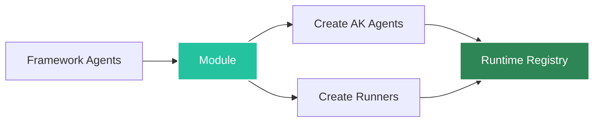
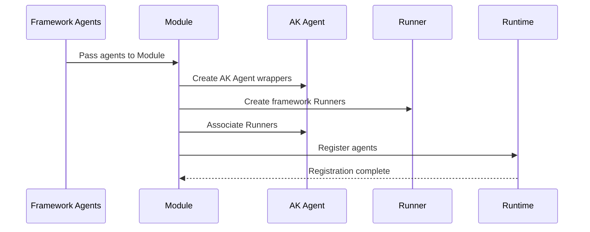

# Module

The **Module** is a container that wraps framework-specific agents and registers them with the Runtime.

## Overview



## What is a Module?

A Module:
- **Wraps** framework-specific agents
- **Creates** Agent Kernel Agent instances
- **Creates** appropriate Runners
- **Registers** agents with the Runtime

## Framework Modules

### OpenAIModule

```python
from agentkernel.openai import OpenAIModule
from agents import Agent as OpenAIAgent

agent = OpenAIAgent(name="assistant", instructions="...")
OpenAIModule([agent])
```

### CrewAIModule

```python
from agentkernel.crewai import CrewAIModule
from crewai import Agent as CrewAgent

agent = CrewAgent(role="assistant", goal="...", backstory="...")
CrewAIModule([agent])
```

### LangGraphModule

```python
from agentkernel.langgraph import LangGraphModule
from langgraph.graph import StateGraph

graph = StateGraph(...).compile()
graph.name = "assistant"
LangGraphModule([graph])
```

### ADKModule

```python
from agentkernel.adk import ADKModule
from adk import Agent as ADKAgent

agent = ADKAgent(name="assistant", model="gemini-2.0-flash-exp", ...)
ADKModule([agent])
```

## Module Lifecycle



## Creating Modules

### Single Agent

```python
from agentkernel.crewai import CrewAIModule
from crewai import Agent

agent = Agent(role="assistant", ...)
CrewAIModule([agent])
```

### Multiple Agents

```python
from agentkernel.crewai import CrewAIModule
from crewai import Agent

agent1 = Agent(role="researcher", ...)
agent2 = Agent(role="writer", ...)
agent3 = Agent(role="reviewer", ...)

CrewAIModule([agent1, agent2, agent3])
```

## Module Configuration

Some modules accept configuration:

```python
from agentkernel.openai import OpenAIModule

OpenAIModule(
    agents=[agent1, agent2],
    model_override="gpt-4",  # Override default model
)
```

## Best Practices

### One Module Per Application

Typically, create one module per application. However, in the scenario of having agents of multiple agentic frameworks, the current module mechanism does support that.

```python
# my_agent.py
from agentkernel.crewai import CrewAIModule
from crewai import Agent

agents = [agent1, agent2, agent3]
CrewAIModule(agents)

if __name__ == "__main__":
    from agentkernel.cli import CLI
    CLI.main()
```

## Summary

- Modules wrap framework agents
- Create AK Agents and Runners
- Automatically register with Runtime
- Each framework has its own Module class

## Next Steps

- [Runtime](./runtime)
- [Framework Integration](../frameworks/overview)
