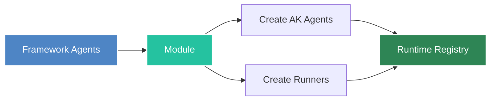
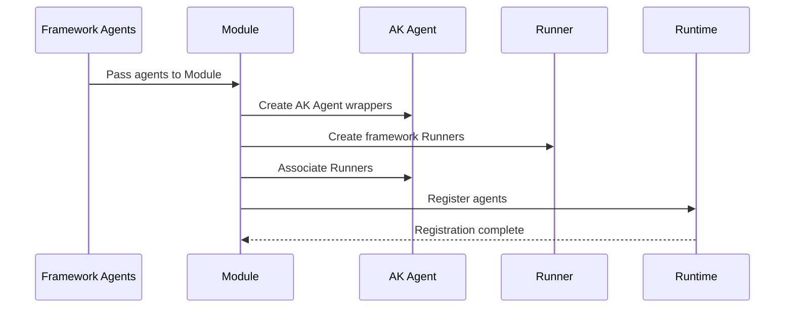

# Module

The **Module** is a container that wraps framework-specific agents and registers them with the Runtime.

## Overview


```mermaid
graph LR
    A[Framework Agents] --> B[Module]
    B --> C[Create AK Agents]
    B --> D[Create Runners]
    C --> E[Runtime Registry]
    D --> E
    
    style A fill:#4e85c5,stroke:#fff,stroke-width:2px,color:#fff
    style B fill:#25c2a0,stroke:#fff,stroke-width:2px,color:#fff
    style E fill:#2e8555,stroke:#fff,stroke-width:2px,color:#fff
```

## What is a Module?

A Module:
- **Wraps** framework-specific agents
- **Creates** Agent Kernel Agent instances
- **Creates** appropriate Runners
- **Registers** agents with the Runtime

## Framework Modules

### OpenAIModule

```python
from agentkernel.openai import OpenAIModule
from agents import Agent as OpenAIAgent

agent = OpenAIAgent(name="assistant", instructions="...")
OpenAIModule([agent])
```

### CrewAIModule

```python
from agentkernel.crewai import CrewAIModule
from crewai import Agent as CrewAgent

agent = CrewAgent(role="assistant", goal="...", backstory="...")
CrewAIModule([agent])
```

### LangGraphModule

```python
from agentkernel.langgraph import LangGraphModule
from langgraph.graph import StateGraph

graph = StateGraph(...).compile()
graph.name = "assistant"
LangGraphModule([graph])
```

### GoogleADKModule

```python
from agentkernel.adk import GoogleADKModule
from adk import Agent as ADKAgent

agent = ADKAgent(name="assistant", model="gemini-2.0-flash-exp", ...)
GoogleADKModule([agent])
```

## Module Lifecycle


```mermaid
sequenceDiagram
    participant A as Framework Agents
    participant M as Module
    participant AK as AK Agent
    participant R as Runner
    participant RT as Runtime
    
    A->>M: Pass agents to Module
    M->>AK: Create AK Agent wrappers
    M->>R: Create framework Runners
    M->>AK: Associate Runners
    M->>RT: Register agents
    RT-->>M: Registration complete
```

## Creating Modules

### Single Agent

```python
from agentkernel.crewai import CrewAIModule
from crewai import Agent

agent = Agent(role="assistant", ...)
CrewAIModule([agent])
```

### Multiple Agents

```python
from agentkernel.crewai import CrewAIModule
from crewai import Agent

agent1 = Agent(role="researcher", ...)
agent2 = Agent(role="writer", ...)
agent3 = Agent(role="reviewer", ...)

CrewAIModule([agent1, agent2, agent3])
```

## Module Configuration

Some modules accept configuration:

```python
from agentkernel.openai import OpenAIModule

OpenAIModule(
    agents=[agent1, agent2],
    model_override="gpt-4",  # Override default model
)
```

### Native run options

`run_options(agent, **options)` declares the framework's own per-run options for one agent, in the
framework's own types, and is chained like `pre_hook` / `post_hook`:

```python
from agents import Agent, RunConfig

agent = Agent(name="assistant", instructions="...")

OpenAIModule([agent]).run_options(
    agent,
    max_turns=25,
    hooks=ProgressHooks(),
    run_config=RunConfig(call_model_input_filter=trim_history),
).pre_hook(agent, [RAGHook()])
```

Every keyword is a keyword argument of that framework's native run call (LangGraph's `config`, ADK's
`plugins` and `run_config`, Pydantic AI's `usage_limits`, CrewAI's `step_callback`, smolagents'
`max_steps`). Repeated calls merge, the later call winning per key. A key the adapter populates
itself (`session`, `context`, `input`, ...) raises `ValueError` at declaration. See
[Runner → Per-agent native run options](./runner.md#native-run-options) for the merge rule and the
per-framework table.

## Best Practices

### One Module Per Application

Typically, create one module per application. In a use case of having agents of multiple agentic frameworks, you can instentiate multiple modules. However, please note that hands offs are only possible within the assigned module. If you need to talk to agents defined in other modules they should be exposed via A2A.


```python
# my_agent.py
from agentkernel.crewai import CrewAIModule
from crewai import Agent

agents = [agent1, agent2, agent3]
CrewAIModule(agents)

if __name__ == "__main__":
    from agentkernel.cli import CLI
    CLI.main()
```

## Summary

- Modules wrap framework agents
- Create AK Agents and Runners
- Automatically register with Runtime
- Each framework has its own Module class

## Next Steps

- [Runtime](./runtime)
- [Framework Integration](../frameworks/overview)
