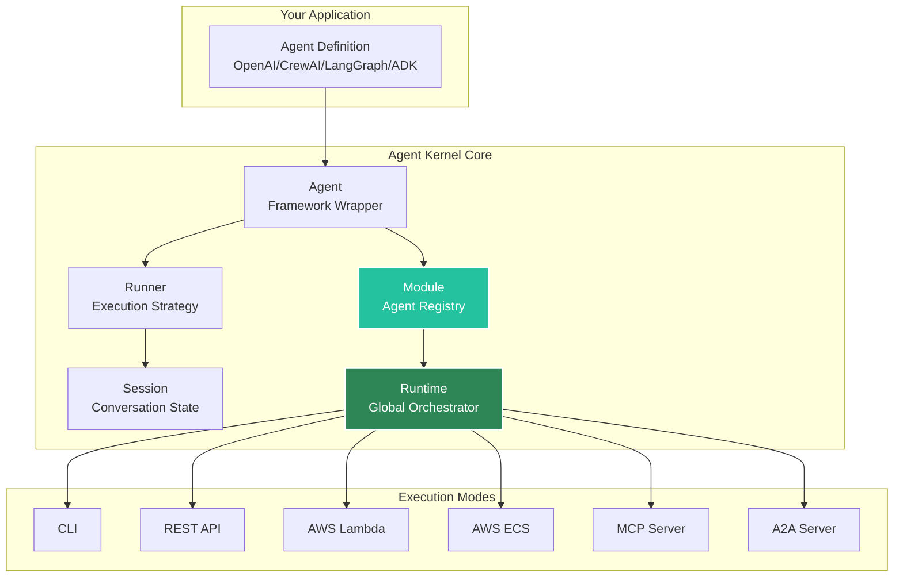
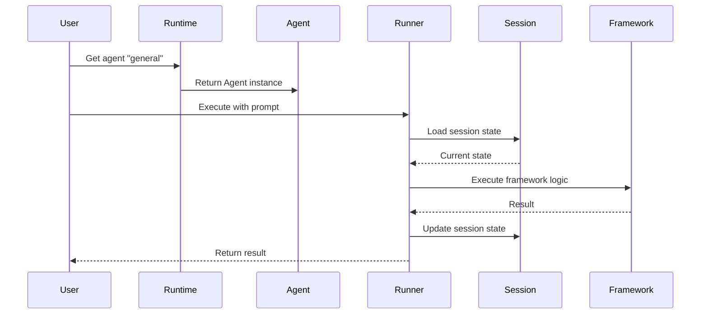
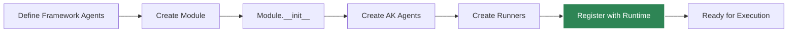
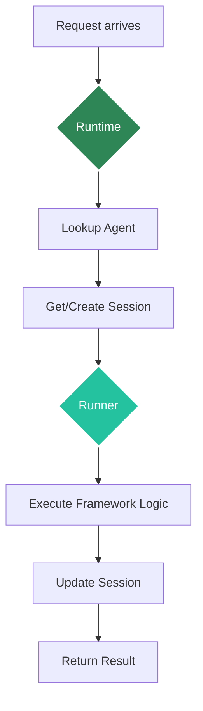

# Core Concepts Overview

Agent Kernel is built around five core abstractions that work together to provide a unified interface for AI agent development and execution.

## Architecture Overview



## The Five Core Abstractions

### 1. **Agent**

A wrapper around framework-specific agent implementations that provides a unified interface.

```python
from agentkernel.core import Agent

# Agent wraps your framework-specific agent
# Provides consistent interface across frameworks
```

**Key Features:**
- Framework-agnostic interface
- Consistent naming and identification
- Unified execution model

[Learn more about Agents →](./agent)

### 2. **Runner**

Executes agent logic using framework-specific execution strategies.

```python
from agentkernel.core import Runner

# Runner encapsulates how agents are executed
# Each framework has its own Runner implementation
```

**Key Features:**
- Framework-specific execution
- Async/await support
- Error handling and retry logic

[Learn more about Runners →](./runner)

### 3. **Session**

Manages conversation state across multiple agent interactions.

```python
from agentkernel.core import Session

# Session tracks conversation history
# Persists state between interactions
session = Session(id="user-123")
```

**Key Features:**
- Conversation history tracking
- State persistence (in-memory or Redis)
- Thread management
- Context preservation

[Learn more about Sessions →](./session)

### 4. **Module**

A container that registers agents with the Runtime.

```python
from agentkernel.crewai import CrewAIModule

# Module groups related agents together
CrewAIModule([agent1, agent2, agent3])
```

**Key Features:**
- Agent grouping and organization
- Automatic registration with Runtime
- Framework-specific initialization
- Lifecycle management

[Learn more about Modules →](./module)

### 5. **Runtime**

The global orchestrator that manages all agents and execution.

```python
from agentkernel.core import Runtime

# Runtime is the central registry
runtime = Runtime.get()
agent = runtime.get_agent("my-agent")
```

**Key Features:**
- Global agent registry
- Centralized configuration
- Execution coordination
- Service integration (API, MCP, A2A)

[Learn more about Runtime →](./runtime)

## How They Work Together

### Basic Flow



### Initialization Flow



### Execution Flow



## Design Principles

### Framework Agnostic

Agent Kernel provides a consistent API regardless of the underlying framework.

### Minimal Overhead

Agent Kernel adds minimal overhead to framework execution. It's a thin adapter layer, not a heavy abstraction.

### Pluggable Architecture

All components are designed to be extended or replaced:
- Custom Runners for new frameworks
- Pluggable Session storage backends
- Custom execution modes

### Production Ready

Built-in features for production deployment:
- Session persistence
- Error handling
- Logging and traceability
- Multiple deployment modes

## Configuration

Agent Kernel can be configured via environment variables or a configuration object:

```python
from agentkernel.core import AKConfig

# Access configuration
config = AKConfig.get()

# Configuration is loaded from environment variables
# or defaults to sensible values
```

Common configuration options:

| Variable | Description | Default |
|----------|-------------|---------|
| `AK_LOG_LEVEL` | Logging level | `INFO` |
| `AK_SESSION_STORAGE` | Session storage backend | `in-memory` |
| `AK_REDIS_URL` | Redis connection URL | `redis://localhost:6379` |

[Learn more about Configuration →](../deployment/configuration)

## Example: Putting It All Together

Here's a complete example showing how all components work together:

```python
from crewai import Agent as CrewAgent
from agentkernel.cli import CLI
from agentkernel.crewai import CrewAIModule

# 1. Define framework-specific agents
general_agent = CrewAgent(
    role="general",
    goal="Answer general questions",
    backstory="You are a helpful assistant",
    verbose=False,
)

math_agent = CrewAgent(
    role="math",
    goal="Solve math problems",
    backstory="You are a math expert",
    verbose=False,
)

# 2. Create a Module to wrap them
CrewAIModule([general_agent, math_agent])

# 3. Module automatically registers agents with Runtime
# Behind the scenes:
# - CrewAIModule creates Agent instances
# - Each Agent gets a Runner
# - All agents registered with Runtime.get()

# 4. Execute using CLI (or API, Lambda, etc.)
if __name__ == "__main__":
    CLI.main()
    
# The CLI uses Runtime to:
# - Discover available agents
# - Create/retrieve sessions
# - Execute agent logic via Runners
```

## Next Steps

Dive deeper into each core concept:

- [**Agent**](./agent) - Learn about agent wrapping and identification
- [**Runner**](./runner) - Understand execution strategies
- [**Session**](./session) - Master conversation state management
- [**Module**](./module) - Organize your agents effectively
- [**Runtime**](./runtime) - Control the global orchestrator

Or explore specific use cases:

- [Framework Integration](../frameworks/overview) - Framework-specific details
- [Deployment](../deployment/overview) - Production deployment options
- [Advanced Features](../advanced/memory-management) - Memory, RBAC, and more

---

**Questions?** Check out our [GitHub Discussions](https://github.com/yaalalabs/agent-kernel/discussions)!
