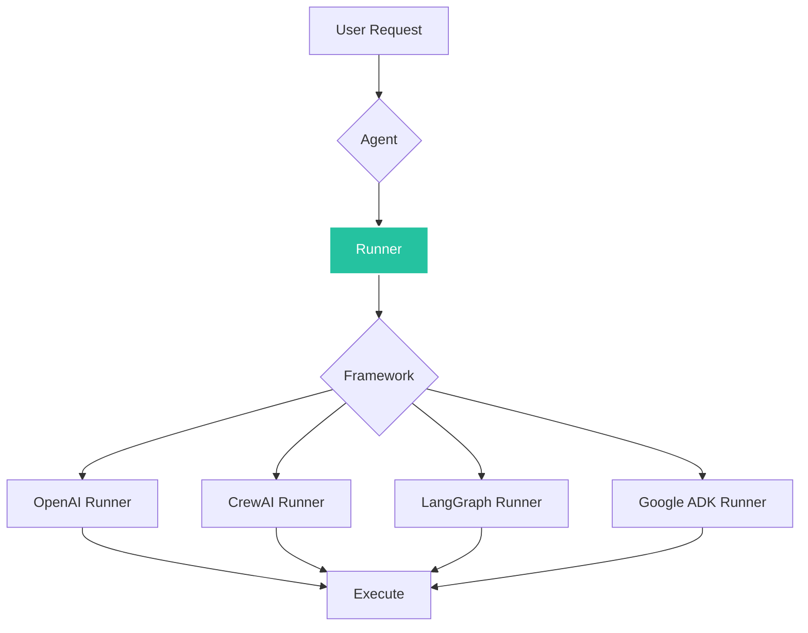
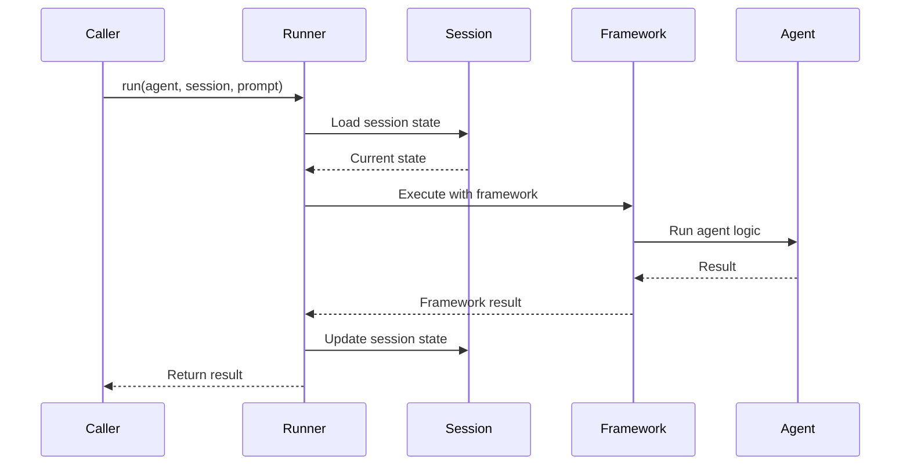

# Runner

The **Runner** encapsulates framework-specific execution strategies, providing a consistent interface for running agents across different frameworks. You can skip this section if you are not planning to contribute to Agent Kernel.

## Overview



## What is a Runner?

A Runner:
- **Executes** framework-specific agent logic
- **Manages** session state during execution
- **Handles** async/await execution patterns
- **Provides** consistent error handling

## Runner Interface

```python
from agentkernel.core import Runner, Session

class Runner(ABC):
    def __init__(self, name: str):
        self._name = name
    
    @abstractmethod
    async def run(self, agent: Any, session: Session, prompt: Any) -> Any:
        """Run the agent with the provided prompt"""
        pass
```

## Framework Runners

### OpenAI Runner

Executes OpenAI Agents SDK agents:

```python
from agentkernel.openai import OpenAIRunner

class OpenAIRunner(Runner):
    async def run(self, agent, session, prompt):
        # Get or create OpenAI session
        # Execute agent with prompt
        # Return result
```

### CrewAI Runner

Executes CrewAI agents:

```python
from agentkernel.crewai import CrewAIRunner

class CrewAIRunner(Runner):
    async def run(self, agent, session, prompt):
        # Execute CrewAI kickoff
        # Return result
```

### LangGraph Runner

Executes LangGraph compiled graphs:

```python
from agentkernel.langgraph import LangGraphRunner

class LangGraphRunner(Runner):
    async def run(self, agent, session, prompt):
        # Invoke graph with state
        # Handle streaming if enabled
        # Return result
```

## Execution Flow



## Using Runners

Runners are typically accessed through agents:

```python
from agentkernel.core import Runtime

runtime = Runtime.get()
agent = runtime.get_agent("assistant")

# Get the runner from the agent
runner = agent.runner

# Execute
result = await runner.run(agent, session, prompt)
```

## Session Integration

Runners work closely with Sessions to maintain state:

```python
async def run(self, agent, session, prompt):
    # Get framework-specific session from AK session
    framework_session = session.get(f"{agent.name}_session")
    
    if not framework_session:
        # Create new framework session
        framework_session = self._create_session()
        session.set(f"{agent.name}_session", framework_session)
    
    # Execute with session
    result = await self._execute(agent, framework_session, prompt)
    
    # Session automatically persisted
    return result
```

## Best Practices

### Async Execution

Always use `await` when calling runners:

```python
# Correct
result = await runner.run(agent, session, prompt)

# Incorrect
result = runner.run(agent, session, prompt)  # Returns coroutine
```

### Error Handling

Wrap runner execution in try-except:

```python
try:
    result = await runner.run(agent, session, prompt)
except Exception as e:
    logger.error(f"Runner error: {e}")
    # Handle error appropriately
```

## Summary

- Runners execute framework-specific agent logic
- Each framework has its own Runner implementation
- Runners manage session state during execution
- Always use async/await pattern

## Next Steps

- [Session Management](./session)
- [Module Organization](./module)
- [Framework Integration](../frameworks/overview)
